# 项目名称：PhytoOracle MVP

**文档版本**: v1.0
**创建时间**: 2025-01-11
**编写者**: 系统架构师
**状态**: 评审中

---

## 1. 架构总览

### 1.1 系统架构图

```mermaid
graph TB
    %% 前端层
    subgraph Frontend["前端层 (Frontend Layer)"]
        Web["Web诊断界面<br/>(Next.js 15)"]
        Admin["管理后台<br/>(Streamlit)"]
    end

    %% API网关层
    subgraph Gateway["API层 (API Gateway)"]
        API["FastAPI Server"]
        Auth["认证中间件<br/>(API Key)"]
    end

    %% 业务逻辑层
    subgraph Business["业务逻辑层 (Business Logic)"]
        DiagService["诊断服务<br/>(Diagnosis Service)"]
        KnowledgeService["知识库服务<br/>(Knowledge Service)"]
        ImageService["图片服务<br/>(Image Service)"]
    end

    %% 领域模型层
    subgraph Domain["领域模型层 (Domain Models)"]
        DM1["Disease Ontology"]
        DM2["Feature Ontology"]
        DM3["Plant Ontology"]
        DM4["Host-Disease Relations"]
    end

    %% 基础设施层
    subgraph Infra["基础设施层 (Infrastructure)"]
        VLM["VLM客户端<br/>(Fallback机制)"]
        OntologyLoader["知识库加载器<br/>(JSON Loader)"]
        Matcher["模糊匹配引擎"]
        Scorer["加权评分器"]
    end

    %% 外部服务
    subgraph External["外部服务 (External Services)"]
        Qwen["Qwen VL Plus"]
        GPT["ChatGPT<br/>gpt-4o"]
        Grok["Grok Vision"]
        Claude["Claude Sonnet"]
    end

    %% 数据存储
    subgraph Storage["数据存储 (Storage)"]
        PG[("PostgreSQL<br/>诊断记录")]
        Redis[("Redis<br/>缓存")]
        FS[("文件系统<br/>图片存储")]
        Git[("Git仓库<br/>知识库JSON")]
    end

    %% 连接关系
    Web --> API
    Admin --> API
    API --> Auth
    Auth --> DiagService
    Auth --> KnowledgeService
    Auth --> ImageService

    DiagService --> VLM
    DiagService --> Scorer
    DiagService --> Domain

    KnowledgeService --> OntologyLoader
    KnowledgeService --> Git

    ImageService --> FS

    VLM --> Qwen
    VLM --> GPT
    VLM --> Grok
    VLM --> Claude

    Scorer --> Matcher
    OntologyLoader --> Git

    DiagService --> PG
    VLM --> Redis
    ImageService --> PG
```



### 1.2 部署架构图

```mermaid
graph LR
    subgraph Development["开发环境"]
        Dev1["后端<br/>python main.py<br/>:8000"]
        Dev2["前端<br/>npm run dev<br/>:3000"]
        Dev3["管理后台<br/>streamlit run<br/>:8501"]
        Dev4["PostgreSQL<br/>本地安装<br/>:5432"]
        Dev5["Redis<br/>本地安装<br/>:6379"]
    end

    subgraph Production["生产环境(云服务器)"]
        Nginx["Nginx<br/>反向代理<br/>:80/:443"]
        Uvicorn["Uvicorn<br/>多进程<br/>:8000-8003"]
        Next["Next.js<br/>Production Build<br/>:3000"]
        StreamlitProd["Streamlit<br/>:8501"]
        PGProd["PostgreSQL<br/>:5432"]
        RedisProd["Redis<br/>:6379"]
    end

    subgraph Users["用户访问"]
        U1["API用户"]
        U2["Web用户"]
        U3["管理员"]
    end

    U1 -->|API请求| Nginx
    U2 -->|Web访问| Nginx
    U3 -->|管理界面| Nginx

    Nginx -->|/api/*| Uvicorn
    Nginx -->|/*| Next
    Nginx -->|/admin/*| StreamlitProd

    Uvicorn --> PGProd
    Uvicorn --> RedisProd
```



### 1.3 核心类图


---

## 2. 高内聚低耦合设计原则说明

### 2.1 单一职责原则 (SRP)

每个模块严格遵循单一职责：

| 模块 | 职责 | 不负责 |
|-----|------|--------|
| **DiagnosisService** | 协调诊断流程 | VLM调用细节、评分算法 |
| **VLMClient** | VLM调用与降级 | 业务逻辑、Prompt生成 |
| **FuzzyMatcher** | 模糊匹配逻辑 | 权重计算、诊断决策 |
| **DiagnosisScorer** | 加权评分计算 | 特征提取、VLM交互 |
| **KnowledgeLoader** | JSON加载与缓存 | 业务验证、诊断逻辑 |
| **ImageService** | 图片存储与检索 | 诊断逻辑、VLM调用 |

### 2.2 依赖倒置原则 (DIP)

通过Protocol抽象实现依赖倒置：

```python
from typing import Protocol

# 抽象接口定义
class VLMProtocol(Protocol):
    async def call(self, prompt: str, image: bytes) -> str: ...
    def is_available(self) -> bool: ...

class CacheProtocol(Protocol):
    async def get(self, key: str) -> Optional[str]: ...
    async def set(self, key: str, value: str, ttl: int) -> None: ...

class RepositoryProtocol(Protocol):
    async def save(self, entity: Any) -> str: ...
    async def find_by_id(self, id: str) -> Optional[Any]: ...

# 业务层依赖抽象，而非具体实现
class DiagnosisService:
    def __init__(
        self,
        vlm: VLMProtocol,  # 依赖抽象
        cache: CacheProtocol,  # 依赖抽象
        repo: RepositoryProtocol  # 依赖抽象
    ):
        self.vlm = vlm
        self.cache = cache
        self.repo = repo
```

### 2.3 接口隔离原则 (ISP)

细粒度接口设计，避免胖接口：

```python
# ❌ 错误示例：胖接口
class KnowledgeService:
    def load_diseases(): ...
    def save_disease(): ...
    def delete_disease(): ...
    def load_plants(): ...
    def save_plant(): ...
    def validate_json(): ...
    def export_to_csv(): ...

# ✅ 正确示例：细粒度接口
class DiseaseLoader(Protocol):
    def load_all() -> List[DiseaseOntology]: ...

class DiseaseEditor(Protocol):
    def save(disease: DiseaseOntology) -> None: ...
    def delete(disease_id: str) -> None: ...

class OntologyValidator(Protocol):
    def validate(json_data: dict) -> ValidationResult: ...
```

### 2.4 层次隔离

严格的层次结构，禁止跨层调用：

```
表现层 (Routers)
    ↓ [仅通过Schema传递数据]
应用层 (Services)
    ↓ [仅通过Domain Model交互]
领域层 (Domain)
    ↓ [仅通过Protocol调用]
基础设施层 (Infrastructure)
```

### 2.5 循环依赖检测

使用mypy严格模式检测循环依赖：

```bash
# pyproject.toml配置
[tool.mypy]
strict = true
disallow_any_unimported = true
no_implicit_reexport = true
warn_return_any = true

# 运行检测
mypy --strict backend/
```

---

## 3. 分层架构与模块划分（DDD 风格）

### 3.1 领域驱动设计分层

```
┌─────────────────────────────────────────┐
│        表现层 (Presentation)            │
│   FastAPI Routers / Streamlit UI        │
├─────────────────────────────────────────┤
│         应用层 (Application)            │
│   DiagnosisService / KnowledgeService   │
├─────────────────────────────────────────┤
│          领域层 (Domain)                │
│   实体 / 值对象 / 领域服务 / 聚合根      │
├─────────────────────────────────────────┤
│      基础设施层 (Infrastructure)        │
│   VLM / Database / Cache / Storage      │
└─────────────────────────────────────────┘
```

### 3.2 聚合根设计

**诊断聚合 (Diagnosis Aggregate)**：
```python
class DiagnosisAggregate:
    """诊断聚合根"""
    def __init__(self, diagnosis_id: str):
        self.diagnosis_id = diagnosis_id
        self.feature_vector: FeatureVector = None
        self.disease_matches: List[DiseaseMatch] = []
        self.final_diagnosis: DiagnosisResult = None
        self.images: List[ImageEntity] = []

    def add_image(self, image: ImageEntity) -> None:
        """添加诊断图片"""
        self.images.append(image)

    def extract_features(self, vlm_responses: dict) -> None:
        """提取特征向量"""
        self.feature_vector = FeatureVector.from_vlm_responses(vlm_responses)

    def match_diseases(self, candidates: List[DiseaseOntology]) -> None:
        """匹配候选疾病"""
        for disease in candidates:
            score = self._calculate_match_score(disease)
            self.disease_matches.append(DiseaseMatch(disease, score))

    def finalize_diagnosis(self) -> DiagnosisResult:
        """最终诊断决策"""
        best_match = max(self.disease_matches, key=lambda x: x.score)
        confidence_level = self._determine_confidence_level(best_match.score)
        self.final_diagnosis = DiagnosisResult(
            disease=best_match.disease,
            confidence=best_match.score,
            level=confidence_level
        )
        return self.final_diagnosis
```

**知识库聚合 (KnowledgeBase Aggregate)**：
```python
class KnowledgeBaseAggregate:
    """知识库聚合根"""
    def __init__(self):
        self.diseases: Dict[str, DiseaseOntology] = {}
        self.plants: Dict[str, PlantOntology] = {}
        self.features: FeatureOntology = None
        self.host_disease_map: HostDiseaseMap = None
        self.version: str = None

    def load_from_json(self, base_path: str) -> None:
        """从JSON加载知识库"""
        pass

    def get_diseases_by_genus(self, genus: str) -> List[DiseaseOntology]:
        """根据花卉属获取候选疾病"""
        disease_ids = self.host_disease_map.get_diseases_for_host(genus)
        return [self.diseases[id] for id in disease_ids if id in self.diseases]

    def reload(self) -> None:
        """热更新知识库"""
        pass
```

### 3.3 值对象设计

```python
# 值对象：不可变，通过值判断相等性
@dataclass(frozen=True)
class FeatureVector:
    """特征向量值对象"""
    content_type: str
    plant_category: str
    flower_genus: str
    organ: str
    completeness: str
    has_abnormality: str
    symptom_type: str
    color_center: Optional[str] = None
    location: Optional[str] = None
    size: Optional[str] = None
    distribution: Optional[str] = None

    def to_dict(self) -> dict:
        return asdict(self)

@dataclass(frozen=True)
class DiagnosisScore:
    """诊断分数值对象"""
    total_score: float
    major_features_score: float
    minor_features_score: float
    optional_features_score: float

    @property
    def confidence_level(self) -> str:
        if self.total_score >= 0.85:
            return "confirmed"
        elif self.total_score >= 0.60:
            return "suspected"
        return "unlikely"
```

### 3.4 领域服务

```python
class DomainDiagnosisService:
    """领域层诊断服务"""

    @staticmethod
    def calculate_weighted_score(
        feature_vector: FeatureVector,
        disease: DiseaseOntology
    ) -> DiagnosisScore:
        """计算加权诊断分数（核心业务逻辑）"""
        major_score = 0.0
        minor_score = 0.0
        optional_score = 0.0

        # Major Features (权重0.8)
        if feature_vector.symptom_type == disease.expected_symptom_type:
            major_score += 0.5
        if feature_vector.color_center in disease.expected_colors:
            major_score += 0.3

        # Minor Features (权重0.15)
        if feature_vector.location == disease.expected_location:
            minor_score += 0.1
        # ... 其他次要特征

        # Optional Features (权重0.05)
        # ... 可选特征计算

        total = major_score * 0.8 + minor_score * 0.15 + optional_score * 0.05

        return DiagnosisScore(
            total_score=total,
            major_features_score=major_score,
            minor_features_score=minor_score,
            optional_features_score=optional_score
        )
```

---

## 4. 完整目录结构

```
PhytoOracle/
├── backend/                                 # 后端服务（FastAPI）
│   ├── apps/
│   │   ├── api/                            # FastAPI 主应用
│   │   │   ├── __init__.py
│   │   │   ├── main.py                     # FastAPI应用入口，配置CORS、中间件
│   │   │   ├── deps.py                     # 依赖注入：DB连接池、Redis、VLM Client
│   │   │   ├── routers/                    # 路由模块
│   │   │   │   ├── __init__.py
│   │   │   │   ├── diagnosis.py            # POST /diagnose - 诊断接口
│   │   │   │   ├── knowledge.py            # GET /diseases, /plants - 知识库查询
│   │   │   │   ├── admin.py                # POST /reload - 知识库重载
│   │   │   │   └── auth.py                 # POST /login, /api-keys - 认证管理
│   │   │   ├── schemas/                    # Pydantic请求/响应模型
│   │   │   │   ├── __init__.py
│   │   │   │   ├── diagnosis.py            # DiagnosisRequest/Response
│   │   │   │   ├── knowledge.py            # DiseaseSchema, PlantSchema
│   │   │   │   └── auth.py                 # LoginRequest, ApiKeyResponse
│   │   │   └── middleware/                 # 中间件
│   │   │       ├── __init__.py
│   │   │       └── auth.py                 # API Key验证中间件
│   │   │
│   │   └── admin/                          # 管理后台（Streamlit）
│   │       ├── __init__.py
│   │       ├── app.py                      # Streamlit主入口
│   │       ├── pages/                      # 多页面应用
│   │       │   ├── 1_🌸_疾病管理.py        # 疾病CRUD界面
│   │       │   ├── 2_🔬_诊断测试.py        # 上传图片测试诊断
│   │       │   ├── 3_📊_统计分析.py        # 准确率统计
│   │       │   └── 4_🔄_知识库版本.py      # 版本管理与回滚
│   │       └── utils/                      # 工具函数
│   │           └── auth.py                 # Streamlit认证
│   │
│   ├── core/                               # 核心配置与工具
│   │   ├── __init__.py
│   │   ├── config.py                       # Settings类，从.env加载配置
│   │   ├── security.py                     # API Key生成(secrets)、密码哈希(bcrypt)
│   │   ├── exceptions.py                   # 自定义异常：DiagnosisError, VLMError
│   │   └── cache.py                        # Redis缓存封装类
│   │
│   ├── domain/                             # DDD领域模型（Pydantic V2）
│   │   ├── __init__.py
│   │   ├── diagnosis.py                    # DiagnosisAggregate, DiagnosisResult
│   │   ├── disease.py                      # DiseaseOntology领域模型
│   │   ├── feature.py                      # FeatureOntology, FeatureVector
│   │   ├── plant.py                        # PlantOntology领域模型
│   │   ├── treatment.py                    # TreatmentOntology（v1.3预留）
│   │   └── value_objects.py                # 值对象：Score, Confidence
│   │
│   ├── infrastructure/                     # 基础设施层
│   │   ├── llm/
│   │   │   ├── __init__.py
│   │   │   ├── base.py                     # VLMProtocol抽象接口
│   │   │   ├── client.py                   # VLMClient实现Fallback机制
│   │   │   ├── providers/                  # 具体Provider实现
│   │   │   │   ├── __init__.py
│   │   │   │   ├── qwen.py                 # QwenVLPlusProvider
│   │   │   │   ├── chatgpt.py              # ChatGPTProvider (gpt-4o)
│   │   │   │   ├── grok.py                 # GrokVisionProvider
│   │   │   │   └── claude.py               # ClaudeProvider
│   │   │   └── prompts.py                  # Q0-Q6问题模板定义
│   │   │
│   │   ├── ontology/
│   │   │   ├── __init__.py
│   │   │   ├── loader.py                   # JSONKnowledgeLoader - 加载JSON知识库
│   │   │   ├── matcher.py                  # FuzzyMatcher - 模糊匹配COLOR_GROUPS/SIZE_ORDER
│   │   │   └── scorer.py                   # DiagnosisScorer - 加权评分0.8/0.15/0.05
│   │   │
│   │   ├── persistence/
│   │   │   ├── __init__.py
│   │   │   ├── database.py                 # create_pool() - asyncpg连接池
│   │   │   ├── redis_client.py             # RedisCache类封装
│   │   │   └── repositories/               # 数据访问层
│   │   │       ├── __init__.py
│   │   │       ├── diagnosis_repo.py       # 诊断记录CRUD (asyncpg)
│   │   │       ├── image_repo.py           # 图片元数据CRUD
│   │   │       └── apikey_repo.py          # API Key管理
│   │   │
│   │   └── storage/
│   │       ├── __init__.py
│   │       └── local_storage.py            # LocalImageStorage - 按分类存储图片
│   │
│   ├── services/                           # 业务逻辑层（应用服务）
│   │   ├── __init__.py
│   │   ├── diagnosis_service.py            # 核心诊断流程编排
│   │   ├── knowledge_service.py            # 知识库加载、重载、查询
│   │   └── image_service.py                # 图片保存、分类、元数据管理
│   │
│   ├── tests/                              # 测试目录
│   │   ├── conftest.py                     # Pytest fixtures
│   │   ├── unit/                           # 单元测试
│   │   │   ├── test_matcher.py             # 测试COLOR_GROUPS模糊匹配
│   │   │   ├── test_scorer.py              # 测试加权评分算法
│   │   │   └── test_vlm_client.py          # 测试VLM Fallback机制
│   │   ├── integration/                    # 集成测试
│   │   │   ├── test_diagnosis_api.py       # 测试完整诊断API流程
│   │   │   └── test_knowledge_reload.py    # 测试知识库热更新
│   │   └── e2e/                            # 端到端测试（Playwright）
│   │       └── test_diagnosis_flow.py      # 测试Web界面完整流程
│   │
│   ├── knowledge_base/                     # 知识库JSON文件（Git版本控制）
│   │   ├── diseases/                       # 疾病本体JSON
│   │   │   ├── rose_black_spot.json        # 玫瑰黑斑病
│   │   │   ├── cherry_powdery_mildew.json  # 樱花白粉病
│   │   │   └── ...                         # 其他18-24种疾病
│   │   ├── features/                       # 特征本体
│   │   │   └── feature_ontology.json       # 特征定义与模糊匹配规则
│   │   ├── plants/                         # 植物本体
│   │   │   ├── rosa.json                   # 玫瑰属
│   │   │   ├── prunus.json                 # 樱花属
│   │   │   ├── tulipa.json                 # 郁金香属
│   │   │   ├── dianthus.json               # 康乃馨属
│   │   │   └── paeonia.json                # 牡丹属
│   │   ├── host_disease/                   # 宿主-疾病关系
│   │   │   └── associations.json           # 花卉与疾病映射关系
│   │   └── treatments/                     # 治疗方案（v1.3+预留）
│   │
│   ├── storage/                            # 本地文件存储目录
│   │   ├── images/
│   │   │   ├── unlabeled/                  # 未标注图片
│   │   │   │   ├── rose/
│   │   │   │   │   └── 2025-01/
│   │   │   │   └── cherry/
│   │   │   ├── correct/                    # 诊断正确
│   │   │   └── incorrect/                  # 诊断错误
│   │   └── metadata/                       # 图片元数据JSON缓存
│   │
│   ├── scripts/                            # 运维脚本
│   │   ├── init_db.sql                     # 创建表结构SQL脚本
│   │   ├── seed_apikeys.py                 # 生成测试用API Key
│   │   └── validate_ontology.py            # JSON Schema校验脚本
│   │
│   ├── pyproject.toml                      # Poetry依赖管理
│   ├── .env.example                        # 环境变量模板
│   ├── .gitignore
│   └── README.md                           # 后端部署说明
│
├── frontend/                               # 前端（Next.js 15）
│   ├── app/                                # App Router
│   │   ├── layout.tsx                      # 根布局
│   │   ├── page.tsx                        # 首页
│   │   ├── diagnose/
│   │   │   └── page.tsx                    # 诊断页面
│   │   ├── history/
│   │   │   └── page.tsx                    # 历史记录页面
│   │   ├── login/
│   │   │   └── page.tsx                    # 登录页面
│   │   └── api/
│   │       └── [...].ts                    # API代理（可选）
│   ├── components/                         # React组件
│   │   ├── ui/                             # Shadcn UI组件
│   │   ├── ImageUploader.tsx               # 图片上传组件
│   │   ├── DiagnosisResult.tsx             # 诊断结果展示
│   │   └── FeatureDisplay.tsx              # 特征向量可视化
│   ├── lib/                                # 工具库
│   │   ├── api.ts                          # API调用封装
│   │   └── utils.ts                        # 工具函数
│   ├── public/                             # 静态资源
│   ├── package.json
│   ├── next.config.js
│   ├── tailwind.config.js
│   └── tsconfig.json
│
└── docs/                                   # 项目文档
    ├── requirements/                       # 需求文档
    │   └── 需求文档.md
    ├── design/                             # 详细设计文档
    │   └── 详细设计文档.md                  # 本文档
    ├── methodology/                        # 方法论文档
    │   └── 方法论v4.0完整文档.md
    └── api/                                # API文档
        └── openapi.yaml                    # OpenAPI 3.0规范
```

---

## 5. 核心服务与模块详细设计

### 5.1 诊断服务 (DiagnosisService)

```python
# services/diagnosis_service.py
class DiagnosisService:
    """核心诊断服务 - 编排诊断流程"""

    def __init__(
        self,
        vlm_client: VLMClient,
        knowledge_base: KnowledgeBaseAggregate,
        scorer: DiagnosisScorer,
        diagnosis_repo: DiagnosisRepository,
        image_service: ImageService,
        cache: RedisCache
    ):
        self.vlm_client = vlm_client
        self.knowledge_base = knowledge_base
        self.scorer = scorer
        self.diagnosis_repo = diagnosis_repo
        self.image_service = image_service
        self.cache = cache

    async def diagnose(self, image_bytes: bytes, metadata: dict = None) -> DiagnosisResult:
        """执行完整诊断流程"""
        # 1. 创建诊断聚合
        diagnosis = DiagnosisAggregate(
            diagnosis_id=generate_diagnosis_id()
        )

        # 2. 保存图片
        image_path = await self.image_service.save_image(
            image_bytes,
            diagnosis.diagnosis_id
        )

        # 3. Q0逐级过滤
        q0_responses = await self._execute_q0_sequence(image_bytes)

        # 检查Q0.0: 是否植物
        if q0_responses["content_type"] != "plant":
            return DiagnosisResult(
                error="不支持的图片类型，请上传植物图片"
            )

        # 检查Q0.1: 是否花卉
        if q0_responses["plant_category"] != "flower":
            return DiagnosisResult(
                error="当前仅支持花卉疾病诊断"
            )

        # Q0.2: 获取花卉种属
        flower_genus = q0_responses["flower_genus"]

        # 检查Q0.5: 是否有异常
        if q0_responses["has_abnormality"] == "healthy":
            return DiagnosisResult(
                disease_name="健康",
                confidence=1.0,
                level="confirmed"
            )

        # 4. Q1-Q6动态特征提取
        q1_q6_responses = await self._execute_q1_q6_sequence(
            image_bytes,
            q0_responses["symptom_type"]
        )

        # 5. 构建特征向量
        feature_vector = FeatureVector(
            **q0_responses,
            **q1_q6_responses
        )
        diagnosis.extract_features(feature_vector)

        # 6. 获取候选疾病（基于种属）
        candidate_diseases = self.knowledge_base.get_diseases_by_genus(flower_genus)

        # 7. 疾病匹配与评分
        disease_scores = []
        for disease in candidate_diseases:
            score = self.scorer.calculate_score(
                feature_vector.to_dict(),
                disease.to_dict()
            )
            disease_scores.append((disease, score))

        # 8. 排序并确定诊断结果
        disease_scores.sort(key=lambda x: x[1].total_score, reverse=True)

        # 9. 根据置信度分层决策
        best_match = disease_scores[0] if disease_scores else None

        if not best_match or best_match[1].total_score < 0.60:
            # Low Confidence: VLM兜底
            return await self._vlm_fallback_diagnosis(image_bytes)

        elif best_match[1].total_score < 0.85:
            # Medium Confidence: 返回疑似诊断
            top_candidates = disease_scores[:3]
            return DiagnosisResult(
                disease_id=best_match[0].disease_id,
                disease_name=best_match[0].disease_name,
                confidence=best_match[1].total_score,
                level="suspected",
                candidates=[
                    {
                        "disease_name": d[0].disease_name,
                        "confidence": d[1].total_score
                    }
                    for d in top_candidates
                ]
            )
        else:
            # High Confidence: 确诊
            return DiagnosisResult(
                disease_id=best_match[0].disease_id,
                disease_name=best_match[0].disease_name,
                confidence=best_match[1].total_score,
                level="confirmed"
            )

    async def _execute_q0_sequence(self, image_bytes: bytes) -> dict:
        """执行Q0逐级过滤"""
        # 实现Q0.0-Q0.5的VLM调用
        pass

    async def _execute_q1_q6_sequence(self, image_bytes: bytes, symptom_type: str) -> dict:
        """执行Q1-Q6动态特征提取"""
        # 根据symptom_type动态生成问题
        pass
```

### 5.2 VLM客户端 (VLMClient)

```python
# infrastructure/llm/client.py
class VLMClient:
    """VLM客户端 - 实现Fallback机制"""

    def __init__(self, providers: List[VLMProvider], cache: RedisCache):
        self.providers = providers  # 按优先级排序
        self.cache = cache
        self.current_provider_index = 0

    async def call_with_fallback(
        self,
        prompt: str,
        image_bytes: bytes,
        question_id: str = None
    ) -> str:
        """带降级的VLM调用"""
        # 1. 尝试缓存
        if question_id:
            cache_key = self._build_cache_key(image_bytes, question_id)
            cached = await self.cache.get(cache_key)
            if cached:
                return cached

        # 2. 依次尝试各Provider
        last_error = None
        for i, provider in enumerate(self.providers):
            try:
                # 设置超时30秒
                result = await asyncio.wait_for(
                    provider.call(prompt, image_bytes),
                    timeout=30.0
                )

                # 缓存结果
                if question_id:
                    await self.cache.set(cache_key, result, ttl=7*24*3600)

                return result

            except asyncio.TimeoutError:
                logger.warning(f"Provider {provider.__class__.__name__} timeout")
                last_error = "VLM调用超时"
                continue

            except Exception as e:
                logger.error(f"Provider {provider.__class__.__name__} failed: {e}")
                last_error = str(e)
                continue

        # 3. 所有Provider都失败
        raise VLMError(f"All VLM providers failed. Last error: {last_error}")

    def _build_cache_key(self, image_bytes: bytes, question_id: str) -> str:
        """构建缓存键"""
        image_hash = hashlib.md5(image_bytes).hexdigest()
        provider_name = self.providers[0].__class__.__name__
        return f"vlm:{provider_name}:{image_hash}:{question_id}"
```

### 5.3 模糊匹配引擎 (FuzzyMatcher)

```python
# infrastructure/ontology/matcher.py
class FuzzyMatcher:
    """模糊匹配引擎 - 处理VLM观察误差"""

    # 颜色分组定义
    COLOR_GROUPS = {
        "黑褐色系": ["black", "dark_brown", "brown", "dark"],
        "黄色系": ["yellow", "light_yellow", "yellowish_green", "pale_yellow"],
        "白色系": ["white", "gray_white", "off_white", "cream"],
        "红色系": ["red", "dark_red", "reddish_brown", "crimson"],
        "绿色系": ["green", "light_green", "dark_green", "yellowish_green"]
    }

    # 尺寸顺序定义
    SIZE_ORDER = ["pinpoint", "small", "medium_small", "medium", "large"]

    def match_color(self, observed: str, expected: Union[str, List[str]]) -> bool:
        """颜色模糊匹配"""
        if isinstance(expected, str):
            expected = [expected]

        for exp_color in expected:
            # 1. 精确匹配
            if observed == exp_color:
                return True

            # 2. 同色系匹配
            for group_name, group_colors in self.COLOR_GROUPS.items():
                if observed in group_colors and exp_color in group_colors:
                    return True

        return False

    def match_size(self, observed: str, expected: str) -> bool:
        """尺寸模糊匹配 - 允许±1级别误差"""
        try:
            obs_idx = self.SIZE_ORDER.index(observed)
            exp_idx = self.SIZE_ORDER.index(expected)
            return abs(obs_idx - exp_idx) <= 1
        except ValueError:
            # 未知尺寸，返回False
            return False

    def match_location(self, observed: str, expected: Union[str, List[str]]) -> bool:
        """位置匹配 - 支持多值"""
        if isinstance(expected, str):
            expected = [expected]
        return observed in expected
```

### 5.4 加权诊断评分器 (DiagnosisScorer)

```python
# infrastructure/ontology/scorer.py
class DiagnosisScorer:
    """加权诊断评分器 - 核心诊断算法"""

    def __init__(self, matcher: FuzzyMatcher):
        self.matcher = matcher

    def calculate_score(
        self,
        observed_features: dict,
        disease_definition: dict
    ) -> DiagnosisScore:
        """计算诊断分数"""

        # 获取特征重要性配置
        importance = disease_definition.get("feature_importance", {})
        major_features = importance.get("major_features", {})
        minor_features = importance.get("minor_features", {})
        optional_features = importance.get("optional_features", {})

        # 计算各类特征得分
        major_score = self._calculate_major_score(
            observed_features,
            major_features
        )
        minor_score = self._calculate_minor_score(
            observed_features,
            minor_features
        )
        optional_score = self._calculate_optional_score(
            observed_features,
            optional_features
        )

        # 应用完整性修正
        completeness = observed_features.get("completeness", "complete")
        modifier = {
            "complete": 1.0,
            "partial": 0.8,
            "close_up": 0.6
        }.get(completeness, 1.0)

        # 计算总分
        total_score = (
            major_score * 0.8 +
            minor_score * 0.15 +
            optional_score * 0.05
        ) * modifier

        return DiagnosisScore(
            total_score=min(total_score, 1.0),
            major_features_score=major_score,
            minor_features_score=minor_score,
            optional_features_score=optional_score
        )

    def _calculate_major_score(self, observed: dict, major_config: dict) -> float:
        """计算主要特征得分"""
        score = 0.0
        features = major_config.get("features", [])

        for feature in features:
            dimension = feature["dimension"]
            expected = feature["expected_values"]
            weight = feature["weight"]

            if dimension == "symptom_type":
                if observed.get("symptom_type") in expected:
                    score += weight

            elif dimension == "color_center":
                if self.matcher.match_color(
                    observed.get("color_center", ""),
                    expected
                ):
                    score += weight

        return score
```

### 5.5 知识库加载器 (KnowledgeLoader)

```python
# infrastructure/ontology/loader.py
class JSONKnowledgeLoader:
    """JSON知识库加载器"""

    def __init__(self, base_path: str):
        self.base_path = Path(base_path)
        self._cache = {}

    async def load_all(self) -> KnowledgeBaseAggregate:
        """加载完整知识库"""
        kb = KnowledgeBaseAggregate()

        # 加载疾病本体
        diseases_path = self.base_path / "diseases"
        for disease_file in diseases_path.glob("*.json"):
            with open(disease_file, 'r', encoding='utf-8') as f:
                data = json.load(f)
                disease = DiseaseOntology(**data)
                kb.diseases[disease.disease_id] = disease

        # 加载植物本体
        plants_path = self.base_path / "plants"
        for plant_file in plants_path.glob("*.json"):
            with open(plant_file, 'r', encoding='utf-8') as f:
                data = json.load(f)
                plant = PlantOntology(**data)
                kb.plants[plant.genus] = plant

        # 加载特征本体
        features_file = self.base_path / "features" / "feature_ontology.json"
        with open(features_file, 'r', encoding='utf-8') as f:
            data = json.load(f)
            kb.features = FeatureOntology(**data)

        # 加载宿主-疾病关系
        host_disease_file = self.base_path / "host_disease" / "associations.json"
        with open(host_disease_file, 'r', encoding='utf-8') as f:
            data = json.load(f)
            kb.host_disease_map = HostDiseaseMap(**data)

        # 记录版本
        kb.version = self._get_git_commit_hash()

        return kb

    async def reload(self) -> KnowledgeBaseAggregate:
        """热更新知识库"""
        # 清除缓存
        self._cache.clear()
        # 重新加载
        return await self.load_all()
```

---

## 6. API 设计（OpenAPI 规范片段）

```yaml
openapi: 3.0.3
info:
  title: PhytoOracle API
  version: 1.0.0
  description: 花卉疾病诊断系统API

servers:
  - url: http://localhost:8000/api/v1
    description: 开发环境
  - url: https://api.phytooracle.com/api/v1
    description: 生产环境

paths:
  /diagnose:
    post:
      summary: 执行疾病诊断
      operationId: diagnose
      tags: [Diagnosis]
      security:
        - ApiKeyAuth: []
      requestBody:
        content:
          multipart/form-data:
            schema:
              type: object
              required: [image]
              properties:
                image:
                  type: string
                  format: binary
                  description: 图片文件(JPG/PNG/HEIC)
                flower_genus:
                  type: string
                  description: 花卉种属(可选，提高准确率)
                  enum: [Rosa, Prunus, Tulipa, Dianthus, Paeonia]
      responses:
        '200':
          description: 诊断成功
          content:
            application/json:
              schema:
                $ref: '#/components/schemas/DiagnosisResponse'
        '400':
          description: 请求错误
          content:
            application/json:
              schema:
                $ref: '#/components/schemas/ErrorResponse'
        '401':
          description: 未授权
        '500':
          description: 服务器错误

  /diseases:
    get:
      summary: 获取疾病列表
      operationId: listDiseases
      tags: [Knowledge]
      parameters:
        - name: genus
          in: query
          schema:
            type: string
          description: 按花卉属过滤
      responses:
        '200':
          description: 成功
          content:
            application/json:
              schema:
                type: array
                items:
                  $ref: '#/components/schemas/Disease'

  /admin/reload:
    post:
      summary: 重载知识库
      operationId: reloadKnowledge
      tags: [Admin]
      security:
        - ApiKeyAuth: []
      responses:
        '200':
          description: 重载成功
          content:
            application/json:
              schema:
                type: object
                properties:
                  message:
                    type: string
                  version:
                    type: string
                  disease_count:
                    type: integer

  /auth/login:
    post:
      summary: 管理员登录
      operationId: login
      tags: [Auth]
      requestBody:
        content:
          application/json:
            schema:
              type: object
              required: [username, password]
              properties:
                username:
                  type: string
                password:
                  type: string
      responses:
        '200':
          description: 登录成功
          content:
            application/json:
              schema:
                type: object
                properties:
                  access_token:
                    type: string
                  token_type:
                    type: string
                    default: bearer

  /history:
    get:
      summary: 查询诊断历史
      operationId: getDiagnosisHistory
      tags: [Diagnosis]
      security:
        - ApiKeyAuth: []
      parameters:
        - name: start_date
          in: query
          schema:
            type: string
            format: date
        - name: end_date
          in: query
          schema:
            type: string
            format: date
        - name: plant_genus
          in: query
          schema:
            type: string
        - name: confidence_level
          in: query
          schema:
            type: string
            enum: [confirmed, suspected, unlikely]
      responses:
        '200':
          description: 成功
          content:
            application/json:
              schema:
                type: array
                items:
                  $ref: '#/components/schemas/DiagnosisHistory'

components:
  securitySchemes:
    ApiKeyAuth:
      type: apiKey
      in: header
      name: X-API-Key

  schemas:
    DiagnosisResponse:
      type: object
      properties:
        diagnosis_id:
          type: string
          example: diag_20250111_001
        timestamp:
          type: string
          format: date-time
        diagnosis:
          type: object
          properties:
            disease_id:
              type: string
            disease_name:
              type: string
            common_name_en:
              type: string
            pathogen:
              type: string
            level:
              type: string
              enum: [confirmed, suspected, unlikely]
            confidence:
              type: number
              format: float
              minimum: 0
              maximum: 1
        feature_vector:
          $ref: '#/components/schemas/FeatureVector'
        scores:
          type: object
          properties:
            total_score:
              type: number
            major_features:
              type: object
            minor_features:
              type: object
            optional_features:
              type: object
        reasoning:
          type: array
          items:
            type: string
        candidates:
          type: array
          description: 疑似诊断时的候选疾病
          items:
            type: object
            properties:
              disease_name:
                type: string
              confidence:
                type: number
        vlm_provider:
          type: string
        execution_time_ms:
          type: integer

    FeatureVector:
      type: object
      properties:
        content_type:
          type: string
        plant_category:
          type: string
        flower_genus:
          type: string
        organ:
          type: string
        completeness:
          type: string
        has_abnormality:
          type: string
        symptom_type:
          type: string
        color_center:
          type: string
        location:
          type: string
        size:
          type: string
        distribution:
          type: string

    Disease:
      type: object
      properties:
        disease_id:
          type: string
        disease_name:
          type: string
        common_name_en:
          type: string
        pathogen:
          type: string
        affected_plants:
          type: array
          items:
            type: string
        typical_symptoms:
          type: array
          items:
            type: string

    ErrorResponse:
      type: object
      properties:
        error:
          type: string
        detail:
          type: string
        timestamp:
          type: string
          format: date-time
```

---

## 7. 数据模型（Pydantic V2 完整代码）

```python
# domain/diagnosis.py
from pydantic import BaseModel, Field, ConfigDict
from typing import Optional, List, Dict, Any
from datetime import datetime
from enum import Enum

class ContentType(str, Enum):
    """图片内容类型"""
    PLANT = "plant"
    ANIMAL = "animal"
    PERSON = "person"
    OBJECT = "object"
    LANDSCAPE = "landscape"
    OTHER = "other"

class PlantCategory(str, Enum):
    """植物类别"""
    FLOWER = "flower"
    VEGETABLE = "vegetable"
    TREE = "tree"
    CROP = "crop"
    GRASS = "grass"
    OTHER = "other"

class FlowerGenus(str, Enum):
    """花卉种属"""
    ROSA = "Rosa"
    PRUNUS = "Prunus"
    TULIPA = "Tulipa"
    DIANTHUS = "Dianthus"
    PAEONIA = "Paeonia"
    OTHER = "Other"

class OrganType(str, Enum):
    """器官类型"""
    FLOWER = "flower"
    LEAF = "leaf"

class Completeness(str, Enum):
    """完整性"""
    COMPLETE = "complete"
    PARTIAL = "partial"
    CLOSE_UP = "close_up"

class AbnormalityStatus(str, Enum):
    """异常状态"""
    HEALTHY = "healthy"
    ABNORMAL = "abnormal"

class ConfidenceLevel(str, Enum):
    """置信度级别"""
    CONFIRMED = "confirmed"
    SUSPECTED = "suspected"
    UNLIKELY = "unlikely"

class FeatureVector(BaseModel):
    """特征向量模型"""
    model_config = ConfigDict(use_enum_values=True)

    # Q0特征
    content_type: ContentType
    plant_category: PlantCategory
    flower_genus: FlowerGenus
    organ: OrganType
    completeness: Completeness
    has_abnormality: AbnormalityStatus

    # Q1-Q6特征
    symptom_type: Optional[str] = None
    color_center: Optional[str] = None
    color_border: Optional[str] = None
    location: Optional[str] = None
    size: Optional[str] = None
    distribution: Optional[str] = None
    additional_features: Dict[str, Any] = Field(default_factory=dict)

class DiagnosisScore(BaseModel):
    """诊断分数模型"""
    model_config = ConfigDict(frozen=True)

    total_score: float = Field(..., ge=0, le=1)
    major_features_score: float = Field(..., ge=0, le=1)
    minor_features_score: float = Field(..., ge=0, le=1)
    optional_features_score: float = Field(..., ge=0, le=1)

    @property
    def confidence_level(self) -> ConfidenceLevel:
        if self.total_score >= 0.85:
            return ConfidenceLevel.CONFIRMED
        elif self.total_score >= 0.60:
            return ConfidenceLevel.SUSPECTED
        return ConfidenceLevel.UNLIKELY

class DiagnosisResult(BaseModel):
    """诊断结果模型"""
    diagnosis_id: str = Field(..., pattern=r"^diag_\d{8}_\d{3}$")
    timestamp: datetime

    # 诊断结果
    disease_id: Optional[str] = None
    disease_name: str
    common_name_en: Optional[str] = None
    pathogen: Optional[str] = None
    level: ConfidenceLevel
    confidence: float = Field(..., ge=0, le=1)

    # 特征向量
    feature_vector: FeatureVector

    # 评分详情
    scores: DiagnosisScore

    # 推理过程
    reasoning: List[str] = Field(default_factory=list)
    matched_rule: Optional[str] = None

    # 候选疾病（疑似诊断时）
    candidates: Optional[List[Dict[str, Any]]] = None

    # 执行信息
    vlm_provider: str
    execution_time_ms: int

    # 错误信息
    error: Optional[str] = None

# domain/disease.py
class DiseaseOntology(BaseModel):
    """疾病本体模型"""
    model_config = ConfigDict(validate_assignment=True)

    version: str = "4.1"
    disease_id: str = Field(..., min_length=3, max_length=50)
    disease_name: str = Field(..., min_length=2, max_length=100)
    common_name_en: str
    pathogen: str

    # 特征向量
    feature_vector: Dict[str, Any]

    # 特征重要性
    feature_importance: Dict[str, Dict] = Field(...)

    # 诊断规则
    diagnosis_rules: Dict[str, List[Dict]] = Field(...)

    # 视觉描述
    visual_descriptions: Dict[str, str] = Field(default_factory=dict)

    # 宿主植物
    host_plants: List[str] = Field(default_factory=list)

    # 典型症状描述
    typical_symptoms: List[str] = Field(default_factory=list)

    def get_major_features(self) -> List[Dict]:
        """获取主要特征"""
        return self.feature_importance.get("major_features", {}).get("features", [])

    def get_expected_values(self, dimension: str) -> List[str]:
        """获取某维度的期望值"""
        for feature_group in self.feature_importance.values():
            for feature in feature_group.get("features", []):
                if feature.get("dimension") == dimension:
                    return feature.get("expected_values", [])
        return []

# domain/plant.py
class PlantOntology(BaseModel):
    """植物本体模型"""
    model_config = ConfigDict(validate_assignment=True)

    # 分类学信息
    kingdom: str = "Plantae"
    family: str
    genus: str
    species: List[str] = Field(default_factory=list)
    common_names: Dict[str, str] = Field(default_factory=dict)  # {"zh": "玫瑰", "en": "Rose"}

    # 器官解剖
    organ_anatomy: Dict[str, List[str]] = Field(default_factory=dict)

    # VLM识别线索
    visual_cues: Dict[str, str] = Field(default_factory=dict)

    # 易感疾病
    susceptible_diseases: List[str] = Field(default_factory=list)

# domain/feature.py
class FeatureOntology(BaseModel):
    """特征本体模型"""
    model_config = ConfigDict(validate_assignment=True)

    version: str = "1.0"

    # 特征维度定义
    dimensions: Dict[str, Dict] = Field(...)

    # 模糊匹配规则
    fuzzy_matching: Dict[str, Any] = Field(...)

    # 症状类型定义
    symptom_types: List[Dict[str, str]] = Field(default_factory=list)

    # 颜色定义
    colors: Dict[str, List[str]] = Field(default_factory=dict)

    # 尺寸定义
    sizes: List[str] = Field(default_factory=list)

    # 分布模式定义
    distribution_patterns: List[str] = Field(default_factory=list)

# domain/value_objects.py
from dataclasses import dataclass

@dataclass(frozen=True)
class ImageHash:
    """图片哈希值对象"""
    md5: str
    sha256: Optional[str] = None

    @classmethod
    def from_bytes(cls, image_bytes: bytes) -> "ImageHash":
        import hashlib
        return cls(
            md5=hashlib.md5(image_bytes).hexdigest(),
            sha256=hashlib.sha256(image_bytes).hexdigest()
        )

@dataclass(frozen=True)
class DiagnosisId:
    """诊断ID值对象"""
    value: str

    def __post_init__(self):
        import re
        if not re.match(r"^diag_\d{8}_\d{3}$", self.value):
            raise ValueError(f"Invalid diagnosis ID format: {self.value}")

    @classmethod
    def generate(cls) -> "DiagnosisId":
        from datetime import datetime
        import random
        date_str = datetime.now().strftime("%Y%m%d")
        seq = random.randint(1, 999)
        return cls(f"diag_{date_str}_{seq:03d}")
```

---

## 8. 知识本体设计（JSON Schema + 示例）

### 8.1 Disease Ontology Schema

```json
{
  "$schema": "http://json-schema.org/draft-07/schema#",
  "title": "Disease Ontology Schema",
  "type": "object",
  "required": [
    "version",
    "disease_id",
    "disease_name",
    "feature_vector",
    "feature_importance",
    "diagnosis_rules"
  ],
  "properties": {
    "version": {
      "type": "string",
      "pattern": "^\\d+\\.\\d+$"
    },
    "disease_id": {
      "type": "string",
      "minLength": 3,
      "maxLength": 50
    },
    "disease_name": {
      "type": "string",
      "minLength": 2,
      "maxLength": 100
    },
    "common_name_en": {
      "type": "string"
    },
    "pathogen": {
      "type": "string"
    },
    "feature_vector": {
      "type": "object",
      "properties": {
        "symptom_type": {"type": "string"},
        "color_center": {"type": ["string", "array"]},
        "color_border": {"type": ["string", "array"]},
        "location": {"type": ["string", "array"]},
        "size": {"type": "string"},
        "distribution": {"type": "string"}
      }
    },
    "feature_importance": {
      "type": "object",
      "properties": {
        "major_features": {
          "type": "object",
          "properties": {
            "_weight": {"type": "number"},
            "features": {
              "type": "array",
              "items": {
                "type": "object",
                "required": ["dimension", "expected_values", "weight"],
                "properties": {
                  "dimension": {"type": "string"},
                  "expected_values": {
                    "type": "array",
                    "items": {"type": "string"}
                  },
                  "weight": {"type": "number"},
                  "description": {"type": "string"}
                }
              }
            }
          }
        },
        "minor_features": {
          "type": "object"
        },
        "optional_features": {
          "type": "object"
        }
      }
    },
    "diagnosis_rules": {
      "type": "object"
    },
    "visual_descriptions": {
      "type": "object"
    }
  }
}
```

### 8.2 Disease Ontology 示例

```json
{
  "version": "4.1",
  "disease_id": "rose_black_spot",
  "disease_name": "玫瑰黑斑病",
  "common_name_en": "Rose Black Spot",
  "pathogen": "Diplocarpon rosae",

  "feature_vector": {
    "symptom_type": "necrosis_spot",
    "color_center": ["black", "dark_brown"],
    "color_border": ["yellow", "light_yellow"],
    "location": ["lamina", "petiole"],
    "size": "medium",
    "distribution": "random"
  },

  "feature_importance": {
    "major_features": {
      "_weight": 0.8,
      "features": [
        {
          "dimension": "symptom_type",
          "expected_values": ["necrosis_spot"],
          "weight": 0.5,
          "description": "坏死性斑点是黑斑病的关键特征"
        },
        {
          "dimension": "color_center",
          "expected_values": ["black", "dark_brown", "brown"],
          "weight": 0.3,
          "description": "黑色或深褐色中心是典型特征"
        }
      ]
    },
    "minor_features": {
      "_weight": 0.15,
      "features": [
        {
          "dimension": "color_border",
          "expected_values": ["yellow", "light_yellow"],
          "weight": 0.1,
          "description": "黄色晕圈"
        },
        {
          "dimension": "location",
          "expected_values": ["lamina", "petiole"],
          "weight": 0.05,
          "description": "主要发生在叶片和叶柄"
        }
      ]
    },
    "optional_features": {
      "_weight": 0.05,
      "features": [
        {
          "dimension": "size",
          "expected_values": ["medium", "medium_small"],
          "weight": 0.03,
          "description": "斑点大小随病程变化"
        },
        {
          "dimension": "distribution",
          "expected_values": ["random", "scattered"],
          "weight": 0.02,
          "description": "随机分布"
        }
      ]
    }
  },

  "diagnosis_rules": {
    "confirmed": {
      "criteria": [
        {
          "rule_id": "R1",
          "logic": "major_features >= 2/2 AND minor_features >= 1/2",
          "confidence": 0.95,
          "description": "主要特征全部匹配且至少一个次要特征匹配"
        }
      ]
    },
    "suspected": {
      "criteria": [
        {
          "rule_id": "R2",
          "logic": "major_features >= 1/2 AND minor_features >= 1/2",
          "confidence": 0.70,
          "description": "至少一个主要特征和一个次要特征匹配"
        }
      ]
    }
  },

  "visual_descriptions": {
    "color_border": "观察斑点边缘，寻找像煎蛋蛋白环绕蛋黄的黄色晕圈",
    "symptom_appearance": "斑点看起来像被香烟烫过留下的焦痕",
    "progression": "早期为小黑点，后期扩大并融合，可导致叶片脱落"
  }
}
```

### 8.3 Feature Ontology Schema

```json
{
  "$schema": "http://json-schema.org/draft-07/schema#",
  "title": "Feature Ontology Schema",
  "type": "object",
  "properties": {
    "version": {"type": "string"},
    "dimensions": {
      "type": "object",
      "properties": {
        "symptom_type": {
          "type": "object",
          "properties": {
            "values": {
              "type": "array",
              "items": {"type": "string"}
            },
            "descriptions": {
              "type": "object"
            }
          }
        },
        "color": {
          "type": "object",
          "properties": {
            "groups": {
              "type": "object",
              "additionalProperties": {
                "type": "array",
                "items": {"type": "string"}
              }
            }
          }
        },
        "size": {
          "type": "object",
          "properties": {
            "order": {
              "type": "array",
              "items": {"type": "string"}
            },
            "visual_references": {
              "type": "object"
            }
          }
        }
      }
    },
    "fuzzy_matching": {
      "type": "object"
    }
  }
}
```

### 8.4 Host-Disease Ontology Schema

```json
{
  "$schema": "http://json-schema.org/draft-07/schema#",
  "title": "Host-Disease Associations Schema",
  "type": "object",
  "properties": {
    "version": {"type": "string"},
    "associations": {
      "type": "array",
      "items": {
        "type": "object",
        "required": ["host_genus", "disease_id", "specificity"],
        "properties": {
          "host_genus": {"type": "string"},
          "disease_id": {"type": "string"},
          "specificity": {
            "type": "string",
            "enum": ["species", "genus", "family"]
          },
          "prevalence": {
            "type": "string",
            "enum": ["common", "occasional", "rare"]
          }
        }
      }
    }
  }
}
```

---

## 9. 缓存与 Rate Limit 策略

### 9.1 缓存策略（MVP简化版）

**仅实现VLM响应缓存**：

```python
# core/cache.py
class RedisCache:
    """Redis缓存封装"""

    def __init__(self, redis_url: str):
        self.redis = redis.from_url(redis_url)

    async def get_vlm_response(
        self,
        provider: str,
        image_hash: str,
        question_id: str
    ) -> Optional[str]:
        """获取VLM响应缓存"""
        key = f"vlm:{provider}:{image_hash}:{question_id}"
        return await self.redis.get(key)

    async def set_vlm_response(
        self,
        provider: str,
        image_hash: str,
        question_id: str,
        response: str,
        ttl: int = 7 * 24 * 3600  # 7天
    ) -> None:
        """缓存VLM响应"""
        key = f"vlm:{provider}:{image_hash}:{question_id}"
        await self.redis.setex(key, ttl, response)

    async def invalidate_pattern(self, pattern: str) -> int:
        """批量失效缓存"""
        keys = await self.redis.keys(pattern)
        if keys:
            return await self.redis.delete(*keys)
        return 0
```

**缓存键设计**：

| 缓存类型 | 键格式 | TTL | 说明 |
|---------|--------|-----|------|
| VLM响应 | `vlm:{provider}:{image_hash}:{question_id}` | 7天 | 缓存VLM问答结果 |
| 知识库版本 | `kb:version` | 永久 | 当前知识库版本 |
| 诊断结果 | `diag:{diagnosis_id}` | 30天 | 缓存完整诊断结果 |

### 9.2 Rate Limit策略（MVP不实现）

MVP阶段信任用户，不实现Rate Limit。

未来扩展（v1.2+）：
- 基于API Key的限流
- 使用滑动窗口算法
- 每个Key每分钟20次请求

---

## 10. 多租户与权限设计

### 10.1 权限模型（MVP简化版）

**单租户架构，两级权限**：

```python
# 权限级别
class UserRole(str, Enum):
    API_USER = "api_user"    # 普通用户：调用诊断API
    ADMIN = "admin"          # 管理员：所有权限

# 权限矩阵
PERMISSION_MATRIX = {
    UserRole.API_USER: [
        "diagnose:execute",
        "history:read_own"
    ],
    UserRole.ADMIN: [
        "diagnose:execute",
        "history:read_all",
        "knowledge:read",
        "knowledge:write",
        "knowledge:reload",
        "statistics:read",
        "apikey:manage"
    ]
}
```

### 10.2 认证实现

```python
# middleware/auth.py
class APIKeyMiddleware:
    """API Key验证中间件"""

    async def __call__(self, request: Request, call_next):
        # 跳过不需要认证的路径
        if request.url.path in ["/docs", "/openapi.json", "/health"]:
            return await call_next(request)

        # 检查API Key
        api_key = request.headers.get("X-API-Key")
        if not api_key:
            return JSONResponse(
                status_code=401,
                content={"error": "Missing API Key"}
            )

        # 验证API Key
        key_info = await verify_api_key(api_key)
        if not key_info or not key_info.is_active:
            return JSONResponse(
                status_code=401,
                content={"error": "Invalid API Key"}
            )

        # 注入用户信息
        request.state.user = key_info

        return await call_next(request)
```

### 10.3 管理后台认证

```python
# admin/utils/auth.py
def check_admin_auth():
    """Streamlit管理后台认证"""
    if 'authenticated' not in st.session_state:
        st.session_state.authenticated = False

    if not st.session_state.authenticated:
        with st.form("login_form"):
            username = st.text_input("用户名")
            password = st.text_input("密码", type="password")
            submitted = st.form_submit_button("登录")

            if submitted:
                # 验证用户名密码
                if verify_admin_credentials(username, password):
                    st.session_state.authenticated = True
                    st.session_state.username = username
                    st.rerun()
                else:
                    st.error("用户名或密码错误")
        return False

    return True
```

---

## 11. 测试策略

### 11.1 单元测试策略

**测试覆盖率目标**：核心模块 ≥ 80%

**重点测试模块**：
- `FuzzyMatcher`: 颜色/尺寸模糊匹配逻辑
- `DiagnosisScorer`: 加权评分算法
- `VLMClient`: Fallback机制
- `FeatureVector`: 数据验证

**测试示例**：

```python
# tests/unit/test_matcher.py
import pytest
from infrastructure.ontology.matcher import FuzzyMatcher

class TestFuzzyMatcher:
    @pytest.fixture
    def matcher(self):
        return FuzzyMatcher()

    def test_color_exact_match(self, matcher):
        """测试颜色精确匹配"""
        assert matcher.match_color("black", "black") == True
        assert matcher.match_color("black", "white") == False

    def test_color_group_match(self, matcher):
        """测试同色系匹配"""
        assert matcher.match_color("black", "dark_brown") == True
        assert matcher.match_color("yellow", "light_yellow") == True
        assert matcher.match_color("black", "yellow") == False

    def test_size_fuzzy_match(self, matcher):
        """测试尺寸模糊匹配（±1级别）"""
        assert matcher.match_size("medium", "medium") == True
        assert matcher.match_size("medium", "medium_small") == True
        assert matcher.match_size("medium", "large") == True
        assert matcher.match_size("small", "large") == False
```

### 11.2 集成测试策略

**测试场景**：
- 完整诊断流程（图片上传→特征提取→疾病匹配→结果返回）
- 知识库热更新（修改JSON→触发重载→验证生效）
- VLM降级流程（主Provider失败→自动切换→返回结果）

```python
# tests/integration/test_diagnosis_api.py
@pytest.mark.asyncio
async def test_complete_diagnosis_flow():
    """测试完整诊断流程"""
    async with AsyncClient(app=app, base_url="http://test") as client:
        # 准备测试图片
        with open("tests/fixtures/rose_black_spot.jpg", "rb") as f:
            files = {"image": ("test.jpg", f, "image/jpeg")}

        # 发送诊断请求
        response = await client.post(
            "/api/v1/diagnose",
            files=files,
            headers={"X-API-Key": "test_key"}
        )

        # 验证响应
        assert response.status_code == 200
        data = response.json()
        assert data["diagnosis"]["disease_id"] == "rose_black_spot"
        assert data["diagnosis"]["level"] == "confirmed"
        assert data["diagnosis"]["confidence"] >= 0.85
```

### 11.3 E2E测试策略

使用Playwright测试Web界面：

```python
# tests/e2e/test_diagnosis_flow.py
from playwright.async_api import async_playwright

async def test_web_diagnosis_flow():
    """测试Web诊断完整流程"""
    async with async_playwright() as p:
        browser = await p.chromium.launch()
        page = await browser.new_page()

        # 访问诊断页面
        await page.goto("http://localhost:3000/diagnose")

        # 上传图片
        await page.set_input_files(
            'input[type="file"]',
            "tests/fixtures/rose_black_spot.jpg"
        )

        # 点击诊断按钮
        await page.click('button:has-text("开始诊断")')

        # 等待结果
        await page.wait_for_selector(".diagnosis-result", timeout=30000)

        # 验证结果显示
        result_text = await page.text_content(".disease-name")
        assert "玫瑰黑斑病" in result_text

        await browser.close()
```

---

## 12. 测试用例表格

| ID | 类型 | 描述 | 前置条件 | 输入 | 预期输出 | 覆盖点 |
|----|------|------|----------|------|----------|--------|
| TC01 | 功能 | 正常诊断流程 | 系统正常运行 | 玫瑰黑斑病图片 | 返回confirmed诊断，confidence≥0.85 | 完整诊断流程 |
| TC02 | 边界 | Q0.0非植物图片 | 系统正常运行 | 动物图片 | 返回"不支持的图片类型" | Q0内容类型过滤 |
| TC03 | 边界 | Q0.1非花卉植物 | 系统正常运行 | 蔬菜图片 | 返回"仅支持花卉疾病诊断" | Q0植物类别过滤 |
| TC04 | 边界 | Q0.2未识别花属 | 系统正常运行 | 未知花卉图片 | 返回genus="Other" | Q0花属识别 |
| TC05 | 边界 | Q0.5健康样本 | 系统正常运行 | 健康玫瑰图片 | 返回"未发现异常" | Q0异常判断 |
| TC06 | 功能 | Q1症状类型necrosis | 系统正常运行 | 坏死斑点图片 | symptom_type="necrosis_spot" | Q1动态特征提取 |
| TC07 | 功能 | Q1症状类型powdery | 系统正常运行 | 白粉病图片 | symptom_type="powdery_coating" | Q1分支逻辑 |
| TC08 | 算法 | 高置信度诊断 | 特征完全匹配 | 典型黑斑病图片 | level="confirmed", score≥0.85 | 置信度分层决策 |
| TC09 | 算法 | 中置信度诊断 | 部分特征匹配 | 模糊症状图片 | level="suspected", 0.6≤score<0.85 | 疑似诊断逻辑 |
| TC10 | 算法 | 低置信度VLM兜底 | 知识库外疾病 | 未知疾病图片 | 调用VLM开放诊断，标记"VLM推测" | VLM兜底策略 |
| TC11 | 系统 | 知识库热更新 | 管理员权限 | POST /admin/reload | 新版本立即生效 | 热更新机制 |
| TC12 | 容错 | VLM超时降级 | Qwen不可用 | 诊断请求 | 自动切换到ChatGPT | Fallback机制 |
| TC13 | 算法 | 颜色模糊匹配 | 颜色观察误差 | observed="dark_brown", expected="black" | 匹配成功（同色系） | COLOR_GROUPS |
| TC14 | 算法 | 尺寸模糊匹配 | 尺寸观察误差 | observed="medium_small", expected="medium" | 匹配成功（±1级别） | SIZE_ORDER |
| TC15 | 算法 | Major特征权重计算 | 主要特征匹配 | symptom_type匹配 | major_score += 0.5 | 加权评分0.8 |
| TC16 | 算法 | Minor特征权重计算 | 次要特征匹配 | location匹配 | minor_score += 0.1 | 加权评分0.15 |
| TC17 | 算法 | Optional特征权重 | 可选特征匹配 | size匹配 | optional_score += 0.03 | 加权评分0.05 |
| TC18 | 功能 | 管理后台疾病编辑 | 管理员登录 | 修改疾病JSON | 保存成功，重载生效 | 知识库管理 |
| TC19 | 边界 | 错误图片格式 | 系统正常运行 | BMP格式图片 | 返回400错误 | 格式验证 |
| TC20 | 容错 | 数据库连接失败 | PG服务停止 | 诊断请求 | 返回503服务不可用 | 数据库容错 |
| TC21 | 安全 | API Key验证-有效 | 有效Key | Header含X-API-Key | 请求成功 | 认证机制 |
| TC22 | 安全 | API Key验证-无效 | 无效Key | 错误的API Key | 返回401未授权 | 认证拒绝 |
| TC23 | 安全 | API Key验证-缺失 | 无Header | 缺少X-API-Key | 返回401 | 认证检查 |
| TC24 | 功能 | 图片存储分类 | 诊断完成 | 玫瑰图片 | 存储到unlabeled/rose/目录 | 存储策略 |
| TC25 | 功能 | 历史查询-按日期 | 有历史记录 | start_date, end_date | 返回日期范围内记录 | 查询功能 |
| TC26 | 功能 | 历史查询-按植物 | 有历史记录 | plant_genus="Rosa" | 返回玫瑰相关记录 | 筛选逻辑 |
| TC27 | 功能 | 历史查询-按置信度 | 有历史记录 | level="confirmed" | 返回确诊记录 | 置信度筛选 |
| TC28 | 并发 | 10个并发诊断 | 系统正常运行 | 10个并发请求 | 全部成功，无冲突 | 并发处理 |
| TC29 | 算法 | 完整性修正complete | complete图片 | completeness="complete" | modifier=1.0 | 完整性系数 |
| TC30 | 算法 | 完整性修正partial | 部分图片 | completeness="partial" | modifier=0.8 | 部分修正 |
| TC31 | 算法 | 完整性修正close_up | 特写图片 | completeness="close_up" | modifier=0.6,跳过分布 | 特写处理 |
| TC32 | 功能 | Q0新增字段输出 | 诊断完成 | 任意图片 | feature_vector含content_type等 | 特征向量完整性 |
| TC33 | 性能 | 诊断延迟P95 | 系统正常 | 100次诊断请求 | P95延迟≤30秒 | 性能指标 |
| TC34 | 容错 | VLM全部失败 | 所有Provider不可用 | 诊断请求 | 返回"VLM服务不可用"错误 | 极端容错 |
| TC35 | 功能 | 缓存命中 | 相同图片二次诊断 | 重复的图片+问题 | 从缓存返回，<1秒响应 | VLM缓存机制 |

---

## 13. 部署与 CI/CD 方案

### 13.1 开发环境部署

**环境准备**：

```bash
# 1. 安装PostgreSQL 15
brew install postgresql@15  # macOS
sudo apt install postgresql-15  # Ubuntu

# 2. 安装Redis
brew install redis  # macOS
sudo apt install redis-server  # Ubuntu

# 3. 创建数据库
createdb phytooracle_dev

# 4. 初始化表结构
psql phytooracle_dev < backend/scripts/init_db.sql
```

**后端启动**：

```bash
cd backend

# 安装依赖
poetry install

# 配置环境变量
cp .env.example .env
# 编辑.env，填写数据库连接、VLM API Key等

# 运行服务
python -m apps.api.main
# 或使用uvicorn热重载
uvicorn apps.api.main:app --reload --host 0.0.0.0 --port 8000
```

**前端启动**：

```bash
cd frontend

# 安装依赖
npm install

# 启动开发服务器
npm run dev
# 访问 http://localhost:3000
```

**管理后台**：

```bash
cd backend

# 启动Streamlit
streamlit run apps/admin/app.py --server.port 8501
# 访问 http://localhost:8501
```

### 13.2 生产环境部署

**服务器要求**：
- CPU: 4核+
- 内存: 8GB+
- 硬盘: 100GB+
- OS: Ubuntu 22.04 LTS

**部署步骤**：

```bash
# 1. 克隆代码
git clone https://github.com/yourorg/phytooracle.git
cd phytooracle

# 2. 安装系统依赖
sudo apt update
sudo apt install -y python3.10 python3.10-venv postgresql-15 redis-server nginx

# 3. 创建虚拟环境
python3.10 -m venv venv
source venv/bin/activate

# 4. 安装Python依赖
cd backend
pip install -r requirements.txt

# 5. 配置数据库
sudo -u postgres createuser phytooracle
sudo -u postgres createdb -O phytooracle phytooracle_prod
psql -U phytooracle phytooracle_prod < scripts/init_db.sql

# 6. 配置环境变量
cp .env.example .env.production
# 编辑配置文件

# 7. 启动后端服务（使用Supervisor管理）
sudo cp deploy/supervisor/phytooracle.conf /etc/supervisor/conf.d/
sudo supervisorctl reread
sudo supervisorctl update
sudo supervisorctl start phytooracle:*

# 8. 构建前端
cd ../frontend
npm install
npm run build

# 9. 配置Nginx
sudo cp deploy/nginx/phytooracle.conf /etc/nginx/sites-available/
sudo ln -s /etc/nginx/sites-available/phytooracle.conf /etc/nginx/sites-enabled/
sudo nginx -s reload
```

**Nginx配置示例**：

```nginx
# /etc/nginx/sites-available/phytooracle.conf
upstream backend {
    server 127.0.0.1:8000;
    server 127.0.0.1:8001;
    server 127.0.0.1:8002;
    server 127.0.0.1:8003;
}

server {
    listen 80;
    server_name api.phytooracle.com;

    # API转发
    location /api/ {
        proxy_pass http://backend;
        proxy_set_header Host $host;
        proxy_set_header X-Real-IP $remote_addr;
        proxy_set_header X-Forwarded-For $proxy_add_x_forwarded_for;
        proxy_set_header X-Forwarded-Proto $scheme;

        # 超时设置（VLM调用可能较慢）
        proxy_connect_timeout 60s;
        proxy_send_timeout 60s;
        proxy_read_timeout 60s;
    }

    # 静态文件
    location / {
        root /var/www/phytooracle/frontend/out;
        try_files $uri $uri.html $uri/ =404;
    }

    # 管理后台
    location /admin/ {
        proxy_pass http://127.0.0.1:8501/;
        proxy_http_version 1.1;
        proxy_set_header Upgrade $http_upgrade;
        proxy_set_header Connection "upgrade";
    }
}
```

**Supervisor配置**：

```ini
# /etc/supervisor/conf.d/phytooracle.conf
[group:phytooracle]
programs=backend-8000,backend-8001,backend-8002,backend-8003

[program:backend-8000]
command=/home/phytooracle/venv/bin/uvicorn apps.api.main:app --host 127.0.0.1 --port 8000
directory=/home/phytooracle/backend
user=phytooracle
autostart=true
autorestart=true
stdout_logfile=/var/log/phytooracle/backend-8000.log
stderr_logfile=/var/log/phytooracle/backend-8000-error.log

# 类似配置8001-8003端口...
```

### 13.3 CI/CD方案（MVP手工部署）

MVP阶段采用手工部署，步骤：

```bash
# 1. 本地测试通过
pytest backend/tests/

# 2. 推送代码
git add .
git commit -m "feat: xxx"
git push origin main

# 3. 服务器拉取更新
ssh phytooracle@server
cd /home/phytooracle
git pull origin main

# 4. 更新依赖（如需要）
source venv/bin/activate
pip install -r backend/requirements.txt

# 5. 重启服务
sudo supervisorctl restart phytooracle:*

# 6. 验证服务
curl http://localhost:8000/health
```

**未来CI/CD改进（v1.3+）**：
- 使用GitHub Actions自动化测试
- Docker容器化部署
- 蓝绿部署策略
- 自动回滚机制

---

## 14. 未来扩展点清单

### 14.1 功能扩展（v1.2）

| 扩展项 | 优先级 | 预估工时 | 价值 |
|--------|--------|----------|------|
| **多租户隔离** | P1 | 80h | 支持SaaS多客户 |
| **Docker容器化** | P1 | 40h | 简化部署运维 |
| **Rate Limit** | P2 | 20h | 防止API滥用 |
| **图片去重缓存** | P2 | 16h | 节省VLM成本 |
| **批量诊断API** | P2 | 24h | 提升效率 |
| **WebSocket进度推送** | P3 | 32h | 改善用户体验 |

### 14.2 功能扩展（v1.3+）

| 扩展项 | 优先级 | 预估工时 | 价值 |
|--------|--------|----------|------|
| **支付与配额管理** | P1 | 120h | 商业化能力 |
| **CI/CD自动化** | P1 | 40h | 提升发布效率 |
| **异步任务队列** | P2 | 60h | 支持大批量处理 |
| **Treatment Ontology** | P2 | 80h | 诊断-治疗闭环 |
| **移动端SDK** | P3 | 160h | 扩展使用场景 |
| **多语言支持** | P3 | 80h | 国际化 |

### 14.3 技术债务清理

- 完善单元测试覆盖率到90%+
- 重构VLM Prompt管理
- 优化知识库加载性能
- 统一错误处理机制
- 添加性能监控（APM）
- 实现日志聚合分析

### 14.4 知识库扩展计划

**v1.2目标**（基于数据集）：
- Hibiscus（木槿）- 4种疾病
- Crape Jasmine（狗牙花）- 3种疾病
- Night-flowering Jasmine（夜来香）- 3种疾病
- Dwarf White Bauhinia（羊蹄甲）- 3种疾病

**v1.3目标**（市场需求）：
- 兰花属（Orchidaceae）- 高端市场
- 菊花属（Chrysanthemum）- 大众市场
- 百合属（Lilium）- 鲜切花市场

---

## 文档修订记录

| 版本 | 日期 | 修订内容 | 作者 |
|-----|------|---------|------|
| v1.0 | 2025-11-11 | 初始版本，完成14章节详细设计 | 系统架构师 |

---
