# 项目名称：PhytoOracle MVP

**文档版本**: v1.0
**创建时间**: 2025-01-11
**编写者**: 系统架构师
**状态**: 评审中

---

## 目录索引

- [1. 架构总览](#1-架构总览)
  - [1.1 系统架构图](#11-系统架构图)
  - [1.2 部署架构图](#12-部署架构图)
  - [1.3 核心类图](#13-核心类图)
- [2. 高内聚低耦合设计原则说明](#2-高内聚低耦合设计原则说明)
  - [2.1 单一职责原则 (SRP)](#21-单一职责原则-srp)
  - [2.2 依赖倒置原则 (DIP)](#22-依赖倒置原则-dip)
  - [2.3 接口隔离原则 (ISP)](#23-接口隔离原则-isp)
  - [2.4 层次隔离](#24-层次隔离)
  - [2.5 循环依赖检测](#25-循环依赖检测)
- [3. 分层架构与模块划分（DDD 风格）](#3-分层架构与模块划分ddd-风格)
  - [3.1 领域驱动设计分层](#31-领域驱动设计分层)
  - [3.2 聚合根设计](#32-聚合根设计)
  - [3.3 值对象设计](#33-值对象设计)
  - [3.4 领域服务](#34-领域服务)
- [4. 完整目录结构](#4-完整目录结构)
- [5. 核心服务与模块详细设计](#5-核心服务与模块详细设计)
  - [5.1 诊断服务 (DiagnosisService)](#51-诊断服务-diagnosisservice)
  - [5.2 VLM客户端 (VLMClient)](#52-vlm客户端-vlmclient)
  - [5.3 模糊匹配引擎 (FuzzyMatcher)](#53-模糊匹配引擎-fuzzymatcher)
  - [5.4 加权诊断评分器 (DiagnosisScorer)](#54-加权诊断评分器-diagnosisscorer)
  - [5.5 知识库加载器 (KnowledgeLoader)](#55-知识库加载器-knowledgeloader)
  - [5.6 提示词工程框架（核心基础设施）](#56-提示词工程框架核心基础设施)
    - [5.6.1 项目本质定位](#561-项目本质定位)
    - [5.6.2 两层规范性设计](#562-两层规范性设计)
    - [5.6.3 PROOF Framework（提示词规范性）](#563-proof-framework提示词规范性)
    - [5.6.4 Instructor 集成（输出规范性）](#564-instructor-集成输出规范性)
    - [5.6.5 VLM 响应格式协议（Pydantic Models）](#565-vlm-响应格式协议pydantic-models)
    - [5.6.6 提示词版本管理策略](#566-提示词版本管理策略)
    - [5.6.7 可复用性设计](#567-可复用性设计)
    - [5.6.8 实施路线图](#568-实施路线图)
    - [5.6.9 依赖管理](#569-依赖管理)
- [6. API 设计（OpenAPI 规范片段）](#6-api-设计openapi-规范片段)
- [7. 数据模型（Pydantic V2 完整代码）](#7-数据模型pydantic-v2-完整代码)
- [8. 知识本体设计（JSON Schema + 示例）](#8-知识本体设计json-schema--示例)
  - [8.1 Disease Ontology Schema](#81-disease-ontology-schema)
  - [8.2 Disease Ontology 示例](#82-disease-ontology-示例)
  - [8.3 Feature Ontology Schema](#83-feature-ontology-schema)
  - [8.4 Host-Disease Ontology Schema](#84-host-disease-ontology-schema)
- [9. 数据库表设计（PostgreSQL DDL）](#9-数据库表设计postgresql-ddl)
  - [9.1 表结构总览](#91-表结构总览)
  - [9.2 完整DDL语句](#92-完整ddl语句)
  - [9.3 初始化数据脚本](#93-初始化数据脚本)
  - [9.4 数据库访问层接口（Repository模式）](#94-数据库访问层接口repository模式)
  - [9.5 数据库连接池管理](#95-数据库连接池管理)
- [10. 缓存与 Rate Limit 策略](#10-缓存与-rate-limit-策略)
  - [10.1 缓存策略（MVP简化版）](#101-缓存策略mvp简化版)
  - [10.2 Rate Limit策略（MVP不实现）](#102-rate-limit策略mvp不实现)
- [11. 多租户与权限设计](#11-多租户与权限设计)
  - [11.1 权限模型（MVP简化版）](#111-权限模型mvp简化版)
  - [11.2 认证实现](#112-认证实现)
  - [11.3 管理后台认证](#113-管理后台认证)
- [12. 测试策略](#12-测试策略)
  - [12.1 单元测试策略](#121-单元测试策略)
  - [12.2 集成测试策略](#122-集成测试策略)
  - [12.3 E2E测试策略](#123-e2e测试策略)
- [13. 测试用例表格](#13-测试用例表格)
- [14. 部署与 CI/CD 方案](#14-部署与-cicd-方案)
  - [14.1 开发环境部署](#141-开发环境部署)
  - [14.2 生产环境部署](#142-生产环境部署)
  - [14.3 CI/CD方案（MVP手工部署）](#143-cicd方案mvp手工部署)
- [15. 未来扩展点清单](#15-未来扩展点清单)
  - [15.1 功能扩展（v1.2）](#151-功能扩展v12)
  - [15.2 功能扩展（v1.3+）](#152-功能扩展v13)
  - [15.3 技术债务清理](#153-技术债务清理)
  - [15.4 知识库扩展计划](#154-知识库扩展计划)

---

## 1. 架构总览

### 1.1 系统架构图

```mermaid
graph TB
    %% 前端层
    subgraph Frontend["前端层 (Frontend Layer)"]
        Web["Web诊断界面<br/>(Next.js 15)"]
        Admin["管理后台<br/>(Streamlit)"]
    end

    %% API网关层
    subgraph Gateway["API层 (API Gateway)"]
        API["FastAPI Server"]
        Auth["认证中间件<br/>(API Key)"]
    end

    %% 业务逻辑层
    subgraph Business["业务逻辑层 (Business Logic)"]
        DiagService["诊断服务<br/>(Diagnosis Service)"]
        KnowledgeService["知识库服务<br/>(Knowledge Service)"]
        ImageService["图片服务<br/>(Image Service)"]
    end

    %% 领域模型层
    subgraph Domain["领域模型层 (Domain Models)"]
        DM1["Disease Ontology"]
        DM2["Feature Ontology"]
        DM3["Plant Ontology"]
        DM4["Host-Disease Relations"]
    end

    %% 基础设施层
    subgraph Infra["基础设施层 (Infrastructure)"]
        PromptFramework["提示词框架<br/>(PROOF Framework)"]
        VLM["VLM客户端<br/>(Instructor + Fallback)"]
        OntologyLoader["知识库加载器<br/>(JSON Loader)"]
        Matcher["模糊匹配引擎"]
        Scorer["加权评分器"]
    end

    %% 外部服务
    subgraph External["外部服务 (External Services)"]
        Qwen["Qwen VL Plus"]
        GPT["ChatGPT<br/>gpt-4o"]
        Grok["Grok Vision"]
        Claude["Claude Sonnet"]
    end

    %% 数据存储
    subgraph Storage["数据存储 (Storage)"]
        PG[("PostgreSQL<br/>诊断记录")]
        Redis[("Redis<br/>缓存")]
        FS[("文件系统<br/>图片存储")]
        Git[("Git仓库<br/>知识库JSON")]
    end

    %% 连接关系
    Web --> API
    Admin --> API
    API --> Auth
    Auth --> DiagService
    Auth --> KnowledgeService
    Auth --> ImageService

    DiagService --> VLM
    DiagService --> Scorer
    DiagService --> Domain

    KnowledgeService --> OntologyLoader
    KnowledgeService --> Git

    ImageService --> FS

    VLM --> PromptFramework
    VLM --> Qwen
    VLM --> GPT
    VLM --> Grok
    VLM --> Claude

    Scorer --> Matcher
    OntologyLoader --> Git

    DiagService --> PG
    VLM --> Redis
    ImageService --> PG
```



### 1.2 部署架构图

```mermaid
graph LR
    subgraph Development["开发环境"]
        Dev1["后端<br/>python main.py<br/>:8000"]
        Dev2["前端<br/>npm run dev<br/>:3000"]
        Dev3["管理后台<br/>streamlit run<br/>:8501"]
        Dev4["PostgreSQL<br/>本地安装<br/>:5432"]
        Dev5["Redis<br/>本地安装<br/>:6379"]
    end

    subgraph Production["生产环境(云服务器)"]
        Nginx["Nginx<br/>反向代理<br/>:80/:443"]
        Uvicorn["Uvicorn<br/>多进程<br/>:8000-8003"]
        Next["Next.js<br/>Production Build<br/>:3000"]
        StreamlitProd["Streamlit<br/>:8501"]
        PGProd["PostgreSQL<br/>:5432"]
        RedisProd["Redis<br/>:6379"]
    end

    subgraph Users["用户访问"]
        U1["API用户"]
        U2["Web用户"]
        U3["管理员"]
    end

    U1 -->|API请求| Nginx
    U2 -->|Web访问| Nginx
    U3 -->|管理界面| Nginx

    Nginx -->|/api/*| Uvicorn
    Nginx -->|/*| Next
    Nginx -->|/admin/*| StreamlitProd

    Uvicorn --> PGProd
    Uvicorn --> RedisProd
```



### 1.3 核心类图


---

## 2. 高内聚低耦合设计原则说明

### 2.1 单一职责原则 (SRP)

每个模块严格遵循单一职责：

| 模块 | 职责 | 不负责 |
|-----|------|--------|
| **PromptFramework** | 提示词结构化编写与版本控制 | VLM调用、响应验证 |
| **DiagnosisService** | 协调诊断流程 | VLM调用细节、评分算法 |
| **VLMClient** | VLM调用与降级、Instructor集成 | 业务逻辑、Prompt生成 |
| **FuzzyMatcher** | 模糊匹配逻辑 | 权重计算、诊断决策 |
| **DiagnosisScorer** | 加权评分计算 | 特征提取、VLM交互 |
| **KnowledgeLoader** | JSON加载与缓存 | 业务验证、诊断逻辑 |
| **ImageService** | 图片存储与检索 | 诊断逻辑、VLM调用 |

### 2.2 依赖倒置原则 (DIP)

通过Protocol抽象实现依赖倒置：

```python
from typing import Protocol

# 抽象接口定义
class VLMProtocol(Protocol):
    async def call(self, prompt: str, image: bytes) -> str: ...
    def is_available(self) -> bool: ...

class CacheProtocol(Protocol):
    async def get(self, key: str) -> Optional[str]: ...
    async def set(self, key: str, value: str, ttl: int) -> None: ...

class RepositoryProtocol(Protocol):
    async def save(self, entity: Any) -> str: ...
    async def find_by_id(self, id: str) -> Optional[Any]: ...

# 业务层依赖抽象，而非具体实现
class DiagnosisService:
    def __init__(
        self,
        vlm: VLMProtocol,  # 依赖抽象
        cache: CacheProtocol,  # 依赖抽象
        repo: RepositoryProtocol  # 依赖抽象
    ):
        self.vlm = vlm
        self.cache = cache
        self.repo = repo
```

### 2.3 接口隔离原则 (ISP)

细粒度接口设计，避免胖接口：

```python
# ❌ 错误示例：胖接口
class KnowledgeService:
    def load_diseases(): ...
    def save_disease(): ...
    def delete_disease(): ...
    def load_plants(): ...
    def save_plant(): ...
    def validate_json(): ...
    def export_to_csv(): ...

# ✅ 正确示例：细粒度接口
class DiseaseLoader(Protocol):
    def load_all() -> List[DiseaseOntology]: ...

class DiseaseEditor(Protocol):
    def save(disease: DiseaseOntology) -> None: ...
    def delete(disease_id: str) -> None: ...

class OntologyValidator(Protocol):
    def validate(json_data: dict) -> ValidationResult: ...
```

### 2.4 层次隔离

严格的层次结构，禁止跨层调用：

```
表现层 (Routers)
    ↓ [仅通过Schema传递数据]
应用层 (Services)
    ↓ [仅通过Domain Model交互]
领域层 (Domain)
    ↓ [仅通过Protocol调用]
基础设施层 (Infrastructure)
```

### 2.5 循环依赖检测

使用mypy严格模式检测循环依赖：

```bash
# pyproject.toml配置
[tool.mypy]
strict = true
disallow_any_unimported = true
no_implicit_reexport = true
warn_return_any = true

# 运行检测
mypy --strict backend/
```

---

## 3. 分层架构与模块划分（DDD 风格）

### 3.1 领域驱动设计分层

```
┌─────────────────────────────────────────┐
│        表现层 (Presentation)            │
│   FastAPI Routers / Streamlit UI        │
├─────────────────────────────────────────┤
│         应用层 (Application)            │
│   DiagnosisService / KnowledgeService   │
├─────────────────────────────────────────┤
│          领域层 (Domain)                │
│   实体 / 值对象 / 领域服务 / 聚合根      │
├─────────────────────────────────────────┤
│      基础设施层 (Infrastructure)        │
│   VLM / Database / Cache / Storage      │
└─────────────────────────────────────────┘
```

### 3.2 聚合根设计

**诊断聚合 (Diagnosis Aggregate)**：
```python
class DiagnosisAggregate:
    """诊断聚合根"""
    def __init__(self, diagnosis_id: str):
        self.diagnosis_id = diagnosis_id
        self.feature_vector: FeatureVector = None
        self.disease_matches: List[DiseaseMatch] = []
        self.final_diagnosis: DiagnosisResult = None
        self.images: List[ImageEntity] = []

    def add_image(self, image: ImageEntity) -> None:
        """添加诊断图片"""
        self.images.append(image)

    def extract_features(self, vlm_responses: dict) -> None:
        """提取特征向量"""
        self.feature_vector = FeatureVector.from_vlm_responses(vlm_responses)

    def match_diseases(self, candidates: List[DiseaseOntology]) -> None:
        """匹配候选疾病"""
        for disease in candidates:
            score = self._calculate_match_score(disease)
            self.disease_matches.append(DiseaseMatch(disease, score))

    def finalize_diagnosis(self) -> DiagnosisResult:
        """最终诊断决策"""
        best_match = max(self.disease_matches, key=lambda x: x.score)
        confidence_level = self._determine_confidence_level(best_match.score)
        self.final_diagnosis = DiagnosisResult(
            disease=best_match.disease,
            confidence=best_match.score,
            level=confidence_level
        )
        return self.final_diagnosis
```

**知识库聚合 (KnowledgeBase Aggregate)**：
```python
class KnowledgeBaseAggregate:
    """知识库聚合根"""
    def __init__(self):
        self.diseases: Dict[str, DiseaseOntology] = {}
        self.plants: Dict[str, PlantOntology] = {}
        self.features: FeatureOntology = None
        self.host_disease_map: HostDiseaseMap = None
        self.version: str = None

    def load_from_json(self, base_path: str) -> None:
        """从JSON加载知识库"""
        pass

    def get_diseases_by_genus(self, genus: str) -> List[DiseaseOntology]:
        """根据花卉属获取候选疾病"""
        disease_ids = self.host_disease_map.get_diseases_for_host(genus)
        return [self.diseases[id] for id in disease_ids if id in self.diseases]

    def reload(self) -> None:
        """热更新知识库"""
        pass
```

### 3.3 值对象设计

```python
# 值对象：不可变，通过值判断相等性
@dataclass(frozen=True)
class FeatureVector:
    """特征向量值对象"""
    content_type: str
    plant_category: str
    flower_genus: str
    organ: str
    completeness: str
    has_abnormality: str
    symptom_type: str
    color_center: Optional[str] = None
    location: Optional[str] = None
    size: Optional[str] = None
    distribution: Optional[str] = None

    def to_dict(self) -> dict:
        return asdict(self)

@dataclass(frozen=True)
class DiagnosisScore:
    """诊断分数值对象（完整版，包含医学诊断逻辑）"""
    total_score: float
    major_features_score: float
    minor_features_score: float
    optional_features_score: float
    major_matched: int  # 新增：主要特征匹配数量
    major_total: int    # 新增：主要特征总数

    @property
    def confidence_level(self) -> str:
        """
        诊断等级判定（严格遵循医学诊断逻辑）

        规则（需求文档v1.3定义）：
        - confirmed: total_score ≥ 0.85 且 major_matched ≥ 2/2
          医学原理：主要症状必须全部匹配才能确诊
        - suspected: 0.60 ≤ total_score < 0.85 且 major_matched ≥ 1/2
          医学原理：至少一个主要症状匹配 + 次要症状支持
        - unlikely: total_score < 0.60 或 major_matched = 0
          医学原理：主要症状不匹配则排除诊断
        """
        if self.total_score >= 0.85 and self.major_matched >= 2:
            return "confirmed"
        elif self.total_score >= 0.60 and self.major_matched >= 1:
            return "suspected"
        else:
            return "unlikely"

    @property
    def is_diagnosable(self) -> bool:
        """
        是否可诊断（排除"健康"或"知识库外疾病"）

        规则：
        - total_score < 0.30: 认为无病或知识库外疾病
        - 用于触发VLM兜底策略或返回"无法诊断"
        """
        return self.total_score >= 0.30
```

### 3.4 领域服务

```python
class DomainDiagnosisService:
    """领域层诊断服务"""

    @staticmethod
    def calculate_weighted_score(
        feature_vector: FeatureVector,
        disease: DiseaseOntology
    ) -> DiagnosisScore:
        """计算加权诊断分数（核心业务逻辑）"""
        major_score = 0.0
        minor_score = 0.0
        optional_score = 0.0
        major_matched = 0  # 主要特征匹配数
        major_total = 2    # 主要特征总数（symptom_type + color_center）

        # Major Features (权重0.8)
        if feature_vector.symptom_type == disease.expected_symptom_type:
            major_score += 0.5
            major_matched += 1
        if feature_vector.color_center in disease.expected_colors:
            major_score += 0.3
            major_matched += 1

        # Minor Features (权重0.15)
        if feature_vector.location == disease.expected_location:
            minor_score += 0.1
        # ... 其他次要特征

        # Optional Features (权重0.05)
        # ... 可选特征计算

        total = major_score * 0.8 + minor_score * 0.15 + optional_score * 0.05

        return DiagnosisScore(
            total_score=total,
            major_features_score=major_score,
            minor_features_score=minor_score,
            optional_features_score=optional_score,
            major_matched=major_matched,  # 新增
            major_total=major_total        # 新增
        )
```

---

## 4. 完整目录结构

```
PhytoOracle/
├── backend/                                 # 后端服务（FastAPI）
│   ├── apps/
│   │   ├── api/                            # FastAPI 主应用
│   │   │   ├── __init__.py
│   │   │   ├── main.py                     # FastAPI应用入口，配置CORS、中间件
│   │   │   ├── deps.py                     # 依赖注入：DB连接池、Redis、VLM Client
│   │   │   ├── routers/                    # 路由模块
│   │   │   │   ├── __init__.py
│   │   │   │   ├── diagnosis.py            # POST /diagnose - 诊断接口
│   │   │   │   ├── knowledge.py            # GET /diseases, /plants - 知识库查询
│   │   │   │   ├── admin.py                # POST /reload - 知识库重载
│   │   │   │   └── auth.py                 # POST /login, /api-keys - 认证管理
│   │   │   ├── schemas/                    # Pydantic请求/响应模型
│   │   │   │   ├── __init__.py
│   │   │   │   ├── diagnosis.py            # DiagnosisRequest/Response
│   │   │   │   ├── knowledge.py            # DiseaseSchema, PlantSchema
│   │   │   │   └── auth.py                 # LoginRequest, ApiKeyResponse
│   │   │   └── middleware/                 # 中间件
│   │   │       ├── __init__.py
│   │   │       └── auth.py                 # API Key验证中间件
│   │   │
│   │   └── admin/                          # 管理后台（Streamlit）
│   │       ├── __init__.py
│   │       ├── app.py                      # Streamlit主入口
│   │       ├── pages/                      # 多页面应用
│   │       │   ├── 1_🌸_疾病管理.py        # 疾病CRUD界面
│   │       │   ├── 2_🔬_诊断测试.py        # 上传图片测试诊断
│   │       │   ├── 3_📊_统计分析.py        # 准确率统计
│   │       │   └── 4_🔄_知识库版本.py      # 版本管理与回滚
│   │       └── utils/                      # 工具函数
│   │           └── auth.py                 # Streamlit认证
│   │
│   ├── core/                               # 核心配置与工具
│   │   ├── __init__.py
│   │   ├── config.py                       # Settings类，从.env加载配置
│   │   ├── security.py                     # API Key生成(secrets)、密码哈希(bcrypt)
│   │   ├── exceptions.py                   # 自定义异常：DiagnosisError, VLMError
│   │   └── cache.py                        # Redis缓存封装类
│   │
│   ├── domain/                             # DDD领域模型（Pydantic V2）
│   │   ├── __init__.py
│   │   ├── diagnosis.py                    # DiagnosisAggregate, DiagnosisResult
│   │   ├── disease.py                      # DiseaseOntology领域模型
│   │   ├── feature.py                      # FeatureOntology, FeatureVector
│   │   ├── plant.py                        # PlantOntology领域模型
│   │   ├── treatment.py                    # TreatmentOntology（v1.3预留）
│   │   └── value_objects.py                # 值对象：Score, Confidence
│   │
│   ├── infrastructure/                     # 基础设施层
│   │   ├── llm/
│   │   │   ├── __init__.py
│   │   │   ├── base.py                     # VLMProtocol抽象接口
│   │   │   ├── client.py                   # VLMClient实现Fallback机制
│   │   │   ├── providers/                  # 具体Provider实现
│   │   │   │   ├── __init__.py
│   │   │   │   ├── qwen.py                 # QwenVLPlusProvider
│   │   │   │   ├── chatgpt.py              # ChatGPTProvider (gpt-4o)
│   │   │   │   ├── grok.py                 # GrokVisionProvider
│   │   │   │   └── claude.py               # ClaudeProvider
│   │   │   ├── prompts/                    # VLM提示词模板（Git版本控制）
│   │   │   │   ├── __init__.py
│   │   │   │   ├── q0_screening.py         # Q0.0-Q0.5 过滤问题模板
│   │   │   │   ├── q1_q6_features.py       # Q1-Q6 特征提取模板
│   │   │   │   ├── fallback.py             # VLM开放式诊断模板
│   │   │   │   ├── CHANGELOG.md            # 提示词版本变更记录
│   │   │   │   └── versions/               # 历史版本归档（A/B测试）
│   │   │   │       └── v1.0/
│   │   │   └── validators.py               # VLM响应验证器（JSON Schema）
│   │   │
│   │   ├── ontology/
│   │   │   ├── __init__.py
│   │   │   ├── loader.py                   # JSONKnowledgeLoader - 加载JSON知识库
│   │   │   ├── matcher.py                  # FuzzyMatcher - 模糊匹配COLOR_GROUPS/SIZE_ORDER
│   │   │   └── scorer.py                   # DiagnosisScorer - 加权评分0.8/0.15/0.05
│   │   │
│   │   ├── persistence/
│   │   │   ├── __init__.py
│   │   │   ├── database.py                 # create_pool() - asyncpg连接池
│   │   │   ├── redis_client.py             # RedisCache类封装
│   │   │   └── repositories/               # 数据访问层
│   │   │       ├── __init__.py
│   │   │       ├── diagnosis_repo.py       # 诊断记录CRUD (asyncpg)
│   │   │       ├── image_repo.py           # 图片元数据CRUD
│   │   │       └── apikey_repo.py          # API Key管理
│   │   │
│   │   └── storage/
│   │       ├── __init__.py
│   │       └── local_storage.py            # LocalImageStorage - 按分类存储图片
│   │
│   ├── services/                           # 业务逻辑层（应用服务）
│   │   ├── __init__.py
│   │   ├── diagnosis_service.py            # 核心诊断流程编排
│   │   ├── knowledge_service.py            # 知识库加载、重载、查询
│   │   └── image_service.py                # 图片保存、分类、元数据管理
│   │
│   ├── tests/                              # 测试目录
│   │   ├── conftest.py                     # Pytest fixtures
│   │   ├── unit/                           # 单元测试
│   │   │   ├── test_matcher.py             # 测试COLOR_GROUPS模糊匹配
│   │   │   ├── test_scorer.py              # 测试加权评分算法
│   │   │   └── test_vlm_client.py          # 测试VLM Fallback机制
│   │   ├── integration/                    # 集成测试
│   │   │   ├── test_diagnosis_api.py       # 测试完整诊断API流程
│   │   │   └── test_knowledge_reload.py    # 测试知识库热更新
│   │   └── e2e/                            # 端到端测试（Playwright）
│   │       └── test_diagnosis_flow.py      # 测试Web界面完整流程
│   │
│   ├── knowledge_base/                     # 知识库JSON文件（Git版本控制）
│   │   ├── diseases/                       # 疾病本体JSON
│   │   │   ├── rose_black_spot.json        # 玫瑰黑斑病
│   │   │   ├── cherry_powdery_mildew.json  # 樱花白粉病
│   │   │   └── ...                         # 其他18-24种疾病
│   │   ├── features/                       # 特征本体
│   │   │   └── feature_ontology.json       # 特征定义与模糊匹配规则
│   │   ├── plants/                         # 植物本体
│   │   │   ├── rosa.json                   # 玫瑰属
│   │   │   ├── prunus.json                 # 樱花属
│   │   │   ├── tulipa.json                 # 郁金香属
│   │   │   ├── dianthus.json               # 康乃馨属
│   │   │   └── paeonia.json                # 牡丹属
│   │   ├── host_disease/                   # 宿主-疾病关系
│   │   │   └── associations.json           # 花卉与疾病映射关系
│   │   └── treatments/                     # 治疗方案（v1.3+预留）
│   │
│   ├── storage/                            # 本地文件存储目录
│   │   ├── images/
│   │   │   ├── unlabeled/                  # 未标注图片
│   │   │   │   ├── rose/
│   │   │   │   │   └── 2025-01/
│   │   │   │   └── cherry/
│   │   │   ├── correct/                    # 诊断正确
│   │   │   └── incorrect/                  # 诊断错误
│   │   └── metadata/                       # 图片元数据JSON缓存
│   │
│   ├── scripts/                            # 运维脚本
│   │   ├── init_db.sql                     # 创建表结构SQL脚本
│   │   ├── seed_apikeys.py                 # 生成测试用API Key
│   │   └── validate_ontology.py            # JSON Schema校验脚本
│   │
│   ├── pyproject.toml                      # Poetry依赖管理
│   ├── .env.example                        # 环境变量模板
│   ├── .gitignore
│   └── README.md                           # 后端部署说明
│
├── frontend/                               # 前端（Next.js 15）
│   ├── app/                                # App Router
│   │   ├── layout.tsx                      # 根布局
│   │   ├── page.tsx                        # 首页
│   │   ├── diagnose/
│   │   │   └── page.tsx                    # 诊断页面
│   │   ├── history/
│   │   │   └── page.tsx                    # 历史记录页面
│   │   ├── login/
│   │   │   └── page.tsx                    # 登录页面
│   │   └── api/
│   │       └── [...].ts                    # API代理（可选）
│   ├── components/                         # React组件
│   │   ├── ui/                             # Shadcn UI组件
│   │   ├── ImageUploader.tsx               # 图片上传组件
│   │   ├── DiagnosisResult.tsx             # 诊断结果展示
│   │   └── FeatureDisplay.tsx              # 特征向量可视化
│   ├── lib/                                # 工具库
│   │   ├── api.ts                          # API调用封装
│   │   └── utils.ts                        # 工具函数
│   ├── public/                             # 静态资源
│   ├── package.json
│   ├── next.config.js
│   ├── tailwind.config.js
│   └── tsconfig.json
│
└── docs/                                   # 项目文档
    ├── requirements/                       # 需求文档
    │   └── 需求文档.md
    ├── design/                             # 详细设计文档
    │   └── 详细设计文档.md                  # 本文档
    ├── methodology/                        # 方法论文档
    │   └── 方法论v4.0完整文档.md
    └── api/                                # API文档
        └── openapi.yaml                    # OpenAPI 3.0规范
```

---

## 5. 核心服务与模块详细设计

> **设计说明**：本章明确区分**应用服务（Application Services）**和**基础设施模块（Infrastructure Modules）**，并阐明彼此的调用关系。粒度可粗但不能缺。

---

### 5.1 服务与模块总览

#### 5.1.1 分层架构图

```mermaid
graph TB
    subgraph API["API层 (FastAPI)"]
        DiagnosisRouter["DiagnosisRouter<br/>诊断路由"]
        KnowledgeRouter["KnowledgeRouter<br/>知识库路由"]
    end

    subgraph Services["应用服务层 (Application Services)"]
        DiagnosisService["DiagnosisService<br/>诊断服务"]
        KnowledgeService["KnowledgeService<br/>知识库服务"]
        ImageService["ImageService<br/>图片服务"]
    end

    subgraph Infrastructure["基础设施层 (Infrastructure Modules)"]
        VLMClient["VLMClient<br/>VLM客户端"]
        KnowledgeLoader["KnowledgeLoader<br/>知识库加载器"]
        DiagnosisScorer["DiagnosisScorer<br/>加权诊断评分器"]
        FuzzyMatcher["FuzzyMatcher<br/>模糊匹配引擎"]
        PROOFFramework["PROOF Framework<br/>提示词框架"]
        LocalImageStorage["LocalImageStorage<br/>本地图片存储"]
    end

    subgraph Persistence["持久化层"]
        PostgreSQL["PostgreSQL<br/>数据库"]
        Redis["Redis<br/>缓存"]
        FileSystem["FileSystem<br/>文件系统"]
    end

    %% API调用服务
    DiagnosisRouter --> DiagnosisService
    KnowledgeRouter --> KnowledgeService

    %% 服务调用模块
    DiagnosisService --> VLMClient
    DiagnosisService --> DiagnosisScorer
    DiagnosisService --> ImageService
    DiagnosisService --> KnowledgeService

    KnowledgeService --> KnowledgeLoader

    ImageService --> LocalImageStorage
    ImageService --> PostgreSQL

    %% 模块间调用
    VLMClient --> PROOFFramework
    VLMClient --> Redis
    DiagnosisScorer --> FuzzyMatcher
    KnowledgeLoader --> FileSystem
    LocalImageStorage --> FileSystem
```



#### 5.1.2 调用关系矩阵

| 调用者 \ 被调用者 | DiagnosisService | VLMClient | DiagnosisScorer | KnowledgeLoader | FuzzyMatcher | PROOF Framework |
|-------------------|------------------|-----------|-----------------|-----------------|--------------|-----------------|
| **DiagnosisRouter** | ✓ | - | - | - | - | - |
| **DiagnosisService** | - | ✓ | ✓ | - | - | - |
| **VLMClient** | - | - | - | - | - | ✓ |
| **DiagnosisScorer** | - | - | - | - | ✓ | - |

**说明**：
- ✓ 表示调用关系
- 应用服务层不能直接依赖持久化层（必须通过Repository模式）
- 基础设施模块之间可以相互调用（但要避免循环依赖）

---

### 5.2 应用服务（Application Services）

> **职责**：编排业务流程，调用多个基础设施模块协同工作，包含业务逻辑和流程控制。

---

#### 5.2.1 DiagnosisService（诊断服务）

**文件路径**：`backend/services/diagnosis_service.py`

**职责**：
- 编排完整诊断流程（Q0-Q6问诊序列 + 三层渐进诊断）
- 协调VLM客户端、知识库服务、评分器、图片服务
- 实现兜底逻辑（知识库外疾病、VLM失败）

**依赖的模块/服务**：
- `VLMClient`：调用VLM进行特征提取
- `KnowledgeService`：获取候选疾病列表
- `DiagnosisScorer`：计算诊断评分
- `ImageService`：保存图片
- `DiagnosisRepository`：保存诊断记录

**被谁调用**：
- `DiagnosisRouter`（FastAPI路由）

**关键接口**：

```python
class DiagnosisService:
    """核心诊断服务 - 编排诊断流程"""

    def __init__(
        self,
        vlm_client: VLMClient,
        knowledge_service: KnowledgeService,
        scorer: DiagnosisScorer,
        diagnosis_repo: DiagnosisRepository,
        image_service: ImageService
    ):
        self.vlm_client = vlm_client
        self.knowledge_service = knowledge_service
        self.scorer = scorer
        self.diagnosis_repo = diagnosis_repo
        self.image_service = image_service

    async def diagnose(self, image_bytes: bytes, metadata: dict = None) -> DiagnosisResult:
        """
        执行完整诊断流程

        流程：
        1. 保存图片
        2. Q0逐级过滤（Q0.0-Q0.5）
        3. Q1-Q6动态特征提取
        4. 构建特征向量
        5. 获取候选疾病（基于种属）
        6. 疾病匹配与评分
        7. 置信度分层决策（confirmed/suspected/兜底）
        8. 保存诊断记录
        """
        pass

    async def _execute_q0_sequence(self, image_bytes: bytes) -> dict:
        """执行Q0逐级过滤（调用VLMClient 6次）"""
        pass

    async def _execute_q1_q6_sequence(self, image_bytes: bytes, symptom_type: str) -> dict:
        """执行Q1-Q6动态特征提取（根据symptom_type动态生成问题）"""
        pass

    async def _vlm_open_ended_diagnosis(self, image_bytes: bytes) -> str:
        """VLM开放式诊断（兜底策略）"""
        pass
```

**调用流程示例**：
```
DiagnosisRouter.diagnose()
  → DiagnosisService.diagnose()
      → ImageService.save_image()           # 保存图片
      → VLMClient.call_with_fallback()       # Q0.0内容类型识别
      → VLMClient.call_with_fallback()       # Q0.1植物类别识别
      → ...                                  # Q0.2-Q0.5
      → VLMClient.call_with_fallback()       # Q1-Q6特征提取
      → KnowledgeService.get_diseases_by_genus()  # 获取候选疾病
      → DiagnosisScorer.calculate_score()    # 计算评分
      → DiagnosisRepository.save()           # 保存诊断记录
```

---

#### 5.2.2 KnowledgeService（知识库服务）

**文件路径**：`backend/services/knowledge_service.py`

**职责**：
- 知识库加载、重载、查询
- 提供疾病列表查询（按花卉属筛选）
- 管理知识库版本

**依赖的模块/服务**：
- `KnowledgeLoader`：加载JSON知识库

**被谁调用**：
- `DiagnosisService`：查询候选疾病
- `KnowledgeRouter`：管理后台查询疾病列表

**关键接口**：

```python
class KnowledgeService:
    """知识库服务"""

    def __init__(self, loader: KnowledgeLoader):
        self.loader = loader
        self.knowledge_base: Optional[KnowledgeBaseAggregate] = None

    async def initialize(self):
        """系统启动时加载知识库"""
        self.knowledge_base = await self.loader.load_all()

    async def reload(self):
        """热更新知识库（管理后台调用）"""
        self.knowledge_base = await self.loader.reload()

    def get_diseases_by_genus(self, genus: str) -> List[DiseaseOntology]:
        """获取指定花卉属的疾病列表"""
        pass

    def get_all_diseases(self) -> List[DiseaseOntology]:
        """获取所有疾病列表"""
        pass

    def get_disease_by_id(self, disease_id: str) -> Optional[DiseaseOntology]:
        """根据ID获取疾病详情"""
        pass
```

**调用流程示例**：
```
KnowledgeRouter.reload()
  → KnowledgeService.reload()
      → KnowledgeLoader.reload()  # 重新加载JSON文件
```

---

#### 5.2.3 ImageService（图片服务）

**文件路径**：`backend/services/image_service.py`

**职责**：
- 图片保存（按准确率+花卉名+日期分类）
- 图片元数据管理
- 准确性标注

**依赖的模块/服务**：
- `LocalImageStorage`：本地文件存储
- `ImageRepository`：图片元数据持久化

**被谁调用**：
- `DiagnosisService`：保存诊断图片
- `AdminRouter`：准确性标注

**关键接口**：

```python
class ImageService:
    """图片服务"""

    def __init__(
        self,
        storage: LocalImageStorage,
        image_repo: ImageRepository
    ):
        self.storage = storage
        self.image_repo = image_repo

    async def save_image(
        self,
        image_bytes: bytes,
        diagnosis_id: str,
        plant_genus: str,
        organ: str
    ) -> str:
        """
        保存图片到本地存储

        路径：storage/images/unlabeled/{genus}/{year-month}/{day}/{diagnosis_id}_{disease_id}.jpg
        """
        pass

    async def update_accuracy_label(
        self,
        image_id: str,
        label: str  # "correct" / "incorrect"
    ):
        """更新准确性标签（移动文件到correct/incorrect文件夹）"""
        pass

    async def query_images(
        self,
        genus: Optional[str] = None,
        accuracy_label: Optional[str] = None,
        date_range: Optional[tuple] = None
    ) -> List[ImageMetadata]:
        """查询图片（按花卉属、准确性、日期范围）"""
        pass
```

---

### 5.3 基础设施模块（Infrastructure Modules）

> **职责**：提供技术能力（VLM调用、数据库访问、算法实现），无业务逻辑，可独立测试。

---

#### 5.3.1 VLMClient（VLM客户端）

**文件路径**：`backend/infrastructure/llm/client.py`

**职责**：
- VLM API调用（包装多个Provider）
- Fallback机制（Qwen → ChatGPT → Grok → Claude）
- 缓存机制（Redis，避免重复调用）
- 集成Instructor（自动验证Pydantic模型）

**依赖的模块/服务**：
- `PROOFFramework`：获取渲染后的提示词
- `RedisCache`：缓存VLM响应
- `VLM Providers`：具体Provider实现（QwenProvider, ChatGPTProvider等）

**被谁调用**：
- `DiagnosisService`：Q0-Q6问诊调用

**关键接口**：

```python
class VLMClient:
    """VLM客户端 - 实现Fallback机制 + Instructor集成"""

    def __init__(self, providers: List[VLMProvider], cache: RedisCache):
        self.providers = providers  # 按优先级排序：Qwen, ChatGPT, Grok, Claude
        self.cache = cache

    async def call_with_fallback(
        self,
        prompt: str,
        image: bytes,
        response_model: Type[BaseModel],  # Pydantic模型，如Q00Response
        question_id: str = None
    ) -> BaseModel:
        """
        带降级的VLM调用 + 自动验证

        流程：
        1. 尝试缓存（如果提供了question_id）
        2. 依次尝试各Provider（Instructor自动验证 + 重试3次）
        3. 缓存结果（ttl=7天）
        4. 所有Provider失败 → 抛出VLMError
        """
        pass

    def _build_cache_key(self, image: bytes, question_id: str) -> str:
        """构建缓存键：vlm:{image_hash}:{question_id}"""
        pass
```

**调用流程示例**：
```
DiagnosisService._execute_q0_sequence()
  → VLMClient.call_with_fallback(prompt=Q0_0_PROMPT, response_model=Q00Response)
      → RedisCache.get()                    # 尝试缓存
      → QwenVLProvider.call()               # 调用Qwen VL Plus
          → Instructor.chat.completions.create()  # Instructor自动验证
      → RedisCache.set()                    # 缓存结果
```

---

#### 5.3.2 FuzzyMatcher（模糊匹配引擎）

**文件路径**：`backend/infrastructure/ontology/matcher.py`

**职责**：
- 颜色模糊匹配（COLOR_GROUPS同色系匹配）
- 尺寸模糊匹配（SIZE_ORDER允许±1级别误差）
- 位置模糊匹配（支持多值匹配）

**依赖的模块/服务**：无

**被谁调用**：
- `DiagnosisScorer`：特征匹配时调用

**关键接口**：

```python
class FuzzyMatcher:
    """模糊匹配引擎 - 处理VLM观察误差"""

    COLOR_GROUPS = {
        "黑褐色系": ["black", "dark_brown", "brown", "dark"],
        "黄色系": ["yellow", "light_yellow", "yellowish_green", "pale_yellow"],
        "白色系": ["white", "gray_white", "off_white", "cream"],
        # ...
    }

    SIZE_ORDER = ["pinpoint", "small", "medium_small", "medium", "large"]

    def match_color(self, observed: str, expected: Union[str, List[str]]) -> bool:
        """颜色模糊匹配（精确匹配 + 同色系匹配）"""
        pass

    def match_size(self, observed: str, expected: str) -> bool:
        """尺寸模糊匹配（允许±1级别误差）"""
        pass

    def match_location(self, observed: str, expected: Union[str, List[str]]) -> bool:
        """位置匹配（支持多值）"""
        pass
```

---

#### 5.3.3 DiagnosisScorer（加权诊断评分器）

**文件路径**：`backend/infrastructure/ontology/scorer.py`

**职责**：
- 实现加权诊断评分算法
- 主要特征权重0.8（symptom_type: 0.5 + color_center: 0.3）
- 次要特征权重0.15、可选特征权重0.05
- 完整性修正系数（complete: 1.0, partial: 0.8, close_up: 0.6）
- 诊断规则判定（confirmed/suspected/unlikely）

**依赖的模块/服务**：
- `FuzzyMatcher`：特征匹配时调用

**被谁调用**：
- `DiagnosisService`：疾病匹配与评分时调用

**关键接口**：

```python
class DiagnosisScorer:
    """加权诊断评分器 - 核心诊断算法"""

    def __init__(self, matcher: FuzzyMatcher):
        self.matcher = matcher

    def calculate_score(
        self,
        observed_features: dict,      # 特征向量（从VLM提取）
        disease_definition: dict      # 疾病定义（从知识库）
    ) -> DiagnosisScore:
        """
        计算诊断分数

        流程：
        1. 计算主要特征得分（调用FuzzyMatcher匹配）
        2. 计算次要特征得分
        3. 计算可选特征得分
        4. 应用完整性修正系数
        5. 统计主要特征匹配数量（用于医学诊断逻辑判定）
        6. 返回DiagnosisScore对象

        返回：DiagnosisScore(
            total_score,
            major_features_score,
            minor_features_score,
            optional_features_score,
            major_matched,   # 主要特征匹配数量
            major_total      # 主要特征总数
        )
        """
        pass

    def _calculate_major_score(self, observed: dict, major_config: dict) -> float:
        """计算主要特征得分"""
        pass

    def _count_major_matched(self, observed: dict, major_config: dict) -> int:
        """统计主要特征匹配数量（用于医学诊断逻辑判定）"""
        pass
```

**调用流程示例**：
```
DiagnosisService.diagnose()
  → DiagnosisScorer.calculate_score(feature_vector, disease)
      → _calculate_major_score()
          → FuzzyMatcher.match_color()     # 颜色匹配
          → FuzzyMatcher.match_size()      # 尺寸匹配
      → _calculate_minor_score()
      → _calculate_optional_score()
      → 应用完整性修正系数
      → 返回DiagnosisScore
```

---

#### 5.3.4 KnowledgeLoader（知识库加载器）

**文件路径**：`backend/infrastructure/ontology/loader.py`

**职责**：
- 加载JSON知识库文件（疾病、植物、特征、宿主-疾病关系）
- 解析JSON → Pydantic对象（类型安全）
- 支持热更新（reload方法）
- 记录知识库版本（Git commit hash）

**依赖的模块/服务**：无（直接读取文件系统）

**被谁调用**：
- `KnowledgeService`：初始化和重载时调用

**关键接口**：

```python
class JSONKnowledgeLoader:
    """JSON知识库加载器"""

    def __init__(self, base_path: str):
        self.base_path = Path(base_path)  # knowledge_base/
        self._cache = {}

    async def load_all(self) -> KnowledgeBaseAggregate:
        """
        加载完整知识库

        流程：
        1. 加载疾病本体（knowledge_base/diseases/*.json）
        2. 加载植物本体（knowledge_base/plants/*.json）
        3. 加载特征本体（knowledge_base/features/feature_ontology.json）
        4. 加载宿主-疾病关系（knowledge_base/host_disease/associations.json）
        5. 记录版本（Git commit hash）
        6. 返回KnowledgeBaseAggregate对象
        """
        pass

    async def reload(self) -> KnowledgeBaseAggregate:
        """热更新知识库（清除缓存 + 重新加载）"""
        pass

    def _get_git_commit_hash(self) -> str:
        """获取当前Git commit hash作为版本号"""
        pass
```

**调用流程示例**：
```
KnowledgeService.initialize()
  → KnowledgeLoader.load_all()
      → 读取knowledge_base/diseases/*.json
      → JSON解析为DiseaseOntology对象
      → 读取knowledge_base/plants/*.json
      → JSON解析为PlantOntology对象
      → 返回KnowledgeBaseAggregate
```

---

#### 5.3.5 PROOF Framework（提示词框架）

**文件路径**：`backend/infrastructure/llm/prompts/framework.py`

**职责**：
- 提供PROOF框架（Purpose + Role + Observation + Options + Format）
- 结构化提示词编写（统一5大组件）
- 支持参数化和A/B测试
- 导出JSON配置（版本控制）
- 融入方法论v5.0视觉化方法

**依赖的模块/服务**：无

**被谁调用**：
- `VLMClient`：渲染提示词时调用
- 提示词定义文件（`q0_0_content.py`, `q0_1_category.py`等）

**关键接口**：

```python
class PROOFPrompt:
    """PROOF 框架提示词"""

    def __init__(
        self,
        question_id: str,
        purpose: PromptPurpose,
        role: PromptRole,
        observation: PromptObservation,
        options: PromptOptions,
        format_spec: PromptFormat,
        version: str = "v1.0"
    ):
        """
        初始化PROOF提示词

        参数：
        - question_id: 问题ID（如"Q0.0"）
        - purpose: 提示词目的（task + context + why_important）
        - role: 提示词角色（role + expertise + constraints）
        - observation: 观察指导（visual_method + visual_clues + focus_areas）
        - options: 提示词选项（choices + allow_unknown）
        - format_spec: 输出格式（response_schema + examples）
        - version: 提示词版本号
        """
        pass

    def render(self) -> str:
        """
        渲染成最终的提示词字符串

        流程：
        1. 渲染Role部分
        2. 渲染Purpose部分
        3. 渲染Observation部分（如果有）
        4. 渲染Options部分
        5. 渲染Format部分（Few-shot示例 + 响应格式）
        6. 渲染Constraints
        7. 返回完整提示词字符串
        """
        pass

    def to_dict(self) -> dict:
        """导出为字典（用于版本控制）"""
        pass
```

**使用示例**：
```python
# infrastructure/llm/prompts/q0_2_genus.py
q0_2_prompt = PROOFPrompt(
    question_id="Q0.2",
    purpose=PromptPurpose(
        task="Identify the genus (属) of this flower",
        context="The image contains an ornamental flower (confirmed by Q0.1)"
    ),
    role=PromptRole(
        role="plant disease diagnosis assistant",
        expertise=["plant taxonomy", "visual morphology analysis"]
    ),
    observation=PromptObservation(
        visual_method="Compound Feature Description (方法论v5.0)",
        visual_clues={
            "Rosa": "Compound leaves with 5-7 leaflets, thorny stems, layered petals",
            "Prunus": "Simple oval leaves with serrated edges, 5-petal flowers, smooth bark",
            # ...
        }
    ),
    options=PromptOptions(
        choices=[
            Choice("Rosa", "玫瑰/月季属"),
            Choice("Prunus", "樱花/樱桃属"),
            # ...
        ],
        allow_unknown=True
    ),
    format_spec=PromptFormat(
        response_schema=Q02Response,
        examples=[...]
    ),
    version="v1.0"
)

# 渲染成字符串
Q0_2_GENUS_PROMPT = q0_2_prompt.render()
```

---

#### 5.3.6 LocalImageStorage（本地图片存储）

**文件路径**：`backend/infrastructure/storage/local_storage.py`

**职责**：
- 本地文件系统图片存储
- 按准确率+花卉名+日期分类存储
- 文件路径生成（规范化）
- 文件移动（准确性标注时）

**依赖的模块/服务**：无（直接操作文件系统）

**被谁调用**：
- `ImageService`：保存图片和移动文件时调用

**关键接口**：

```python
class LocalImageStorage:
    """本地图片存储"""

    def __init__(self, base_path: str):
        self.base_path = Path(base_path)  # storage/images/

    async def save(
        self,
        image_bytes: bytes,
        diagnosis_id: str,
        plant_genus: str,
        accuracy_label: str = "unlabeled"  # unlabeled / correct / incorrect
    ) -> str:
        """
        保存图片到本地存储

        路径规范：
        storage/images/{accuracy_label}/{genus}/{year-month}/{day}/{diagnosis_id}.jpg

        示例：
        storage/images/unlabeled/rosa/2025-11/10/diag_20251110_001.jpg
        """
        pass

    async def move(
        self,
        old_path: str,
        new_accuracy_label: str  # correct / incorrect
    ) -> str:
        """移动文件（准确性标注时）"""
        pass

    def get_path(
        self,
        diagnosis_id: str,
        plant_genus: str,
        accuracy_label: str
    ) -> str:
        """生成文件路径"""
        pass
```

---

### 5.4 服务与模块实现顺序

根据依赖关系，推荐以下实现顺序：

```
第1层（无依赖）：
  ├─ FuzzyMatcher（模糊匹配引擎）
  ├─ PROOF Framework（提示词框架）
  └─ LocalImageStorage（本地图片存储）

第2层（依赖第1层）：
  ├─ VLMClient（依赖PROOF Framework）
  ├─ DiagnosisScorer（依赖FuzzyMatcher）
  └─ KnowledgeLoader（无依赖，可并行实现）

第3层（依赖第2层）：
  ├─ KnowledgeService（依赖KnowledgeLoader）
  └─ ImageService（依赖LocalImageStorage + ImageRepository）

第4层（依赖第3层）：
  └─ DiagnosisService（依赖VLMClient + DiagnosisScorer + KnowledgeService + ImageService）
```

---

### 5.5 关键设计原则

1. **单一职责**：每个服务/模块只负责一个明确的职责
2. **依赖倒置**：服务依赖抽象接口，不依赖具体实现
3. **接口隔离**：模块只暴露必要的公共接口
4. **避免循环依赖**：严格按照分层调用（API → Services → Infrastructure → Persistence）

---

### 5.6 提示词工程框架（核心基础设施）

> **⚠️ 架构地位警示**：提示词框架是 PhytoOracle 的**核心基础设施**，类似于数据库 Schema 或 API 契约。一旦定型后，任何改动都会影响整个系统（VLM Provider、诊断服务、测试用例等）。请慎重设计并充分测试。

---

#### 5.6.1 项目本质定位

**PhytoOracle 的核心本质**：

```
PhytoOracle = 提示词工程 (Prompt Engineering) + 诊断逻辑问答工程 (Diagnostic Q&A System)
```

**两大核心组件**：

1. **提示词工程**（本节内容）
   - 结构化提示词设计（PROOF Framework）
   - VLM 响应格式保障（Instructor）
   - 视觉化方法融入（方法论 v5.0）
   - 版本管理与 A/B 测试

2. **诊断逻辑问答工程**（DiagnosisService）
   - Q0-Q6 逐级过滤流程
   - Layer1-Layer3 渐进诊断
   - 知识库匹配与评分
   - 兜底逻辑设计

**可复用性**：
- ✅ 未来类似项目（如作物疾病诊断、动物疾病识别）可以**直接复用**提示词框架
- ✅ 只需修改上层业务逻辑（疾病知识库、特征定义）
- ✅ 提示词框架保持不变，大幅降低开发成本

---

#### 5.6.2 两层规范性设计

**问题陈述**：
- **层次1**：如何结构化地**编写**提示词？（编写阶段规范性）
- **层次2**：如何确保 VLM **返回**的数据符合预期格式？（运行时规范性）

**解决方案**：

| 层次 | 问题 | 解决方案 | 责任模块 |
|------|------|---------|---------|
| **层次1** | 提示词编写不规范，难以维护和 A/B 测试 | PROOF Framework | `PromptFramework` |
| **层次2** | VLM 输出格式不可控，需要重试和异常处理 | Instructor | `VLMClient` + `Instructor` |

---

#### 5.6.3 PROOF Framework（提示词规范性）

**PROOF** = **P**urpose + **R**ole + **O**bservation + **O**ptions + **F**ormat

**设计目标**：
1. 所有提示词遵循统一的 5 大组件结构
2. 支持参数化，便于 A/B 测试
3. 导出 JSON 配置，便于版本控制
4. 融入方法论 v5.0 的视觉化方法

**框架基类定义**：

```python
# infrastructure/llm/prompts/framework.py
from typing import List, Optional, Type, Dict
from pydantic import BaseModel
from dataclasses import dataclass
from datetime import datetime

@dataclass
class PromptPurpose:
    """提示词目的"""
    task: str                          # 任务描述（一句话）
    context: Optional[str] = None      # 前置条件
    why_important: Optional[str] = None  # 为什么重要（可选）

@dataclass
class PromptRole:
    """提示词角色"""
    role: str                     # 角色名称
    expertise: List[str]          # 专业知识领域
    constraints: List[str] = None # 角色限制

@dataclass
class PromptObservation:
    """观察指导"""
    visual_method: Optional[str] = None      # 视觉化方法名称（如"Egg Yolk Metaphor"）
    visual_clues: Optional[Dict[str, str]] = None  # 视觉线索
    focus_areas: Optional[List[str]] = None  # 重点关注区域

@dataclass
class Choice:
    """选项"""
    label: str           # 选项标签
    description: str     # 选项描述

@dataclass
class PromptOptions:
    """提示词选项"""
    choices: List[Choice]           # 选项列表
    allow_unknown: bool = True      # 是否允许"unknown"
    allow_uncertain: bool = False   # 是否允许"unclear"

@dataclass
class Example:
    """Few-shot 示例"""
    input: str                      # 输入描述
    output: BaseModel               # 输出（Pydantic 对象）

@dataclass
class PromptFormat:
    """输出格式"""
    response_schema: Type[BaseModel]  # Pydantic 响应模型
    examples: Optional[List[Example]] = None  # Few-shot 示例
    constraints: List[str] = None     # 输出约束

class PROOFPrompt:
    """PROOF 框架提示词"""

    def __init__(
        self,
        question_id: str,
        purpose: PromptPurpose,
        role: PromptRole,
        observation: PromptObservation,
        options: PromptOptions,
        format_spec: PromptFormat,
        version: str = "v1.0"
    ):
        self.question_id = question_id
        self.purpose = purpose
        self.role = role
        self.observation = observation
        self.options = options
        self.format_spec = format_spec
        self.version = version
        self.last_modified = datetime.now().isoformat()

    def render(self) -> str:
        """渲染成最终的提示词字符串"""
        sections = []

        # 1. Role
        sections.append(f"You are a {self.role.role}.")
        if self.role.expertise:
            sections.append(f"Your expertise: {', '.join(self.role.expertise)}.")
        sections.append("")

        # 2. Purpose
        sections.append(f"TASK: {self.purpose.task}")
        if self.purpose.context:
            sections.append(f"CONTEXT: {self.purpose.context}")
        sections.append("")

        # 3. Observation（如果有）
        if self.observation.visual_method:
            sections.append(f"VISUAL METHOD ({self.observation.visual_method}):")

        if self.observation.visual_clues:
            sections.append("VISUAL CLUES:")
            for key, value in self.observation.visual_clues.items():
                sections.append(f"- {key}: {value}")
            sections.append("")

        # 4. Options
        sections.append("CHOICES:")
        for choice in self.options.choices:
            sections.append(f"- {choice.label}: {choice.description}")

        if self.options.allow_unknown:
            sections.append("- unknown (如果不在以上列表中)")
        sections.append("")

        # 5. Format（Few-shot 示例）
        if self.format_spec.examples:
            sections.append("FEW-SHOT EXAMPLE:")
            for example in self.format_spec.examples:
                sections.append(f"Input: {example.input}")
                sections.append(f"Output: {example.output.model_dump_json(indent=2)}")
            sections.append("")

        # 6. Format（响应格式）
        sections.append("RESPONSE FORMAT (JSON only):")
        sections.append("```json")
        sections.append(self._generate_example_json())
        sections.append("```")
        sections.append("")

        # 7. Constraints
        sections.append("IMPORTANT: Only return JSON, no additional text.")

        return "\n".join(sections)

    def _generate_example_json(self) -> str:
        """根据 response_schema 生成示例 JSON"""
        import json
        schema = self.format_spec.response_schema.model_json_schema()
        properties = schema.get("properties", {})
        example = {}

        for key, prop in properties.items():
            if prop.get("type") == "string":
                example[key] = "example_value"
            elif prop.get("type") == "number":
                example[key] = 0.85

        return json.dumps(example, indent=2, ensure_ascii=False)

    def to_dict(self) -> dict:
        """导出为字典（用于版本控制）"""
        return {
            "question_id": self.question_id,
            "version": self.version,
            "last_modified": self.last_modified,
            "purpose": {
                "task": self.purpose.task,
                "context": self.purpose.context
            },
            "role": {
                "role": self.role.role,
                "expertise": self.role.expertise
            },
            "observation": {
                "visual_method": self.observation.visual_method,
                "visual_clues": self.observation.visual_clues
            },
            "options": {
                "choices": [{"label": c.label, "description": c.description} for c in self.options.choices],
                "allow_unknown": self.options.allow_unknown
            }
        }
```

**使用示例（Q0.2 花卉种属识别）**：

```python
# infrastructure/llm/prompts/q0_2_genus.py
from .framework import *
from ..response_schema import Q02Response

# 定义提示词参数
q0_2_prompt = PROOFPrompt(
    question_id="Q0.2",

    # P - Purpose
    purpose=PromptPurpose(
        task="Identify the genus (属) of this flower",
        context="The image contains an ornamental flower (confirmed by Q0.1)"
    ),

    # R - Role
    role=PromptRole(
        role="plant disease diagnosis assistant",
        expertise=["plant taxonomy", "visual morphology analysis"]
    ),

    # O - Observation
    observation=PromptObservation(
        visual_method="Compound Feature Description (方法论v5.0)",
        visual_clues={
            "Rosa": "Compound leaves with 5-7 leaflets, thorny stems, layered petals",
            "Prunus": "Simple oval leaves with serrated edges, 5-petal flowers, smooth bark",
            "Tulipa": "Long narrow leaves, cup-shaped flowers, smooth stem",
            "Dianthus": "Narrow linear leaves, fringed petal edges, swollen stem nodes",
            "Paeonia": "Large compound leaves, large multi-layered flowers, thick stems"
        },
        focus_areas=["leaf shape", "stem texture", "petal arrangement"]
    ),

    # O - Options
    options=PromptOptions(
        choices=[
            Choice("Rosa", "玫瑰/月季属"),
            Choice("Prunus", "樱花/樱桃属"),
            Choice("Tulipa", "郁金香属"),
            Choice("Dianthus", "康乃馨属"),
            Choice("Paeonia", "牡丹属")
        ],
        allow_unknown=True
    ),

    # F - Format
    format_spec=PromptFormat(
        response_schema=Q02Response,
        examples=[
            Example(
                input="Image shows a flower with compound leaves (5 leaflets), thorns on stem, pink layered petals",
                output=Q02Response(
                    choice="Rosa",
                    confidence=0.92,
                    reasoning="Compound leaves with 5 leaflets and thorny stems are典型特征 of Rosa genus"
                )
            )
        ]
    ),

    version="v1.0"
)

# 渲染成字符串
Q0_2_GENUS_PROMPT = q0_2_prompt.render()

# 导出为字典（用于版本控制）
Q0_2_GENUS_CONFIG = q0_2_prompt.to_dict()
```

---

#### 5.6.4 Instructor 集成（输出规范性）

**为什么选择 Instructor**：

| 对比维度 | 自研 ResponseValidator | Instructor | 选择原因 |
|---------|---------------------|-----------|---------|
| **自动重试** | ❌ 需要手工实现 | ✅ 内置（最多3次） | 减少代码量 |
| **多 Provider 支持** | ❌ 需要每个 Provider 适配 | ✅ 支持 15+ Provider | 覆盖 Qwen/ChatGPT/Claude |
| **维护成本** | 🔴 需要团队维护 | ✅ 社区维护 | 降低技术债 |
| **依赖大小** | ✅ 0 | ✅ 25KB | 几乎无影响 |
| **学习成本** | 🟡 需要理解自研代码 | ✅ 文档清晰 | 降低上手成本 |

**Instructor 集成方案**：

```python
# infrastructure/llm/client.py
import instructor
from openai import OpenAI
from anthropic import Anthropic
from typing import Type, List
from pydantic import BaseModel

class VLMClient:
    """VLM客户端 - 集成 Instructor 实现结构化输出"""

    def __init__(self):
        # 包装各Provider（使用 Instructor）
        self.providers = [
            instructor.from_openai(OpenAI(base_url="https://dashscope.aliyuncs.com/compatible-mode/v1")),  # Qwen
            instructor.from_openai(OpenAI()),                                                              # ChatGPT
            instructor.from_anthropic(Anthropic())                                                         # Claude
        ]
        self.current_provider_index = 0

    async def call_with_fallback(
        self,
        prompt: str,
        image: bytes,
        response_model: Type[BaseModel],
        question_id: str = None
    ) -> BaseModel:
        """带降级的VLM调用 + 自动验证"""

        # 1. 尝试缓存（如果提供了 question_id）
        if question_id:
            cache_key = self._build_cache_key(image, question_id)
            cached = await self.cache.get(cache_key)
            if cached:
                return response_model.model_validate_json(cached)

        # 2. 依次尝试各Provider
        last_error = None
        for provider in self.providers:
            try:
                # Instructor 自动验证 + 重试（最多3次）
                response = provider.chat.completions.create(
                    model="auto-detect",
                    response_model=response_model,  # 自动验证 Pydantic 模型
                    messages=[
                        {"role": "system", "content": "You are a JSON API. Always respond with valid JSON."},
                        {"role": "user", "content": [
                            {"type": "image_url", "image_url": self._encode_image(image)},
                            {"type": "text", "text": prompt}
                        ]}
                    ],
                    max_retries=3  # Instructor 自动重试
                )

                # 缓存结果
                if question_id:
                    await self.cache.set(cache_key, response.model_dump_json(), ttl=7*24*3600)

                return response  # 已经是 Pydantic 对象，100% 符合格式

            except Exception as e:
                logger.warning(f"Provider {provider} failed: {e}")
                last_error = str(e)
                continue

        # 3. 所有Provider都失败
        raise VLMError(f"All VLM providers failed. Last error: {last_error}")

    def _build_cache_key(self, image: bytes, question_id: str) -> str:
        """构建缓存键"""
        import hashlib
        image_hash = hashlib.md5(image).hexdigest()
        return f"vlm:{image_hash}:{question_id}"

    def _encode_image(self, image: bytes) -> str:
        """将图片编码为 base64"""
        import base64
        return f"data:image/jpeg;base64,{base64.b64encode(image).decode()}"
```

**DiagnosisService 使用示例**：

```python
# application/services/diagnosis_service.py
class DiagnosisService:
    def __init__(self, vlm_client: VLMClient, knowledge_base: KnowledgeBase):
        self.vlm_client = vlm_client
        self.knowledge_base = knowledge_base

    async def diagnose(self, image: bytes) -> DiagnosisResult:
        # Layer1: Q0.0 内容类型识别
        q0_0_response = await self.vlm_client.call_with_fallback(
            prompt=Q0_0_CONTENT_TYPE_PROMPT.render(),
            image=image,
            response_model=Q00Response,  # Instructor 自动验证
            question_id="Q0.0"
        )

        if q0_0_response.choice != "plant":
            return self._reject_non_plant(q0_0_response)

        # Layer1: Q0.1 植物类别识别
        q0_1_response = await self.vlm_client.call_with_fallback(
            prompt=Q0_1_PLANT_CATEGORY_PROMPT.render(),
            image=image,
            response_model=Q01Response,
            question_id="Q0.1"
        )

        if q0_1_response.choice != "flower":
            return self._reject_non_flower(q0_1_response)

        # Layer1: Q0.2 花卉种属识别
        q0_2_response = await self.vlm_client.call_with_fallback(
            prompt=Q0_2_GENUS_PROMPT.render(),
            image=image,
            response_model=Q02Response,
            question_id="Q0.2"
        )

        flower_genus = q0_2_response.choice
        if flower_genus == "unknown":
            return self._fallback_unknown_genus(q0_2_response)

        # ... Q0.3 - Q0.6 逐级过滤
        # ... Layer2: 知识库匹配
        # ... Layer3: 置信度决策
```

---

#### 5.6.5 VLM 响应格式协议（Pydantic Models）

所有 VLM Provider 必须返回严格符合此协议的 JSON：

```python
# infrastructure/llm/response_schema.py
from typing import Literal, Optional, List
from pydantic import BaseModel, Field

class VLMResponse(BaseModel):
    """VLM响应基类"""
    choice: str = Field(..., description="选择的选项值")
    confidence: float = Field(..., ge=0.0, le=1.0, description="VLM对此答案的置信度")
    reasoning: Optional[str] = Field(None, description="推理过程（可选，调试用）")

# Q0系列响应格式
class Q00Response(VLMResponse):
    """Q0.0 内容类型识别"""
    choice: Literal["plant", "animal", "person", "object", "landscape", "other"]

class Q01Response(VLMResponse):
    """Q0.1 植物类别识别"""
    choice: Literal["flower", "vegetable", "tree", "crop", "grass", "other"]

class Q02Response(VLMResponse):
    """Q0.2 花卉种属识别"""
    choice: Literal["Rosa", "Prunus", "Tulipa", "Dianthus", "Paeonia", "unknown"]

class Q03Response(VLMResponse):
    """Q0.3 器官识别"""
    choice: Literal["flower", "leaf"]

class Q04Response(VLMResponse):
    """Q0.4 完整性检查"""
    choice: Literal["complete", "partial", "close_up"]

class Q05Response(VLMResponse):
    """Q0.5 异常判断"""
    choice: Literal["healthy", "abnormal"]

# Q1-Q6动态特征提取
class FeatureResponse(VLMResponse):
    """Q1-Q6特征提取响应（动态）"""
    choice: str  # 根据symptom_type动态变化
    alternatives: Optional[List[str]] = Field(None, description="其他可能的选项（不确定时）")
```

---

#### 5.6.6 提示词版本管理策略

**文件组织**：
```
infrastructure/llm/prompts/
├── __init__.py
├── framework.py            # PROOF Framework 基类
├── q0_0_content.py         # Q0.0 提示词定义
├── q0_1_category.py        # Q0.1 提示词定义
├── q0_2_genus.py           # Q0.2 提示词定义（见上面示例）
├── q0_3_organ.py           # Q0.3 提示词定义
├── q0_4_completeness.py    # Q0.4 提示词定义
├── q0_5_abnormality.py     # Q0.5 提示词定义
├── q1_q6_features.py       # Q1-Q6 动态模板
├── configs/                # JSON 配置文件（版本控制）
│   ├── q0_2_genus_v1.0.json
│   ├── q0_2_genus_v1.1.json
│   └── ...
└── CHANGELOG.md            # 提示词变更日志
```

**版本控制规范**：
1. 提示词参数（PROOFPrompt 对象）纳入 Git 版本控制
2. 每次修改提示词必须：
   - 更新 CHANGELOG.md
   - 运行 A/B 测试验证准确率
   - 准确率下降 >5% 则回滚
3. 提示词版本号与知识库版本号独立管理

**CHANGELOG.md 示例**：

```markdown
# Prompt Engineering CHANGELOG

## Q0.2 花卉种属识别

### v1.1 (2025-11-15)
- **改动**: 更新 Few-shot 示例（从 Rosa 改为 Prunus）
- **原因**: 测试发现 VLM 对 Prunus 的识别准确率较低
- **A/B 测试结果**: 准确率从 82% 提升到 88%
- **审批人**: @expert_botanist

### v1.0 (2025-11-11)
- 初始版本
- 采用 Compound Feature Description 视觉化方法
```

**A/B 测试流程**：

```python
# tests/prompt_ab_test.py
async def ab_test_prompt(
    test_images: List[bytes],
    variant_a: PROOFPrompt,
    variant_b: PROOFPrompt
) -> dict:
    """对比两个提示词变体的准确率"""

    accuracy_a = await test_prompts(test_images, variant_a.render())
    accuracy_b = await test_prompts(test_images, variant_b.render())

    return {
        "variant_a": {
            "version": variant_a.version,
            "accuracy": accuracy_a
        },
        "variant_b": {
            "version": variant_b.version,
            "accuracy": accuracy_b
        },
        "improvement": accuracy_b - accuracy_a
    }
```

---

#### 5.6.7 可复用性设计

**未来扩展场景**：

| 新项目 | 需要改动 | 不需要改动 |
|--------|---------|----------|
| **作物疾病诊断** | 知识库（疾病定义）、Q0.2 选项（作物种类） | PROOF Framework、Instructor 集成、版本管理 |
| **动物疾病识别** | 知识库（疾病定义）、Q0.0 选项（动物类别） | PROOF Framework、Instructor 集成、A/B 测试流程 |
| **工业缺陷检测** | 知识库（缺陷类型）、Q0 过滤逻辑（产品类别） | PROOF Framework、结构化输出机制 |

**复用流程**：

1. **保留提示词框架**：PROOF Framework + Instructor
2. **修改上层业务**：
   - 修改 Q0.2 的 `choices`（适配新的分类体系）
   - 修改知识库结构（DiseaseOntology → DefectOntology）
   - 修改诊断评分逻辑（DiagnosisScorer）
3. **复用基础设施**：
   - VLMClient（Fallback 机制）
   - 版本管理机制（CHANGELOG.md）
   - A/B 测试流程

---

#### 5.6.8 实施路线图

**Phase 1: PROOF Framework 实现（1-2天）**

- [ ] 实现 `framework.py` 基类（PROOFPrompt、PromptPurpose 等）
- [ ] 迁移 Q0.0 - Q0.5 到 PROOF 框架
- [ ] 导出 JSON 配置到 `configs/` 目录
- [ ] 建立 CHANGELOG.md

**Phase 2: Instructor 集成（1天）**

- [ ] 安装 Instructor：`pip install instructor`（仅 25KB）
- [ ] 包装 VLMClient 的各 Provider（Qwen/ChatGPT/Claude）
- [ ] 修改 `call_with_fallback` 方法，传入 `response_model`
- [ ] 移除现有的 ResponseValidator（Instructor 已提供）

**Phase 3: 集成测试（0.5天）**

- [ ] 编写集成测试（Q0-Q6 完整流程）
- [ ] 对比迁移前后的准确率
- [ ] 监控重试次数和响应时间

---

#### 5.6.9 依赖管理

**新增依赖**：

```toml
# pyproject.toml
[tool.poetry.dependencies]
instructor = "^1.7.0"  # 唯一新增依赖（25KB，无额外依赖）

# 已有依赖
pydantic = "^2.0"
fastapi = "^0.100"
```

**依赖对比**：

| 方案 | 新增依赖 | 依赖大小 | 维护成本 |
|------|---------|---------|---------|
| 自研 ResponseValidator | 无 | 0 | 🔴 需要团队维护 |
| Instructor | instructor | 25KB | ✅ 社区维护 |
| Outlines | outlines + torch | ~2GB | 🔴 开源模型专用 |
| LangChain | langchain + 70+ 依赖 | ~500MB | 🔴 过度设计 |

**结论**：Instructor 是最轻量且最符合需求的选择。

---


## 6. API 设计（OpenAPI 规范片段）

```yaml
openapi: 3.0.3
info:
  title: PhytoOracle API
  version: 1.0.0
  description: 花卉疾病诊断系统API

servers:
  - url: http://localhost:8000/api/v1
    description: 开发环境
  - url: https://api.phytooracle.com/api/v1
    description: 生产环境

paths:
  /diagnose:
    post:
      summary: 执行疾病诊断
      operationId: diagnose
      tags: [Diagnosis]
      security:
        - ApiKeyAuth: []
      requestBody:
        content:
          multipart/form-data:
            schema:
              type: object
              required: [image]
              properties:
                image:
                  type: string
                  format: binary
                  description: 图片文件(JPG/PNG/HEIC)
                flower_genus:
                  type: string
                  description: 花卉种属(可选，提高准确率)
                  enum: [Rosa, Prunus, Tulipa, Dianthus, Paeonia]
      responses:
        '200':
          description: 诊断成功
          content:
            application/json:
              schema:
                $ref: '#/components/schemas/DiagnosisResponse'
        '400':
          description: 请求错误
          content:
            application/json:
              schema:
                $ref: '#/components/schemas/ErrorResponse'
        '401':
          description: 未授权
        '500':
          description: 服务器错误

  /diseases:
    get:
      summary: 获取疾病列表
      operationId: listDiseases
      tags: [Knowledge]
      parameters:
        - name: genus
          in: query
          schema:
            type: string
          description: 按花卉属过滤
      responses:
        '200':
          description: 成功
          content:
            application/json:
              schema:
                type: array
                items:
                  $ref: '#/components/schemas/Disease'

  /admin/reload:
    post:
      summary: 重载知识库
      operationId: reloadKnowledge
      tags: [Admin]
      security:
        - ApiKeyAuth: []
      responses:
        '200':
          description: 重载成功
          content:
            application/json:
              schema:
                type: object
                properties:
                  message:
                    type: string
                  version:
                    type: string
                  disease_count:
                    type: integer

  /auth/login:
    post:
      summary: 管理员登录
      operationId: login
      tags: [Auth]
      requestBody:
        content:
          application/json:
            schema:
              type: object
              required: [username, password]
              properties:
                username:
                  type: string
                password:
                  type: string
      responses:
        '200':
          description: 登录成功
          content:
            application/json:
              schema:
                type: object
                properties:
                  access_token:
                    type: string
                  token_type:
                    type: string
                    default: bearer

  /history:
    get:
      summary: 查询诊断历史
      operationId: getDiagnosisHistory
      tags: [Diagnosis]
      security:
        - ApiKeyAuth: []
      parameters:
        - name: start_date
          in: query
          schema:
            type: string
            format: date
        - name: end_date
          in: query
          schema:
            type: string
            format: date
        - name: plant_genus
          in: query
          schema:
            type: string
        - name: confidence_level
          in: query
          schema:
            type: string
            enum: [confirmed, suspected, unlikely]
      responses:
        '200':
          description: 成功
          content:
            application/json:
              schema:
                type: array
                items:
                  $ref: '#/components/schemas/DiagnosisHistory'

components:
  securitySchemes:
    ApiKeyAuth:
      type: apiKey
      in: header
      name: X-API-Key

  schemas:
    DiagnosisResponse:
      type: object
      properties:
        diagnosis_id:
          type: string
          example: diag_20250111_001
        timestamp:
          type: string
          format: date-time
        diagnosis:
          type: object
          properties:
            disease_id:
              type: string
            disease_name:
              type: string
            common_name_en:
              type: string
            pathogen:
              type: string
            level:
              type: string
              enum: [confirmed, suspected, unlikely]
            confidence:
              type: number
              format: float
              minimum: 0
              maximum: 1
        feature_vector:
          $ref: '#/components/schemas/FeatureVector'
        scores:
          type: object
          properties:
            total_score:
              type: number
            major_features:
              type: object
            minor_features:
              type: object
            optional_features:
              type: object
        reasoning:
          type: array
          items:
            type: string
        candidates:
          type: array
          description: 疑似诊断时的候选疾病
          items:
            type: object
            properties:
              disease_name:
                type: string
              confidence:
                type: number
        vlm_provider:
          type: string
        execution_time_ms:
          type: integer

    FeatureVector:
      type: object
      properties:
        content_type:
          type: string
        plant_category:
          type: string
        flower_genus:
          type: string
        organ:
          type: string
        completeness:
          type: string
        has_abnormality:
          type: string
        symptom_type:
          type: string
        color_center:
          type: string
        location:
          type: string
        size:
          type: string
        distribution:
          type: string

    Disease:
      type: object
      properties:
        disease_id:
          type: string
        disease_name:
          type: string
        common_name_en:
          type: string
        pathogen:
          type: string
        affected_plants:
          type: array
          items:
            type: string
        typical_symptoms:
          type: array
          items:
            type: string

    ErrorResponse:
      type: object
      properties:
        error:
          type: string
        detail:
          type: string
        timestamp:
          type: string
          format: date-time
```

---

## 7. 数据模型（Pydantic V2 完整代码）

```python
# domain/diagnosis.py
from pydantic import BaseModel, Field, ConfigDict
from typing import Optional, List, Dict, Any
from datetime import datetime
from enum import Enum

class ContentType(str, Enum):
    """图片内容类型"""
    PLANT = "plant"
    ANIMAL = "animal"
    PERSON = "person"
    OBJECT = "object"
    LANDSCAPE = "landscape"
    OTHER = "other"

class PlantCategory(str, Enum):
    """植物类别"""
    FLOWER = "flower"
    VEGETABLE = "vegetable"
    TREE = "tree"
    CROP = "crop"
    GRASS = "grass"
    OTHER = "other"

class FlowerGenus(str, Enum):
    """花卉种属"""
    ROSA = "Rosa"
    PRUNUS = "Prunus"
    TULIPA = "Tulipa"
    DIANTHUS = "Dianthus"
    PAEONIA = "Paeonia"
    OTHER = "Other"

class OrganType(str, Enum):
    """器官类型"""
    FLOWER = "flower"
    LEAF = "leaf"

class Completeness(str, Enum):
    """完整性"""
    COMPLETE = "complete"
    PARTIAL = "partial"
    CLOSE_UP = "close_up"

class AbnormalityStatus(str, Enum):
    """异常状态"""
    HEALTHY = "healthy"
    ABNORMAL = "abnormal"

class ConfidenceLevel(str, Enum):
    """置信度级别（扩展版，包含兜底状态）"""
    CONFIRMED = "confirmed"          # 确诊（score ≥ 0.85 且 major_matched ≥ 2）
    SUSPECTED = "suspected"          # 疑似（0.60 ≤ score < 0.85 且 major_matched ≥ 1）
    UNLIKELY = "unlikely"            # 不太可能（score < 0.60 或 major_matched = 0）
    UNKNOWN = "unknown"              # 知识库无数据（该花卉未收录）
    VLM_FALLBACK = "vlm_fallback"   # VLM兜底诊断（知识库外疾病）
    SYSTEM_ERROR = "system_error"    # 系统错误（VLM完全失败）

class FeatureVector(BaseModel):
    """特征向量模型"""
    model_config = ConfigDict(use_enum_values=True)

    # Q0特征
    content_type: ContentType
    plant_category: PlantCategory
    flower_genus: FlowerGenus
    organ: OrganType
    completeness: Completeness
    has_abnormality: AbnormalityStatus

    # Q1-Q6特征
    symptom_type: Optional[str] = None
    color_center: Optional[str] = None
    color_border: Optional[str] = None
    location: Optional[str] = None
    size: Optional[str] = None
    distribution: Optional[str] = None
    additional_features: Dict[str, Any] = Field(default_factory=dict)

class DiagnosisScore(BaseModel):
    """诊断分数模型（扩展版，包含医学诊断逻辑）"""
    model_config = ConfigDict(frozen=True)

    total_score: float = Field(..., ge=0, le=1)
    major_features_score: float = Field(..., ge=0, le=1)
    minor_features_score: float = Field(..., ge=0, le=1)
    optional_features_score: float = Field(..., ge=0, le=1)

    # 医学诊断逻辑新增字段
    major_matched: int = Field(..., ge=0)    # 主要特征匹配数量
    major_total: int = Field(..., ge=0)      # 主要特征总数（通常为2）

    @property
    def confidence_level(self) -> ConfidenceLevel:
        """
        诊断等级判定（严格遵循医学诊断逻辑）

        规则（需求文档v1.3定义）：
        - confirmed: total_score ≥ 0.85 且 major_matched ≥ 2/2
        - suspected: 0.60 ≤ total_score < 0.85 且 major_matched ≥ 1/2
        - unlikely: total_score < 0.60 或 major_matched = 0
        """
        if self.total_score >= 0.85 and self.major_matched >= 2:
            return ConfidenceLevel.CONFIRMED
        elif self.total_score >= 0.60 and self.major_matched >= 1:
            return ConfidenceLevel.SUSPECTED
        return ConfidenceLevel.UNLIKELY

class DiagnosisResult(BaseModel):
    """诊断结果模型（扩展版，支持兜底逻辑）"""
    diagnosis_id: str = Field(..., pattern=r"^diag_\d{8}_\d{3}$")
    timestamp: datetime

    # 诊断结果
    disease_id: Optional[str] = None
    disease_name: str
    common_name_en: Optional[str] = None
    pathogen: Optional[str] = None
    level: ConfidenceLevel
    confidence: float = Field(..., ge=0, le=1)

    # 兜底逻辑新增字段
    message: Optional[str] = None            # 兜底场景的说明信息
    suggestion: Optional[str] = None         # 给用户的建议
    vlm_suggestion: Optional[str] = None     # VLM开放式诊断结果

    # 特征向量（兜底场景可能为空）
    feature_vector: Optional[FeatureVector] = None

    # 评分详情（兜底场景可能为空）
    scores: Optional[DiagnosisScore] = None

    # 推理过程
    reasoning: List[str] = Field(default_factory=list)
    matched_rule: Optional[str] = None

    # 候选疾病（疑似诊断时）
    candidates: Optional[List[Dict[str, Any]]] = None

    # 执行信息
    vlm_provider: str
    execution_time_ms: int

    # 错误信息
    error: Optional[str] = None

# domain/disease.py
class DiseaseOntology(BaseModel):
    """疾病本体模型"""
    model_config = ConfigDict(validate_assignment=True)

    version: str = "4.1"
    disease_id: str = Field(..., min_length=3, max_length=50)
    disease_name: str = Field(..., min_length=2, max_length=100)
    common_name_en: str
    pathogen: str

    # 特征向量
    feature_vector: Dict[str, Any]

    # 特征重要性
    feature_importance: Dict[str, Dict] = Field(...)

    # 诊断规则
    diagnosis_rules: Dict[str, List[Dict]] = Field(...)

    # 视觉描述
    visual_descriptions: Dict[str, str] = Field(default_factory=dict)

    # 宿主植物
    host_plants: List[str] = Field(default_factory=list)

    # 典型症状描述
    typical_symptoms: List[str] = Field(default_factory=list)

    def get_major_features(self) -> List[Dict]:
        """获取主要特征"""
        return self.feature_importance.get("major_features", {}).get("features", [])

    def get_expected_values(self, dimension: str) -> List[str]:
        """获取某维度的期望值"""
        for feature_group in self.feature_importance.values():
            for feature in feature_group.get("features", []):
                if feature.get("dimension") == dimension:
                    return feature.get("expected_values", [])
        return []

# domain/plant.py
class PlantOntology(BaseModel):
    """植物本体模型"""
    model_config = ConfigDict(validate_assignment=True)

    # 分类学信息
    kingdom: str = "Plantae"
    family: str
    genus: str
    species: List[str] = Field(default_factory=list)
    common_names: Dict[str, str] = Field(default_factory=dict)  # {"zh": "玫瑰", "en": "Rose"}

    # 器官解剖
    organ_anatomy: Dict[str, List[str]] = Field(default_factory=dict)

    # VLM识别线索
    visual_cues: Dict[str, str] = Field(default_factory=dict)

    # 易感疾病
    susceptible_diseases: List[str] = Field(default_factory=list)

# domain/feature.py
class FeatureOntology(BaseModel):
    """特征本体模型"""
    model_config = ConfigDict(validate_assignment=True)

    version: str = "1.0"

    # 特征维度定义
    dimensions: Dict[str, Dict] = Field(...)

    # 模糊匹配规则
    fuzzy_matching: Dict[str, Any] = Field(...)

    # 症状类型定义
    symptom_types: List[Dict[str, str]] = Field(default_factory=list)

    # 颜色定义
    colors: Dict[str, List[str]] = Field(default_factory=dict)

    # 尺寸定义
    sizes: List[str] = Field(default_factory=list)

    # 分布模式定义
    distribution_patterns: List[str] = Field(default_factory=list)

# domain/value_objects.py
from dataclasses import dataclass

@dataclass(frozen=True)
class ImageHash:
    """图片哈希值对象"""
    md5: str
    sha256: Optional[str] = None

    @classmethod
    def from_bytes(cls, image_bytes: bytes) -> "ImageHash":
        import hashlib
        return cls(
            md5=hashlib.md5(image_bytes).hexdigest(),
            sha256=hashlib.sha256(image_bytes).hexdigest()
        )

@dataclass(frozen=True)
class DiagnosisId:
    """诊断ID值对象"""
    value: str

    def __post_init__(self):
        import re
        if not re.match(r"^diag_\d{8}_\d{3}$", self.value):
            raise ValueError(f"Invalid diagnosis ID format: {self.value}")

    @classmethod
    def generate(cls) -> "DiagnosisId":
        from datetime import datetime
        import random
        date_str = datetime.now().strftime("%Y%m%d")
        seq = random.randint(1, 999)
        return cls(f"diag_{date_str}_{seq:03d}")
```

---

## 8. 知识本体设计（JSON Schema + 示例）

### 8.1 Disease Ontology Schema

```json
{
  "$schema": "http://json-schema.org/draft-07/schema#",
  "title": "Disease Ontology Schema",
  "type": "object",
  "required": [
    "version",
    "disease_id",
    "disease_name",
    "feature_vector",
    "feature_importance",
    "diagnosis_rules"
  ],
  "properties": {
    "version": {
      "type": "string",
      "pattern": "^\\d+\\.\\d+$"
    },
    "disease_id": {
      "type": "string",
      "minLength": 3,
      "maxLength": 50
    },
    "disease_name": {
      "type": "string",
      "minLength": 2,
      "maxLength": 100
    },
    "common_name_en": {
      "type": "string"
    },
    "pathogen": {
      "type": "string"
    },
    "feature_vector": {
      "type": "object",
      "properties": {
        "symptom_type": {"type": "string"},
        "color_center": {"type": ["string", "array"]},
        "color_border": {"type": ["string", "array"]},
        "location": {"type": ["string", "array"]},
        "size": {"type": "string"},
        "distribution": {"type": "string"}
      }
    },
    "feature_importance": {
      "type": "object",
      "properties": {
        "major_features": {
          "type": "object",
          "properties": {
            "_weight": {"type": "number"},
            "features": {
              "type": "array",
              "items": {
                "type": "object",
                "required": ["dimension", "expected_values", "weight"],
                "properties": {
                  "dimension": {"type": "string"},
                  "expected_values": {
                    "type": "array",
                    "items": {"type": "string"}
                  },
                  "weight": {"type": "number"},
                  "description": {"type": "string"}
                }
              }
            }
          }
        },
        "minor_features": {
          "type": "object"
        },
        "optional_features": {
          "type": "object"
        }
      }
    },
    "diagnosis_rules": {
      "type": "object"
    },
    "visual_descriptions": {
      "type": "object"
    }
  }
}
```

### 8.2 Disease Ontology 示例

```json
{
  "version": "4.1",
  "disease_id": "rose_black_spot",
  "disease_name": "玫瑰黑斑病",
  "common_name_en": "Rose Black Spot",
  "pathogen": "Diplocarpon rosae",

  "feature_vector": {
    "symptom_type": "necrosis_spot",
    "color_center": ["black", "dark_brown"],
    "color_border": ["yellow", "light_yellow"],
    "location": ["lamina", "petiole"],
    "size": "medium",
    "distribution": "random"
  },

  "feature_importance": {
    "major_features": {
      "_weight": 0.8,
      "features": [
        {
          "dimension": "symptom_type",
          "expected_values": ["necrosis_spot"],
          "weight": 0.5,
          "description": "坏死性斑点是黑斑病的关键特征"
        },
        {
          "dimension": "color_center",
          "expected_values": ["black", "dark_brown", "brown"],
          "weight": 0.3,
          "description": "黑色或深褐色中心是典型特征"
        }
      ]
    },
    "minor_features": {
      "_weight": 0.15,
      "features": [
        {
          "dimension": "color_border",
          "expected_values": ["yellow", "light_yellow"],
          "weight": 0.1,
          "description": "黄色晕圈"
        },
        {
          "dimension": "location",
          "expected_values": ["lamina", "petiole"],
          "weight": 0.05,
          "description": "主要发生在叶片和叶柄"
        }
      ]
    },
    "optional_features": {
      "_weight": 0.05,
      "features": [
        {
          "dimension": "size",
          "expected_values": ["medium", "medium_small"],
          "weight": 0.03,
          "description": "斑点大小随病程变化"
        },
        {
          "dimension": "distribution",
          "expected_values": ["random", "scattered"],
          "weight": 0.02,
          "description": "随机分布"
        }
      ]
    }
  },

  "diagnosis_rules": {
    "confirmed": {
      "criteria": [
        {
          "rule_id": "R1",
          "logic": "major_features >= 2/2 AND minor_features >= 1/2",
          "confidence": 0.95,
          "description": "主要特征全部匹配且至少一个次要特征匹配"
        }
      ]
    },
    "suspected": {
      "criteria": [
        {
          "rule_id": "R2",
          "logic": "major_features >= 1/2 AND minor_features >= 1/2",
          "confidence": 0.70,
          "description": "至少一个主要特征和一个次要特征匹配"
        }
      ]
    }
  },

  "visual_descriptions": {
    "color_border": "观察斑点边缘，寻找像煎蛋蛋白环绕蛋黄的黄色晕圈",
    "symptom_appearance": "斑点看起来像被香烟烫过留下的焦痕",
    "progression": "早期为小黑点，后期扩大并融合，可导致叶片脱落"
  }
}
```

### 8.3 Feature Ontology Schema

```json
{
  "$schema": "http://json-schema.org/draft-07/schema#",
  "title": "Feature Ontology Schema",
  "type": "object",
  "properties": {
    "version": {"type": "string"},
    "dimensions": {
      "type": "object",
      "properties": {
        "symptom_type": {
          "type": "object",
          "properties": {
            "values": {
              "type": "array",
              "items": {"type": "string"}
            },
            "descriptions": {
              "type": "object"
            }
          }
        },
        "color": {
          "type": "object",
          "properties": {
            "groups": {
              "type": "object",
              "additionalProperties": {
                "type": "array",
                "items": {"type": "string"}
              }
            }
          }
        },
        "size": {
          "type": "object",
          "properties": {
            "order": {
              "type": "array",
              "items": {"type": "string"}
            },
            "visual_references": {
              "type": "object"
            }
          }
        }
      }
    },
    "fuzzy_matching": {
      "type": "object"
    }
  }
}
```

### 8.4 Host-Disease Ontology Schema

```json
{
  "$schema": "http://json-schema.org/draft-07/schema#",
  "title": "Host-Disease Associations Schema",
  "type": "object",
  "properties": {
    "version": {"type": "string"},
    "associations": {
      "type": "array",
      "items": {
        "type": "object",
        "required": ["host_genus", "disease_id", "specificity"],
        "properties": {
          "host_genus": {"type": "string"},
          "disease_id": {"type": "string"},
          "specificity": {
            "type": "string",
            "enum": ["species", "genus", "family"]
          },
          "prevalence": {
            "type": "string",
            "enum": ["common", "occasional", "rare"]
          }
        }
      }
    }
  }
}
```

---

## 9. 数据库表设计（PostgreSQL DDL）

### 9.1 表结构总览

MVP版本需要5张核心表：
- `diagnoses`：诊断记录（存储每次诊断的完整信息）
- `images`：图片元数据（存储图片文件信息和准确率标签）
- `api_keys`：API密钥（存储用户认证密钥）
- `admin_users`：管理员账号（存储管理后台登录账号）
- `knowledge_versions`：知识库版本（存储知识库加载历史）

### 12.2 完整DDL语句

```sql
-- 1. 诊断记录表
CREATE TABLE diagnoses (
    diagnosis_id UUID PRIMARY KEY DEFAULT gen_random_uuid(),
    timestamp TIMESTAMPTZ NOT NULL DEFAULT NOW(),
    image_path TEXT NOT NULL,

    -- 特征向量（JSON存储，包含Q0-Q6所有问题的回答）
    feature_vector JSONB NOT NULL,

    -- 诊断结果（JSON存储，包含status/confirmed_disease/suspected_diseases）
    diagnosis_result JSONB NOT NULL,

    -- 评分详情（JSON数组，包含每个候选疾病的得分明细）
    scores JSONB,

    -- 推理过程（JSON存储，包含Q1-Q6的VLM原始回答）
    reasoning JSONB,

    -- VLM提供商（记录使用的模型）
    vlm_provider VARCHAR(50) NOT NULL,

    -- 执行时间（毫秒）
    execution_time_ms INTEGER,

    -- 索引
    CONSTRAINT valid_diagnosis_result CHECK (
        diagnosis_result ? 'status' AND
        diagnosis_result->>'status' IN ('confirmed', 'suspected', 'uncertain', 'rejected')
    )
);

-- 索引设计
CREATE INDEX idx_diagnoses_timestamp ON diagnoses(timestamp DESC);
CREATE INDEX idx_diagnoses_vlm_provider ON diagnoses(vlm_provider);
CREATE INDEX idx_diagnoses_result_status ON diagnoses((diagnosis_result->>'status'));
CREATE INDEX idx_diagnoses_feature_vector_genus ON diagnoses((feature_vector->>'flower_genus'));

-- 2. 图片元数据表
CREATE TABLE images (
    image_id UUID PRIMARY KEY DEFAULT gen_random_uuid(),
    diagnosis_id UUID REFERENCES diagnoses(diagnosis_id) ON DELETE CASCADE,

    -- 文件存储路径
    file_path TEXT NOT NULL UNIQUE,

    -- 上传时间
    upload_time TIMESTAMPTZ NOT NULL DEFAULT NOW(),

    -- 植物种属（从诊断结果中提取）
    plant_genus VARCHAR(100),

    -- 器官类型（leaf/flower）
    organ VARCHAR(20),

    -- 准确率标签（unlabeled/correct/incorrect）
    accuracy_label VARCHAR(20) DEFAULT 'unlabeled',

    -- 备注（人工标注）
    notes TEXT,

    CONSTRAINT valid_organ CHECK (organ IN ('leaf', 'flower', 'unknown')),
    CONSTRAINT valid_accuracy_label CHECK (
        accuracy_label IN ('unlabeled', 'correct', 'incorrect')
    )
);

-- 索引设计
CREATE INDEX idx_images_diagnosis_id ON images(diagnosis_id);
CREATE INDEX idx_images_upload_time ON images(upload_time DESC);
CREATE INDEX idx_images_plant_genus ON images(plant_genus);
CREATE INDEX idx_images_accuracy_label ON images(accuracy_label);

-- 3. API密钥表
CREATE TABLE api_keys (
    key_id UUID PRIMARY KEY DEFAULT gen_random_uuid(),

    -- API Key（SHA256哈希存储，原始密钥只在生成时显示一次）
    api_key_hash VARCHAR(64) NOT NULL UNIQUE,

    -- 创建时间
    created_at TIMESTAMPTZ NOT NULL DEFAULT NOW(),

    -- 过期时间（NULL表示永不过期）
    expires_at TIMESTAMPTZ,

    -- 是否激活
    is_active BOOLEAN NOT NULL DEFAULT TRUE,

    -- 描述（用于标识用途）
    description TEXT,

    -- 最后使用时间
    last_used_at TIMESTAMPTZ
);

-- 索引设计
CREATE INDEX idx_api_keys_hash ON api_keys(api_key_hash) WHERE is_active = TRUE;
CREATE INDEX idx_api_keys_expires_at ON api_keys(expires_at) WHERE expires_at IS NOT NULL;

-- 4. 管理员账号表
CREATE TABLE admin_users (
    user_id UUID PRIMARY KEY DEFAULT gen_random_uuid(),

    -- 用户名（唯一）
    username VARCHAR(50) NOT NULL UNIQUE,

    -- 密码（bcrypt哈希存储）
    password_hash VARCHAR(255) NOT NULL,

    -- 创建时间
    created_at TIMESTAMPTZ NOT NULL DEFAULT NOW(),

    -- 最后登录时间
    last_login_at TIMESTAMPTZ,

    -- 是否激活
    is_active BOOLEAN NOT NULL DEFAULT TRUE
);

-- 5. 知识库版本表
CREATE TABLE knowledge_versions (
    version_id UUID PRIMARY KEY DEFAULT gen_random_uuid(),

    -- Git Commit Hash（对应知识库JSON的版本）
    commit_hash VARCHAR(40) NOT NULL,

    -- 加载时间
    loaded_at TIMESTAMPTZ NOT NULL DEFAULT NOW(),

    -- 疾病数量（用于快速验证知识库完整性）
    disease_count INTEGER NOT NULL,

    -- 版本描述
    description TEXT,

    -- 是否为当前激活版本
    is_current BOOLEAN NOT NULL DEFAULT FALSE
);

-- 索引设计
CREATE INDEX idx_knowledge_versions_loaded_at ON knowledge_versions(loaded_at DESC);
CREATE UNIQUE INDEX idx_knowledge_versions_current ON knowledge_versions(is_current) WHERE is_current = TRUE;
```

### 9.3 初始化数据脚本

```sql
-- 创建默认管理员账号（密码：admin123，生产环境必须修改）
-- bcrypt hash for 'admin123'
INSERT INTO admin_users (username, password_hash, is_active)
VALUES (
    'admin',
    '$2b$12$LQv3c1yqBWVHxkd0LHAkCOYz6TtxMQJqhN8/LewY5ckM.Eq0J/7mO',
    TRUE
);

-- 创建初始API Key（示例：phyto_dev_key_12345）
-- SHA256 hash for 'phyto_dev_key_12345'
INSERT INTO api_keys (api_key_hash, description, is_active)
VALUES (
    'f8e3d6c7b2a1e4f5d8c9b0a7e6f5d4c3b2a1f0e9d8c7b6a5f4e3d2c1b0a9f8e7',
    'Development API Key',
    TRUE
);

-- 记录初始知识库版本
INSERT INTO knowledge_versions (commit_hash, disease_count, description, is_current)
VALUES (
    'initial',
    20,
    'Initial knowledge base with 5 flowers and 20 diseases',
    TRUE
);
```

### 9.4 数据库访问层接口（Repository模式）

```python
# infrastructure/persistence/repositories/diagnosis_repo.py
from typing import Optional, List
from uuid import UUID
from datetime import datetime
import asyncpg

class DiagnosisRepository:
    """诊断记录数据访问层"""

    def __init__(self, pool: asyncpg.Pool):
        self.pool = pool

    async def save(
        self,
        image_path: str,
        feature_vector: dict,
        diagnosis_result: dict,
        scores: Optional[dict],
        reasoning: dict,
        vlm_provider: str,
        execution_time_ms: int
    ) -> UUID:
        """保存诊断记录"""
        async with self.pool.acquire() as conn:
            row = await conn.fetchrow(
                """
                INSERT INTO diagnoses (
                    image_path, feature_vector, diagnosis_result,
                    scores, reasoning, vlm_provider, execution_time_ms
                )
                VALUES ($1, $2, $3, $4, $5, $6, $7)
                RETURNING diagnosis_id
                """,
                image_path,
                feature_vector,
                diagnosis_result,
                scores,
                reasoning,
                vlm_provider,
                execution_time_ms
            )
            return row['diagnosis_id']

    async def get_by_id(self, diagnosis_id: UUID) -> Optional[dict]:
        """根据ID查询诊断记录"""
        async with self.pool.acquire() as conn:
            row = await conn.fetchrow(
                "SELECT * FROM diagnoses WHERE diagnosis_id = $1",
                diagnosis_id
            )
            return dict(row) if row else None

    async def list_by_date_range(
        self,
        start_date: datetime,
        end_date: datetime,
        limit: int = 100,
        offset: int = 0
    ) -> List[dict]:
        """按日期范围查询诊断历史"""
        async with self.pool.acquire() as conn:
            rows = await conn.fetch(
                """
                SELECT * FROM diagnoses
                WHERE timestamp >= $1 AND timestamp < $2
                ORDER BY timestamp DESC
                LIMIT $3 OFFSET $4
                """,
                start_date, end_date, limit, offset
            )
            return [dict(row) for row in rows]

    async def list_by_genus(
        self,
        genus: str,
        limit: int = 100
    ) -> List[dict]:
        """按植物种属查询诊断历史"""
        async with self.pool.acquire() as conn:
            rows = await conn.fetch(
                """
                SELECT * FROM diagnoses
                WHERE feature_vector->>'flower_genus' = $1
                ORDER BY timestamp DESC
                LIMIT $2
                """,
                genus, limit
            )
            return [dict(row) for row in rows]

    async def get_accuracy_stats(self) -> dict:
        """统计准确率（基于人工标注）"""
        async with self.pool.acquire() as conn:
            stats = await conn.fetchrow(
                """
                SELECT
                    COUNT(*) FILTER (WHERE i.accuracy_label = 'correct') as correct_count,
                    COUNT(*) FILTER (WHERE i.accuracy_label = 'incorrect') as incorrect_count,
                    COUNT(*) FILTER (WHERE i.accuracy_label = 'unlabeled') as unlabeled_count,
                    COUNT(*) as total_count
                FROM diagnoses d
                LEFT JOIN images i ON d.diagnosis_id = i.diagnosis_id
                """
            )
            return dict(stats)

# infrastructure/persistence/repositories/apikey_repo.py
class ApiKeyRepository:
    """API Key数据访问层"""

    def __init__(self, pool: asyncpg.Pool):
        self.pool = pool

    async def verify_key(self, api_key_hash: str) -> bool:
        """验证API Key是否有效"""
        async with self.pool.acquire() as conn:
            row = await conn.fetchrow(
                """
                SELECT key_id FROM api_keys
                WHERE api_key_hash = $1
                  AND is_active = TRUE
                  AND (expires_at IS NULL OR expires_at > NOW())
                """,
                api_key_hash
            )

            if row:
                # 更新最后使用时间
                await conn.execute(
                    "UPDATE api_keys SET last_used_at = NOW() WHERE key_id = $1",
                    row['key_id']
                )
                return True
            return False

    async def create_key(
        self,
        api_key_hash: str,
        description: str,
        expires_at: Optional[datetime] = None
    ) -> UUID:
        """创建新的API Key"""
        async with self.pool.acquire() as conn:
            row = await conn.fetchrow(
                """
                INSERT INTO api_keys (api_key_hash, description, expires_at)
                VALUES ($1, $2, $3)
                RETURNING key_id
                """,
                api_key_hash, description, expires_at
            )
            return row['key_id']
```

### 9.5 数据库连接池管理

```python
# infrastructure/persistence/database.py
import asyncpg
from typing import Optional

class Database:
    """数据库连接池管理"""

    def __init__(self):
        self.pool: Optional[asyncpg.Pool] = None

    async def connect(
        self,
        host: str,
        port: int,
        user: str,
        password: str,
        database: str,
        min_size: int = 5,
        max_size: int = 20
    ):
        """创建连接池"""
        self.pool = await asyncpg.create_pool(
            host=host,
            port=port,
            user=user,
            password=password,
            database=database,
            min_size=min_size,
            max_size=max_size,
            command_timeout=60
        )

    async def disconnect(self):
        """关闭连接池"""
        if self.pool:
            await self.pool.close()

    async def execute_script(self, sql_file_path: str):
        """执行SQL脚本（用于初始化）"""
        with open(sql_file_path, 'r') as f:
            sql = f.read()

        async with self.pool.acquire() as conn:
            await conn.execute(sql)

# 使用示例（在FastAPI启动时）
db = Database()

@app.on_event("startup")
async def startup():
    await db.connect(
        host=settings.DB_HOST,
        port=settings.DB_PORT,
        user=settings.DB_USER,
        password=settings.DB_PASSWORD,
        database=settings.DB_NAME
    )

@app.on_event("shutdown")
async def shutdown():
    await db.disconnect()
```

---

## 10. 缓存与 Rate Limit 策略

### 12.1 缓存策略（MVP简化版）

**仅实现VLM响应缓存**：

```python
# core/cache.py
class RedisCache:
    """Redis缓存封装"""

    def __init__(self, redis_url: str):
        self.redis = redis.from_url(redis_url)

    async def get_vlm_response(
        self,
        provider: str,
        image_hash: str,
        question_id: str
    ) -> Optional[str]:
        """获取VLM响应缓存"""
        key = f"vlm:{provider}:{image_hash}:{question_id}"
        return await self.redis.get(key)

    async def set_vlm_response(
        self,
        provider: str,
        image_hash: str,
        question_id: str,
        response: str,
        ttl: int = 7 * 24 * 3600  # 7天
    ) -> None:
        """缓存VLM响应"""
        key = f"vlm:{provider}:{image_hash}:{question_id}"
        await self.redis.setex(key, ttl, response)

    async def invalidate_pattern(self, pattern: str) -> int:
        """批量失效缓存"""
        keys = await self.redis.keys(pattern)
        if keys:
            return await self.redis.delete(*keys)
        return 0
```

**缓存键设计**：

| 缓存类型 | 键格式 | TTL | 说明 |
|---------|--------|-----|------|
| VLM响应 | `vlm:{provider}:{image_hash}:{question_id}` | 7天 | 缓存VLM问答结果 |
| 知识库版本 | `kb:version` | 永久 | 当前知识库版本 |
| 诊断结果 | `diag:{diagnosis_id}` | 30天 | 缓存完整诊断结果 |

### 12.2 Rate Limit策略（MVP不实现）

MVP阶段信任用户，不实现Rate Limit。

未来扩展（v1.2+）：
- 基于API Key的限流
- 使用滑动窗口算法
- 每个Key每分钟20次请求

---

## 11. 多租户与权限设计

### 12.1 权限模型（MVP简化版）

**单租户架构，两级权限**：

```python
# 权限级别
class UserRole(str, Enum):
    API_USER = "api_user"    # 普通用户：调用诊断API
    ADMIN = "admin"          # 管理员：所有权限

# 权限矩阵
PERMISSION_MATRIX = {
    UserRole.API_USER: [
        "diagnose:execute",
        "history:read_own"
    ],
    UserRole.ADMIN: [
        "diagnose:execute",
        "history:read_all",
        "knowledge:read",
        "knowledge:write",
        "knowledge:reload",
        "statistics:read",
        "apikey:manage"
    ]
}
```

### 12.2 认证实现

```python
# middleware/auth.py
class APIKeyMiddleware:
    """API Key验证中间件"""

    async def __call__(self, request: Request, call_next):
        # 跳过不需要认证的路径
        if request.url.path in ["/docs", "/openapi.json", "/health"]:
            return await call_next(request)

        # 检查API Key
        api_key = request.headers.get("X-API-Key")
        if not api_key:
            return JSONResponse(
                status_code=401,
                content={"error": "Missing API Key"}
            )

        # 验证API Key
        key_info = await verify_api_key(api_key)
        if not key_info or not key_info.is_active:
            return JSONResponse(
                status_code=401,
                content={"error": "Invalid API Key"}
            )

        # 注入用户信息
        request.state.user = key_info

        return await call_next(request)
```

### 12.3 管理后台认证

```python
# admin/utils/auth.py
def check_admin_auth():
    """Streamlit管理后台认证"""
    if 'authenticated' not in st.session_state:
        st.session_state.authenticated = False

    if not st.session_state.authenticated:
        with st.form("login_form"):
            username = st.text_input("用户名")
            password = st.text_input("密码", type="password")
            submitted = st.form_submit_button("登录")

            if submitted:
                # 验证用户名密码
                if verify_admin_credentials(username, password):
                    st.session_state.authenticated = True
                    st.session_state.username = username
                    st.rerun()
                else:
                    st.error("用户名或密码错误")
        return False

    return True
```

---

## 12. 测试策略

### 12.1 单元测试策略

**测试覆盖率目标**：核心模块 ≥ 80%

**重点测试模块**：
- `FuzzyMatcher`: 颜色/尺寸模糊匹配逻辑
- `DiagnosisScorer`: 加权评分算法
- `VLMClient`: Fallback机制
- `FeatureVector`: 数据验证

**测试示例**：

```python
# tests/unit/test_matcher.py
import pytest
from infrastructure.ontology.matcher import FuzzyMatcher

class TestFuzzyMatcher:
    @pytest.fixture
    def matcher(self):
        return FuzzyMatcher()

    def test_color_exact_match(self, matcher):
        """测试颜色精确匹配"""
        assert matcher.match_color("black", "black") == True
        assert matcher.match_color("black", "white") == False

    def test_color_group_match(self, matcher):
        """测试同色系匹配"""
        assert matcher.match_color("black", "dark_brown") == True
        assert matcher.match_color("yellow", "light_yellow") == True
        assert matcher.match_color("black", "yellow") == False

    def test_size_fuzzy_match(self, matcher):
        """测试尺寸模糊匹配（±1级别）"""
        assert matcher.match_size("medium", "medium") == True
        assert matcher.match_size("medium", "medium_small") == True
        assert matcher.match_size("medium", "large") == True
        assert matcher.match_size("small", "large") == False
```

### 12.2 集成测试策略

**测试场景**：
- 完整诊断流程（图片上传→特征提取→疾病匹配→结果返回）
- 知识库热更新（修改JSON→触发重载→验证生效）
- VLM降级流程（主Provider失败→自动切换→返回结果）

```python
# tests/integration/test_diagnosis_api.py
@pytest.mark.asyncio
async def test_complete_diagnosis_flow():
    """测试完整诊断流程"""
    async with AsyncClient(app=app, base_url="http://test") as client:
        # 准备测试图片
        with open("tests/fixtures/rose_black_spot.jpg", "rb") as f:
            files = {"image": ("test.jpg", f, "image/jpeg")}

        # 发送诊断请求
        response = await client.post(
            "/api/v1/diagnose",
            files=files,
            headers={"X-API-Key": "test_key"}
        )

        # 验证响应
        assert response.status_code == 200
        data = response.json()
        assert data["diagnosis"]["disease_id"] == "rose_black_spot"
        assert data["diagnosis"]["level"] == "confirmed"
        assert data["diagnosis"]["confidence"] >= 0.85
```

### 12.3 E2E测试策略

使用Playwright测试Web界面：

```python
# tests/e2e/test_diagnosis_flow.py
from playwright.async_api import async_playwright

async def test_web_diagnosis_flow():
    """测试Web诊断完整流程"""
    async with async_playwright() as p:
        browser = await p.chromium.launch()
        page = await browser.new_page()

        # 访问诊断页面
        await page.goto("http://localhost:3000/diagnose")

        # 上传图片
        await page.set_input_files(
            'input[type="file"]',
            "tests/fixtures/rose_black_spot.jpg"
        )

        # 点击诊断按钮
        await page.click('button:has-text("开始诊断")')

        # 等待结果
        await page.wait_for_selector(".diagnosis-result", timeout=30000)

        # 验证结果显示
        result_text = await page.text_content(".disease-name")
        assert "玫瑰黑斑病" in result_text

        await browser.close()
```

---

## 13. 测试用例表格

| ID | 类型 | 描述 | 前置条件 | 输入 | 预期输出 | 覆盖点 |
|----|------|------|----------|------|----------|--------|
| TC01 | 功能 | 正常诊断流程 | 系统正常运行 | 玫瑰黑斑病图片 | 返回confirmed诊断，confidence≥0.85 | 完整诊断流程 |
| TC02 | 边界 | Q0.0非植物图片 | 系统正常运行 | 动物图片 | 返回"不支持的图片类型" | Q0内容类型过滤 |
| TC03 | 边界 | Q0.1非花卉植物 | 系统正常运行 | 蔬菜图片 | 返回"仅支持花卉疾病诊断" | Q0植物类别过滤 |
| TC04 | 边界 | Q0.2未识别花属 | 系统正常运行 | 未知花卉图片 | 返回genus="Other" | Q0花属识别 |
| TC05 | 边界 | Q0.5健康样本 | 系统正常运行 | 健康玫瑰图片 | 返回"未发现异常" | Q0异常判断 |
| TC06 | 功能 | Q1症状类型necrosis | 系统正常运行 | 坏死斑点图片 | symptom_type="necrosis_spot" | Q1动态特征提取 |
| TC07 | 功能 | Q1症状类型powdery | 系统正常运行 | 白粉病图片 | symptom_type="powdery_coating" | Q1分支逻辑 |
| TC08 | 算法 | 高置信度诊断 | 特征完全匹配 | 典型黑斑病图片 | level="confirmed", score≥0.85 | 置信度分层决策 |
| TC09 | 算法 | 中置信度诊断 | 部分特征匹配 | 模糊症状图片 | level="suspected", 0.6≤score<0.85 | 疑似诊断逻辑 |
| TC10 | 算法 | 低置信度VLM兜底 | 知识库外疾病 | 未知疾病图片 | 调用VLM开放诊断，标记"VLM推测" | VLM兜底策略 |
| TC11 | 系统 | 知识库热更新 | 管理员权限 | POST /admin/reload | 新版本立即生效 | 热更新机制 |
| TC12 | 容错 | VLM超时降级 | Qwen不可用 | 诊断请求 | 自动切换到ChatGPT | Fallback机制 |
| TC13 | 算法 | 颜色模糊匹配 | 颜色观察误差 | observed="dark_brown", expected="black" | 匹配成功（同色系） | COLOR_GROUPS |
| TC14 | 算法 | 尺寸模糊匹配 | 尺寸观察误差 | observed="medium_small", expected="medium" | 匹配成功（±1级别） | SIZE_ORDER |
| TC15 | 算法 | Major特征权重计算 | 主要特征匹配 | symptom_type匹配 | major_score += 0.5 | 加权评分0.8 |
| TC16 | 算法 | Minor特征权重计算 | 次要特征匹配 | location匹配 | minor_score += 0.1 | 加权评分0.15 |
| TC17 | 算法 | Optional特征权重 | 可选特征匹配 | size匹配 | optional_score += 0.03 | 加权评分0.05 |
| TC18 | 功能 | 管理后台疾病编辑 | 管理员登录 | 修改疾病JSON | 保存成功，重载生效 | 知识库管理 |
| TC19 | 边界 | 错误图片格式 | 系统正常运行 | BMP格式图片 | 返回400错误 | 格式验证 |
| TC20 | 容错 | 数据库连接失败 | PG服务停止 | 诊断请求 | 返回503服务不可用 | 数据库容错 |
| TC21 | 安全 | API Key验证-有效 | 有效Key | Header含X-API-Key | 请求成功 | 认证机制 |
| TC22 | 安全 | API Key验证-无效 | 无效Key | 错误的API Key | 返回401未授权 | 认证拒绝 |
| TC23 | 安全 | API Key验证-缺失 | 无Header | 缺少X-API-Key | 返回401 | 认证检查 |
| TC24 | 功能 | 图片存储分类 | 诊断完成 | 玫瑰图片 | 存储到unlabeled/rose/目录 | 存储策略 |
| TC25 | 功能 | 历史查询-按日期 | 有历史记录 | start_date, end_date | 返回日期范围内记录 | 查询功能 |
| TC26 | 功能 | 历史查询-按植物 | 有历史记录 | plant_genus="Rosa" | 返回玫瑰相关记录 | 筛选逻辑 |
| TC27 | 功能 | 历史查询-按置信度 | 有历史记录 | level="confirmed" | 返回确诊记录 | 置信度筛选 |
| TC28 | 并发 | 10个并发诊断 | 系统正常运行 | 10个并发请求 | 全部成功，无冲突 | 并发处理 |
| TC29 | 算法 | 完整性修正complete | complete图片 | completeness="complete" | modifier=1.0 | 完整性系数 |
| TC30 | 算法 | 完整性修正partial | 部分图片 | completeness="partial" | modifier=0.8 | 部分修正 |
| TC31 | 算法 | 完整性修正close_up | 特写图片 | completeness="close_up" | modifier=0.6,跳过分布 | 特写处理 |
| TC32 | 功能 | Q0新增字段输出 | 诊断完成 | 任意图片 | feature_vector含content_type等 | 特征向量完整性 |
| TC33 | 性能 | 诊断延迟P95 | 系统正常 | 100次诊断请求 | P95延迟≤30秒 | 性能指标 |
| TC34 | 容错 | VLM全部失败 | 所有Provider不可用 | 诊断请求 | 返回"VLM服务不可用"错误 | 极端容错 |
| TC35 | 功能 | 缓存命中 | 相同图片二次诊断 | 重复的图片+问题 | 从缓存返回，<1秒响应 | VLM缓存机制 |

---

## 14. 部署与 CI/CD 方案

### 15.1 开发环境部署

**环境准备**：

```bash
# 1. 安装PostgreSQL 15
brew install postgresql@15  # macOS
sudo apt install postgresql-15  # Ubuntu

# 2. 安装Redis
brew install redis  # macOS
sudo apt install redis-server  # Ubuntu

# 3. 创建数据库
createdb phytooracle_dev

# 4. 初始化表结构
psql phytooracle_dev < backend/scripts/init_db.sql
```

**后端启动**：

```bash
cd backend

# 安装依赖
poetry install

# 配置环境变量
cp .env.example .env
# 编辑.env，填写数据库连接、VLM API Key等

# 运行服务
python -m apps.api.main
# 或使用uvicorn热重载
uvicorn apps.api.main:app --reload --host 0.0.0.0 --port 8000
```

**前端启动**：

```bash
cd frontend

# 安装依赖
npm install

# 启动开发服务器
npm run dev
# 访问 http://localhost:3000
```

**管理后台**：

```bash
cd backend

# 启动Streamlit
streamlit run apps/admin/app.py --server.port 8501
# 访问 http://localhost:8501
```

### 15.2 生产环境部署

**服务器要求**：
- CPU: 4核+
- 内存: 8GB+
- 硬盘: 100GB+
- OS: Ubuntu 22.04 LTS

**部署步骤**：

```bash
# 1. 克隆代码
git clone https://github.com/yourorg/phytooracle.git
cd phytooracle

# 2. 安装系统依赖
sudo apt update
sudo apt install -y python3.10 python3.10-venv postgresql-15 redis-server nginx

# 3. 创建虚拟环境
python3.10 -m venv venv
source venv/bin/activate

# 4. 安装Python依赖
cd backend
pip install -r requirements.txt

# 5. 配置数据库
sudo -u postgres createuser phytooracle
sudo -u postgres createdb -O phytooracle phytooracle_prod
psql -U phytooracle phytooracle_prod < scripts/init_db.sql

# 6. 配置环境变量
cp .env.example .env.production
# 编辑配置文件

# 7. 启动后端服务（使用Supervisor管理）
sudo cp deploy/supervisor/phytooracle.conf /etc/supervisor/conf.d/
sudo supervisorctl reread
sudo supervisorctl update
sudo supervisorctl start phytooracle:*

# 8. 构建前端
cd ../frontend
npm install
npm run build

# 9. 配置Nginx
sudo cp deploy/nginx/phytooracle.conf /etc/nginx/sites-available/
sudo ln -s /etc/nginx/sites-available/phytooracle.conf /etc/nginx/sites-enabled/
sudo nginx -s reload
```

**Nginx配置示例**：

```nginx
# /etc/nginx/sites-available/phytooracle.conf
upstream backend {
    server 127.0.0.1:8000;
    server 127.0.0.1:8001;
    server 127.0.0.1:8002;
    server 127.0.0.1:8003;
}

server {
    listen 80;
    server_name api.phytooracle.com;

    # API转发
    location /api/ {
        proxy_pass http://backend;
        proxy_set_header Host $host;
        proxy_set_header X-Real-IP $remote_addr;
        proxy_set_header X-Forwarded-For $proxy_add_x_forwarded_for;
        proxy_set_header X-Forwarded-Proto $scheme;

        # 超时设置（VLM调用可能较慢）
        proxy_connect_timeout 60s;
        proxy_send_timeout 60s;
        proxy_read_timeout 60s;
    }

    # 静态文件
    location / {
        root /var/www/phytooracle/frontend/out;
        try_files $uri $uri.html $uri/ =404;
    }

    # 管理后台
    location /admin/ {
        proxy_pass http://127.0.0.1:8501/;
        proxy_http_version 1.1;
        proxy_set_header Upgrade $http_upgrade;
        proxy_set_header Connection "upgrade";
    }
}
```

**Supervisor配置**：

```ini
# /etc/supervisor/conf.d/phytooracle.conf
[group:phytooracle]
programs=backend-8000,backend-8001,backend-8002,backend-8003

[program:backend-8000]
command=/home/phytooracle/venv/bin/uvicorn apps.api.main:app --host 127.0.0.1 --port 8000
directory=/home/phytooracle/backend
user=phytooracle
autostart=true
autorestart=true
stdout_logfile=/var/log/phytooracle/backend-8000.log
stderr_logfile=/var/log/phytooracle/backend-8000-error.log

# 类似配置8001-8003端口...
```

### 15.3 CI/CD方案（MVP手工部署）

MVP阶段采用手工部署，步骤：

```bash
# 1. 本地测试通过
pytest backend/tests/

# 2. 推送代码
git add .
git commit -m "feat: xxx"
git push origin main

# 3. 服务器拉取更新
ssh phytooracle@server
cd /home/phytooracle
git pull origin main

# 4. 更新依赖（如需要）
source venv/bin/activate
pip install -r backend/requirements.txt

# 5. 重启服务
sudo supervisorctl restart phytooracle:*

# 6. 验证服务
curl http://localhost:8000/health
```

**未来CI/CD改进（v1.3+）**：
- 使用GitHub Actions自动化测试
- Docker容器化部署
- 蓝绿部署策略
- 自动回滚机制

---

## 15. 未来扩展点清单

### 15.1 功能扩展（v1.2）

| 扩展项 | 优先级 | 预估工时 | 价值 |
|--------|--------|----------|------|
| **多租户隔离** | P1 | 80h | 支持SaaS多客户 |
| **Docker容器化** | P1 | 40h | 简化部署运维 |
| **Rate Limit** | P2 | 20h | 防止API滥用 |
| **图片去重缓存** | P2 | 16h | 节省VLM成本 |
| **批量诊断API** | P2 | 24h | 提升效率 |
| **WebSocket进度推送** | P3 | 32h | 改善用户体验 |

### 15.2 功能扩展（v1.3+）

| 扩展项 | 优先级 | 预估工时 | 价值 |
|--------|--------|----------|------|
| **支付与配额管理** | P1 | 120h | 商业化能力 |
| **CI/CD自动化** | P1 | 40h | 提升发布效率 |
| **异步任务队列** | P2 | 60h | 支持大批量处理 |
| **Treatment Ontology** | P2 | 80h | 诊断-治疗闭环 |
| **移动端SDK** | P3 | 160h | 扩展使用场景 |
| **多语言支持** | P3 | 80h | 国际化 |

### 15.3 技术债务清理

- 完善单元测试覆盖率到90%+
- 重构VLM Prompt管理
- 优化知识库加载性能
- 统一错误处理机制
- 添加性能监控（APM）
- 实现日志聚合分析

### 15.4 知识库扩展计划

**v1.2目标**（基于数据集）：
- Hibiscus（木槿）- 4种疾病
- Crape Jasmine（狗牙花）- 3种疾病
- Night-flowering Jasmine（夜来香）- 3种疾病
- Dwarf White Bauhinia（羊蹄甲）- 3种疾病

**v1.3目标**（市场需求）：
- 兰花属（Orchidaceae）- 高端市场
- 菊花属（Chrysanthemum）- 大众市场
- 百合属（Lilium）- 鲜切花市场

---

## 文档修订记录

| 版本 | 日期 | 修订内容 | 作者 |
|-----|------|---------|------|
| v1.1 | 2025-11-11 21:27:44 | 重构第5章：明确区分应用服务层和基础设施模块层，补充分层架构图和调用关系矩阵，详细定义每个服务/模块的职责、依赖关系和关键接口 | 系统架构师 |
| v1.0 | 2025-11-11 | 初始版本，完成14章节详细设计 | 系统架构师 |

---
