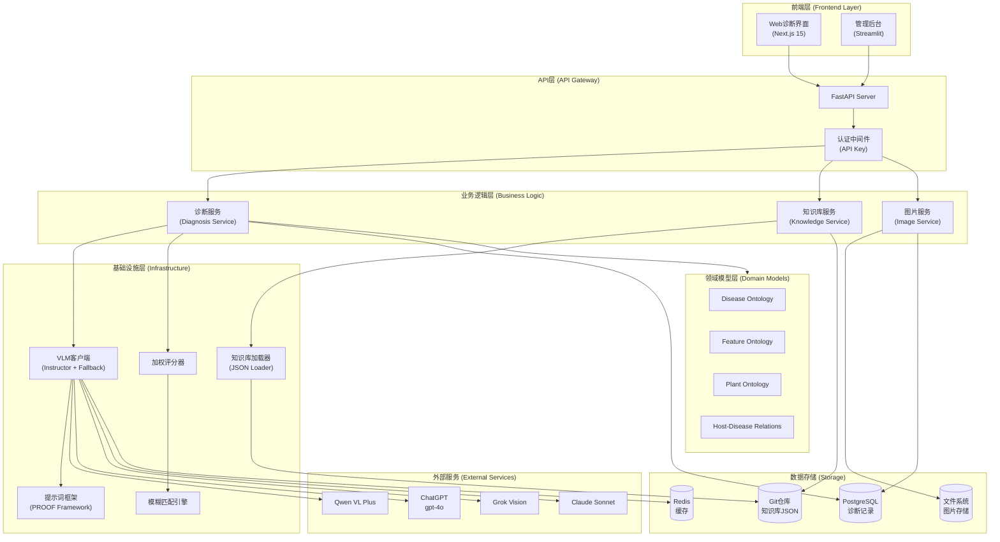
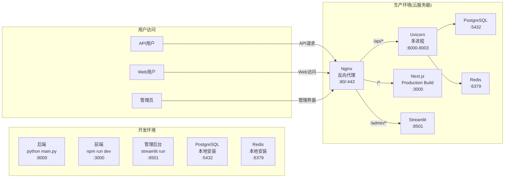
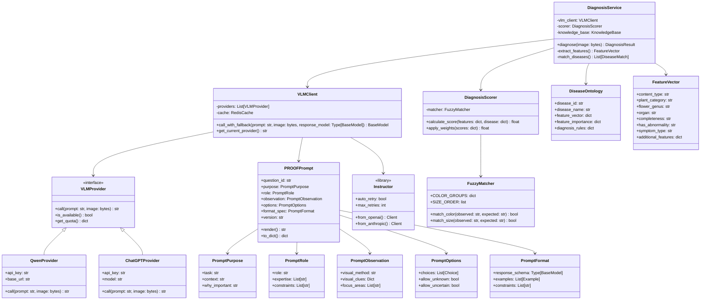
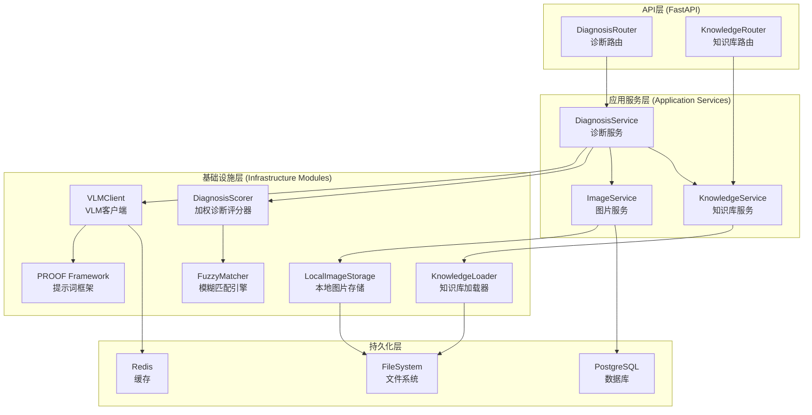

# PhytoOracle MVP 详细设计文档 v2.0

**文档版本**: v2.0
**创建时间**: 2025-11-14
**基于版本**: v1.0
**编写者**: 系统架构师
**状态**: 评审中

---

## 📋 v2.0 版本说明

本文档基于 `详细设计文档.md` (v1.0) 创建，是一个完整的独立文档，主要变更如下：

### 🔄 核心变更
1. **删除内容**: 删除第11章"多租户与权限设计"（需求中不需要）
2. **API设计扩展** (第6章): 扩展诊断API返回格式，新增知识库管理API、本体管理API
3. **目录结构更新** (第4章): 新增前端目录结构（React/Vue）
4. **前端架构设计** (新增第15章): React/Vue前端完整架构设计
5. **前后端联调指南** (新增第16章): API对接调试和E2E测试指南

### 📍 章节修改标记
- ✅ **来自v1.0**: 内容来自v1.0，保持不变或略有调整
- 🔄 **已修改**: 内容已更新扩展
- ✨ **新增**: v2.0新增的内容

---

## 目录索引

- [1. 架构总览](#1-架构总览) ✅
  - [1.1 系统架构图](#11-系统架构图)
  - [1.2 部署架构图](#12-部署架构图)
  - [1.3 核心类图](#13-核心类图)
- [2. 高内聚低耦合设计原则说明](#2-高内聚低耦合设计原则说明) ✅
  - [2.1 单一职责原则 (SRP)](#21-单一职责原则-srp)
  - [2.2 依赖倒置原则 (DIP)](#22-依赖倒置原则-dip)
  - [2.3 接口隔离原则 (ISP)](#23-接口隔离原则-isp)
  - [2.4 层次隔离](#24-层次隔离)
  - [2.5 循环依赖检测](#25-循环依赖检测)
- [3. 分层架构与模块划分（DDD 风格）](#3-分层架构与模块划分ddd-风格) ✅
  - [3.1 领域驱动设计分层](#31-领域驱动设计分层)
  - [3.2 聚合根设计](#32-聚合根设计)
  - [3.3 值对象设计](#33-值对象设计)
  - [3.4 领域服务](#34-领域服务)
- [4. 完整目录结构](#4-完整目录结构) 🔄
- [5. 核心服务与模块详细设计](#5-核心服务与模块详细设计) ✅
  - [5.1 服务与模块总览](#51-服务与模块总览)
  - [5.2 应用服务（Application Services）](#52-应用服务application-services)
  - [5.3 基础设施模块（Infrastructure Modules）](#53-基础设施模块infrastructure-modules)
  - [5.4 服务与模块实现顺序](#54-服务与模块实现顺序)
  - [5.5 关键设计原则](#55-关键设计原则)
  - [5.6 提示词工程框架（核心基础设施）](#56-提示词工程框架核心基础设施)
- [6. API 设计（OpenAPI 规范片段）](#6-api-设计openapi-规范片段) 🔄
- [7. 数据模型（Pydantic V2 完整代码）](#7-数据模型pydantic-v2-完整代码) ✅
- [8. 知识本体设计（JSON Schema + 示例）](#8-知识本体设计json-schema--示例) ✅
  - [8.1 Disease Ontology Schema](#81-disease-ontology-schema)
  - [8.2 Disease Ontology 示例](#82-disease-ontology-示例)
  - [8.3 Feature Ontology Schema](#83-feature-ontology-schema)
  - [8.4 Host-Disease Ontology Schema](#84-host-disease-ontology-schema)
- [9. 数据库表设计（PostgreSQL DDL）](#9-数据库表设计postgresql-ddl) ✅
  - [9.1 表结构总览](#91-表结构总览)
  - [9.2 完整DDL语句](#92-完整ddl语句)
  - [9.3 初始化数据脚本](#93-初始化数据脚本)
  - [9.4 数据库访问层接口（Repository模式）](#94-数据库访问层接口repository模式)
  - [9.5 数据库连接池管理](#95-数据库连接池管理)
- [10. 缓存与 Rate Limit 策略](#10-缓存与-rate-limit-策略) ✅
  - [10.1 缓存策略（MVP简化版）](#101-缓存策略mvp简化版)
  - [10.2 Rate Limit策略（MVP不实现）](#102-rate-limit策略mvp不实现)
- [11. 测试策略](#11-测试策略) ✅
  - [11.1 单元测试策略](#111-单元测试策略)
  - [11.2 集成测试策略](#112-集成测试策略)
  - [11.3 E2E测试策略](#113-e2e测试策略)
- [12. 测试用例表格](#12-测试用例表格) ✅
- [13. 部署与 CI/CD 方案](#13-部署与-cicd-方案) ✅
  - [13.1 开发环境部署](#131-开发环境部署)
  - [13.2 生产环境部署](#132-生产环境部署)
  - [13.3 CI/CD方案（MVP手工部署）](#133-cicd方案mvp手工部署)
- [14. 未来扩展点清单](#14-未来扩展点清单) ✅
  - [14.1 功能扩展（v1.2）](#141-功能扩展v12)
  - [14.2 功能扩展（v1.3+）](#142-功能扩展v13)
  - [14.3 技术债务清理](#143-技术债务清理)
  - [14.4 知识库扩展计划](#144-知识库扩展计划)
- [15. 前端架构设计](#15-前端架构设计) ✨
- [16. 前后端联调指南](#16-前后端联调指南) ✨
- [17. 文档修订记录](#17-文档修订记录) ✨

---

## 1. 架构总览

### 1.1 系统架构图



### 1.2 部署架构图



### 1.3 核心类图



---

## 2. 高内聚低耦合设计原则说明

### 2.1 单一职责原则 (SRP)

每个模块严格遵循单一职责：

| 模块 | 职责 | 不负责 |
|-----|------|--------|
| **PromptFramework** | 提示词结构化编写与版本控制 | VLM调用、响应验证 |
| **DiagnosisService** | 协调诊断流程 | VLM调用细节、评分算法 |
| **VLMClient** | VLM调用与降级、Instructor集成 | 业务逻辑、Prompt生成 |
| **FuzzyMatcher** | 模糊匹配逻辑 | 权重计算、诊断决策 |
| **DiagnosisScorer** | 加权评分计算 | 特征提取、VLM交互 |
| **KnowledgeLoader** | JSON加载与缓存 | 业务验证、诊断逻辑 |
| **ImageService** | 图片存储与检索 | 诊断逻辑、VLM调用 |

### 2.2 依赖倒置原则 (DIP)

通过Protocol抽象实现依赖倒置：

```python
from typing import Protocol

# 抽象接口定义
class VLMProtocol(Protocol):
    async def call(self, prompt: str, image: bytes) -> str: ...
    def is_available(self) -> bool: ...

class CacheProtocol(Protocol):
    async def get(self, key: str) -> Optional[str]: ...
    async def set(self, key: str, value: str, ttl: int) -> None: ...

class RepositoryProtocol(Protocol):
    async def save(self, entity: Any) -> str: ...
    async def find_by_id(self, id: str) -> Optional[Any]: ...

# 业务层依赖抽象，而非具体实现
class DiagnosisService:
    def __init__(
        self,
        vlm: VLMProtocol,  # 依赖抽象
        cache: CacheProtocol,  # 依赖抽象
        repo: RepositoryProtocol  # 依赖抽象
    ):
        self.vlm = vlm
        self.cache = cache
        self.repo = repo
```

### 2.3 接口隔离原则 (ISP)

细粒度接口设计，避免胖接口：

```python
# ❌ 错误示例：胖接口
class KnowledgeService:
    def load_diseases(): ...
    def save_disease(): ...
    def delete_disease(): ...
    def load_plants(): ...
    def save_plant(): ...
    def validate_json(): ...
    def export_to_csv(): ...

# ✅ 正确示例：细粒度接口
class DiseaseLoader(Protocol):
    def load_all() -> List[DiseaseOntology]: ...

class DiseaseEditor(Protocol):
    def save(disease: DiseaseOntology) -> None: ...
    def delete(disease_id: str) -> None: ...

class OntologyValidator(Protocol):
    def validate(json_data: dict) -> ValidationResult: ...
```

### 2.4 层次隔离

严格的层次结构，禁止跨层调用：

```
表现层 (Routers)
    ↓ [仅通过Schema传递数据]
应用层 (Services)
    ↓ [仅通过Domain Model交互]
领域层 (Domain)
    ↓ [仅通过Protocol调用]
基础设施层 (Infrastructure)
```

### 2.5 循环依赖检测

使用mypy严格模式检测循环依赖：

```bash
# pyproject.toml配置
[tool.mypy]
strict = true
disallow_any_unimported = true
no_implicit_reexport = true
warn_return_any = true

# 运行检测
mypy --strict backend/
```

---

## 3. 分层架构与模块划分（DDD 风格）

### 3.1 领域驱动设计分层

```
┌─────────────────────────────────────────┐
│        表现层 (Presentation)            │
│   FastAPI Routers / Streamlit UI        │
├─────────────────────────────────────────┤
│         应用层 (Application)            │
│   DiagnosisService / KnowledgeService   │
├─────────────────────────────────────────┤
│          领域层 (Domain)                │
│   实体 / 值对象 / 领域服务 / 聚合根      │
├─────────────────────────────────────────┤
│      基础设施层 (Infrastructure)        │
│   VLM / Database / Cache / Storage      │
└─────────────────────────────────────────┘
```

### 3.2 聚合根设计

**诊断聚合 (Diagnosis Aggregate)**：
```python
class DiagnosisAggregate:
    """诊断聚合根"""
    def __init__(self, diagnosis_id: str):
        self.diagnosis_id = diagnosis_id
        self.feature_vector: FeatureVector = None
        self.disease_matches: List[DiseaseMatch] = []
        self.final_diagnosis: DiagnosisResult = None
        self.images: List[ImageEntity] = []

    def add_image(self, image: ImageEntity) -> None:
        """添加诊断图片"""
        self.images.append(image)

    def extract_features(self, vlm_responses: dict) -> None:
        """提取特征向量"""
        self.feature_vector = FeatureVector.from_vlm_responses(vlm_responses)

    def match_diseases(self, candidates: List[DiseaseOntology]) -> None:
        """匹配候选疾病"""
        for disease in candidates:
            score = self._calculate_match_score(disease)
            self.disease_matches.append(DiseaseMatch(disease, score))

    def finalize_diagnosis(self) -> DiagnosisResult:
        """最终诊断决策"""
        best_match = max(self.disease_matches, key=lambda x: x.score)
        confidence_level = self._determine_confidence_level(best_match.score)
        self.final_diagnosis = DiagnosisResult(
            disease=best_match.disease,
            confidence=best_match.score,
            level=confidence_level
        )
        return self.final_diagnosis
```

**知识库聚合 (KnowledgeBase Aggregate)**：
```python
class KnowledgeBaseAggregate:
    """知识库聚合根"""
    def __init__(self):
        self.diseases: Dict[str, DiseaseOntology] = {}
        self.plants: Dict[str, PlantOntology] = {}
        self.features: FeatureOntology = None
        self.host_disease_map: HostDiseaseMap = None
        self.version: str = None

    def load_from_json(self, base_path: str) -> None:
        """从JSON加载知识库"""
        pass

    def get_diseases_by_genus(self, genus: str) -> List[DiseaseOntology]:
        """根据花卉属获取候选疾病"""
        disease_ids = self.host_disease_map.get_diseases_for_host(genus)
        return [self.diseases[id] for id in disease_ids if id in self.diseases]

    def reload(self) -> None:
        """热更新知识库"""
        pass
```

### 3.3 值对象设计

```python
# 值对象：不可变，通过值判断相等性
@dataclass(frozen=True)
class FeatureVector:
    """特征向量值对象"""
    content_type: str
    plant_category: str
    flower_genus: str
    organ: str
    completeness: str
    has_abnormality: str
    symptom_type: str
    color_center: Optional[str] = None
    location: Optional[str] = None
    size: Optional[str] = None
    distribution: Optional[str] = None

    def to_dict(self) -> dict:
        return asdict(self)

@dataclass(frozen=True)
class DiagnosisScore:
    """诊断分数值对象（完整版，包含医学诊断逻辑）"""
    total_score: float
    major_features_score: float
    minor_features_score: float
    optional_features_score: float
    major_matched: int  # 新增：主要特征匹配数量
    major_total: int    # 新增：主要特征总数

    @property
    def confidence_level(self) -> str:
        """
        诊断等级判定（严格遵循医学诊断逻辑）

        规则（需求文档v1.3定义）：
        - confirmed: total_score ≥ 0.85 且 major_matched ≥ 2/2
          医学原理：主要症状必须全部匹配才能确诊
        - suspected: 0.60 ≤ total_score < 0.85 且 major_matched ≥ 1/2
          医学原理：至少一个主要症状匹配 + 次要症状支持
        - unlikely: total_score < 0.60 或 major_matched = 0
          医学原理：主要症状不匹配则排除诊断
        """
        if self.total_score >= 0.85 and self.major_matched >= 2:
            return "confirmed"
        elif self.total_score >= 0.60 and self.major_matched >= 1:
            return "suspected"
        else:
            return "unlikely"

    @property
    def is_diagnosable(self) -> bool:
        """
        是否可诊断（排除"健康"或"知识库外疾病"）

        规则：
        - total_score < 0.30: 认为无病或知识库外疾病
        - 用于触发VLM兜底策略或返回"无法诊断"
        """
        return self.total_score >= 0.30
```

### 3.4 领域服务

```python
class DomainDiagnosisService:
    """领域层诊断服务"""

    @staticmethod
    def calculate_weighted_score(
        feature_vector: FeatureVector,
        disease: DiseaseOntology
    ) -> DiagnosisScore:
        """计算加权诊断分数（核心业务逻辑）"""
        major_score = 0.0
        minor_score = 0.0
        optional_score = 0.0
        major_matched = 0  # 主要特征匹配数
        major_total = 2    # 主要特征总数（symptom_type + color_center）

        # Major Features (权重0.8)
        if feature_vector.symptom_type == disease.expected_symptom_type:
            major_score += 0.5
            major_matched += 1
        if feature_vector.color_center in disease.expected_colors:
            major_score += 0.3
            major_matched += 1

        # Minor Features (权重0.15)
        if feature_vector.location == disease.expected_location:
            minor_score += 0.1
        # ... 其他次要特征

        # Optional Features (权重0.05)
        # ... 可选特征计算

        total = major_score * 0.8 + minor_score * 0.15 + optional_score * 0.05

        return DiagnosisScore(
            total_score=total,
            major_features_score=major_score,
            minor_features_score=minor_score,
            optional_features_score=optional_score,
            major_matched=major_matched,  # 新增
            major_total=major_total        # 新增
        )
```

---

## 4. 完整目录结构 🔄

### 4.1 后端目录结构 ✅

```
PhytoOracle/
├── backend/                                 # 后端服务（FastAPI）
│   ├── apps/
│   │   ├── api/                            # FastAPI 主应用
│   │   │   ├── __init__.py
│   │   │   ├── main.py                     # FastAPI应用入口，配置CORS、中间件
│   │   │   ├── deps.py                     # 依赖注入：DB连接池、Redis、VLM Client
│   │   │   ├── routers/                    # 路由模块
│   │   │   │   ├── __init__.py
│   │   │   │   ├── diagnosis.py            # POST /diagnose - 诊断接口
│   │   │   │   ├── knowledge.py            # GET /diseases, /plants - 知识库查询
│   │   │   │   ├── admin.py                # POST /reload - 知识库重载
│   │   │   │   └── auth.py                 # POST /login, /api-keys - 认证管理
│   │   │   ├── schemas/                    # Pydantic请求/响应模型
│   │   │   │   ├── __init__.py
│   │   │   │   ├── diagnosis.py            # DiagnosisRequest/Response
│   │   │   │   ├── knowledge.py            # DiseaseSchema, PlantSchema
│   │   │   │   └── auth.py                 # LoginRequest, ApiKeyResponse
│   │   │   └── middleware/                 # 中间件
│   │   │       ├── __init__.py
│   │   │       └── auth.py                 # API Key验证中间件
│   │   │
│   │   └── admin/                          # 管理后台（Streamlit）
│   │       ├── __init__.py
│   │       ├── app.py                      # Streamlit主入口
│   │       ├── pages/                      # 多页面应用
│   │       │   ├── 1_🌸_疾病管理.py        # 疾病CRUD界面
│   │       │   ├── 2_🔬_诊断测试.py        # 上传图片测试诊断
│   │       │   ├── 3_📊_统计分析.py        # 准确率统计
│   │       │   └── 4_🔄_知识库版本.py      # 版本管理与回滚
│   │       └── utils/                      # 工具函数
│   │           └── auth.py                 # Streamlit认证
│   │
│   ├── core/                               # 核心配置与工具
│   │   ├── __init__.py
│   │   ├── config.py                       # Settings类，从.env加载配置
│   │   ├── security.py                     # API Key生成(secrets)、密码哈希(bcrypt)
│   │   ├── exceptions.py                   # 自定义异常：DiagnosisError, VLMError
│   │   └── cache.py                        # Redis缓存封装类
│   │
│   ├── domain/                             # DDD领域模型（Pydantic V2）
│   │   ├── __init__.py
│   │   ├── diagnosis.py                    # DiagnosisAggregate, DiagnosisResult
│   │   ├── disease.py                      # DiseaseOntology领域模型
│   │   ├── feature.py                      # FeatureOntology, FeatureVector
│   │   ├── plant.py                        # PlantOntology领域模型
│   │   ├── treatment.py                    # TreatmentOntology（v1.3预留）
│   │   └── value_objects.py                # 值对象：Score, Confidence
│   │
│   ├── infrastructure/                     # 基础设施层
│   │   ├── llm/
│   │   │   ├── __init__.py
│   │   │   ├── base.py                     # VLMProtocol抽象接口
│   │   │   ├── client.py                   # VLMClient实现Fallback机制
│   │   │   ├── providers/                  # 具体Provider实现
│   │   │   │   ├── __init__.py
│   │   │   │   ├── qwen.py                 # QwenVLPlusProvider
│   │   │   │   ├── chatgpt.py              # ChatGPTProvider (gpt-4o)
│   │   │   │   ├── grok.py                 # GrokVisionProvider
│   │   │   │   └── claude.py               # ClaudeProvider
│   │   │   ├── prompts/                    # VLM提示词模板（Git版本控制）
│   │   │   │   ├── __init__.py
│   │   │   │   ├── q0_screening.py         # Q0.0-Q0.5 过滤问题模板
│   │   │   │   ├── q1_q6_features.py       # Q1-Q6 特征提取模板
│   │   │   │   ├── fallback.py             # VLM开放式诊断模板
│   │   │   │   ├── CHANGELOG.md            # 提示词版本变更记录
│   │   │   │   └── versions/               # 历史版本归档（A/B测试）
│   │   │   │       └── v1.0/
│   │   │   └── validators.py               # VLM响应验证器（JSON Schema）
│   │   │
│   │   ├── ontology/
│   │   │   ├── __init__.py
│   │   │   ├── loader.py                   # JSONKnowledgeLoader - 加载JSON知识库
│   │   │   ├── matcher.py                  # FuzzyMatcher - 模糊匹配COLOR_GROUPS/SIZE_ORDER
│   │   │   └── scorer.py                   # DiagnosisScorer - 加权评分0.8/0.15/0.05
│   │   │
│   │   ├── persistence/
│   │   │   ├── __init__.py
│   │   │   ├── database.py                 # create_pool() - asyncpg连接池
│   │   │   ├── redis_client.py             # RedisCache类封装
│   │   │   └── repositories/               # 数据访问层
│   │   │       ├── __init__.py
│   │   │       ├── diagnosis_repo.py       # 诊断记录CRUD (asyncpg)
│   │   │       ├── image_repo.py           # 图片元数据CRUD
│   │   │       └── apikey_repo.py          # API Key管理
│   │   │
│   │   └── storage/
│   │       ├── __init__.py
│   │       └── local_storage.py            # LocalImageStorage - 按分类存储图片
│   │
│   ├── services/                           # 业务逻辑层（应用服务）
│   │   ├── __init__.py
│   │   ├── diagnosis_service.py            # 核心诊断流程编排
│   │   ├── knowledge_service.py            # 知识库加载、重载、查询
│   │   └── image_service.py                # 图片保存、分类、元数据管理
│   │
│   ├── tests/                              # 测试目录
│   │   ├── conftest.py                     # Pytest fixtures
│   │   ├── unit/                           # 单元测试
│   │   │   ├── test_matcher.py             # 测试COLOR_GROUPS模糊匹配
│   │   │   ├── test_scorer.py              # 测试加权评分算法
│   │   │   └── test_vlm_client.py          # 测试VLM Fallback机制
│   │   ├── integration/                    # 集成测试
│   │   │   ├── test_diagnosis_api.py       # 测试完整诊断API流程
│   │   │   └── test_knowledge_reload.py    # 测试知识库热更新
│   │   └── e2e/                            # 端到端测试（Playwright）
│   │       └── test_diagnosis_flow.py      # 测试Web界面完整流程
│   │
│   ├── knowledge_base/                     # 知识库JSON文件（Git版本控制）
│   │   ├── diseases/                       # 疾病本体JSON
│   │   │   ├── rose_black_spot.json        # 玫瑰黑斑病
│   │   │   ├── cherry_powdery_mildew.json  # 樱花白粉病
│   │   │   └── ...                         # 其他18-24种疾病
│   │   ├── features/                       # 特征本体
│   │   │   └── feature_ontology.json       # 特征定义与模糊匹配规则
│   │   ├── plants/                         # 植物本体
│   │   │   ├── rosa.json                   # 玫瑰属
│   │   │   ├── prunus.json                 # 樱花属
│   │   │   ├── tulipa.json                 # 郁金香属
│   │   │   ├── dianthus.json               # 康乃馨属
│   │   │   └── paeonia.json                # 牡丹属
│   │   ├── host_disease/                   # 宿主-疾病关系
│   │   │   └── associations.json           # 花卉与疾病映射关系
│   │   └── treatments/                     # 治疗方案（v1.3+预留）
│   │
│   ├── storage/                            # 本地文件存储目录
│   │   ├── images/
│   │   │   ├── unlabeled/                  # 未标注图片
│   │   │   │   ├── rose/
│   │   │   │   │   └── 2025-01/
│   │   │   │   └── cherry/
│   │   │   ├── correct/                    # 诊断正确
│   │   │   └── incorrect/                  # 诊断错误
│   │   └── metadata/                       # 图片元数据JSON缓存
│   │
│   ├── scripts/                            # 运维脚本
│   │   ├── init_db.sql                     # 创建表结构SQL脚本
│   │   ├── seed_apikeys.py                 # 生成测试用API Key
│   │   └── validate_ontology.py            # JSON Schema校验脚本
│   │
│   ├── pyproject.toml                      # Poetry依赖管理
│   ├── .env.example                        # 环境变量模板
│   ├── .gitignore
│   └── README.md                           # 后端部署说明
```

### 4.2 前端目录结构 ✨

**🆕 v2.0新增**: React/Vue前端项目目录结构

```
frontend/
├── public/                     # 静态资源
│   ├── index.html
│   ├── favicon.ico
│   └── assets/
│       └── images/
├── src/
│   ├── api/                    # API客户端层
│   │   ├── client.ts           # Axios配置，统一请求/响应拦截
│   │   │   # - 配置baseURL: process.env.VITE_API_BASE_URL
│   │   │   # - 配置请求拦截器（添加token）
│   │   │   # - 配置响应拦截器（统一错误处理）
│   │   │   # - 配置超时时间（10秒）
│   │   ├── diagnosis.ts        # 诊断API封装
│   │   │   # - diagnoseSingle(image: File): Promise<DiagnosisResult>
│   │   │   # - diagnoseBatch(images: File[]): Promise<BatchDiagnosisResult>
│   │   │   # - getDiagnosisResult(id: string): Promise<DiagnosisResult>
│   │   ├── knowledge.ts        # 知识库API封装
│   │   │   # - getKnowledgeTree(): Promise<KnowledgeTree>
│   │   │   # - getDiseaseDetail(diseaseId: string): Promise<DiseaseDetail>
│   │   │   # - updateDisease(diseaseId: string, data: DiseaseUpdate): Promise<void>
│   │   │   # - createDisease(data: DiseaseCreate): Promise<string>
│   │   │   # - deleteDisease(diseaseId: string): Promise<void>
│   │   └── ontology.ts         # 本体API封装
│   │       # - getOntologyList(): Promise<OntologyType[]>
│   │       # - getOntologySchema(type: string): Promise<OntologySchema>
│   │
│   ├── assets/                 # 静态资源
│   │   ├── images/
│   │   ├── icons/
│   │   └── styles/
│   │       ├── global.css      # 全局样式
│   │       └── variables.css   # CSS变量
│   │
│   ├── components/             # 组件层
│   │   ├── common/             # 通用组件
│   │   │   ├── Header/
│   │   │   │   ├── index.tsx   # 导航栏组件
│   │   │   │   └── style.css
│   │   │   ├── Loading/
│   │   │   │   ├── index.tsx   # 加载组件
│   │   │   │   └── style.css
│   │   │   ├── Toast/
│   │   │   │   ├── index.tsx   # 提示组件
│   │   │   │   └── useToast.ts # Toast Hook
│   │   │   └── Modal/
│   │   │       ├── index.tsx   # 对话框组件
│   │   │       └── style.css
│   │   │
│   │   ├── diagnosis/          # 诊断相关组件
│   │   │   ├── UploadArea/
│   │   │   │   ├── index.tsx   # 上传区域（支持拖拽）
│   │   │   │   └── style.css
│   │   │   ├── ImagePreview/
│   │   │   │   ├── index.tsx   # 图片预览
│   │   │   │   └── style.css
│   │   │   ├── DiagnosisResult/
│   │   │   │   ├── index.tsx   # 诊断结果卡片
│   │   │   │   └── style.css
│   │   │   ├── QADetails/
│   │   │   │   ├── index.tsx   # VLM问答对详情（可展开）
│   │   │   │   └── style.css
│   │   │   └── FeatureMatchDetails/
│   │   │       ├── index.tsx   # 特征匹配详情
│   │   │       └── style.css
│   │   │
│   │   ├── batch/              # 批量诊断组件
│   │   │   ├── BatchUpload/
│   │   │   │   ├── index.tsx   # 批量上传（支持多文件）
│   │   │   │   └── style.css
│   │   │   ├── ResultList/
│   │   │   │   ├── index.tsx   # 结果列表（翻页控制）
│   │   │   │   └── style.css
│   │   │   ├── ResultCard/
│   │   │   │   ├── index.tsx   # 结果卡片（双击查看详情）
│   │   │   │   └── style.css
│   │   │   └── DetailModal/
│   │   │       ├── index.tsx   # 详情模态框
│   │   │       └── style.css
│   │   │
│   │   ├── ontology/           # 本体管理组件
│   │   │   ├── OntologyList/
│   │   │   │   ├── index.tsx   # 本体类型列表
│   │   │   │   └── style.css
│   │   │   ├── OntologyDetail/
│   │   │   │   ├── index.tsx   # 本体详情展示
│   │   │   │   └── style.css
│   │   │   └── DimensionCard/
│   │   │       ├── index.tsx   # 维度卡片（含枚举值）
│   │   │       └── style.css
│   │   │
│   │   └── knowledge/          # 知识管理组件
│   │       ├── KnowledgeTree/
│   │       │   ├── index.tsx   # 知识库目录树（按宿主属分组）
│   │       │   └── style.css
│   │       ├── DiseaseDetail/
│   │       │   ├── index.tsx   # 疾病详情展示
│   │       │   └── style.css
│   │       ├── DimensionCard/
│   │       │   ├── index.tsx   # 维度卡片（带本体标识）
│   │       │   └── style.css
│   │       └── VLMDescriptionEditor/
│   │           ├── index.tsx   # VLM描述编辑器
│   │           └── style.css
│   │
│   ├── pages/                  # 页面层
│   │   ├── SingleDiagnosis/    # 界面1：单图诊断
│   │   │   ├── index.tsx       # 页面主组件
│   │   │   ├── hooks.ts        # 自定义Hooks
│   │   │   └── style.css
│   │   ├── BatchDiagnosis/     # 界面2：批量诊断
│   │   │   ├── index.tsx
│   │   │   ├── hooks.ts
│   │   │   └── style.css
│   │   ├── OntologyManagement/ # 界面3：本体管理
│   │   │   ├── index.tsx
│   │   │   ├── hooks.ts
│   │   │   └── style.css
│   │   └── KnowledgeManagement/# 界面4：知识管理
│   │       ├── index.tsx
│   │       ├── hooks.ts
│   │       └── style.css
│   │
│   ├── store/                  # 状态管理层（Zustand/Pinia）
│   │   ├── diagnosisStore.ts   # 诊断状态
│   │   │   # State: currentDiagnosis, batchDiagnoses, loading
│   │   │   # Actions: setCurrentDiagnosis, addBatchDiagnosis, clearDiagnoses
│   │   ├── knowledgeStore.ts   # 知识库状态
│   │   │   # State: knowledgeTree, currentDisease, editMode
│   │   │   # Actions: setKnowledgeTree, updateDisease, toggleEditMode
│   │   ├── ontologyStore.ts    # 本体状态
│   │   │   # State: ontologyList, currentOntology
│   │   │   # Actions: setOntologyList, selectOntology
│   │   └── globalStore.ts      # 全局状态
│   │       # State: user, loading, toast
│   │       # Actions: showToast, hideToast, setLoading
│   │
│   ├── types/                  # TypeScript类型定义
│   │   ├── diagnosis.ts        # 诊断相关类型
│   │   │   # DiagnosisResult, VLMQAResponse, FeatureMatch
│   │   ├── knowledge.ts        # 知识库相关类型
│   │   │   # KnowledgeTree, DiseaseDetail, DimensionInfo
│   │   ├── ontology.ts         # 本体相关类型
│   │   │   # OntologyType, OntologySchema, DimensionDefinition
│   │   └── api.ts              # API响应类型
│   │       # ApiResponse, ApiError, PaginatedResponse
│   │
│   ├── utils/                  # 工具函数
│   │   ├── formatters.ts       # 格式化工具
│   │   │   # formatDate, formatPercentage, formatFileSize
│   │   ├── validators.ts       # 验证工具
│   │   │   # validateImageFile, validateDiseaseData
│   │   ├── errorHandler.ts     # 错误处理
│   │   │   # handleApiError, showErrorToast
│   │   └── constants.ts        # 常量定义
│   │       # MAX_FILE_SIZE, ALLOWED_FILE_TYPES
│   │
│   ├── hooks/                  # 全局自定义Hooks
│   │   ├── useApi.ts           # API调用Hook
│   │   ├── useUpload.ts        # 文件上传Hook
│   │   └── useModal.ts         # Modal控制Hook
│   │
│   ├── App.tsx                 # 根组件
│   ├── main.tsx                # 入口文件
│   └── routes.tsx              # 路由配置
│       # Route: /diagnosis/single → SingleDiagnosis
│       # Route: /diagnosis/batch → BatchDiagnosis
│       # Route: /ontology → OntologyManagement
│       # Route: /knowledge → KnowledgeManagement
│
├── .env.example                # 环境变量模板
│   # VITE_API_BASE_URL=http://localhost:8000/api/v1
│   # VITE_MAX_FILE_SIZE=10485760
│
├── .eslintrc.js                # ESLint配置
├── .prettierrc                 # Prettier配置
├── package.json
├── tsconfig.json
├── vite.config.ts              # Vite配置（含代理）
└── README.md
```

**目录结构设计说明**：
1. **分层清晰**: api层、component层、page层、store层职责明确
2. **组件化**: 每个组件独立目录，包含tsx + style.css
3. **类型安全**: 完整的TypeScript类型定义
4. **状态管理**: 使用Zustand或Pinia进行状态管理
5. **工具函数**: 统一的工具函数和常量定义

---

## 5. 核心服务与模块详细设计 ✅

> **✅ 来自v1.0**: 本章内容来自详细设计文档v1.0，保持不变。

> **设计说明**：本章明确区分**应用服务（Application Services）**和**基础设施模块（Infrastructure Modules）**，并阐明彼此的调用关系。粒度可粗但不能缺。

---

### 5.1 服务与模块总览

#### 5.1.1 分层架构图



#### 5.1.2 调用关系矩阵

| 调用者 \ 被调用者 | DiagnosisService | VLMClient | DiagnosisScorer | KnowledgeLoader | FuzzyMatcher | PROOF Framework |
|-------------------|------------------|-----------|-----------------|-----------------|--------------|-----------------|
| **DiagnosisRouter** | ✓ | - | - | - | - | - |
| **DiagnosisService** | - | ✓ | ✓ | - | - | - |
| **VLMClient** | - | - | - | - | - | ✓ |
| **DiagnosisScorer** | - | - | - | - | ✓ | - |

**说明**：
- ✓ 表示调用关系
- 应用服务层不能直接依赖持久化层（必须通过Repository模式）
- 基础设施模块之间可以相互调用（但要避免循环依赖）

---

### 5.2 应用服务（Application Services）

> **职责**：编排业务流程，调用多个基础设施模块协同工作，包含业务逻辑和流程控制。

---

#### 5.2.1 DiagnosisService（诊断服务）

**文件路径**：`backend/services/diagnosis_service.py`

**职责**：
- 编排完整诊断流程（Q0-Q6问诊序列 + 三层渐进诊断）
- 协调VLM客户端、知识库服务、评分器、图片服务
- 实现兜底逻辑（知识库外疾病、VLM失败）

**依赖的模块/服务**：
- `VLMClient`：调用VLM进行特征提取
- `KnowledgeService`：获取候选疾病列表
- `DiagnosisScorer`：计算诊断评分
- `ImageService`：保存图片
- `DiagnosisRepository`：保存诊断记录

**被谁调用**：
- `DiagnosisRouter`（FastAPI路由）

**关键接口**：

```python
class DiagnosisService:
    """核心诊断服务 - 编排诊断流程"""

    def __init__(
        self,
        vlm_client: VLMClient,
        knowledge_service: KnowledgeService,
        scorer: DiagnosisScorer,
        diagnosis_repo: DiagnosisRepository,
        image_service: ImageService
    ):
        self.vlm_client = vlm_client
        self.knowledge_service = knowledge_service
        self.scorer = scorer
        self.diagnosis_repo = diagnosis_repo
        self.image_service = image_service

    async def diagnose(self, image_bytes: bytes, metadata: dict = None) -> DiagnosisResult:
        """
        执行完整诊断流程

        流程：
        1. 保存图片
        2. Q0逐级过滤（Q0.0-Q0.5）
        3. Q1-Q6动态特征提取
        4. 构建特征向量
        5. 获取候选疾病（基于种属）
        6. 疾病匹配与评分
        7. 置信度分层决策（confirmed/suspected/兜底）
        8. 保存诊断记录
        """
        pass

    async def _execute_q0_sequence(self, image_bytes: bytes) -> dict:
        """执行Q0逐级过滤（调用VLMClient 6次）"""
        pass

    async def _execute_q1_q6_sequence(self, image_bytes: bytes, symptom_type: str) -> dict:
        """执行Q1-Q6动态特征提取（根据symptom_type动态生成问题）"""
        pass

    async def _vlm_open_ended_diagnosis(self, image_bytes: bytes) -> str:
        """VLM开放式诊断（兜底策略）"""
        pass
```

**调用流程示例**：
```
DiagnosisRouter.diagnose()
  → DiagnosisService.diagnose()
      → ImageService.save_image()           # 保存图片
      → VLMClient.call_with_fallback()       # Q0.0内容类型识别
      → VLMClient.call_with_fallback()       # Q0.1植物类别识别
      → ...                                  # Q0.2-Q0.5
      → VLMClient.call_with_fallback()       # Q1-Q6特征提取
      → KnowledgeService.get_diseases_by_genus()  # 获取候选疾病
      → DiagnosisScorer.calculate_score()    # 计算评分
      → DiagnosisRepository.save()           # 保存诊断记录
```

---

#### 5.2.2 KnowledgeService（知识库服务）

**文件路径**：`backend/services/knowledge_service.py`

**职责**：
- 知识库加载、重载、查询
- 提供疾病列表查询（按花卉属筛选）
- 管理知识库版本

**依赖的模块/服务**：
- `KnowledgeLoader`：加载JSON知识库

**被谁调用**：
- `DiagnosisService`：查询候选疾病
- `KnowledgeRouter`：管理后台查询疾病列表

**关键接口**：

```python
class KnowledgeService:
    """知识库服务"""

    def __init__(self, loader: KnowledgeLoader):
        self.loader = loader
        self.knowledge_base: Optional[KnowledgeBaseAggregate] = None

    async def initialize(self):
        """系统启动时加载知识库"""
        self.knowledge_base = await self.loader.load_all()

    async def reload(self):
        """热更新知识库（管理后台调用）"""
        self.knowledge_base = await self.loader.reload()

    def get_diseases_by_genus(self, genus: str) -> List[DiseaseOntology]:
        """获取指定花卉属的疾病列表"""
        pass

    def get_all_diseases(self) -> List[DiseaseOntology]:
        """获取所有疾病列表"""
        pass

    def get_disease_by_id(self, disease_id: str) -> Optional[DiseaseOntology]:
        """根据ID获取疾病详情"""
        pass
```

**调用流程示例**：
```
KnowledgeRouter.reload()
  → KnowledgeService.reload()
      → KnowledgeLoader.reload()  # 重新加载JSON文件
```

---

#### 5.2.3 ImageService（图片服务）

**文件路径**：`backend/services/image_service.py`

**职责**：
- 图片保存（按准确率+花卉名+日期分类）
- 图片元数据管理
- 准确性标注

**依赖的模块/服务**：
- `LocalImageStorage`：本地文件存储
- `ImageRepository`：图片元数据持久化

**被谁调用**：
- `DiagnosisService`：保存诊断图片
- `AdminRouter`：准确性标注

**关键接口**：

```python
class ImageService:
    """图片服务"""

    def __init__(
        self,
        storage: LocalImageStorage,
        image_repo: ImageRepository
    ):
        self.storage = storage
        self.image_repo = image_repo

    async def save_image(
        self,
        image_bytes: bytes,
        diagnosis_id: str,
        plant_genus: str,
        organ: str
    ) -> str:
        """
        保存图片到本地存储

        路径：storage/images/unlabeled/{genus}/{year-month}/{day}/{diagnosis_id}_{disease_id}.jpg
        """
        pass

    async def update_accuracy_label(
        self,
        image_id: str,
        label: str  # "correct" / "incorrect"
    ):
        """更新准确性标签（移动文件到correct/incorrect文件夹）"""
        pass

    async def query_images(
        self,
        genus: Optional[str] = None,
        accuracy_label: Optional[str] = None,
        date_range: Optional[tuple] = None
    ) -> List[ImageMetadata]:
        """查询图片（按花卉属、准确性、日期范围）"""
        pass
```

---

### 5.3 基础设施模块（Infrastructure Modules）

> **职责**：提供技术能力（VLM调用、数据库访问、算法实现），无业务逻辑，可独立测试。

---

#### 5.3.1 VLMClient（VLM客户端）

**文件路径**：`backend/infrastructure/llm/client.py`

**职责**：
- VLM API调用（包装多个Provider）
- Fallback机制（Qwen → ChatGPT → Grok → Claude）
- 缓存机制（Redis，避免重复调用）
- 集成Instructor（自动验证Pydantic模型）

**依赖的模块/服务**：
- `PROOFFramework`：获取渲染后的提示词
- `RedisCache`：缓存VLM响应
- `VLM Providers`：具体Provider实现（QwenProvider, ChatGPTProvider等）

**被谁调用**：
- `DiagnosisService`：Q0-Q6问诊调用

**关键接口**：

```python
class VLMClient:
    """VLM客户端 - 实现Fallback机制 + Instructor集成"""

    def __init__(self, providers: List[VLMProvider], cache: RedisCache):
        self.providers = providers  # 按优先级排序：Qwen, ChatGPT, Grok, Claude
        self.cache = cache

    async def call_with_fallback(
        self,
        prompt: str,
        image: bytes,
        response_model: Type[BaseModel],  # Pydantic模型，如Q00Response
        question_id: str = None
    ) -> BaseModel:
        """
        带降级的VLM调用 + 自动验证

        流程：
        1. 尝试缓存（如果提供了question_id）
        2. 依次尝试各Provider（Instructor自动验证 + 重试3次）
        3. 缓存结果（ttl=7天）
        4. 所有Provider失败 → 抛出VLMError
        """
        pass

    def _build_cache_key(self, image: bytes, question_id: str) -> str:
        """构建缓存键：vlm:{image_hash}:{question_id}"""
        pass
```

**调用流程示例**：
```
DiagnosisService._execute_q0_sequence()
  → VLMClient.call_with_fallback(prompt=Q0_0_PROMPT, response_model=Q00Response)
      → RedisCache.get()                    # 尝试缓存
      → QwenVLProvider.call()               # 调用Qwen VL Plus
          → Instructor.chat.completions.create()  # Instructor自动验证
      → RedisCache.set()                    # 缓存结果
```

---

#### 5.3.2 FuzzyMatcher（模糊匹配引擎）

**文件路径**：`backend/infrastructure/ontology/matcher.py`

**职责**：
- 颜色模糊匹配（COLOR_GROUPS同色系匹配）
- 尺寸模糊匹配（SIZE_ORDER允许±1级别误差）
- 位置模糊匹配（支持多值匹配）

**依赖的模块/服务**：无

**被谁调用**：
- `DiagnosisScorer`：特征匹配时调用

**关键接口**：

```python
class FuzzyMatcher:
    """模糊匹配引擎 - 处理VLM观察误差"""

    COLOR_GROUPS = {
        "黑褐色系": ["black", "dark_brown", "brown", "dark"],
        "黄色系": ["yellow", "light_yellow", "yellowish_green", "pale_yellow"],
        "白色系": ["white", "gray_white", "off_white", "cream"],
        # ...
    }

    SIZE_ORDER = ["pinpoint", "small", "medium_small", "medium", "large"]

    def match_color(self, observed: str, expected: Union[str, List[str]]) -> bool:
        """颜色模糊匹配（精确匹配 + 同色系匹配）"""
        pass

    def match_size(self, observed: str, expected: str) -> bool:
        """尺寸模糊匹配（允许±1级别误差）"""
        pass

    def match_location(self, observed: str, expected: Union[str, List[str]]) -> bool:
        """位置匹配（支持多值）"""
        pass
```

---

#### 5.3.3 DiagnosisScorer（加权诊断评分器）

**文件路径**：`backend/infrastructure/ontology/scorer.py`

**职责**：
- 实现加权诊断评分算法
- 主要特征权重0.8（symptom_type: 0.5 + color_center: 0.3）
- 次要特征权重0.15、可选特征权重0.05
- 完整性修正系数（complete: 1.0, partial: 0.8, close_up: 0.6）
- 诊断规则判定（confirmed/suspected/unlikely）

**依赖的模块/服务**：
- `FuzzyMatcher`：特征匹配时调用

**被谁调用**：
- `DiagnosisService`：疾病匹配与评分时调用

**关键接口**：

```python
class DiagnosisScorer:
    """加权诊断评分器 - 核心诊断算法"""

    def __init__(self, matcher: FuzzyMatcher):
        self.matcher = matcher

    def calculate_score(
        self,
        observed_features: dict,      # 特征向量（从VLM提取）
        disease_definition: dict      # 疾病定义（从知识库）
    ) -> DiagnosisScore:
        """
        计算诊断分数

        流程：
        1. 计算主要特征得分（调用FuzzyMatcher匹配）
        2. 计算次要特征得分
        3. 计算可选特征得分
        4. 应用完整性修正系数
        5. 统计主要特征匹配数量（用于医学诊断逻辑判定）
        6. 返回DiagnosisScore对象

        返回：DiagnosisScore(
            total_score,
            major_features_score,
            minor_features_score,
            optional_features_score,
            major_matched,   # 主要特征匹配数量
            major_total      # 主要特征总数
        )
        """
        pass

    def _calculate_major_score(self, observed: dict, major_config: dict) -> float:
        """计算主要特征得分"""
        pass

    def _count_major_matched(self, observed: dict, major_config: dict) -> int:
        """统计主要特征匹配数量（用于医学诊断逻辑判定）"""
        pass
```

**调用流程示例**：
```
DiagnosisService.diagnose()
  → DiagnosisScorer.calculate_score(feature_vector, disease)
      → _calculate_major_score()
          → FuzzyMatcher.match_color()     # 颜色匹配
          → FuzzyMatcher.match_size()      # 尺寸匹配
      → _calculate_minor_score()
      → _calculate_optional_score()
      → 应用完整性修正系数
      → 返回DiagnosisScore
```

---

**文件路径**：`backend/infrastructure/ontology/loader.py`

**职责**：
- 加载JSON知识库文件（疾病、植物、特征、宿主-疾病关系）
- 解析JSON → Pydantic对象（类型安全）
- 支持热更新（reload方法）
- 记录知识库版本（Git commit hash）

**依赖的模块/服务**：无（直接读取文件系统）

**被谁调用**：
- `KnowledgeService`：初始化和重载时调用

**关键接口**：

```python
class JSONKnowledgeLoader:
    """JSON知识库加载器"""

    def __init__(self, base_path: str):
        self.base_path = Path(base_path)  # knowledge_base/
        self._cache = {}

    async def load_all(self) -> KnowledgeBaseAggregate:
        """
        加载完整知识库

        流程：
        1. 加载疾病本体（knowledge_base/diseases/*.json）
        2. 加载植物本体（knowledge_base/plants/*.json）
        3. 加载特征本体（knowledge_base/features/feature_ontology.json）
        4. 加载宿主-疾病关系（knowledge_base/host_disease/associations.json）
        5. 记录版本（Git commit hash）
        6. 返回KnowledgeBaseAggregate对象
        """
        pass

    async def reload(self) -> KnowledgeBaseAggregate:
        """热更新知识库（清除缓存 + 重新加载）"""
        pass

    def _get_git_commit_hash(self) -> str:
        """获取当前Git commit hash作为版本号"""
        pass
```

**调用流程示例**：
```
KnowledgeService.initialize()
  → KnowledgeLoader.load_all()
      → 读取knowledge_base/diseases/*.json
      → JSON解析为DiseaseOntology对象
      → 读取knowledge_base/plants/*.json
      → JSON解析为PlantOntology对象
      → 返回KnowledgeBaseAggregate
```

---

#### 5.3.5 PROOF Framework（提示词框架）

**文件路径**：`backend/infrastructure/llm/prompts/framework.py`

**职责**：
- 提供PROOF框架（Purpose + Role + Observation + Options + Format）
- 结构化提示词编写（统一5大组件）
- 支持参数化和A/B测试
- 导出JSON配置（版本控制）
- 融入方法论v5.0视觉化方法

**依赖的模块/服务**：无

**被谁调用**：
- `VLMClient`：渲染提示词时调用
- 提示词定义文件（`q0_0_content.py`, `q0_1_category.py`等）

**关键接口**：

```python
class PROOFPrompt:
    """PROOF 框架提示词"""

    def __init__(
        self,
        question_id: str,
        purpose: PromptPurpose,
        role: PromptRole,
        observation: PromptObservation,
        options: PromptOptions,
        format_spec: PromptFormat,
        version: str = "v1.0"
    ):
        """
        初始化PROOF提示词

        参数：
        - question_id: 问题ID（如"Q0.0"）
        - purpose: 提示词目的（task + context + why_important）
        - role: 提示词角色（role + expertise + constraints）
        - observation: 观察指导（visual_method + visual_clues + focus_areas）
        - options: 提示词选项（choices + allow_unknown）
        - format_spec: 输出格式（response_schema + examples）
        - version: 提示词版本号
        """
        pass

    def render(self) -> str:
        """
        渲染成最终的提示词字符串

        流程：
        1. 渲染Role部分
        2. 渲染Purpose部分
        3. 渲染Observation部分（如果有）
        4. 渲染Options部分
        5. 渲染Format部分（Few-shot示例 + 响应格式）
        6. 渲染Constraints
        7. 返回完整提示词字符串
        """
        pass

    def to_dict(self) -> dict:
        """导出为字典（用于版本控制）"""
        pass
```

**使用示例**：
```python
# infrastructure/llm/prompts/q0_2_genus.py
q0_2_prompt = PROOFPrompt(
    question_id="Q0.2",
    purpose=PromptPurpose(
        task="Identify the genus (属) of this flower",
        context="The image contains an ornamental flower (confirmed by Q0.1)"
    ),
    role=PromptRole(
        role="plant disease diagnosis assistant",
        expertise=["plant taxonomy", "visual morphology analysis"]
    ),
    observation=PromptObservation(
        visual_method="Compound Feature Description (方法论v5.0)",
        visual_clues={
            "Rosa": "Compound leaves with 5-7 leaflets, thorny stems, layered petals",
            "Prunus": "Simple oval leaves with serrated edges, 5-petal flowers, smooth bark",
            # ...
        }
    ),
    options=PromptOptions(
        choices=[
            Choice("Rosa", "玫瑰/月季属"),
            Choice("Prunus", "樱花/樱桃属"),
            # ...
        ],
        allow_unknown=True
    ),
    format_spec=PromptFormat(
        response_schema=Q02Response,
        examples=[...]
    ),
    version="v1.0"
)

# 渲染成字符串
Q0_2_GENUS_PROMPT = q0_2_prompt.render()
```

---

#### 5.3.6 LocalImageStorage（本地图片存储）

**文件路径**：`backend/infrastructure/storage/local_storage.py`

**职责**：
- 本地文件系统图片存储
- 按准确率+花卉名+日期分类存储
- 文件路径生成（规范化）
- 文件移动（准确性标注时）

**依赖的模块/服务**：无（直接操作文件系统）

**被谁调用**：
- `ImageService`：保存图片和移动文件时调用

**关键接口**：

```python
class LocalImageStorage:
    """本地图片存储"""

    def __init__(self, base_path: str):
        self.base_path = Path(base_path)  # storage/images/

    async def save(
        self,
        image_bytes: bytes,
        diagnosis_id: str,
        plant_genus: str,
        accuracy_label: str = "unlabeled"  # unlabeled / correct / incorrect
    ) -> str:
        """
        保存图片到本地存储

        路径规范：
        storage/images/{accuracy_label}/{genus}/{year-month}/{day}/{diagnosis_id}.jpg

        示例：
        storage/images/unlabeled/rosa/2025-11/10/diag_20251110_001.jpg
        """
        pass

    async def move(
        self,
        old_path: str,
        new_accuracy_label: str  # correct / incorrect
    ) -> str:
        """移动文件（准确性标注时）"""
        pass

    def get_path(
        self,
        diagnosis_id: str,
        plant_genus: str,
        accuracy_label: str
    ) -> str:
        """生成文件路径"""
        pass
```

---

### 5.4 服务与模块实现顺序

根据依赖关系，推荐以下实现顺序：

```
第1层（无依赖）：
  ├─ FuzzyMatcher（模糊匹配引擎）
  ├─ PROOF Framework（提示词框架）
  └─ LocalImageStorage（本地图片存储）

第2层（依赖第1层）：
  ├─ VLMClient（依赖PROOF Framework）
  ├─ DiagnosisScorer（依赖FuzzyMatcher）
  └─ KnowledgeLoader（无依赖，可并行实现）

第3层（依赖第2层）：
  ├─ KnowledgeService（依赖KnowledgeLoader）
  └─ ImageService（依赖LocalImageStorage + ImageRepository）

第4层（依赖第3层）：
  └─ DiagnosisService（依赖VLMClient + DiagnosisScorer + KnowledgeService + ImageService）
```

---

### 5.5 关键设计原则

1. **单一职责**：每个服务/模块只负责一个明确的职责
2. **依赖倒置**：服务依赖抽象接口，不依赖具体实现
3. **接口隔离**：模块只暴露必要的公共接口
4. **避免循环依赖**：严格按照分层调用（API → Services → Infrastructure → Persistence）

---

### 5.6 提示词工程框架（核心基础设施）

> **⚠️ 架构地位警示**：提示词框架是 PhytoOracle 的**核心基础设施**，类似于数据库 Schema 或 API 契约。一旦定型后，任何改动都会影响整个系统（VLM Provider、诊断服务、测试用例等）。请慎重设计并充分测试。

---

#### 5.6.1 项目本质定位

**PhytoOracle 的核心本质**：

```
PhytoOracle = 提示词工程 (Prompt Engineering) + 诊断逻辑问答工程 (Diagnostic Q&A System)
```

**两大核心组件**：

1. **提示词工程**（本节内容）
   - 结构化提示词设计（PROOF Framework）
   - VLM 响应格式保障（Instructor）
   - 视觉化方法融入（方法论 v5.0）
   - 版本管理与 A/B 测试

2. **诊断逻辑问答工程**（DiagnosisService）
   - Q0-Q6 逐级过滤流程
   - Layer1-Layer3 渐进诊断
   - 知识库匹配与评分
   - 兜底逻辑设计

**可复用性**：
- ✅ 未来类似项目（如作物疾病诊断、动物疾病识别）可以**直接复用**提示词框架
- ✅ 只需修改上层业务逻辑（疾病知识库、特征定义）
- ✅ 提示词框架保持不变，大幅降低开发成本

---

#### 5.6.2 两层规范性设计

**问题陈述**：
- **层次1**：如何结构化地**编写**提示词？（编写阶段规范性）
- **层次2**：如何确保 VLM **返回**的数据符合预期格式？（运行时规范性）

**解决方案**：

| 层次 | 问题 | 解决方案 | 责任模块 |
|------|------|---------|---------|
| **层次1** | 提示词编写不规范，难以维护和 A/B 测试 | PROOF Framework | `PromptFramework` |
| **层次2** | VLM 输出格式不可控，需要重试和异常处理 | Instructor | `VLMClient` + `Instructor` |

---

#### 5.6.3 PROOF Framework（提示词规范性）

**PROOF** = **P**urpose + **R**ole + **O**bservation + **O**ptions + **F**ormat

**设计目标**：
1. 所有提示词遵循统一的 5 大组件结构
2. 支持参数化，便于 A/B 测试
3. 导出 JSON 配置，便于版本控制
4. 融入方法论 v5.0 的视觉化方法

**框架基类定义**：

```python
# infrastructure/llm/prompts/framework.py
from typing import List, Optional, Type, Dict
from pydantic import BaseModel
from dataclasses import dataclass
from datetime import datetime

@dataclass
class PromptPurpose:
    """提示词目的"""
    task: str                          # 任务描述（一句话）
    context: Optional[str] = None      # 前置条件
    why_important: Optional[str] = None  # 为什么重要（可选）

@dataclass
class PromptRole:
    """提示词角色"""
    role: str                     # 角色名称
    expertise: List[str]          # 专业知识领域
    constraints: List[str] = None # 角色限制

@dataclass
class PromptObservation:
    """观察指导"""
    visual_method: Optional[str] = None      # 视觉化方法名称（如"Egg Yolk Metaphor"）
    visual_clues: Optional[Dict[str, str]] = None  # 视觉线索
    focus_areas: Optional[List[str]] = None  # 重点关注区域

@dataclass
class Choice:
    """选项"""
    label: str           # 选项标签
    description: str     # 选项描述

@dataclass
class PromptOptions:
    """提示词选项"""
    choices: List[Choice]           # 选项列表
    allow_unknown: bool = True      # 是否允许"unknown"
    allow_uncertain: bool = False   # 是否允许"unclear"

@dataclass
class Example:
    """Few-shot 示例"""
    input: str                      # 输入描述
    output: BaseModel               # 输出（Pydantic 对象）

@dataclass
class PromptFormat:
    """输出格式"""
    response_schema: Type[BaseModel]  # Pydantic 响应模型
    examples: Optional[List[Example]] = None  # Few-shot 示例
    constraints: List[str] = None     # 输出约束

class PROOFPrompt:
    """PROOF 框架提示词"""

    def __init__(
        self,
        question_id: str,
        purpose: PromptPurpose,
        role: PromptRole,
        observation: PromptObservation,
        options: PromptOptions,
        format_spec: PromptFormat,
        version: str = "v1.0"
    ):
        self.question_id = question_id
        self.purpose = purpose
        self.role = role
        self.observation = observation
        self.options = options
        self.format_spec = format_spec
        self.version = version
        self.last_modified = datetime.now().isoformat()

    def render(self) -> str:
        """渲染成最终的提示词字符串"""
        sections = []

        # 1. Role
        sections.append(f"You are a {self.role.role}.")
        if self.role.expertise:
            sections.append(f"Your expertise: {', '.join(self.role.expertise)}.")
        sections.append("")

        # 2. Purpose
        sections.append(f"TASK: {self.purpose.task}")
        if self.purpose.context:
            sections.append(f"CONTEXT: {self.purpose.context}")
        sections.append("")

        # 3. Observation（如果有）
        if self.observation.visual_method:
            sections.append(f"VISUAL METHOD ({self.observation.visual_method}):")

        if self.observation.visual_clues:
            sections.append("VISUAL CLUES:")
            for key, value in self.observation.visual_clues.items():
                sections.append(f"- {key}: {value}")
            sections.append("")

        # 4. Options
        sections.append("CHOICES:")
        for choice in self.options.choices:
            sections.append(f"- {choice.label}: {choice.description}")

        if self.options.allow_unknown:
            sections.append("- unknown (如果不在以上列表中)")
        sections.append("")

        # 5. Format（Few-shot 示例）
        if self.format_spec.examples:
            sections.append("FEW-SHOT EXAMPLE:")
            for example in self.format_spec.examples:
                sections.append(f"Input: {example.input}")
                sections.append(f"Output: {example.output.model_dump_json(indent=2)}")
            sections.append("")

        # 6. Format（响应格式）
        sections.append("RESPONSE FORMAT (JSON only):")
        sections.append("```json")
        sections.append(self._generate_example_json())
        sections.append("```")
        sections.append("")

        # 7. Constraints
        sections.append("IMPORTANT: Only return JSON, no additional text.")

        return "\n".join(sections)

    def _generate_example_json(self) -> str:
        """根据 response_schema 生成示例 JSON"""
        import json
        schema = self.format_spec.response_schema.model_json_schema()
        properties = schema.get("properties", {})
        example = {}

        for key, prop in properties.items():
            if prop.get("type") == "string":
                example[key] = "example_value"
            elif prop.get("type") == "number":
                example[key] = 0.85

        return json.dumps(example, indent=2, ensure_ascii=False)

    def to_dict(self) -> dict:
        """导出为字典（用于版本控制）"""
        return {
            "question_id": self.question_id,
            "version": self.version,
            "last_modified": self.last_modified,
            "purpose": {
                "task": self.purpose.task,
                "context": self.purpose.context
            },
            "role": {
                "role": self.role.role,
                "expertise": self.role.expertise
            },
            "observation": {
                "visual_method": self.observation.visual_method,
                "visual_clues": self.observation.visual_clues
            },
            "options": {
                "choices": [{"label": c.label, "description": c.description} for c in self.options.choices],
                "allow_unknown": self.options.allow_unknown
            }
        }
```

**使用示例（Q0.2 花卉种属识别）**：

```python
# infrastructure/llm/prompts/q0_2_genus.py
from .framework import *
from ..response_schema import Q02Response

# 定义提示词参数
q0_2_prompt = PROOFPrompt(
    question_id="Q0.2",

    # P - Purpose
    purpose=PromptPurpose(
        task="Identify the genus (属) of this flower",
        context="The image contains an ornamental flower (confirmed by Q0.1)"
    ),

    # R - Role
    role=PromptRole(
        role="plant disease diagnosis assistant",
        expertise=["plant taxonomy", "visual morphology analysis"]
    ),

    # O - Observation
    observation=PromptObservation(
        visual_method="Compound Feature Description (方法论v5.0)",
        visual_clues={
            "Rosa": "Compound leaves with 5-7 leaflets, thorny stems, layered petals",
            "Prunus": "Simple oval leaves with serrated edges, 5-petal flowers, smooth bark",
            "Tulipa": "Long narrow leaves, cup-shaped flowers, smooth stem",
            "Dianthus": "Narrow linear leaves, fringed petal edges, swollen stem nodes",
            "Paeonia": "Large compound leaves, large multi-layered flowers, thick stems"
        },
        focus_areas=["leaf shape", "stem texture", "petal arrangement"]
    ),

    # O - Options
    options=PromptOptions(
        choices=[
            Choice("Rosa", "玫瑰/月季属"),
            Choice("Prunus", "樱花/樱桃属"),
            Choice("Tulipa", "郁金香属"),
            Choice("Dianthus", "康乃馨属"),
            Choice("Paeonia", "牡丹属")
        ],
        allow_unknown=True
    ),

    # F - Format
    format_spec=PromptFormat(
        response_schema=Q02Response,
        examples=[
            Example(
                input="Image shows a flower with compound leaves (5 leaflets), thorns on stem, pink layered petals",
                output=Q02Response(
                    choice="Rosa",
                    confidence=0.92,
                    reasoning="Compound leaves with 5 leaflets and thorny stems are典型特征 of Rosa genus"
                )
            )
        ]
    ),

    version="v1.0"
)

# 渲染成字符串
Q0_2_GENUS_PROMPT = q0_2_prompt.render()

# 导出为字典（用于版本控制）
Q0_2_GENUS_CONFIG = q0_2_prompt.to_dict()
```

---

#### 5.6.4 Instructor 集成（输出规范性）

**为什么选择 Instructor**：

| 对比维度 | 自研 ResponseValidator | Instructor | 选择原因 |
|---------|---------------------|-----------|---------|
| **自动重试** | ❌ 需要手工实现 | ✅ 内置（最多3次） | 减少代码量 |
| **多 Provider 支持** | ❌ 需要每个 Provider 适配 | ✅ 支持 15+ Provider | 覆盖 Qwen/ChatGPT/Claude |
| **维护成本** | 🔴 需要团队维护 | ✅ 社区维护 | 降低技术债 |
| **依赖大小** | ✅ 0 | ✅ 25KB | 几乎无影响 |
| **学习成本** | 🟡 需要理解自研代码 | ✅ 文档清晰 | 降低上手成本 |

**Instructor 集成方案**：

```python
# infrastructure/llm/client.py
import instructor
from openai import OpenAI
from anthropic import Anthropic
from typing import Type, List
from pydantic import BaseModel

class VLMClient:
    """VLM客户端 - 集成 Instructor 实现结构化输出"""

    def __init__(self):
        # 包装各Provider（使用 Instructor）
        self.providers = [
            instructor.from_openai(OpenAI(base_url="https://dashscope.aliyuncs.com/compatible-mode/v1")),  # Qwen
            instructor.from_openai(OpenAI()),                                                              # ChatGPT
            instructor.from_anthropic(Anthropic())                                                         # Claude
        ]
        self.current_provider_index = 0

    async def call_with_fallback(
        self,
        prompt: str,
        image: bytes,
        response_model: Type[BaseModel],
        question_id: str = None
    ) -> BaseModel:
        """带降级的VLM调用 + 自动验证"""

        # 1. 尝试缓存（如果提供了 question_id）
        if question_id:
            cache_key = self._build_cache_key(image, question_id)
            cached = await self.cache.get(cache_key)
            if cached:
                return response_model.model_validate_json(cached)

        # 2. 依次尝试各Provider
        last_error = None
        for provider in self.providers:
            try:
                # Instructor 自动验证 + 重试（最多3次）
                response = provider.chat.completions.create(
                    model="auto-detect",
                    response_model=response_model,  # 自动验证 Pydantic 模型
                    messages=[
                        {"role": "system", "content": "You are a JSON API. Always respond with valid JSON."},
                        {"role": "user", "content": [
                            {"type": "image_url", "image_url": self._encode_image(image)},
                            {"type": "text", "text": prompt}
                        ]}
                    ],
                    max_retries=3  # Instructor 自动重试
                )

                # 缓存结果
                if question_id:
                    await self.cache.set(cache_key, response.model_dump_json(), ttl=7*24*3600)

                return response  # 已经是 Pydantic 对象，100% 符合格式

            except Exception as e:
                logger.warning(f"Provider {provider} failed: {e}")
                last_error = str(e)
                continue

        # 3. 所有Provider都失败
        raise VLMError(f"All VLM providers failed. Last error: {last_error}")

    def _build_cache_key(self, image: bytes, question_id: str) -> str:
        """构建缓存键"""
        import hashlib
        image_hash = hashlib.md5(image).hexdigest()
        return f"vlm:{image_hash}:{question_id}"

    def _encode_image(self, image: bytes) -> str:
        """将图片编码为 base64"""
        import base64
        return f"data:image/jpeg;base64,{base64.b64encode(image).decode()}"
```

**DiagnosisService 使用示例**：

```python
# application/services/diagnosis_service.py
class DiagnosisService:
    def __init__(self, vlm_client: VLMClient, knowledge_base: KnowledgeBase):
        self.vlm_client = vlm_client
        self.knowledge_base = knowledge_base

    async def diagnose(self, image: bytes) -> DiagnosisResult:
        # Layer1: Q0.0 内容类型识别
        q0_0_response = await self.vlm_client.call_with_fallback(
            prompt=Q0_0_CONTENT_TYPE_PROMPT.render(),
            image=image,
            response_model=Q00Response,  # Instructor 自动验证
            question_id="Q0.0"
        )

        if q0_0_response.choice != "plant":
            return self._reject_non_plant(q0_0_response)

        # Layer1: Q0.1 植物类别识别
        q0_1_response = await self.vlm_client.call_with_fallback(
            prompt=Q0_1_PLANT_CATEGORY_PROMPT.render(),
            image=image,
            response_model=Q01Response,
            question_id="Q0.1"
        )

        if q0_1_response.choice != "flower":
            return self._reject_non_flower(q0_1_response)

        # Layer1: Q0.2 花卉种属识别
        q0_2_response = await self.vlm_client.call_with_fallback(
            prompt=Q0_2_GENUS_PROMPT.render(),
            image=image,
            response_model=Q02Response,
            question_id="Q0.2"
        )

        flower_genus = q0_2_response.choice
        if flower_genus == "unknown":
            return self._fallback_unknown_genus(q0_2_response)

        # ... Q0.3 - Q0.6 逐级过滤
        # ... Layer2: 知识库匹配
        # ... Layer3: 置信度决策
```

---

#### 5.6.5 VLM 响应格式协议（Pydantic Models）

所有 VLM Provider 必须返回严格符合此协议的 JSON：

```python
# infrastructure/llm/response_schema.py
from typing import Literal, Optional, List
from pydantic import BaseModel, Field

class VLMResponse(BaseModel):
    """VLM响应基类"""
    choice: str = Field(..., description="选择的选项值")
    confidence: float = Field(..., ge=0.0, le=1.0, description="VLM对此答案的置信度")
    reasoning: Optional[str] = Field(None, description="推理过程（可选，调试用）")

# Q0系列响应格式
class Q00Response(VLMResponse):
    """Q0.0 内容类型识别"""
    choice: Literal["plant", "animal", "person", "object", "landscape", "other"]

class Q01Response(VLMResponse):
    """Q0.1 植物类别识别"""
    choice: Literal["flower", "vegetable", "tree", "crop", "grass", "other"]

class Q02Response(VLMResponse):
    """Q0.2 花卉种属识别"""
    choice: Literal["Rosa", "Prunus", "Tulipa", "Dianthus", "Paeonia", "unknown"]

class Q03Response(VLMResponse):
    """Q0.3 器官识别"""
    choice: Literal["flower", "leaf"]

class Q04Response(VLMResponse):
    """Q0.4 完整性检查"""
    choice: Literal["complete", "partial", "close_up"]

class Q05Response(VLMResponse):
    """Q0.5 异常判断"""
    choice: Literal["healthy", "abnormal"]

# Q1-Q6动态特征提取
class FeatureResponse(VLMResponse):
    """Q1-Q6特征提取响应（动态）"""
    choice: str  # 根据symptom_type动态变化
    alternatives: Optional[List[str]] = Field(None, description="其他可能的选项（不确定时）")
```

---

#### 5.6.6 提示词版本管理策略

**文件组织**：
```
infrastructure/llm/prompts/
├── __init__.py
├── framework.py            # PROOF Framework 基类
├── q0_0_content.py         # Q0.0 提示词定义
├── q0_1_category.py        # Q0.1 提示词定义
├── q0_2_genus.py           # Q0.2 提示词定义（见上面示例）
├── q0_3_organ.py           # Q0.3 提示词定义
├── q0_4_completeness.py    # Q0.4 提示词定义
├── q0_5_abnormality.py     # Q0.5 提示词定义
├── q1_q6_features.py       # Q1-Q6 动态模板
├── configs/                # JSON 配置文件（版本控制）
│   ├── q0_2_genus_v1.0.json
│   ├── q0_2_genus_v1.1.json
│   └── ...
└── CHANGELOG.md            # 提示词变更日志
```

**版本控制规范**：
1. 提示词参数（PROOFPrompt 对象）纳入 Git 版本控制
2. 每次修改提示词必须：
   - 更新 CHANGELOG.md
   - 运行 A/B 测试验证准确率
   - 准确率下降 >5% 则回滚
3. 提示词版本号与知识库版本号独立管理

**CHANGELOG.md 示例**：

```markdown
# Prompt Engineering CHANGELOG

## Q0.2 花卉种属识别

### v1.1 (2025-11-15)
- **改动**: 更新 Few-shot 示例（从 Rosa 改为 Prunus）
- **原因**: 测试发现 VLM 对 Prunus 的识别准确率较低
- **A/B 测试结果**: 准确率从 82% 提升到 88%
- **审批人**: @expert_botanist

### v1.0 (2025-11-11)
- 初始版本
- 采用 Compound Feature Description 视觉化方法
```

**A/B 测试流程**：

```python
# tests/prompt_ab_test.py
async def ab_test_prompt(
    test_images: List[bytes],
    variant_a: PROOFPrompt,
    variant_b: PROOFPrompt
) -> dict:
    """对比两个提示词变体的准确率"""

    accuracy_a = await test_prompts(test_images, variant_a.render())
    accuracy_b = await test_prompts(test_images, variant_b.render())

    return {
        "variant_a": {
            "version": variant_a.version,
            "accuracy": accuracy_a
        },
        "variant_b": {
            "version": variant_b.version,
            "accuracy": accuracy_b
        },
        "improvement": accuracy_b - accuracy_a
    }
```

---

#### 5.6.7 可复用性设计

**未来扩展场景**：

| 新项目 | 需要改动 | 不需要改动 |
|--------|---------|----------|
| **作物疾病诊断** | 知识库（疾病定义）、Q0.2 选项（作物种类） | PROOF Framework、Instructor 集成、版本管理 |
| **动物疾病识别** | 知识库（疾病定义）、Q0.0 选项（动物类别） | PROOF Framework、Instructor 集成、A/B 测试流程 |
| **工业缺陷检测** | 知识库（缺陷类型）、Q0 过滤逻辑（产品类别） | PROOF Framework、结构化输出机制 |

**复用流程**：

1. **保留提示词框架**：PROOF Framework + Instructor
2. **修改上层业务**：
   - 修改 Q0.2 的 `choices`（适配新的分类体系）
   - 修改知识库结构（DiseaseOntology → DefectOntology）
   - 修改诊断评分逻辑（DiagnosisScorer）
3. **复用基础设施**：
   - VLMClient（Fallback 机制）
   - 版本管理机制（CHANGELOG.md）
   - A/B 测试流程

---

#### 5.6.8 实施路线图

**Phase 1: PROOF Framework 实现（1-2天）**

- [ ] 实现 `framework.py` 基类（PROOFPrompt、PromptPurpose 等）
- [ ] 迁移 Q0.0 - Q0.5 到 PROOF 框架
- [ ] 导出 JSON 配置到 `configs/` 目录
- [ ] 建立 CHANGELOG.md

**Phase 2: Instructor 集成（1天）**

- [ ] 安装 Instructor：`pip install instructor`（仅 25KB）
- [ ] 包装 VLMClient 的各 Provider（Qwen/ChatGPT/Claude）
- [ ] 修改 `call_with_fallback` 方法，传入 `response_model`
- [ ] 移除现有的 ResponseValidator（Instructor 已提供）

**Phase 3: 集成测试（0.5天）**

- [ ] 编写集成测试（Q0-Q6 完整流程）
- [ ] 对比迁移前后的准确率
- [ ] 监控重试次数和响应时间

---

#### 5.6.9 依赖管理

**新增依赖**：

```toml
# pyproject.toml
[tool.poetry.dependencies]
instructor = "^1.7.0"  # 唯一新增依赖（25KB，无额外依赖）

# 已有依赖
pydantic = "^2.0"
fastapi = "^0.100"
```

**依赖对比**：

| 方案 | 新增依赖 | 依赖大小 | 维护成本 |
|------|---------|---------|---------|
| 自研 ResponseValidator | 无 | 0 | 🔴 需要团队维护 |
| Instructor | instructor | 25KB | ✅ 社区维护 |
| Outlines | outlines + torch | ~2GB | 🔴 开源模型专用 |
| LangChain | langchain + 70+ 依赖 | ~500MB | 🔴 过度设计 |

**结论**：Instructor 是最轻量且最符合需求的选择。

---
