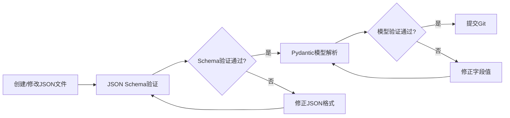

# PhytoOracle 知识库设计说明

**版本**: v1.0
**创建日期**: 2025-11-12
**维护者**: PhytoOracle开发团队
**适用范围**: P1.4 知识库设计（JSON Schema）

---

## 1. 概述

### 1.1 知识库架构

PhytoOracle知识库采用**本体（Ontology）**设计模式，将植物病害领域知识结构化存储为JSON格式，包含以下四类本体：

| 本体类型 | 文件路径 | 用途 |
|---------|----------|------|
| **疾病本体** | `backend/knowledge_base/diseases/*.json` | 定义疾病的特征向量、特征重要性、诊断规则、视觉描述 |
| **特征本体** | `backend/knowledge_base/features/feature_ontology.json` | 定义所有可观察的特征维度和取值范围 |
| **宿主-疾病关系** | `backend/knowledge_base/host_disease/associations.json` | 定义植物属与疾病的关联关系 |
| **植物本体** | `backend/knowledge_base/plants/*.json` | （v1.2+）定义植物属的形态特征、视觉线索 |

### 1.2 设计原则

1. **类型安全**: JSON结构严格对应Pydantic模型（`backend/domain/`），确保可以无损解析
2. **可扩展性**: 使用`additional_features`/`environmental_conditions`等字段支持动态扩展
3. **人类可读**: 包含完整的中文描述、字段说明、视觉隐喻（visual_metaphors）
4. **版本控制**: 每个JSON文件包含`version`字段，支持知识库版本管理
5. **验证友好**: 所有枚举值与`domain/diagnosis.py`中的枚举类一致，并通过JSON Schema验证

---

## 2. JSON Schema 定义

所有知识库JSON文件的结构由JSON Schema定义，存储在`docs/knowledge_base/`目录：

| Schema文件 | 描述 | 对应Pydantic模型 |
|-----------|------|-----------------|
| `disease_schema.json` | 疾病本体Schema | `DiseaseOntology` |
| `feature_schema.json` | 特征本体Schema | `FeatureOntology` |
| `host_disease_schema.json` | 宿主-疾病关系Schema | N/A（关系数据） |

### 2.1 Schema验证流程



**验证命令**（Python）：
```python
import json
import jsonschema
from pathlib import Path

# 1. JSON Schema验证
schema = json.loads(Path("docs/knowledge_base/disease_schema.json").read_text())
disease_json = json.loads(Path("backend/knowledge_base/diseases/rose_black_spot.json").read_text())
jsonschema.validate(instance=disease_json, schema=schema)  # 抛出异常则验证失败

# 2. Pydantic模型验证
from domain import DiseaseOntology
disease = DiseaseOntology(**disease_json)  # 抛出ValidationError则验证失败
```

---

## 3. 疾病本体（Disease Ontology）

### 3.1 文件结构

```json
{
  "version": "4.1",
  "disease_id": "rose_black_spot",
  "disease_name": "玫瑰黑斑病",
  "common_name_en": "Rose Black Spot",
  "pathogen": "Diplocarpon rosae（真菌）",

  "feature_vector": { /* 特征向量 */ },
  "feature_importance": { /* 特征重要性分级 */ },
  "diagnosis_rules": { /* 诊断规则 */ },
  "special_cases": { /* 特殊情况说明 */ },
  "visual_descriptions": { /* VLM视觉描述 */ },

  "host_plants": ["Rosa"],
  "typical_symptoms": [ /* 典型症状列表 */ ],
  "environmental_conditions": { /* 发病环境条件 */ },
  "prevention_measures": [ /* 防治措施 */ ],

  "example_diagnosis": { /* 示例诊断 */ },
  "differential_diagnosis": { /* 鉴别诊断 */ },
  "literature_sources": { /* 文献来源 */ }
}
```

### 3.2 核心字段说明

#### 3.2.1 feature_vector（特征向量）

定义疾病的期望特征值，用于与VLM提取的特征进行匹配。

| 字段 | 类型 | 描述 | 示例 |
|------|------|------|------|
| `symptom_type` | string | 症状类型 | `"necrosis_spot"`, `"powdery_coating"` |
| `color_center` | string\|array | 症状中心颜色 | `["black", "brown"]` |
| `color_border` | string\|array | 症状边缘颜色 | `["yellow", "light_yellow"]` |
| `location` | string\|array | 症状发生位置 | `["lamina", "petiole"]` |
| `size` | string | 症状大小 | `"medium"` |
| `distribution` | string | 症状分布模式 | `"scattered"` |

**设计要点**：
- 颜色和位置支持数组（多个可能值），提高匹配灵活性
- 所有取值必须在`feature_ontology.json`中定义

#### 3.2.2 feature_importance（特征重要性）

实现**加权诊断算法**，将特征分为主要/次要/可选三个层级。

```json
{
  "major_features": {
    "_description": "主要特征（至少匹配2个可确诊）",
    "_weight": 0.8,
    "features": [
      {
        "dimension": "symptom_type",
        "expected_values": ["necrosis_spot"],
        "weight": 0.5,
        "description": "坏死性斑点是黑斑病的核心症状"
      }
    ]
  },
  "minor_features": { "_weight": 0.15, ... },
  "optional_features": { "_weight": 0.05, ... }
}
```

**权重分配原则**：
- **major_features**: 0.8 (关键诊断特征，缺少则置信度大幅下降)
- **minor_features**: 0.15 (辅助特征，提高诊断可信度)
- **optional_features**: 0.05 (随病程变化的特征，不作为核心依据)

**匹配算法**（伪代码）：
```python
total_score = 0.0

# 主要特征匹配
for feature in major_features:
    if vlm_observation[feature.dimension] in feature.expected_values:
        total_score += feature.weight

# 次要特征匹配
for feature in minor_features:
    if vlm_observation[feature.dimension] in feature.expected_values:
        total_score += feature.weight

# 可选特征匹配
for feature in optional_features:
    if vlm_observation[feature.dimension] in feature.expected_values:
        total_score += feature.weight

# 置信度分层决策
if total_score >= 0.85 and major_matched >= 2:
    return "confirmed", total_score
elif 0.60 <= total_score < 0.85 and major_matched >= 1:
    return "suspected", total_score
else:
    return "unlikely", total_score
```

#### 3.2.3 diagnosis_rules（诊断规则）

定义确诊/疑似/不太可能的判断标准。

```json
{
  "confirmed": {
    "criteria": [
      {
        "rule_id": "R1",
        "logic": "major_features >= 2/2 AND minor_features >= 1/2",
        "confidence": 0.95,
        "description": "主要特征全部匹配且至少一个次要特征匹配"
      }
    ]
  },
  "suspected": { ... },
  "unlikely": { ... }
}
```

**规则语法**：
- `major_features >= 2/2`: 主要特征匹配数 >= 2（总共2个主要特征）
- `AND`: 逻辑与
- `OR`: 逻辑或

#### 3.2.4 special_cases（特殊情况）

处理非典型症状阶段的诊断策略。

```json
{
  "no_yellow_halo": {
    "scenario": "color_border未识别到黄色晕圈",
    "possible_reasons": ["早期阶段：晕圈尚未形成", "晚期阶段：斑点融合"],
    "diagnostic_strategy": "依赖symptom_type + color_center + location组合判断",
    "confidence_adjustment": -0.20
  }
}
```

**confidence_adjustment**（置信度调整）：
- 正值：提高置信度（如+0.10）
- 负值：降低置信度（如-0.20）
- 零：不影响置信度

#### 3.2.5 visual_descriptions（VLM视觉描述）

提供直观的视觉描述和隐喻，指导VLM识别。

```json
{
  "overall": "叶片上有黑色或深褐色的圆形坏死斑点，【关键特征】每个斑点外围通常有明显的黄色晕圈",
  "key_features": {
    "color_border": "观察斑点边缘，寻找像煎蛋蛋白环绕蛋黄的黄色晕圈"
  },
  "differential_points": [
    "区别于褐斑病：Rose Black Spot有黄色晕圈，褐斑病无"
  ]
}
```

**visual_metaphors**（视觉隐喻）设计原则：
- 使用日常生活中的对比物（如"像香烟烫过的焦痕"）
- 具体、可视化（避免"坏死"等抽象概念）
- 强调VLM可观察特征（颜色、形状、纹理）

---

## 4. 特征本体（Feature Ontology）

### 4.1 文件结构

```json
{
  "version": "1.0",
  "dimensions": {
    "symptom_type": { "type": "enum", "values": [...] },
    "color_center": { "type": "enum", "values": [...] },
    ...
  },
  "fuzzy_matching": {
    "color_aliases": { "deep_black": ["black", "dark_brown"] },
    "size_order": ["pinpoint", "small", "medium", ...],
    "size_tolerance": 1
  },
  "symptom_types": [...],
  "colors": {...},
  "sizes": [...],
  "distribution_patterns": [...]
}
```

### 4.2 dimensions（特征维度）

定义所有VLM可观察的特征维度。

| 维度 | 类型 | 取值范围 | 描述 |
|------|------|---------|------|
| `symptom_type` | enum | `necrosis_spot`, `powdery_coating`, ... | 症状类型 |
| `color_center` | enum | `black`, `brown`, `yellow`, `white`, ... | 症状中心颜色 |
| `color_border` | enum | `no_special`, `halo_yellow`, `halo_purple`, ... | 症状边缘颜色 |
| `location` | enum | `lamina`, `vein`, `margin`, `petiole` | 症状发生位置 |
| `size` | enum | `pinpoint`, `small`, `medium`, `large` | 症状大小 |
| `distribution` | enum | `scattered`, `clustered`, `along_vein`, ... | 分布模式 |

**扩展新维度**：
1. 在`dimensions`中添加新维度定义
2. 在`backend/domain/diagnosis.py`中添加对应的枚举类
3. 更新提示词模板（`Q1-Q6`）以提取该维度

### 4.3 fuzzy_matching（模糊匹配规则）

#### 4.3.1 color_aliases（颜色别名）

```json
{
  "deep_black": ["black", "dark_brown"],
  "yellowish": ["yellow", "light_yellow"],
  "whitish": ["white", "grayish_white"]
}
```

**使用场景**：VLM识别为`dark_brown`，疾病期望值为`black`，通过别名映射可以匹配成功。

#### 4.3.2 size_tolerance（大小容差）

```json
{
  "size_order": ["pinpoint", "small", "medium_small", "medium", "medium_large", "large"],
  "size_tolerance": 1
}
```

**容差算法**：
- tolerance=1: 允许相邻1个级别匹配
- 示例：期望值`medium`，实际值`medium_small`或`medium_large`均可匹配

---

## 5. 宿主-疾病关系（Host-Disease Associations）

### 5.1 文件结构

```json
{
  "version": "1.0",
  "associations": [
    {
      "host_genus": "Rosa",
      "genus_name": "蔷薇属",
      "family": "Rosaceae",
      "diseases": [
        {
          "disease_id": "rose_black_spot",
          "specificity": "genus",
          "prevalence": "common"
        }
      ]
    }
  ]
}
```

### 5.2 字段说明

| 字段 | 类型 | 描述 | 示例 |
|------|------|------|------|
| `host_genus` | string | 宿主植物属名（学名） | `"Rosa"`, `"Prunus"` |
| `genus_name` | string | 宿主植物属中文名 | `"蔷薇属"`, `"樱属"` |
| `family` | string | 科名（学名） | `"Rosaceae"` |
| `disease_id` | string | 疾病ID | `"rose_black_spot"` |
| `specificity` | enum | 宿主特异性 | `"species"`, `"genus"`, `"family"` |
| `prevalence` | enum | 发病率 | `"common"`, `"occasional"`, `"rare"` |

### 5.3 使用流程

```python
# 1. Q0.2识别出花卉种属
genus = "Rosa"  # VLM识别结果

# 2. 查询associations.json获取候选疾病列表
associations = load_associations()
candidate_diseases = [d["disease_id"] for a in associations if a["host_genus"] == genus for d in a["diseases"]]
# 结果: ["rose_black_spot", "rose_powdery_mildew", "rose_rust", "rose_downy_mildew"]

# 3. 仅对候选疾病进行特征匹配（减少匹配范围）
for disease_id in candidate_diseases:
    disease = load_disease(disease_id)
    score = match_features(vlm_observations, disease.feature_importance)
    ...
```

---

## 6. 知识库扩展指南

### 6.1 新疾病添加流程

#### 步骤1: 创建疾病JSON文件

```bash
# 文件路径: backend/knowledge_base/diseases/{disease_id}.json
# 示例: backend/knowledge_base/diseases/tulip_fire.json
```

#### 步骤2: 填写疾病JSON

参考`rose_black_spot.json`模板，填写以下字段：

```json
{
  "version": "4.1",
  "disease_id": "tulip_fire",
  "disease_name": "郁金香灰霉病",
  "common_name_en": "Tulip Fire",
  "pathogen": "Botrytis tulipae（真菌）",

  "feature_vector": {
    "symptom_type": "necrosis_blotch",
    "color_center": ["gray", "brown"],
    ...
  },

  "feature_importance": {
    "major_features": {
      "_weight": 0.8,
      "features": [
        {
          "dimension": "symptom_type",
          "expected_values": ["necrosis_blotch"],
          "weight": 0.5,
          "description": "大面积坏死斑块是灰霉病的KEY特征"
        }
      ]
    },
    ...
  },

  "diagnosis_rules": {...},
  "visual_descriptions": {...},
  "host_plants": ["Tulipa"],
  "typical_symptoms": [...],
  ...
}
```

#### 步骤3: 更新associations.json

```json
{
  "host_genus": "Tulipa",
  "diseases": [
    {
      "disease_id": "tulip_fire",
      "disease_name": "郁金香灰霉病",
      "specificity": "species",
      "prevalence": "common"
    }
  ]
}
```

#### 步骤4: 验证JSON Schema

```python
import json
import jsonschema

schema = json.loads(open("docs/knowledge_base/disease_schema.json").read())
disease_json = json.loads(open("backend/knowledge_base/diseases/tulip_fire.json").read())

jsonschema.validate(instance=disease_json, schema=schema)
print("✓ JSON Schema验证通过")
```

#### 步骤5: 验证Pydantic模型

```python
from domain import DiseaseOntology

disease = DiseaseOntology(**disease_json)
print(f"✓ Pydantic模型验证通过: {disease.disease_name}")
```

#### 步骤6: 提交Git

```bash
git add backend/knowledge_base/diseases/tulip_fire.json
git add backend/knowledge_base/host_disease/associations.json
git commit -m "feat: 添加郁金香灰霉病（Tulip Fire）到知识库"
git push
```

### 6.2 新特征维度添加流程

#### 步骤1: 更新feature_ontology.json

```json
{
  "dimensions": {
    "leaf_curling": {
      "type": "enum",
      "description": "叶片卷曲方向",
      "values": ["upward", "downward", "no_curling"],
      "value_definitions": {
        "upward": {"cn_term": "向上卷曲", "en_term": "Upward curling"},
        "downward": {"cn_term": "向下卷曲", "en_term": "Downward curling"},
        "no_curling": {"cn_term": "不卷曲", "en_term": "No curling"}
      }
    }
  }
}
```

#### 步骤2: 添加枚举类到domain/diagnosis.py

```python
class LeafCurling(str, Enum):
    """叶片卷曲方向枚举"""
    UPWARD = "upward"
    DOWNWARD = "downward"
    NO_CURLING = "no_curling"
```

#### 步骤3: 更新提示词模板

在`Q1-Q6`提示词中添加对该特征的提取。

```markdown
## Q5: 请描述叶片是否卷曲，卷曲方向？

- 向上卷曲（upward）：叶片边缘向上翘起
- 向下卷曲（downward）：叶片边缘向下垂
- 不卷曲（no_curling）：叶片平展
```

---

## 7. 使用示例

### 7.1 加载疾病本体

```python
import json
from pathlib import Path
from domain import DiseaseOntology

# 加载JSON文件
disease_json = json.loads(Path("backend/knowledge_base/diseases/rose_black_spot.json").read_text())

# 解析为Pydantic模型
disease = DiseaseOntology(**disease_json)

print(f"疾病名称: {disease.disease_name}")
print(f"病原体: {disease.pathogen}")
print(f"主要特征数: {len(disease.get_major_features())}")
```

### 7.2 特征匹配示例

```python
# VLM观察结果
vlm_observations = {
    "symptom_type": "necrosis_spot",
    "color_center": "brown",
    "color_border": "no_special",
    "location": "lamina",
    "size": "small",
    "distribution": "scattered"
}

# 加载疾病
disease = DiseaseOntology(**json.loads(Path("backend/knowledge_base/diseases/rose_black_spot.json").read_text()))

# 匹配主要特征
major_score = 0.0
major_matched = 0

for feature in disease.feature_importance["major_features"]["features"]:
    dimension = feature["dimension"]
    expected_values = feature["expected_values"]
    weight = feature["weight"]

    if vlm_observations.get(dimension) in expected_values:
        major_score += weight
        major_matched += 1

print(f"主要特征得分: {major_score}")
print(f"主要特征匹配数: {major_matched}/{len(disease.feature_importance['major_features']['features'])}")

# 判断置信度级别
if major_score >= 0.5 and major_matched >= 2:
    print("诊断结果: 确诊（Confirmed）")
elif major_score >= 0.3 and major_matched >= 1:
    print("诊断结果: 疑似（Suspected）")
else:
    print("诊断结果: 不太可能（Unlikely）")
```

### 7.3 宿主-疾病关联查询

```python
# 加载associations.json
associations = json.loads(Path("backend/knowledge_base/host_disease/associations.json").read_text())

# 查询Rosa属的所有疾病
genus = "Rosa"
rosa_diseases = []

for assoc in associations["associations"]:
    if assoc["host_genus"] == genus:
        rosa_diseases = [d["disease_id"] for d in assoc["diseases"]]
        break

print(f"{genus}属疾病列表: {rosa_diseases}")
# 输出: Rosa属疾病列表: ['rose_black_spot', 'rose_powdery_mildew', 'rose_rust', 'rose_downy_mildew']
```

---

## 8. 质量保障

### 8.1 JSON Schema验证

**自动化验证脚本**（`backend/tests/test_knowledge_base_validation.py`）：

```python
import json
import jsonschema
from pathlib import Path

def test_disease_json_schema_validation():
    """测试所有疾病JSON是否符合Schema"""
    schema = json.loads(Path("docs/knowledge_base/disease_schema.json").read_text())
    diseases_dir = Path("backend/knowledge_base/diseases")

    for disease_file in diseases_dir.glob("*.json"):
        disease_json = json.loads(disease_file.read_text())
        try:
            jsonschema.validate(instance=disease_json, schema=schema)
            print(f"✓ {disease_file.name} Schema验证通过")
        except jsonschema.ValidationError as e:
            print(f"✗ {disease_file.name} Schema验证失败: {e.message}")
```

### 8.2 Pydantic模型验证

```python
from domain import DiseaseOntology, FeatureOntology

def test_disease_pydantic_validation():
    """测试所有疾病JSON是否可被Pydantic模型解析"""
    diseases_dir = Path("backend/knowledge_base/diseases")

    for disease_file in diseases_dir.glob("*.json"):
        disease_json = json.loads(disease_file.read_text())
        try:
            disease = DiseaseOntology(**disease_json)
            print(f"✓ {disease_file.name} Pydantic验证通过: {disease.disease_name}")
        except Exception as e:
            print(f"✗ {disease_file.name} Pydantic验证失败: {str(e)}")
```

### 8.3 版本控制

- 每次修改知识库JSON文件，必须更新`version`字段
- 版本号格式：`{major}.{minor}`（如`4.1`）
- 重大变更（breaking changes）增加major版本
- 新增疾病/特征增加minor版本

---

## 9. 常见问题（FAQ）

### Q1: 如何区分major_features和minor_features？

**A**:
- **major_features**: 缺少该特征会导致疾病无法诊断（如Rose Black Spot的"黄色晕圈"）
- **minor_features**: 辅助特征，缺少不影响诊断，但匹配后可提高置信度（如"叶片位置"）
- **optional_features**: 随病程变化的特征，不作为诊断依据（如"斑点大小"）

### Q2: 如何处理VLM识别错误（如将brown识别为dark_brown）？

**A**: 使用`fuzzy_matching`中的`color_aliases`进行容错：
```json
{
  "color_aliases": {
    "dark_color": ["black", "dark_brown", "brown"]
  }
}
```

### Q3: 新增疾病需要修改哪些文件？

**A**:
1. 创建`backend/knowledge_base/diseases/{disease_id}.json`
2. 更新`backend/knowledge_base/host_disease/associations.json`
3. （可选）更新`backend/knowledge_base/features/feature_ontology.json`（如需新特征维度）

### Q4: 如何测试新添加的疾病JSON是否正确？

**A**: 运行以下验证步骤：
```bash
# 1. JSON Schema验证
python backend/tests/test_knowledge_base_validation.py

# 2. Pydantic模型验证
python backend/tests/test_pydantic_models.py

# 3. 完整诊断流程测试（P2阶段）
python backend/tests/test_diagnosis_workflow.py
```

---

## 10. 参考资料

### 10.1 相关文档

- [需求文档v1.3](../requirements/需求文档.md)
- [详细设计文档 - 第8章 知识本体设计](../design/详细设计文档.md#8-知识本体设计)
- [P1.3 Pydantic模型设计](../reports/P1.3_执行报告_*.md)

### 10.2 外部资源

- [JSON Schema Draft 7规范](https://json-schema.org/draft-07/schema)
- [Pydantic文档](https://docs.pydantic.dev/)
- [植物病理学分类](https://www.apsnet.org/)

---

**文档维护**: 本文档随知识库版本更新，请保持同步更新。
**最后更新**: 2025-11-12 by Claude Code
