# PhytoOracle MVP v1.1 研发计划

**版本**: v1.0（修订版）
**创建时间**: 2025-11-11
**修订时间**: 2025-11-11 22:00:00
**状态**: 待评审
**目标版本**: MVP v1.1

---

## 目录

- [1. 项目背景](#1-项目背景)
- [2. 总体目标](#2-总体目标)
- [3. 阶段划分总览](#3-阶段划分总览)
- [4. 关键里程碑](#4-关键里程碑)
- [5. 详细阶段规划](#5-详细阶段规划)
- [6. 风险与应对](#6-风险与应对)
- [7. 附录](#7-附录)

---

## 1. 项目背景

PhytoOracle 是基于本体建模的花卉疾病诊断系统，核心技术路线为：**VLM视觉理解 + 本体知识库 + 提示词工程 + 加权诊断引擎**。

### 1.1 技术验证基础

- **FlowerSpecialist v4.1**：已验证玫瑰黑斑病（100%特征检测率）、樱花白粉病（70.8%确诊率）
- **方法论v5.0**：零训练诊断、五知识库架构、视觉描述优化5大方法
- **测试数据集**：
  - `D:\项目管理\植物病虫害\数据集\flower_data`
  - `D:\项目管理\植物病虫害\数据集\Rose_leaf`

### 1.2 核心挑战

1. **知识库数据未完全准备**：18-24种疾病JSON需要逐步构建
2. **可扩展性要求高**：后续不能大规模重写，必须一次性设计好架构
3. **本地部署环境**：PostgreSQL + Redis需要本地搭建并验证
4. **管理后台优先级高**：疾病模型管理功能是关键（通过AI辅助构建疾病JSON）

---

## 2. 总体目标

### 2.1 核心目标

**产出一个可运行的花卉疾病诊断系统MVP**，具备：

1. ✅ **诊断能力**：支持Q0-Q6问诊序列 + 三层渐进诊断
2. ✅ **管理能力**：Streamlit后台，支持疾病CRUD、诊断测试、统计分析
3. ✅ **验证界面**：Next.js Web界面，上传图片→显示诊断结果
4. ✅ **可扩展性**：后续新增花卉/疾病无需大规模重构

### 2.2 质量目标

- **诊断准确率**：≥65%（使用测试数据集验证）
- **单元测试覆盖率**：≥80%（核心模块）
- **端到端测试**：完整诊断流程通过
- **代码质量**：通过Pylint/Flake8检查

### 2.3 边界说明

**本计划范围内**：
- ✅ 后端诊断API（FastAPI）
- ✅ 管理后台（Streamlit）
- ✅ Web验证界面（Next.js）
- ✅ 本地PostgreSQL + Redis部署
- ✅ 简单账号密码认证（后台登录）
- ✅ 单元测试 + 集成测试 + E2E测试

**本计划范围外**：
- ❌ 云服务器部署
- ❌ CI/CD流水线
- ❌ 复杂的API Key认证机制
- ❌ 生产级监控告警

---

## 3. 阶段划分总览

| 阶段 | 名称 | 核心产出 | 预估工作量 | Gate |
|------|------|----------|-----------|------|
| **P0** | 环境准备与架构设计 | 完整目录蓝图 + 环境验证 | 0.5天 | G0 |
| **P1** | 接口协议与数据库设计 | OpenAPI规范 + DDL脚本 | 1天 | G1 |
| **P2** | 核心基础设施开发 | VLM客户端 + 知识库加载器 + 提示词框架 + 本地图片存储 | 3天 | G2 |
| **P3** | 诊断引擎核心逻辑 | Q0-Q6问诊 + 三层渐进诊断 + 知识库服务 + 图片服务 | 3天 | G3 |
| **P4** | 诊断API开发 | FastAPI服务 + 图片管理API | 1.25天 | G4 |
| **P5** | 管理后台开发 | Streamlit界面（疾病管理/诊断测试/统计） | 2天 | G5 |
| **P6** | Web验证界面开发 | Next.js诊断界面 | 1.5天 | G6 |
| **P7** | 测试开发与执行 | 单元测试 + 集成测试 + E2E测试 | 2天 | G7 |
| **P8** | 本地部署与验收 | 完整系统运行 + 验收报告 | 1天 | G8 |
| **总计** | - | - | **15.25天** | - |

---

## 4. 关键里程碑

```mermaid
gantt
    title PhytoOracle MVP v1.1 关键里程碑
    dateFormat  YYYY-MM-DD
    section 基础设施
    P0 环境准备           :p0, 2025-11-11, 0.5d
    P1 接口与数据库设计    :p1, after p0, 1d
    P2 核心基础设施开发    :p2, after p1, 2.5d
    section 核心功能
    P3 诊断引擎核心逻辑    :p3, after p2, 2d
    P4 诊断API开发        :p4, after p3, 1.5d
    section 前端界面
    P5 管理后台开发        :p5, after p4, 2d
    P6 Web验证界面        :p6, after p5, 1.5d
    section 测试与验收
    P7 测试开发与执行      :p7, after p6, 2d
    P8 本地部署与验收      :p8, after p7, 1d
```



**关键里程碑节点**：

- **D+1.5（G1通过）**：数据库表创建完成，API接口规范评审通过
- **D+4（G2通过）**：VLM调用成功，知识库加载验证通过
- **D+6（G3通过）**：完整诊断引擎逻辑验证通过（单疾病测试）
- **D+7.5（G4通过）**：诊断API运行，Postman测试通过
- **D+9.5（G5通过）**：管理后台运行，疾病CRUD功能验证
- **D+11（G6通过）**：Web界面运行，图片上传诊断成功
- **D+13（G7通过）**：所有测试用例通过
- **D+14（G8通过）**：验收测试通过，MVP交付

---

## 5. 详细阶段规划

---

### P0: 环境准备与架构设计

**目标**：搭建开发环境，产出完整目录蓝图，验证技术栈可用性

**预估时间**：0.5天（4小时）

---

#### P0.1 开发环境搭建

**任务清单**：
1. 安装Python 3.10+（验证版本）
2. 安装PostgreSQL 14+（本地）
3. 安装Redis 7+（本地）
4. 安装Node.js 18+（用于Next.js前端）
5. 创建项目根目录 `D:\项目管理\PhytoOracle`

**产出物**：
- `backend/.env.example`：环境变量模板
- `backend/pyproject.toml`：Poetry依赖配置（初始版本）
- `frontend/package.json`：Node.js依赖配置（初始版本）

**验收标准（G0.1）**：
- [ ] Python版本 ≥ 3.10
- [ ] PostgreSQL服务运行成功（`psql --version`）
- [ ] Redis服务运行成功（`redis-cli ping` 返回 `PONG`）
- [ ] Node.js版本 ≥ 18

**上下文依赖**：无

---

#### P0.2 完整目录蓝图构建

**任务清单**：
1. 根据详细设计文档第4章，创建完整目录结构
2. 创建所有 `__init__.py` 文件（Python包结构）
3. 创建关键配置文件模板

**产出物**：
- **完整目录树**（见附录A）
- `backend/core/config.py`（空白模板，包含Settings类定义）
- `backend/apps/api/main.py`（FastAPI应用骨架）
- `backend/apps/admin/app.py`（Streamlit应用骨架）
- `frontend/app/page.tsx`（Next.js首页骨架）

**验收标准（G0.2）**：
- [ ] 目录结构与详细设计文档第4章完全一致
- [ ] 所有Python包包含 `__init__.py`
- [ ] `backend/` 和 `frontend/` 结构分离清晰
- [ ] 目录树可通过 `tree` 命令输出验证

**上下文依赖**：P0.1完成

**产出示例**：
```
PhytoOracle/
├── backend/
│   ├── apps/
│   │   ├── api/
│   │   │   ├── __init__.py
│   │   │   ├── main.py            # ✓ 创建骨架
│   │   │   ├── deps.py            # ✓ 创建空文件
│   │   │   ├── routers/
│   │   │   │   └── __init__.py
│   │   │   ├── schemas/
│   │   │   │   └── __init__.py
│   │   │   └── middleware/
│   │   │       └── __init__.py
│   │   └── admin/
│   │       ├── __init__.py
│   │       ├── app.py             # ✓ 创建骨架
│   │       └── pages/
│   ├── core/
│   │   ├── __init__.py
│   │   ├── config.py              # ✓ Settings类模板
│   │   └── ...
│   ├── domain/
│   ├── infrastructure/
│   ├── services/
│   ├── tests/
│   ├── knowledge_base/
│   │   ├── diseases/
│   │   ├── features/
│   │   ├── plants/
│   │   └── host_disease/
│   └── storage/
│       └── images/
└── frontend/
    ├── app/
    │   ├── layout.tsx
    │   └── page.tsx               # ✓ 创建骨架
    ├── components/
    └── lib/
```

---

#### P0.3 技术栈验证

**任务清单**：
1. 创建最小化FastAPI Hello World（验证FastAPI可运行）
2. 创建最小化Streamlit Hello World（验证Streamlit可运行）
3. 创建最小化Next.js页面（验证Next.js可运行）
4. 测试PostgreSQL连接（使用asyncpg）
5. 测试Redis连接（使用redis-py）
6. 测试Qwen VL Plus API调用（使用llm_config.json中的API Key）

**产出物**：
- `backend/tests/test_env_validation.py`：环境验证测试脚本
- `backend/scripts/test_qwen_api.py`：Qwen VL API测试脚本

**验收标准（G0.3）**：
- [ ] FastAPI服务启动成功（`http://localhost:8000/docs` 可访问）
- [ ] Streamlit应用启动成功（`http://localhost:8501` 可访问）
- [ ] Next.js开发服务器启动成功（`http://localhost:3000` 可访问）
- [ ] PostgreSQL连接成功（创建测试数据库 `phytooracle_test`）
- [ ] Redis连接成功（`SET test_key test_value` 成功）
- [ ] Qwen VL Plus API调用成功（返回有效响应）

**上下文依赖**：P0.1 + P0.2完成

---

**P0阶段Gate（G0）**：

通过条件（全部满足）：
- [x] G0.1：开发环境验证通过
- [x] G0.2：完整目录蓝图创建完成
- [x] G0.3：技术栈验证全部通过

失败时行动：
- 如果PostgreSQL/Redis连接失败 → 检查服务状态，重新安装
- 如果Qwen API调用失败 → 检查API Key有效性，标记为 **[待决策]**，向用户提问

---

### P1: 接口协议与数据库设计

**目标**：完成API接口设计、数据库表设计、数据模型设计，产出可评审的设计文档

**预估时间**：1天（8小时）

---

#### P1.1 API接口设计（OpenAPI规范）

**任务清单**：
1. 根据详细设计文档第6章，编写完整OpenAPI 3.0规范
2. 定义核心接口：
   - `POST /api/v1/diagnose`：诊断接口
   - `GET /api/v1/diseases`：获取疾病列表
   - `POST /api/v1/admin/reload`：重载知识库
   - `POST /api/v1/auth/login`：后台登录
3. 定义所有请求/响应Schema

**产出物**：
- `docs/api/openapi.yaml`：完整OpenAPI 3.0规范文档
- `docs/api/接口协议说明.md`：接口使用说明（中文）

**验收标准（G1.1）**：
- [ ] OpenAPI规范通过Swagger Editor验证（无语法错误）
- [ ] 所有核心接口定义完整（路径、方法、参数、响应）
- [ ] Schema定义符合详细设计文档第7章数据模型
- [ ] 接口协议评审通过（架构师审核）

**上下文依赖**：P0完成

**评审检查点**：
- 诊断接口是否支持 `multipart/form-data`？
- 响应Schema是否包含 `feature_vector`、`diagnosis_result`、`scores`？
- 是否定义了错误响应格式（400/401/500）？

---

#### P1.2 数据库表设计（DDL）

**任务清单**：
1. 根据详细设计文档第9章，编写完整PostgreSQL DDL脚本
2. 创建5张核心表：
   - `diagnoses`：诊断记录
   - `images`：图片元数据
   - `api_keys`：API密钥（暂不使用，预留）
   - `admin_users`：管理员账号
   - `knowledge_versions`：知识库版本
3. 设计索引（timestamp、plant_genus、accuracy_label等）
4. 设计约束（CHECK约束、外键约束）

**产出物**：
- `backend/scripts/init_db.sql`：完整DDL脚本
- `backend/scripts/seed_data.sql`：初始化数据脚本（管理员账号）
- `docs/design/数据库设计评审.md`：数据库设计说明（表结构、索引策略）

**验收标准（G1.2）**：
- [ ] DDL脚本在PostgreSQL中执行成功（无错误）
- [ ] 所有表创建成功（`\dt` 命令可查看）
- [ ] 索引创建成功（`\di` 命令可查看）
- [ ] 初始化数据插入成功（至少1个管理员账号）
- [ ] 数据库设计评审通过（检查表结构、索引合理性）

**上下文依赖**：P0完成

**评审检查点**：
- `diagnoses` 表是否使用JSONB存储 `feature_vector`？
- `images` 表是否有 `accuracy_label` 字段（unlabeled/correct/incorrect）？
- `admin_users` 表是否存储密码哈希（bcrypt）？
- 是否创建了合适的索引（避免全表扫描）？

---

#### P1.3 数据模型设计（Pydantic）

**任务清单**：
1. 根据详细设计文档第7章，编写所有Pydantic V2数据模型
2. 创建领域模型（`domain/`）：
   - `DiagnosisAggregate`：诊断聚合根
   - `DiseaseOntology`：疾病本体
   - `FeatureVector`：特征向量
   - `PlantOntology`：植物本体
3. 创建API Schema（`apps/api/schemas/`）：
   - `DiagnosisRequest`/`DiagnosisResponse`
   - `DiseaseSchema`
   - `LoginRequest`/`LoginResponse`
4. 使用Pydantic V2特性（Field、validator、model_validator）

**产出物**：
- `backend/domain/diagnosis.py`
- `backend/domain/disease.py`
- `backend/domain/feature.py`
- `backend/domain/plant.py`
- `backend/domain/value_objects.py`
- `backend/apps/api/schemas/diagnosis.py`
- `backend/apps/api/schemas/auth.py`

**验收标准（G1.3）**：
- [ ] 所有Pydantic模型可成功导入（无语法错误）
- [ ] 使用 `pydantic.BaseModel` V2语法
- [ ] 必填字段使用 `Field(..., description="...")` 定义
- [ ] 可选字段使用 `Optional[T] = None` 或 `T | None = None`
- [ ] 模型通过单元测试验证（创建示例实例）

**上下文依赖**：P1.1完成（API Schema需参考OpenAPI定义）

**代码示例**：
```python
# backend/domain/diagnosis.py
from pydantic import BaseModel, Field
from typing import Optional
from uuid import UUID

class DiagnosisResult(BaseModel):
    """诊断结果领域模型"""
    diagnosis_id: UUID
    status: str = Field(..., description="诊断状态：confirmed/suspected/uncertain/rejected")
    confirmed_disease: Optional[str] = Field(None, description="确诊疾病ID")
    suspected_diseases: Optional[list[str]] = Field(None, description="疑似疾病ID列表")
    confidence: float = Field(..., ge=0.0, le=1.0, description="置信度")
    reasoning: Optional[str] = Field(None, description="诊断推理过程")
```

---

**P1阶段Gate（G1）**：

通过条件（全部满足）：
- [x] G1.1：OpenAPI规范评审通过
- [x] G1.2：数据库DDL执行成功，初始化数据插入成功
- [x] G1.3：Pydantic模型创建完成，单元测试通过

产出物清单：
- [ ] `docs/api/openapi.yaml`
- [ ] `backend/scripts/init_db.sql`
- [ ] `backend/scripts/seed_data.sql`
- [ ] `backend/domain/` 下所有模型文件
- [ ] `backend/apps/api/schemas/` 下所有Schema文件

失败时行动：
- 如果OpenAPI规范评审不通过 → 修正后重新评审
- 如果DDL执行失败 → 检查SQL语法，修正后重试
- 如果发现数据模型遗漏 → 标记为 **[待决策]**，向用户提问

---

### P2: 核心基础设施开发

**目标**：实现VLM客户端、知识库加载器、提示词框架、模糊匹配引擎、加权诊断评分器、本地图片存储

**预估时间**：3天（24小时）

---

#### P2.1 提示词框架（PROOF Framework + Instructor）

**任务清单**：
1. 根据详细设计文档5.6节，实现PROOF Framework
2. 实现Instructor集成（包装Qwen VL Plus API）
3. 定义所有VLM响应Schema（Q00Response ~ Q05Response + FeatureResponse）
4. 编写Q0-Q6提示词模板

**产出物**：
- `backend/infrastructure/llm/prompts/framework.py`：PROOF Framework基类
- `backend/infrastructure/llm/prompts/response_schema.py`：VLM响应Schema
- `backend/infrastructure/llm/prompts/q0_0_content.py`：Q0.0提示词定义
- `backend/infrastructure/llm/prompts/q0_1_category.py`：Q0.1提示词定义
- `backend/infrastructure/llm/prompts/q0_2_genus.py`：Q0.2提示词定义
- `backend/infrastructure/llm/prompts/q0_3_organ.py`：Q0.3提示词定义
- `backend/infrastructure/llm/prompts/q0_4_completeness.py`：Q0.4提示词定义
- `backend/infrastructure/llm/prompts/q0_5_abnormality.py`：Q0.5提示词定义
- `backend/infrastructure/llm/prompts/q1_q6_features.py`：Q1-Q6动态特征提取模板

**验收标准（G2.1）**：
- [ ] PROOF Framework类可成功实例化
- [ ] `PROOFPrompt.render()` 方法可生成完整提示词字符串
- [ ] 所有VLM响应Schema使用 `Literal` 类型严格限制选项
- [ ] Q0.2提示词包含5种花卉的visual_cues（详细设计文档5.6.3示例）
- [ ] 单元测试通过（测试提示词渲染输出）

**上下文依赖**：P1.3完成（需要Pydantic模型）

**单元测试示例**：
```python
# backend/tests/unit/test_proof_framework.py
def test_q0_2_genus_prompt_render():
    """测试Q0.2提示词渲染"""
    from infrastructure.llm.prompts.q0_2_genus import q0_2_prompt

    rendered = q0_2_prompt.render()

    # 验证包含关键字段
    assert "ROLE: plant disease diagnosis assistant" in rendered
    assert "TASK: Identify the genus" in rendered
    assert "Rosa" in rendered
    assert "Prunus" in rendered
    assert "RESPONSE FORMAT (JSON only)" in rendered
```

---

#### P2.2 VLM客户端（Fallback机制）

**任务清单**：
1. 实现VLM Provider抽象接口（`VLMProtocol`）
2. 实现Qwen VL Plus Provider（读取 `llm_config.json`）
3. 实现Instructor集成（自动验证 + 重试）
4. 实现Fallback机制（Qwen → ChatGPT → Grok → Claude，当前仅Qwen可用）
5. 实现缓存机制（Redis，key = `vlm:{image_hash}:{question_id}`）

**产出物**：
- `backend/infrastructure/llm/base.py`：VLMProtocol抽象接口
- `backend/infrastructure/llm/client.py`：VLMClient主类
- `backend/infrastructure/llm/providers/qwen.py`：QwenVLPlusProvider
- `backend/infrastructure/llm/providers/chatgpt.py`：ChatGPTProvider（占位，标记TODO）
- `backend/core/cache.py`：RedisCache封装类

**验收标准（G2.2）**：
- [ ] VLMClient可成功初始化（加载Qwen API Key）
- [ ] 调用 `VLMClient.call_with_fallback()` 成功（使用测试图片）
- [ ] 返回的响应符合Pydantic Schema（如 `Q00Response`）
- [ ] 缓存机制生效（第二次调用同一图片时从Redis读取）
- [ ] 集成测试通过（测试完整VLM调用流程）

**上下文依赖**：P2.1完成（需要响应Schema）

**集成测试示例**：
```python
# backend/tests/integration/test_vlm_client.py
async def test_vlm_client_q0_0_call():
    """测试VLM客户端Q0.0调用"""
    from infrastructure.llm.client import VLMClient
    from infrastructure.llm.prompts.q0_0_content import Q0_0_PROMPT
    from infrastructure.llm.prompts.response_schema import Q00Response

    client = VLMClient()

    # 加载测试图片
    with open("tests/fixtures/rose_black_spot.jpg", "rb") as f:
        image_bytes = f.read()

    # 调用VLM
    response = await client.call_with_fallback(
        prompt=Q0_0_PROMPT,
        image=image_bytes,
        response_model=Q00Response,
        question_id="Q0.0"
    )

    # 验证响应
    assert response.choice in ["plant", "animal", "person", "object", "landscape", "other"]
    assert 0.0 <= response.confidence <= 1.0
```

---

#### P2.3 知识库加载器

**任务清单**：
1. 实现JSON知识库加载器（`JSONKnowledgeLoader`）
2. 加载疾病本体（`knowledge_base/diseases/*.json`）
3. 加载特征本体（`knowledge_base/features/feature_ontology.json`）
4. 加载植物本体（`knowledge_base/plants/*.json`，v1.2+预留）
5. 加载宿主-疾病关系（`knowledge_base/host_disease/associations.json`）
6. 解析JSON → Pydantic类（类型安全）
7. 支持热更新（管理后台调用 `reload()` 方法）

**产出物**：
- `backend/infrastructure/ontology/loader.py`：JSONKnowledgeLoader
- `backend/knowledge_base/diseases/rose_black_spot.json`：玫瑰黑斑病JSON（复制FlowerSpecialist数据）
- `backend/knowledge_base/diseases/cherry_powdery_mildew.json`：樱花白粉病JSON
- `backend/knowledge_base/features/feature_ontology.json`：特征本体JSON
- `backend/knowledge_base/host_disease/associations.json`：宿主-疾病关系JSON

**验收标准（G2.3）**：
- [ ] 知识库加载成功（至少2种疾病：Rose Black Spot + Cherry Powdery Mildew）
- [ ] JSON解析为Pydantic对象（`DiseaseOntology`）
- [ ] 可通过 `knowledge_base.get_disease_by_id("rose_black_spot")` 查询
- [ ] 热更新机制验证（修改JSON文件后调用 `reload()` 生效）
- [ ] 单元测试通过（测试加载、查询、重载）

**上下文依赖**：P1.3完成（需要 `DiseaseOntology` 模型）

**知识库JSON示例**：
```json
{
  "version": "4.1",
  "disease_id": "rose_black_spot",
  "disease_name": "玫瑰黑斑病",
  "common_name_en": "Rose Black Spot",
  "pathogen": "Diplocarpon rosae",
  "feature_vector": {
    "symptom_type": "necrosis_spot",
    "color_center": "black",
    "color_border": "yellow",
    "location": "lamina",
    "size": "medium",
    "distribution": "scattered"
  },
  "feature_importance": {
    "major_features": {
      "_weight": 0.8,
      "features": [
        {
          "dimension": "symptom_type",
          "expected_values": ["necrosis_spot"],
          "weight": 0.5
        },
        {
          "dimension": "color_center",
          "expected_values": ["black", "dark_brown"],
          "weight": 0.3
        }
      ]
    }
  },
  "visual_descriptions": {
    "color_border": "像煎蛋的蛋白部分环绕着蛋黄（黄色晕圈）"
  }
}
```

---

#### P2.4 模糊匹配引擎

**任务清单**：
1. 实现颜色模糊匹配（`COLOR_GROUPS`）
2. 实现尺寸模糊匹配（`SIZE_ORDER`，允许±1级别误差）
3. 实现位置模糊匹配（如 `lamina` 匹配 `["lamina", "petiole"]`）
4. 封装为 `FuzzyMatcher` 类

**产出物**：
- `backend/infrastructure/ontology/matcher.py`：FuzzyMatcher类

**验收标准（G2.4）**：
- [ ] 颜色模糊匹配测试通过（如 `black` 匹配 `dark_brown`）
- [ ] 尺寸模糊匹配测试通过（如 `medium` 匹配 `medium_small`）
- [ ] 位置模糊匹配测试通过
- [ ] 单元测试覆盖率 ≥ 90%

**上下文依赖**：P2.3完成（需要知识库数据）

**单元测试示例**：
```python
# backend/tests/unit/test_matcher.py
def test_color_fuzzy_match():
    """测试颜色模糊匹配"""
    from infrastructure.ontology.matcher import FuzzyMatcher

    matcher = FuzzyMatcher()

    # 同色系匹配
    assert matcher.match_color("black", "dark_brown") == True
    assert matcher.match_color("yellow", "light_yellow") == True

    # 不同色系不匹配
    assert matcher.match_color("black", "yellow") == False

def test_size_fuzzy_match():
    """测试尺寸模糊匹配"""
    from infrastructure.ontology.matcher import FuzzyMatcher

    matcher = FuzzyMatcher()

    # ±1级别匹配
    assert matcher.match_size("medium", "medium_small") == True
    assert matcher.match_size("medium", "small") == False  # 相差2级
```

---

#### P2.5 加权诊断评分器

**任务清单**：
1. 实现加权诊断评分算法（详细设计文档第5.4节）
2. 主要特征权重0.8（symptom_type: 0.5 + color_center: 0.3）
3. 次要特征权重0.15（location: 0.1 + additional_features: 0.05）
4. 可选特征权重0.05（size: 0.03 + distribution: 0.02）
5. 完整性修正系数（complete: 1.0, partial: 0.8, close_up: 0.6）
6. 诊断规则（confirmed: ≥0.85且主要特征≥2/2, suspected: 0.6-0.85）

**产出物**：
- `backend/infrastructure/ontology/scorer.py`：DiagnosisScorer类

**验收标准（G2.5）**：
- [ ] 评分算法与FlowerSpecialist v11实验结果一致
- [ ] 主要特征完全匹配时，total_score ≥ 0.8
- [ ] 诊断规则正确（confirmed/suspected/unlikely）
- [ ] 单元测试覆盖率 ≥ 95%

**上下文依赖**：P2.3 + P2.4完成

**单元测试示例**：
```python
# backend/tests/unit/test_scorer.py
def test_weighted_scoring():
    """测试加权评分算法"""
    from infrastructure.ontology.scorer import DiagnosisScorer
    from domain.feature import FeatureVector
    from domain.disease import DiseaseOntology

    scorer = DiagnosisScorer()

    # 构建特征向量（完全匹配）
    feature_vector = FeatureVector(
        symptom_type="necrosis_spot",
        color_center="black",
        color_border="yellow",
        location="lamina"
    )

    # 加载疾病
    disease = load_disease("rose_black_spot")

    # 计算评分
    score = scorer.calculate_score(feature_vector, disease)

    # 验证
    assert score.total_score >= 0.85  # 应为confirmed
    assert score.major_matched == 2   # 主要特征全匹配
    assert score.diagnosis_level == "confirmed"
```

---

#### P2.6 本地图片存储（LocalImageStorage）

**任务清单**：
1. 实现本地文件系统图片存储（`LocalImageStorage`类）
2. 按准确率+花卉名+日期分类存储规则：
   - 路径规范：`storage/images/{accuracy_label}/{genus}/{year-month}/{day}/{diagnosis_id}.jpg`
   - accuracy_label: unlabeled / correct / incorrect
3. 实现文件路径生成规范化（`get_path`方法）
4. 实现文件移动功能（`move`方法，用于准确性标注时移动文件）
5. 实现图片保存功能（`save`方法，异步保存图片）

**产出物**：
- `backend/infrastructure/storage/local_storage.py`：LocalImageStorage类
- `backend/infrastructure/storage/__init__.py`

**验收标准（G2.6）**：
- [ ] LocalImageStorage类可成功实例化
- [ ] `save()` 方法测试通过（生成正确的文件路径，保存图片成功）
- [ ] `move()` 方法测试通过（移动文件到correct/incorrect文件夹）
- [ ] `get_path()` 方法测试通过（路径生成规范正确）
- [ ] 单元测试覆盖率 ≥ 90%

**上下文依赖**：无（Layer 1模块，无依赖）

**单元测试示例**：
```python
# backend/tests/unit/test_local_storage.py
import pytest
from infrastructure.storage.local_storage import LocalImageStorage
from pathlib import Path

@pytest.mark.asyncio
async def test_save_image():
    """测试图片保存"""
    storage = LocalImageStorage(base_path="tests/storage_test")

    # 模拟图片数据
    image_bytes = b"fake_image_data"
    diagnosis_id = "diag_20251111_001"
    plant_genus = "rosa"

    # 保存图片
    saved_path = await storage.save(
        image_bytes=image_bytes,
        diagnosis_id=diagnosis_id,
        plant_genus=plant_genus,
        accuracy_label="unlabeled"
    )

    # 验证路径格式
    assert "unlabeled/rosa/2025-11/" in saved_path
    assert diagnosis_id in saved_path

    # 验证文件存在
    assert Path(saved_path).exists()

@pytest.mark.asyncio
async def test_move_file():
    """测试文件移动（准确性标注）"""
    storage = LocalImageStorage(base_path="tests/storage_test")

    # 先保存一张图片
    image_bytes = b"fake_image_data"
    old_path = await storage.save(
        image_bytes=image_bytes,
        diagnosis_id="diag_20251111_002",
        plant_genus="rosa",
        accuracy_label="unlabeled"
    )

    # 移动到correct文件夹
    new_path = await storage.move(
        old_path=old_path,
        new_accuracy_label="correct"
    )

    # 验证
    assert "correct/rosa/" in new_path
    assert Path(new_path).exists()
    assert not Path(old_path).exists()  # 旧文件已删除
```

**架构说明**：
- LocalImageStorage是**Layer 1基础设施模块**（无依赖）
- 被ImageService（Layer 3服务）调用
- 实现顺序：P2.6 → P3.6（ImageService） → P4.3（图片管理API）

---

**P2阶段Gate（G2）**：

通过条件（全部满足）：
- [x] G2.1：PROOF Framework + VLM响应Schema创建完成，单元测试通过
- [x] G2.2：VLM客户端调用成功，集成测试通过
- [x] G2.3：知识库加载成功（至少2种疾病）
- [x] G2.4：模糊匹配引擎单元测试通过
- [x] G2.5：加权诊断评分器单元测试通过
- [x] G2.6：本地图片存储单元测试通过

产出物清单：
- [ ] `backend/infrastructure/llm/` 下所有文件
- [ ] `backend/infrastructure/ontology/` 下所有文件
- [ ] `backend/infrastructure/storage/` 下所有文件（LocalImageStorage）
- [ ] `backend/knowledge_base/` 下至少2种疾病JSON
- [ ] `backend/tests/unit/` 下所有单元测试
- [ ] `backend/tests/integration/test_vlm_client.py`

失败时行动：
- 如果VLM调用失败 → 检查API Key，检查网络，标记为 **[待决策]**
- 如果知识库加载失败 → 检查JSON格式，使用JSON Schema验证
- 如果评分算法与v11不一致 → 对照v11源码修正

---

### P3: 诊断引擎核心逻辑

**目标**：实现Q0-Q6问诊序列、三层渐进诊断流程、VLM兜底策略、知识库服务、图片服务

**预估时间**：3天（24小时）

---

#### P3.1 Q0逐级过滤实现

**任务清单**：
1. 实现Q0.0内容类型识别（plant/animal/person/object/landscape/other）
2. 实现Q0.1植物类别识别（flower/vegetable/tree/crop/grass/other）
3. 实现Q0.2花卉种属识别（Rosa/Prunus/Tulipa/Dianthus/Paeonia/unknown）
4. 实现Q0.3器官识别（flower/leaf）
5. 实现Q0.4完整性检查（complete/partial/close_up）
6. 实现Q0.5异常判断（healthy/abnormal）
7. 早期退出机制（如Q0.0 != plant → 直接返回错误）

**产出物**：
- `backend/services/diagnosis_service.py`：DiagnosisService类（部分实现）
  - `_execute_q0_sequence()` 方法
  - `_check_content_type()` 方法
  - `_check_plant_category()` 方法
  - `_check_flower_genus()` 方法

**验收标准（G3.1）**：
- [ ] Q0逐级过滤完整流程测试通过
- [ ] 非植物图片返回"不支持的图片类型"
- [ ] 非花卉图片返回"当前仅支持花卉诊断"
- [ ] Q0.2返回的flower_genus可用于候选疾病剪枝
- [ ] 集成测试通过（使用测试数据集）

**上下文依赖**：P2.1 + P2.2完成

**集成测试示例**：
```python
# backend/tests/integration/test_q0_filtering.py
async def test_q0_sequence_with_rose_image():
    """测试Q0序列（玫瑰图片）"""
    from services.diagnosis_service import DiagnosisService

    service = DiagnosisService(...)

    # 加载玫瑰图片
    with open("tests/fixtures/rose_black_spot.jpg", "rb") as f:
        image_bytes = f.read()

    # 执行Q0序列
    q0_responses = await service._execute_q0_sequence(image_bytes)

    # 验证
    assert q0_responses["content_type"] == "plant"
    assert q0_responses["plant_category"] == "flower"
    assert q0_responses["flower_genus"] in ["Rosa", "Prunus", "unknown"]
    assert q0_responses["organ"] in ["flower", "leaf"]
    assert q0_responses["completeness"] in ["complete", "partial", "close_up"]
    assert q0_responses["has_abnormality"] in ["healthy", "abnormal"]
```

---

#### P3.2 Q1-Q6动态特征提取

**任务清单**：
1. 实现Q1症状类型识别（symptom_type）
2. 根据Q1结果动态生成Q2-Q6问题：
   - 如symptom_type = "necrosis_spot" → Q2: color_center, Q3: color_border, Q4: location
   - 如symptom_type = "powdery_coating" → Q2: coverage_color, Q3: coverage_density
3. 实现特征向量构建（`FeatureVector` Pydantic对象）
4. 处理VLM不确定性（confidence < 0.5时标记为uncertain）

**产出物**：
- `backend/services/diagnosis_service.py`：DiagnosisService类（部分实现）
  - `_execute_q1_q6_sequence()` 方法
  - `_build_feature_vector()` 方法

**验收标准（G3.2）**：
- [ ] Q1-Q6动态问题生成成功
- [ ] 特征向量构建完整（包含所有必要字段）
- [ ] VLM不确定性处理正确
- [ ] 集成测试通过（使用测试数据集）

**上下文依赖**：P3.1完成

---

#### P3.3 三层渐进诊断流程

**任务清单**：
1. 实现Layer1：VLM视觉特征提取（Q0-Q6）
2. 实现Layer2：知识库匹配引擎
   - 候选疾病筛选（根据flower_genus剪枝）
   - 加权诊断评分（调用DiagnosisScorer）
   - 排序（按total_score降序）
3. 实现Layer3：置信度分层决策
   - High Confidence (≥0.85) → 返回confirmed
   - Medium Confidence (0.60-0.85) → 返回suspected（Top 2-3候选）
   - Low Confidence (<0.60) → 触发兜底策略（P3.4）

**产出物**：
- `backend/services/diagnosis_service.py`：DiagnosisService类（完整实现）
  - `diagnose()` 主方法（编排完整流程）

**验收标准（G3.3）**：
- [ ] 完整诊断流程测试通过（使用Rose Black Spot测试图片）
- [ ] 确诊结果正确（total_score ≥ 0.85，disease_id正确）
- [ ] 疑似结果正确（返回Top 2-3候选疾病）
- [ ] 集成测试通过（覆盖confirmed/suspected两种场景）

**上下文依赖**：P3.2 + P2.3 + P2.5完成

**集成测试示例**：
```python
# backend/tests/integration/test_diagnosis_flow.py
async def test_complete_diagnosis_rose_black_spot():
    """测试完整诊断流程（玫瑰黑斑病）"""
    from services.diagnosis_service import DiagnosisService

    service = DiagnosisService(...)

    # 加载测试图片
    with open("tests/fixtures/rose_black_spot.jpg", "rb") as f:
        image_bytes = f.read()

    # 执行诊断
    result = await service.diagnose(image_bytes)

    # 验证
    assert result.status == "confirmed"
    assert result.confirmed_disease == "rose_black_spot"
    assert result.confidence >= 0.85
    assert "feature_vector" in result.dict()
    assert "scores" in result.dict()
```

---

#### P3.4 VLM兜底策略

**任务清单**：
1. 当所有候选疾病score < 0.6时触发兜底策略
2. 调用VLM开放式诊断（使用fallback提示词模板）
3. 返回VLM推测结果，标记为"VLM推测"
4. 记录case用于后续知识库补充

**产出物**：
- `backend/infrastructure/llm/prompts/fallback.py`：VLM开放式诊断提示词
- `backend/services/diagnosis_service.py`：DiagnosisService类
  - `_vlm_fallback_diagnosis()` 方法

**验收标准（G3.4）**：
- [ ] 兜底策略触发测试通过（使用知识库外疾病图片）
- [ ] VLM开放式诊断返回有效结果
- [ ] 结果标记为"VLM推测"
- [ ] 集成测试通过

**上下文依赖**：P3.3完成

---

#### P3.5 知识库服务实现（KnowledgeService）

**任务清单**：
1. 实现KnowledgeService类（`backend/services/knowledge_service.py`）
2. 实现知识库初始化（`initialize`方法，调用KnowledgeLoader加载所有知识库）
3. 实现知识库热更新（`reload`方法，清除缓存并重新加载）
4. 实现候选疾病查询（`get_diseases_by_genus`方法，用于P3.3的候选疾病筛选）
5. 实现全部疾病查询（`get_all_diseases`方法，用于管理后台）
6. 实现单个疾病查询（`get_disease_by_id`方法）
7. 实现知识库版本管理（记录Git commit hash）

**产出物**：
- `backend/services/knowledge_service.py`：KnowledgeService类
- `backend/services/__init__.py`

**验收标准（G3.5）**：
- [ ] KnowledgeService可成功初始化（加载至少2种疾病）
- [ ] `get_diseases_by_genus("Rosa")` 返回玫瑰属疾病列表
- [ ] `get_all_diseases()` 返回所有疾病列表
- [ ] `get_disease_by_id("rose_black_spot")` 返回正确的疾病对象
- [ ] `reload()` 热更新测试通过（修改JSON后重新加载生效）
- [ ] 单元测试覆盖率 ≥ 90%

**上下文依赖**：P2.3（KnowledgeLoader）完成

**单元测试示例**：
```python
# backend/tests/unit/test_knowledge_service.py
import pytest
from services.knowledge_service import KnowledgeService
from infrastructure.ontology.loader import JSONKnowledgeLoader

@pytest.mark.asyncio
async def test_initialize_knowledge_service():
    """测试知识库服务初始化"""
    loader = JSONKnowledgeLoader(base_path="backend/knowledge_base")
    service = KnowledgeService(loader=loader)

    # 初始化知识库
    await service.initialize()

    # 验证
    assert service.knowledge_base is not None
    all_diseases = service.get_all_diseases()
    assert len(all_diseases) >= 2  # 至少2种疾病

@pytest.mark.asyncio
async def test_get_diseases_by_genus():
    """测试按花卉属查询疾病"""
    loader = JSONKnowledgeLoader(base_path="backend/knowledge_base")
    service = KnowledgeService(loader=loader)
    await service.initialize()

    # 查询玫瑰属疾病
    rosa_diseases = service.get_diseases_by_genus("Rosa")

    # 验证
    assert len(rosa_diseases) > 0
    assert all(d.host_genus == "Rosa" for d in rosa_diseases)

@pytest.mark.asyncio
async def test_reload_knowledge_base():
    """测试知识库热更新"""
    loader = JSONKnowledgeLoader(base_path="backend/knowledge_base")
    service = KnowledgeService(loader=loader)
    await service.initialize()

    # 记录初始疾病数量
    initial_count = len(service.get_all_diseases())

    # 热更新
    await service.reload()

    # 验证（数量应该一致，证明重新加载成功）
    new_count = len(service.get_all_diseases())
    assert new_count == initial_count
```

**架构说明**：
- KnowledgeService是**Layer 3应用服务**（依赖KnowledgeLoader）
- 被DiagnosisService（Layer 4服务）调用
- 实现顺序：P2.3（KnowledgeLoader） → P3.5（KnowledgeService） → P3.1-P3.4（DiagnosisService）

---

#### P3.6 图片服务实现（ImageService）

**任务清单**：
1. 实现ImageService类（`backend/services/image_service.py`）
2. 实现图片保存（`save_image`方法，调用LocalImageStorage保存图片）
3. 实现图片元数据持久化（调用ImageRepository保存到数据库）
4. 实现准确性标注（`update_accuracy_label`方法，移动文件到correct/incorrect文件夹）
5. 实现图片查询（`query_images`方法，按花卉属、准确性、日期范围筛选）
6. 实现图片删除（`delete_image`方法，软删除）
7. 实现ImageRepository（`backend/infrastructure/persistence/repositories/image_repo.py`）

**产出物**：
- `backend/services/image_service.py`：ImageService类
- `backend/infrastructure/persistence/repositories/image_repo.py`：ImageRepository类

**验收标准（G3.6）**：
- [ ] ImageService可成功保存图片（文件存在于正确路径）
- [ ] 图片元数据保存到数据库（`images`表）
- [ ] `update_accuracy_label()` 测试通过（文件移动成功）
- [ ] `query_images()` 测试通过（按条件筛选）
- [ ] `delete_image()` 测试通过（软删除，文件和数据库记录都标记为已删除）
- [ ] 单元测试覆盖率 ≥ 90%

**上下文依赖**：P2.6（LocalImageStorage）完成

**单元测试示例**：
```python
# backend/tests/unit/test_image_service.py
import pytest
from services.image_service import ImageService
from infrastructure.storage.local_storage import LocalImageStorage
from infrastructure.persistence.repositories.image_repo import ImageRepository

@pytest.mark.asyncio
async def test_save_image():
    """测试图片保存"""
    storage = LocalImageStorage(base_path="tests/storage_test")
    repo = ImageRepository(db_pool=...)
    service = ImageService(storage=storage, image_repo=repo)

    # 保存图片
    image_bytes = b"fake_image_data"
    image_id = await service.save_image(
        image_bytes=image_bytes,
        diagnosis_id="diag_20251111_001",
        plant_genus="rosa",
        organ="leaf"
    )

    # 验证文件存在
    assert image_id is not None

    # 验证数据库记录
    image_metadata = await repo.get_by_id(image_id)
    assert image_metadata.plant_genus == "rosa"
    assert image_metadata.accuracy_label == "unlabeled"

@pytest.mark.asyncio
async def test_update_accuracy_label():
    """测试准确性标注"""
    storage = LocalImageStorage(base_path="tests/storage_test")
    repo = ImageRepository(db_pool=...)
    service = ImageService(storage=storage, image_repo=repo)

    # 先保存一张图片
    image_bytes = b"fake_image_data"
    image_id = await service.save_image(
        image_bytes=image_bytes,
        diagnosis_id="diag_20251111_002",
        plant_genus="rosa",
        organ="leaf"
    )

    # 更新准确性标签
    await service.update_accuracy_label(
        image_id=image_id,
        label="correct"
    )

    # 验证数据库更新
    image_metadata = await repo.get_by_id(image_id)
    assert image_metadata.accuracy_label == "correct"

    # 验证文件已移动
    assert "correct/rosa/" in image_metadata.file_path

@pytest.mark.asyncio
async def test_query_images():
    """测试图片查询"""
    storage = LocalImageStorage(base_path="tests/storage_test")
    repo = ImageRepository(db_pool=...)
    service = ImageService(storage=storage, image_repo=repo)

    # 查询所有玫瑰属图片
    images = await service.query_images(
        genus="rosa",
        accuracy_label="unlabeled"
    )

    # 验证
    assert len(images) > 0
    assert all(img.plant_genus == "rosa" for img in images)
    assert all(img.accuracy_label == "unlabeled" for img in images)
```

**架构说明**：
- ImageService是**Layer 3应用服务**（依赖LocalImageStorage + ImageRepository）
- 被DiagnosisService（Layer 4服务）和AdminRouter调用
- 实现顺序：P2.6（LocalImageStorage） → P3.6（ImageService） → P4.3（图片管理API）

---

**P3阶段Gate（G3）**：

通过条件（全部满足）：
- [x] G3.1：Q0逐级过滤测试通过
- [x] G3.2：Q1-Q6动态特征提取测试通过
- [x] G3.3：三层渐进诊断流程测试通过（使用Rose Black Spot + Cherry Powdery Mildew测试）
- [x] G3.4：VLM兜底策略测试通过
- [x] G3.5：知识库服务单元测试通过
- [x] G3.6：图片服务单元测试通过

产出物清单：
- [ ] `backend/services/diagnosis_service.py`（DiagnosisService完整实现）
- [ ] `backend/services/knowledge_service.py`（KnowledgeService完整实现）
- [ ] `backend/services/image_service.py`（ImageService完整实现）
- [ ] `backend/infrastructure/persistence/repositories/image_repo.py`（ImageRepository）
- [ ] `backend/tests/integration/test_q0_filtering.py`
- [ ] `backend/tests/integration/test_diagnosis_flow.py`

验收测试：
- [ ] 使用测试数据集（Rose Black Spot 12张图片），确诊率 ≥ 65%
- [ ] 使用测试数据集（Cherry Powdery Mildew 12张图片），确诊率 ≥ 65%

失败时行动：
- 如果确诊率 < 65% → 调整提示词、特征权重，重新测试
- 如果VLM兜底失败 → 标记为 **[待决策]**，向用户提问

---

### P4: 诊断API开发

**目标**：实现FastAPI服务、诊断路由、图片管理API、简单认证中间件

**预估时间**：1.25天（10小时）

---

#### P4.1 FastAPI基础框架

**任务清单**：
1. 实现FastAPI应用主入口（`apps/api/main.py`）
2. 配置CORS中间件（允许前端跨域）
3. 配置异常处理器（统一错误响应格式）
4. 实现依赖注入（`apps/api/deps.py`）：
   - `get_db_pool()`：PostgreSQL连接池
   - `get_redis_client()`：Redis客户端
   - `get_vlm_client()`：VLM客户端
   - `get_knowledge_base()`：知识库
5. 实现配置管理（`core/config.py`）：从 `.env` 加载配置

**产出物**：
- `backend/apps/api/main.py`
- `backend/apps/api/deps.py`
- `backend/core/config.py`
- `backend/.env.example`

**验收标准（G4.1）**：
- [ ] FastAPI服务启动成功（`uvicorn apps.api.main:app --reload`）
- [ ] `/docs` 可访问（Swagger UI）
- [ ] 依赖注入测试通过（数据库连接池、Redis、VLM客户端可正常获取）
- [ ] 配置管理测试通过（从 `.env` 读取配置）

**上下文依赖**：P1.1完成（需要API接口定义）

---

#### P4.2 诊断路由实现

**任务清单**：
1. 实现 `POST /api/v1/diagnose` 路由
2. 处理 `multipart/form-data` 图片上传
3. 调用DiagnosisService执行诊断
4. 返回DiagnosisResponse（符合OpenAPI规范）
5. 错误处理（400/500错误）

**产出物**：
- `backend/apps/api/routers/diagnosis.py`
- `backend/apps/api/schemas/diagnosis.py`

**验收标准（G4.2）**：
- [ ] Postman测试通过（上传图片 → 返回诊断结果）
- [ ] 响应格式符合OpenAPI规范
- [ ] 错误处理正确（如上传非图片文件 → 400错误）
- [ ] 集成测试通过

**上下文依赖**：P3.3完成（需要DiagnosisService）

**Postman测试步骤**：
1. 请求方法：POST
2. URL：`http://localhost:8000/api/v1/diagnose`
3. Body：form-data，key=`image`，value=选择图片文件
4. 发送请求 → 验证响应

---

#### P4.3 图片管理API

**任务清单**：
1. 实现图片查询API（`GET /api/v1/images`）：
   - 支持按花卉属（genus）筛选
   - 支持按准确性标签（accuracy_label）筛选
   - 支持按日期范围（date_range）筛选
   - 返回图片列表（包含元数据）
2. 实现准确性标注API（`PATCH /api/v1/images/{image_id}/label`）：
   - 接收准确性标签（correct/incorrect）
   - 调用ImageService更新标签（移动文件）
3. 实现图片删除API（`DELETE /api/v1/images/{image_id}`）：
   - 软删除图片（标记为已删除）
4. 错误处理（404/400/500错误）

**产出物**：
- `backend/apps/api/routers/image.py`：图片管理路由
- `backend/apps/api/schemas/image.py`：图片API Schema

**验收标准（G4.3）**：
- [ ] 图片查询API测试通过（Postman测试，支持筛选条件）
- [ ] 准确性标注API测试通过（标注后文件移动成功）
- [ ] 图片删除API测试通过（软删除成功）
- [ ] 响应格式符合OpenAPI规范
- [ ] 错误处理正确（如图片不存在 → 404错误）
- [ ] 集成测试通过

**上下文依赖**：P3.6（ImageService）完成

**Postman测试步骤**：
1. **查询图片**：
   - GET `/api/v1/images?genus=rosa&accuracy_label=unlabeled`
   - 验证返回玫瑰属未标注图片列表
2. **标注图片**：
   - PATCH `/api/v1/images/{image_id}/label`
   - Body: `{"label": "correct"}`
   - 验证返回200，文件移动到correct文件夹
3. **删除图片**：
   - DELETE `/api/v1/images/{image_id}`
   - 验证返回204，图片标记为已删除

**架构说明**：
- P4.3是**纯API层**（不实现基础设施模块或服务）
- LocalImageStorage已在P2.6实现（Layer 1模块）
- ImageService已在P3.6实现（Layer 3服务）
- P4.3只负责API路由和请求处理

---

#### P4.4 简单认证中间件

**任务清单**：
1. 实现管理后台账号密码登录（`POST /api/v1/auth/login`）
2. 使用bcrypt哈希存储密码（`admin_users` 表）
3. 登录成功返回简单token（或session）
4. 实现认证中间件（验证token）

**产出物**：
- `backend/apps/api/routers/auth.py`
- `backend/apps/api/middleware/auth.py`
- `backend/core/security.py`（密码哈希、token生成）

**验收标准（G4.4）**：
- [ ] 登录接口测试通过（正确密码 → 返回token）
- [ ] 认证中间件测试通过（无token → 401错误）
- [ ] 密码哈希测试通过（bcrypt验证）

**上下文依赖**：P1.2完成（需要 `admin_users` 表）

**简化方案**（MVP版本）：
- 使用JWT token（有效期7天）
- 无需刷新token机制
- 无需验证码

---

**P4阶段Gate（G4）**：

通过条件（全部满足）：
- [x] G4.1：FastAPI服务启动成功，Swagger UI可访问
- [x] G4.2：诊断API Postman测试通过
- [x] G4.3：图片管理API Postman测试通过
- [x] G4.4：认证中间件测试通过

产出物清单：
- [ ] `backend/apps/api/` 下所有文件（含routers/diagnosis.py, routers/image.py, routers/auth.py）
- [ ] Postman测试集合（导出JSON文件）

验收测试：
- [ ] 使用Postman完整测试诊断API流程（上传图片 → 获取结果 → 验证准确性）

失败时行动：
- 如果API返回500错误 → 检查日志，修复bug
- 如果图片存储失败 → 检查文件权限，修正路径

---

### P5: 管理后台开发（Streamlit）

**目标**：实现疾病管理界面、诊断测试界面、统计分析界面、账号密码登录

**预估时间**：2天（16小时）

---

#### P5.1 疾病管理界面（CRUD）

**任务清单**：
1. 创建Streamlit多页面应用（`apps/admin/app.py`）
2. 实现疾病列表展示（分页、搜索、筛选）
3. 实现疾病详情查看（展示JSON内容，使用Monaco Editor）
4. 实现疾病新增（表单 + JSON编辑器）
5. 实现疾病编辑（保存时创建新版本）
6. 实现疾病删除（软删除，不删除JSON文件）
7. 实现知识库重载（调用 `POST /api/v1/admin/reload`）

**产出物**：
- `backend/apps/admin/app.py`
- `backend/apps/admin/pages/1_🌸_疾病管理.py`

**验收标准（G5.1）**：
- [ ] Streamlit应用启动成功（`streamlit run apps/admin/app.py`）
- [ ] 疾病列表显示正确（至少显示2种疾病）
- [ ] 新增疾病测试通过（填写表单 → 保存 → JSON文件创建）
- [ ] 编辑疾病测试通过（修改JSON → 保存 → 知识库重载生效）
- [ ] 删除疾病测试通过
- [ ] 功能测试通过（用户体验流畅）

**上下文依赖**：P2.3完成（需要知识库加载器）

**界面原型**：
```
疾病管理

[搜索框：疾病名称]  [筛选：花卉属 ▼]  [+ 新增疾病]

| 疾病ID              | 疾病名称      | 花卉属 | 版本 | 操作        |
|--------------------|-------------|--------|------|------------|
| rose_black_spot    | 玫瑰黑斑病    | Rosa   | v4.1 | 查看 编辑 删除 |
| cherry_powdery_... | 樱花白粉病    | Prunus | v4.1 | 查看 编辑 删除 |

[当前知识库版本: v1.0]  [🔄 重载知识库]
```

---

#### P5.2 诊断测试界面

**任务清单**：
1. 实现图片上传组件（支持拖拽上传）
2. 调用诊断API（`POST /api/v1/diagnose`）
3. 显示诊断结果：
   - 诊断状态（confirmed/suspected/uncertain）
   - 疾病名称
   - 置信度
   - 匹配的关键特征
   - 特征向量（JSON折叠显示）
4. 支持准确性标注（正确/错误）

**产出物**：
- `backend/apps/admin/pages/2_🔬_诊断测试.py`

**验收标准（G5.2）**：
- [ ] 图片上传成功
- [ ] 诊断结果显示正确
- [ ] 准确性标注功能测试通过（标注后图片移动到correct/incorrect文件夹）
- [ ] 功能测试通过

**上下文依赖**：P4.2完成（需要诊断API）

**界面原型**：
```
诊断测试

[上传图片（拖拽或点击选择）]

诊断结果：

✅ 确诊（Confirmed）
疾病名称：玫瑰黑斑病 (Rose Black Spot)
置信度：0.95
病原：Diplocarpon rosae

匹配的关键特征：
✓ 症状类型：坏死斑点 (necrosis_spot)
✓ 中心颜色：黑色 (black)
✓ 边缘颜色：黄色晕圈 (yellow)

[查看完整特征向量 ▼]

准确性标注：
( ) 正确  ( ) 错误  [提交标注]
```

---

#### P5.3 统计分析界面

**任务清单**：
1. 统计诊断总量（按日期、花卉属）
2. 统计准确率（按疾病、按花卉属）
3. 显示误诊案例列表
4. 图表展示（使用Streamlit原生图表）

**产出物**：
- `backend/apps/admin/pages/3_📊_统计分析.py`

**验收标准（G5.3）**：
- [ ] 统计数据显示正确
- [ ] 准确率计算正确
- [ ] 误诊案例列表可查看
- [ ] 图表显示正常

**上下文依赖**：P4.3完成（需要图片元数据）

**界面原型**：
```
统计分析

总诊断量：128
准确率：72.5% (93/128)

按疾病统计：
| 疾病名称      | 诊断量 | 正确 | 错误 | 准确率 |
|-------------|--------|-----|------|--------|
| 玫瑰黑斑病    | 64     | 58  | 6    | 90.6%  |
| 樱花白粉病    | 64     | 35  | 29   | 54.7%  |

[准确率趋势图]

误诊案例：
| 图片         | 诊断结果      | 实际疾病 | 日期       |
|-------------|-------------|---------|-----------|
| rose_001.jpg| 樱花白粉病    | 玫瑰黑斑病 | 2025-11-10 |
```

---

#### P5.4 账号密码登录

**任务清单**：
1. 实现Streamlit认证（使用 `st.session_state`）
2. 登录表单（账号 + 密码）
3. 调用 `POST /api/v1/auth/login`
4. 登录成功后显示主界面

**产出物**：
- `backend/apps/admin/utils/auth.py`
- `backend/apps/admin/app.py`（加入登录逻辑）

**验收标准（G5.4）**：
- [ ] 未登录时显示登录表单
- [ ] 登录成功后跳转到主界面
- [ ] 登录失败显示错误提示
- [ ] 登出功能测试通过

**上下文依赖**：P4.4完成（需要认证API）

---

**P5阶段Gate（G5）**：

通过条件（全部满足）：
- [x] G5.1：疾病管理界面功能测试通过
- [x] G5.2：诊断测试界面功能测试通过
- [x] G5.3：统计分析界面功能测试通过
- [x] G5.4：账号密码登录功能测试通过

产出物清单：
- [ ] `backend/apps/admin/` 下所有文件
- [ ] 管理后台功能测试报告（截图 + 测试步骤）

验收测试：
- [ ] 使用管理后台完整流程测试：登录 → 新增疾病 → 诊断测试 → 准确性标注 → 查看统计

失败时行动：
- 如果Streamlit启动失败 → 检查依赖安装，检查端口占用
- 如果界面功能异常 → 检查日志，修复bug

---

### P6: Web验证界面开发（Next.js）

**目标**：实现图片上传组件、诊断结果展示、历史记录查询

**预估时间**：1.5天（12小时）

---

#### P6.1 图片上传组件

**任务清单**：
1. 创建Next.js 15项目（App Router）
2. 实现图片上传组件（使用Shadcn UI）
3. 支持拖拽上传
4. 图片预览
5. 调用诊断API（`POST /api/v1/diagnose`）

**产出物**：
- `frontend/components/ImageUploader.tsx`
- `frontend/app/diagnose/page.tsx`
- `frontend/lib/api.ts`（API调用封装）

**验收标准（G6.1）**：
- [ ] Next.js开发服务器启动成功
- [ ] 图片上传组件显示正常
- [ ] 拖拽上传功能测试通过
- [ ] 图片预览功能测试通过
- [ ] 调用诊断API成功

**上下文依赖**：P4.2完成（需要诊断API）

---

#### P6.2 诊断结果展示

**任务清单**：
1. 创建诊断结果展示组件
2. 显示疾病名称、置信度、病原
3. 显示匹配的关键特征
4. 支持特征向量JSON折叠显示

**产出物**：
- `frontend/components/DiagnosisResult.tsx`

**验收标准（G6.2）**：
- [ ] 诊断结果显示正常
- [ ] 确诊/疑似/不确定状态显示正确
- [ ] 特征向量JSON折叠显示正常
- [ ] 样式美观

**上下文依赖**：P6.1完成

---

#### P6.3 历史记录查询

**任务清单**：
1. 创建历史记录页面
2. 调用API查询历史诊断记录
3. 显示诊断时间、疾病名称、置信度
4. 支持按日期筛选

**产出物**：
- `frontend/app/history/page.tsx`
- `backend/apps/api/routers/diagnosis.py`（新增 `GET /api/v1/diagnoses` 接口）

**验收标准（G6.3）**：
- [ ] 历史记录页面显示正常
- [ ] 历史记录查询API测试通过
- [ ] 筛选功能测试通过

**上下文依赖**：P6.2完成

---

**P6阶段Gate（G6）**：

通过条件（全部满足）：
- [x] G6.1：图片上传组件功能测试通过
- [x] G6.2：诊断结果展示功能测试通过
- [x] G6.3：历史记录查询功能测试通过

产出物清单：
- [ ] `frontend/` 下所有文件
- [ ] Web界面功能测试报告（截图 + 测试步骤）

验收测试：
- [ ] 使用Web界面完整流程测试：上传图片 → 显示诊断结果 → 查看历史记录

失败时行动：
- 如果Next.js启动失败 → 检查依赖安装，检查Node.js版本
- 如果API调用失败 → 检查CORS配置，检查API地址

---

### P7: 测试开发与执行

**目标**：编写单元测试、集成测试、端到端测试，执行所有测试用例

**预估时间**：2天（16小时）

---

#### P7.1 单元测试（核心逻辑）

**任务清单**：
1. 编写模糊匹配引擎单元测试（`test_matcher.py`）
2. 编写加权诊断评分器单元测试（`test_scorer.py`）
3. 编写知识库加载器单元测试（`test_loader.py`）
4. 编写PROOF Framework单元测试（`test_proof_framework.py`）
5. 编写VLM客户端单元测试（`test_vlm_client.py`，使用mock）
6. 确保单元测试覆盖率 ≥ 80%

**产出物**：
- `backend/tests/unit/` 下所有单元测试文件

**验收标准（G7.1）**：
- [ ] 所有单元测试通过（`pytest backend/tests/unit/`）
- [ ] 单元测试覆盖率 ≥ 80%（使用 `pytest-cov`）
- [ ] 测试报告生成（HTML格式）

**上下文依赖**：P2-P3完成

---

#### P7.2 集成测试（API流程）

**任务清单**：
1. 编写诊断API集成测试（`test_diagnosis_api.py`）
2. 编写知识库重载集成测试（`test_knowledge_reload.py`）
3. 编写认证流程集成测试（`test_auth_flow.py`）
4. 使用真实的PostgreSQL + Redis（测试数据库）

**产出物**：
- `backend/tests/integration/` 下所有集成测试文件

**验收标准（G7.2）**：
- [ ] 所有集成测试通过（`pytest backend/tests/integration/`）
- [ ] 测试使用独立的测试数据库（`phytooracle_test`）
- [ ] 测试后自动清理数据

**上下文依赖**：P4-P5完成

---

#### P7.3 端到端测试（完整诊断流程）

**任务清单**：
1. 编写E2E测试（使用Playwright）
2. 测试完整诊断流程：
   - 打开Web界面
   - 上传图片
   - 等待诊断结果
   - 验证结果正确性
3. 测试管理后台流程：
   - 登录
   - 新增疾病
   - 诊断测试
   - 查看统计

**产出物**：
- `backend/tests/e2e/test_diagnosis_flow.py`
- `backend/tests/e2e/test_admin_flow.py`

**验收标准（G7.3）**：
- [ ] E2E测试通过（`pytest backend/tests/e2e/`）
- [ ] 测试覆盖Web界面 + 管理后台两个前端应用

**上下文依赖**：P6完成

---

**P7阶段Gate（G7）**：

通过条件（全部满足）：
- [x] G7.1：单元测试全部通过，覆盖率 ≥ 80%
- [x] G7.2：集成测试全部通过
- [x] G7.3：E2E测试全部通过

产出物清单：
- [ ] `backend/tests/` 下所有测试文件
- [ ] 测试覆盖率报告（HTML）
- [ ] 测试执行报告（Pytest HTML Report）

失败时行动：
- 如果测试失败 → 修复bug，重新执行测试
- 如果覆盖率不足 → 补充测试用例

---

### P8: 本地部署与验收

**目标**：部署PostgreSQL + Redis，启动所有服务，执行验收测试

**预估时间**：1天（8小时）

---

#### P8.1 PostgreSQL + Redis部署

**任务清单**：
1. 安装PostgreSQL 14+（Windows本地）
2. 创建数据库 `phytooracle`
3. 执行DDL脚本（`backend/scripts/init_db.sql`）
4. 执行初始化数据脚本（`backend/scripts/seed_data.sql`）
5. 安装Redis 7+（Windows本地）
6. 验证PostgreSQL + Redis服务运行

**产出物**：
- `docs/deployment/本地部署指南.md`

**验收标准（G8.1）**：
- [ ] PostgreSQL服务运行成功
- [ ] 数据库 `phytooracle` 创建成功
- [ ] 所有表创建成功
- [ ] Redis服务运行成功

**上下文依赖**：P1.2完成

---

#### P8.2 服务启动与联调

**任务清单**：
1. 启动后端API服务（`uvicorn apps.api.main:app --reload`）
2. 启动管理后台（`streamlit run apps/admin/app.py`）
3. 启动Web验证界面（`npm run dev`，在 `frontend/` 目录）
4. 验证三个服务互相联调成功

**产出物**：
- 无

**验收标准（G8.2）**：
- [ ] 后端API服务启动成功（http://localhost:8000）
- [ ] 管理后台启动成功（http://localhost:8501）
- [ ] Web验证界面启动成功（http://localhost:3000）
- [ ] 服务间联调成功（Web界面可调用后端API）

**上下文依赖**：P8.1完成

---

#### P8.3 验收测试执行

**任务清单**：
1. 执行验收测试（使用测试数据集）
2. 测试诊断准确率：
   - Rose Black Spot：12张图片，确诊率 ≥ 65%
   - Cherry Powdery Mildew：12张图片，确诊率 ≥ 65%
3. 测试管理后台功能：
   - 新增疾病成功
   - 诊断测试成功
   - 统计分析正确
4. 测试Web验证界面功能：
   - 图片上传成功
   - 诊断结果显示正确
5. 生成验收报告

**产出物**：
- `docs/acceptance/验收测试报告.md`

**验收标准（G8.3）**：
- [ ] 诊断准确率 ≥ 65%（Rose Black Spot + Cherry Powdery Mildew平均）
- [ ] 管理后台功能验收通过
- [ ] Web验证界面功能验收通过
- [ ] 验收报告完成

**上下文依赖**：P8.2完成

---

**P8阶段Gate（G8）**：

通过条件（全部满足）：
- [x] G8.1：PostgreSQL + Redis部署成功
- [x] G8.2：三个服务启动成功，联调通过
- [x] G8.3：验收测试通过

产出物清单：
- [ ] `docs/deployment/本地部署指南.md`
- [ ] `docs/acceptance/验收测试报告.md`

**MVP v1.1交付**：
- [ ] 所有代码提交到Git
- [ ] 所有文档更新
- [ ] 验收报告评审通过

---

## 6. 风险与应对

| 风险 | 影响 | 概率 | 应对措施 |
|------|------|------|----------|
| **VLM API不稳定** | 高 | 中 | 1. 实现缓存机制（避免重复调用）<br>2. 实现Fallback机制（备用Provider）<br>3. 记录失败日志，人工审查 |
| **诊断准确率不达标** | 高 | 中 | 1. 调整提示词（使用方法论v5.0优化）<br>2. 调整特征权重<br>3. 增加测试图片数量 |
| **知识库JSON格式错误** | 中 | 低 | 1. 使用JSON Schema验证<br>2. 管理后台提供JSON编辑器（Monaco Editor）<br>3. 保存前验证格式 |
| **PostgreSQL性能问题** | 低 | 低 | 1. 创建合适的索引<br>2. 使用连接池（asyncpg）<br>3. 定期清理历史数据 |
| **前端兼容性问题** | 低 | 低 | 1. 使用现代浏览器（Chrome/Edge/Firefox）<br>2. 使用Tailwind CSS确保样式一致 |
| **依赖库版本冲突** | 中 | 低 | 1. 使用Poetry锁定依赖版本<br>2. 定期更新依赖 |

---

## 7. 附录

### 附录A：完整目录蓝图

见详细设计文档第4章。

### 附录B：测试数据集路径

- `D:\项目管理\植物病虫害\数据集\flower_data`
- `D:\项目管理\植物病虫害\数据集\Rose_leaf`

### 附录C：关键配置文件路径

- Qwen VL API配置：`D:\项目管理\NewBloomCheck\FlowerSpecialist\config\llm_config.json`
- FlowerSpecialist实验代码：`D:\项目管理\NewBloomCheck\FlowerSpecialist`

### 附录D：Gate通过清单

| Gate | 阶段 | 通过条件 |
|------|------|----------|
| G0 | P0 | 开发环境验证 + 目录蓝图 + 技术栈验证 |
| G1 | P1 | OpenAPI规范评审 + DDL执行成功 + Pydantic模型创建 |
| G2 | P2 | PROOF Framework + VLM客户端 + 知识库加载器 + 模糊匹配 + 评分器 + 本地图片存储 |
| G3 | P3 | Q0过滤 + Q1-Q6特征提取 + 三层诊断 + VLM兜底 + 知识库服务 + 图片服务 |
| G4 | P4 | FastAPI启动 + 诊断API测试 + 图片管理API + 认证中间件 |
| G5 | P5 | 疾病管理 + 诊断测试 + 统计分析 + 账号登录 |
| G6 | P6 | 图片上传 + 诊断结果展示 + 历史记录 |
| G7 | P7 | 单元测试 + 集成测试 + E2E测试 |
| G8 | P8 | PostgreSQL部署 + 服务联调 + 验收测试 |

### 附录E：关键决策记录

| 决策项 | 决策 | 理由 |
|--------|------|------|
| 本地部署 | PostgreSQL + Redis本地安装 | MVP阶段简化部署，不使用Docker |
| 认证方式 | 简单账号密码登录 | MVP阶段无需复杂的API Key机制 |
| 管理后台优先级 | 第一阶段实现 | 疾病模型管理功能是关键 |
| 知识库数据 | 逐步构建 | 使用测试数据集逐步补充疾病JSON |
| 前端技术栈 | Next.js 15 + Shadcn UI | 现代化、开发效率高 |
| 后端技术栈 | FastAPI + Streamlit | FastAPI异步高性能，Streamlit快速构建后台 |

---

**文档状态**: ✅ 待评审
**评审人**: [待填写]
**批准人**: [待填写]

---

## 文档修订记录

| 版本 | 修订日期 | 修订内容 | 修订人 |
|-----|---------|---------|--------|
| v1.0（修订版） | 2025-11-11 22:00:00 | **架构对齐修订**：根据详细设计v1.1的4层依赖结构，调整研发计划<br>1. **P2阶段新增P2.6**：LocalImageStorage（Layer 1模块，0.5天）<br>2. **P3阶段新增P3.5/P3.6**：KnowledgeService和ImageService（Layer 3服务，各0.5天）<br>3. **P4.3修正**：从"LocalImageStorage + ImageService实现"改为"纯API层（图片管理API）"<br>4. **时间调整**：P2: 2.5天→3天, P3: 2天→3天, P4: 1.5天→1.25天, 总计: 14天→15.25天<br>5. **依赖关系修正**：确保实现顺序符合Layer 1→2→3→4依赖结构 | 系统架构师 |
| v1.0 | 2025-11-11 | 初始版本：完整14天MVP研发计划 | 系统架构师 |

---

**修订说明**：

本次修订主要解决研发计划与详细设计文档v1.1架构不一致的问题。详细设计v1.1明确区分了应用服务层和基础设施模块层，并定义了4层依赖结构。原研发计划v1.0的实现顺序存在3个关键问题：

1. **LocalImageStorage缺失（P2阶段）**：LocalImageStorage是Layer 1基础设施模块（无依赖），应在P2阶段实现，但原计划将其延后到P4阶段，违反了分层原则。

2. **KnowledgeService和ImageService未明确（P3阶段）**：DiagnosisService（Layer 4）依赖KnowledgeService和ImageService（Layer 3），但原计划未明确实现这两个服务，导致依赖关系断层。

3. **P4.3实现顺序错误**：原P4.3同时实现LocalImageStorage（Layer 1）和ImageService（Layer 3），违反了架构分层原则。

修订后的计划严格遵循详细设计的4层依赖结构：
- **Layer 1**（无依赖）：FuzzyMatcher, PROOF Framework, LocalImageStorage
- **Layer 2**（依赖Layer 1）：VLMClient, DiagnosisScorer, KnowledgeLoader
- **Layer 3**（依赖Layer 2）：KnowledgeService, ImageService
- **Layer 4**（依赖Layer 3）：DiagnosisService

时间净增1.25天，总计15.25天完成MVP v1.1。
