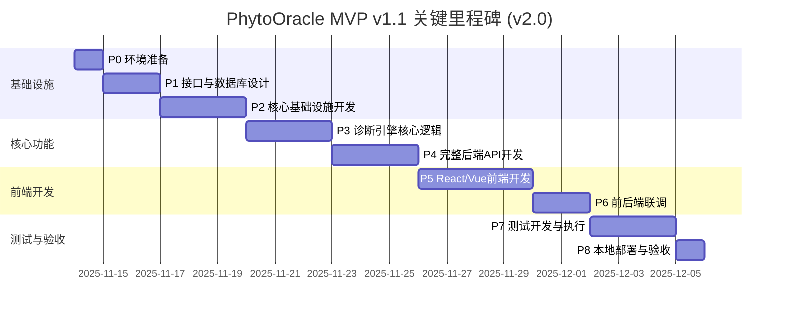

# PhytoOracle MVP v1.1 研发计划 v2.0

**版本**: v2.0
**创建时间**: 2025-11-14
**基于版本**: v1.0
**状态**: 待评审
**目标版本**: MVP v1.1 (端到端实现)

---

## 📋 v2.0 版本说明

本文档基于 `研发计划v1.0.md` 创建，主要变更如下：

### 🔄 核心变更
1. **前端技术栈调整**: Streamlit管理后台 + Next.js诊断界面 → **React/Vue单一技术栈实现4个界面**
2. **界面数量扩展**: 2个主要界面 → **4个完整界面**（单图诊断、批量诊断、本体管理、知识管理）
3. **API范围扩展**: 基础诊断API → **完整CRUD API**（诊断、图片、知识库、本体）
4. **新增联调阶段**: 增加P6前后端联调阶段，确保端到端流程畅通
5. **接口协议梳理**: 在P4阶段详细梳理所有接口协议，与设计文档第6章对应

### ✅ 保持不变
- P0-P3的所有内容（已完成，不修改）
- 技术架构和设计原则
- 测试策略和质量标准
- 风险管理和应对策略

### 📍 章节修改标记
- ✅ **保持不变**: 内容与v1.0完全一致
- 🔄 **已修改**: 内容已更新，与v1.0不同
- ✨ **新增**: v2.0新增的内容

---

## 目录

- [1. 项目背景](#1-项目背景) ✅
- [2. 总体目标](#2-总体目标) 🔄
- [3. 阶段划分总览](#3-阶段划分总览) 🔄
- [4. 关键里程碑](#4-关键里程碑) 🔄
- [5. 详细阶段规划](#5-详细阶段规划)
  - [P0: 环境准备与架构设计](#p0-环境准备与架构设计) ✅
  - [P1: 接口协议与数据库设计](#p1-接口协议与数据库设计) ✅
  - [P2: 核心基础设施开发](#p2-核心基础设施开发) ✅
  - [P3: 诊断引擎核心逻辑](#p3-诊断引擎核心逻辑) ✅
  - [P4: 完整后端API开发](#p4-完整后端api开发) 🔄
  - [P5: React/Vue前端开发](#p5-reactvue前端开发) 🔄
  - [P6: 前后端联调](#p6-前后端联调) ✨
  - [P7: 测试开发与执行](#p7-测试开发与执行) 🔄
  - [P8: 本地部署与验收](#p8-本地部署与验收) 🔄
- [6. 风险与应对](#6-风险与应对) 🔄
- [7. 附录](#7-附录) 🔄
- [8. 文档修订记录](#8-文档修订记录) ✨

---

## 1. 项目背景 ✅

**与v1.0保持一致，内容不变**

PhytoOracle 是基于本体建模的花卉疾病诊断系统，核心技术路线为：**VLM视觉理解 + 本体知识库 + 提示词工程 + 加权诊断引擎**。

### 1.1 技术验证基础

- **FlowerSpecialist v4.1**：已验证玫瑰黑斑病（100%特征检测率）、樱花白粉病（70.8%确诊率）
- **方法论v5.0**：零训练诊断、五知识库架构、视觉描述优化5大方法
- **测试数据集**：
  - `D:\项目管理\植物病虫害\数据集\flower_data`
  - `D:\项目管理\植物病虫害\数据集\Rose_leaf`

### 1.2 核心挑战

1. **知识库数据未完全准备**：18-24种疾病JSON需要逐步构建
2. **可扩展性要求高**：后续不能大规模重写，必须一次性设计好架构
3. **本地部署环境**：PostgreSQL + Redis需要本地搭建并验证
4. **管理后台优先级高**：疾病模型管理功能是关键（通过AI辅助构建疾病JSON）

---

## 2. 总体目标 🔄

### 2.1 核心目标

**产出一个可运行的花卉疾病诊断系统MVP**，具备：

1. ✅ **诊断能力**：支持Q0-Q6问诊序列 + 三层渐进诊断
2. 🔄 **管理能力**：Web界面，支持疾病CRUD、本体查看、诊断测试、统计分析
3. 🔄 **用户界面**：React/Vue实现的4个完整界面（单图诊断、批量诊断、本体管理、知识管理）
4. ✅ **可扩展性**：后续新增花卉/疾病无需大规模重构

**🆕 v2.0新增**: 完整的端到端系统实现，用户可正常使用所有功能（从上传到诊断到VLM给出结果）

### 2.2 质量目标

- **诊断准确率**：≥65%（使用测试数据集验证）
- **单元测试覆盖率**：≥80%（核心模块）
- **端到端测试**：完整诊断流程通过
- **代码质量**：通过Pylint/Flake8检查
- 🆕 **API响应时间**: < 5秒（单次VLM调用）
- 🆕 **前端界面响应**: 流畅，无明显卡顿

### 2.3 边界说明

**本计划范围内**：
- ✅ 后端诊断API（FastAPI）
- 🔄 完整Web界面（React/Vue，4个界面）
- ✅ 本地PostgreSQL + Redis部署
- ✅ 简单账号密码认证（后台登录）
- ✅ 单元测试 + 集成测试 + E2E测试

**本计划范围外**：
- ❌ 云服务器部署
- ❌ CI/CD流水线
- ❌ 复杂的API Key认证机制
- ❌ 生产级监控告警

---

## 3. 阶段划分总览 🔄

| 阶段 | 名称 | 核心产出 | 预估工作量 | v2.0变化 | Gate |
|------|------|----------|-----------|---------|------|
| **P0** | 环境准备与架构设计 | 完整目录蓝图 + 环境验证 | 0.5天 | ✅ 保持不变 | G0 |
| **P1** | 接口协议与数据库设计 | OpenAPI规范 + DDL脚本 + Pydantic模型 + 知识库JSON | 1.5天 | ✅ 保持不变 | G1 |
| **P2** | 核心基础设施开发 | VLM客户端 + 知识库加载器 + 提示词框架 + 本地图片存储 | 3天 | ✅ 保持不变 | G2 |
| **P3** | 诊断引擎核心逻辑 | Q0-Q6问诊 + 三层渐进诊断 + 知识库服务 + 图片服务 | 3天 | ✅ 保持不变 | G3 |
| **P4** | 完整后端API开发 | FastAPI服务 + 完整API（诊断+知识库+本体+图片） | 2.5天 | 🔄 扩展API范围，增加接口协议梳理 | G4 |
| **P5** | React/Vue前端开发 | 4个完整界面（单图/批量诊断+本体/知识管理） | 4天 | 🔄 改为React/Vue，4个界面 | G5 |
| **P6** | 前后端联调 | API对接完成 + 端到端流程验证 | 1.5天 | ✨ 新增阶段 | G6 |
| **P7** | 测试开发与执行 | 单元测试 + 集成测试 + E2E测试 | 2.5天 | 🔄 增加前后端测试 | G7 |
| **P8** | 本地部署与验收 | 完整系统运行 + 验收报告 | 1天 | 🔄 更新验收标准 | G8 |
| **总计** | - | - | **16.5天** | 🔄 总工期增加0.75天 | - |

**v1.0 → v2.0 主要变化**：
- ~~P5: 管理后台开发（Streamlit）2天~~ → P5: React/Vue前端开发 4天
- ~~P6: Web验证界面开发（Next.js）1.5天~~ → P6: 前后端联调 1.5天
- P4工期: 1.25天 → 2.5天（增加API范围）
- P7工期: 2天 → 2.5天（增加前端测试）

---

## 4. 关键里程碑 🔄



**关键里程碑节点（v2.0）**：

- **D+2（G1通过）**：数据库表创建完成，API接口规范评审通过，知识库JSON设计完成
- **D+5（G2通过）**：VLM调用成功，知识库加载验证通过
- **D+8（G3通过）**：完整诊断引擎逻辑验证通过（单疾病测试）
- **D+10.5（G4通过）**：🔄 完整后端API运行，所有接口协议已梳理，Postman测试通过
- **D+14.5（G5通过）**：🔄 4个前端界面开发完成，样式与原型一致
- **D+16（G6通过）**：✨ 前后端完全联通，端到端流程测试通过
- **D+18.5（G7通过）**：所有测试用例通过（单元+集成+E2E）
- **D+19.5（G8通过）**：验收测试通过，MVP交付

---

## 5. 详细阶段规划

---

### P0: 环境准备与架构设计 ✅

**✅ 与v1.0保持完全一致，内容不变**

**目标**：搭建开发环境，产出完整目录蓝图，验证技术栈可用性

**预估时间**：0.5天（4小时）

*(P0的详细内容与v1.0相同，此处省略。完整内容请参考研发计划v1.0.md的P0章节)*

---

### P1: 接口协议与数据库设计 ✅

**✅ 与v1.0保持完全一致，内容不变**

**目标**：产出OpenAPI规范、数据库DDL、Pydantic模型、知识库JSON

**预估时间**：1.5天（12小时）

*(P1的详细内容与v1.0相同，此处省略。完整内容请参考研发计划v1.0.md的P1章节)*

---

### P2: 核心基础设施开发 ✅

**✅ 与v1.0保持完全一致，内容不变**

**目标**：实现VLM客户端、知识库加载器、提示词框架、本地图片存储

**预估时间**：3天（24小时）

*(P2的详细内容与v1.0相同，此处省略。完整内容请参考研发计划v1.0.md的P2章节)*

---

### P3: 诊断引擎核心逻辑 ✅

**✅ 与v1.0保持完全一致，内容不变**

**目标**：实现Q0-Q6问诊序列、三层渐进诊断流程、VLM兜底策略、知识库服务、图片服务

**预估时间**：3天（24小时）

*(P3的详细内容与v1.0相同，此处省略。完整内容请参考研发计划v1.0.md的P3章节)*

---

### P4: 完整后端API开发 🔄

**🔄 v2.0重大修改**: 扩展API范围，增加知识库管理和本体管理API，详细梳理接口协议

**目标**：基于界面原型需求，实现完整的后端API服务

**预估时间**：2.5天（20小时）

**设计文档引用**: 详细设计文档v2.0 第6章 API设计

---

#### P4.1 FastAPI基础框架（0.5天）

**任务清单**：
1. 实现FastAPI应用主入口（`apps/api/main.py`）
2. 配置CORS中间件（允许前端跨域）
3. 配置异常处理器（统一错误响应格式）
4. 实现依赖注入（`apps/api/deps.py`）：
   - `get_db_pool()`：PostgreSQL连接池
   - `get_redis_client()`：Redis客户端
   - `get_vlm_client()`：VLM客户端
   - `get_knowledge_service()`：知识库服务
   - `get_diagnosis_service()`：诊断服务
5. 实现配置管理（`core/config.py`）：从 `.env` 加载配置

**产出物**：
- `backend/apps/api/main.py`
- `backend/apps/api/deps.py`
- `backend/core/config.py`
- `backend/.env.example`

**验收标准（G4.1）**：
- [ ] FastAPI服务启动成功（`uvicorn apps.api.main:app --reload`）
- [ ] `/docs` 可访问（Swagger UI自动生成API文档）
- [ ] 依赖注入测试通过（数据库连接池、Redis、VLM客户端可正常获取）
- [ ] 配置管理测试通过（从 `.env` 读取配置）
- [ ] CORS配置正确（前端可跨域调用）

**上下文依赖**：P1.1完成（需要API接口定义）

**设计文档引用**: 详细设计文档v2.0 第6.1节 FastAPI基础配置

---

#### P4.2 诊断API实现（1天）

**🔄 v2.0扩展**: 基于interface1和interface2原型需求，实现完整诊断API

**任务清单**：

1. **单图诊断API**: `POST /api/v1/diagnosis/single`
   - 接收图片文件上传（multipart/form-data）
   - 调用DiagnosisService执行完整诊断流程
   - 返回完整诊断结果：
     - 基本信息（疾病名称、置信度、病原体）
     - VLM问答对详情（Q0.0-Q0.5, Q1-Q6，包含原始问答对内容）
     - 特征匹配详情（按权重分组，显示得分）
     - 推理依据（匹配成功的特征）

2. **批量诊断API**: `POST /api/v1/diagnosis/batch`
   - 接收多张图片上传（最多50张）
   - 异步处理多张图片诊断
   - 返回批量诊断结果列表（包含进度状态）

3. **诊断结果查询API**: `GET /api/v1/diagnosis/result/{diagnosis_id}`
   - 支持interface2双击查看详情功能
   - 返回单个诊断的完整信息（与单图诊断API返回格式一致）

**接口协议详细定义**（参考设计文档v2.0 第6.2节）：

```yaml
# POST /api/v1/diagnosis/single
Request:
  ContentType: multipart/form-data
  Body:
    image: File (required) - 图片文件，支持JPG/PNG，最大10MB

Response:
  StatusCode: 200 OK
  ContentType: application/json
  Body:
    diagnosis_id: string        # 诊断ID
    image_path: string           # 图片存储路径
    timestamp: string            # 诊断时间
    disease:                     # 诊断结果
      disease_id: string         # 疾病ID
      disease_name_zh: string    # 中文名称
      disease_name_en: string    # 英文名称
      confidence: float          # 置信度 (0-1)
      pathogen: object           # 病原体信息
        type: string             # 类型 (fungal/bacterial/viral)
        species: string          # 学名
    vlm_qa_details:              # VLM问答对详情
      q0_responses: array        # Q0.0-Q0.5过滤问答
        - question_id: string    # 问题ID (q0_0)
          question_text: string  # 原始问题
          answer: string         # VLM原始回答
          extracted_value: string # 提取的结构化值
          passed: boolean        # 是否通过
      q1_q6_responses: array     # Q1-Q6特征提取问答
        - question_id: string    # 问题ID (q1-q6)
          dimension: string      # 特征维度
          question_text: string  # 原始问题
          answer: string         # VLM原始回答
          extracted_value: string # 提取的特征值
    feature_match_details:       # 特征匹配详情
      total_score: int           # 总得分
      max_score: int             # 最大分数
      match_percentage: float    # 匹配百分比
      feature_groups:            # 按权重分组
        major_features: array    # 主要特征 (权重50%+)
          - dimension: string    # 维度名称
            expected_value: string # 期望值
            actual_value: string # 实际值
            match_status: string # 匹配状态 (exact/fuzzy/mismatch)
            score: int           # 得分
            weight: float        # 权重
        minor_features: array    # 次要特征 (权重10-30%)
        optional_features: array # 可选特征 (权重<10%)
    推理依据: array               # 匹配成功的关键特征
      - 症状类型: 坏死斑点 ✓
      - 边缘颜色: 黄色晕圈 ✓

Error Response:
  400 Bad Request:
    message: "Invalid image format"
  500 Internal Server Error:
    message: "VLM service unavailable"
```

**产出物**：
- `backend/apps/api/routers/diagnosis.py`
- `backend/apps/api/schemas/diagnosis.py`
- `backend/apps/api/schemas/diagnosis_response.py`

**验收标准（G4.2）**：
- [ ] 单图诊断API测试通过（使用Postman）
- [ ] 批量诊断API测试通过（上传5张图片）
- [ ] 诊断结果查询API测试通过
- [ ] 返回数据包含所有必需字段（VLM问答对、特征匹配详情）
- [ ] 响应格式符合OpenAPI规范
- [ ] 错误处理正确（如上传非图片文件 → 400错误）
- [ ] 集成测试通过

**上下文依赖**：P3.3完成（需要DiagnosisService）

**设计文档引用**: 详细设计文档v2.0 第6.2节 诊断API详细设计

**Postman测试步骤**：
1. 单图诊断：
   - POST `http://localhost:8000/api/v1/diagnosis/single`
   - Body: form-data，key=`image`，value=选择玫瑰黑斑病图片
   - 验证响应包含完整VLM问答对和特征匹配详情

2. 批量诊断：
   - POST `http://localhost:8000/api/v1/diagnosis/batch`
   - Body: form-data，key=`images`，value=选择5张不同疾病图片
   - 验证返回批量诊断结果列表

---

#### P4.3 知识库管理API实现（0.75天）

**✨ v2.0新增**: 基于interface4原型需求，实现知识库CRUD API

**任务清单**：

1. **知识库目录树API**: `GET /api/v1/knowledge/tree`
   - 返回按宿主属分组的疾病树结构
   - 支持interface4左侧目录树展示

2. **疾病详情查询API**: `GET /api/v1/knowledge/disease/{disease_id}`
   - 返回疾病的完整知识数据
   - 包含基本信息、特征维度、VLM描述、权重

3. **疾病知识更新API**: `PUT /api/v1/knowledge/disease/{disease_id}`
   - 支持编辑VLM可理解的描述
   - 支持调整特征权重
   - 验证数据格式并保存到JSON文件

4. **疾病知识新增API**: `POST /api/v1/knowledge/disease`
   - 支持interface4添加新疾病

5. **疾病知识删除API**: `DELETE /api/v1/knowledge/disease/{disease_id}`
   - 软删除疾病知识（标记为已删除）

**接口协议详细定义**（参考设计文档v2.0 第6.3节）：

```yaml
# GET /api/v1/knowledge/tree
Response:
  StatusCode: 200 OK
  Body:
    hosts: array
      - genus: string           # 属名 (如 "Rosa")
        name_zh: string         # 中文名 (如 "蔷薇属")
        diseases: array         # 该属的所有疾病
          - disease_id: string  # 疾病ID
            name_zh: string     # 中文名称
    others: array               # 其他配置文件
      - id: string
        name: string
        type: string            # 类型 (config/ontology)

# GET /api/v1/knowledge/disease/{disease_id}
Response:
  StatusCode: 200 OK
  Body:
    disease_id: string
    disease_name_zh: string
    disease_name_en: string
    pathogen: object
    host_genus: string
    feature_vector: object      # 特征向量（8个维度）
      symptom_type: string
      color_center: string
      color_border: string
      location: string
      size: string
      distribution: string
      coverage: string
      edge_clarity: string
    visual_descriptions: object # VLM可理解的描述
      symptom_type:
        standard_value: string  # 标准值
        terminology: string     # 专业术语
        vlm_descriptions:
          medical_imaging: string    # 影像学描述
          everyday_language: string  # 日常用语
          spatial_positioning: string # 空间定位
      color_border:
        ...（相同结构）
    feature_importance: object  # 特征权重
      major_features: array     # 主要特征及权重
        - dimension: string
          weight: float
      minor_features: array
      optional_features: array

# PUT /api/v1/knowledge/disease/{disease_id}
Request:
  Body: (同GET响应格式，允许修改visual_descriptions和feature_importance)

Response:
  StatusCode: 200 OK
  Body:
    message: "Disease knowledge updated successfully"
    updated_at: string
```

**产出物**：
- `backend/apps/api/routers/knowledge.py`
- `backend/apps/api/schemas/knowledge.py`
- `backend/services/knowledge_service.py`（扩展CRUD方法）

**验收标准（G4.3）**：
- [ ] 知识库目录树API测试通过
- [ ] 疾病详情查询API测试通过
- [ ] 疾病知识更新API测试通过（更新后重新查询验证）
- [ ] 疾病知识新增API测试通过
- [ ] 疾病知识删除API测试通过
- [ ] 更新后的知识立即生效（刷新知识库缓存）
- [ ] JSON文件格式验证正确

**上下文依赖**：P3.5完成（需要KnowledgeService）

**设计文档引用**: 详细设计文档v2.0 第6.3节 知识库管理API详细设计

---

#### P4.4 本体管理API实现（0.25天）

**✨ v2.0新增**: 基于interface3原型需求，实现本体查询API

**任务清单**：

1. **本体类型列表API**: `GET /api/v1/ontology/list`
   - 返回所有本体类型（特征本体、疾病本体、宿主本体、治疗本体）

2. **本体Schema查询API**: `GET /api/v1/ontology/{type}`
   - 返回指定本体的Schema定义
   - 包含字段定义、枚举值、约束规则
   - 支持interface3本体结构展示

**接口协议详细定义**（参考设计文档v2.0 第6.4节）：

```yaml
# GET /api/v1/ontology/list
Response:
  StatusCode: 200 OK
  Body:
    ontologies: array
      - type: string            # 类型标识 (feature/disease/host/treatment)
        name_zh: string         # 中文名称
        name_en: string         # 英文名称
        file_path: string       # 文件路径
        version: string         # 版本号
        updated_at: string      # 更新时间

# GET /api/v1/ontology/feature
Response:
  StatusCode: 200 OK
  Body:
    type: "feature"
    name_zh: "特征本体"
    file_path: "knowledge_base/ontology/feature_ontology.json"
    version: "1.0"
    description: "定义可观察病害特征的维度和枚举值约束"
    dimensions: array           # 维度列表
      - dimension_name: string  # 维度名称 (symptom_type)
        name_zh: string         # 中文名称
        type: string            # 数据类型 (enum)
        allowed_values: array   # 允许值列表
          - value: string       # 值 (necrosis_spot)
            label_zh: string    # 中文标签
            label_en: string    # 英文标签
        fuzzy_matching_rules: object # 模糊匹配规则
```

**产出物**：
- `backend/apps/api/routers/ontology.py`
- `backend/apps/api/schemas/ontology.py`

**验收标准（G4.4）**：
- [ ] 本体类型列表API测试通过
- [ ] 特征本体查询API测试通过
- [ ] 返回数据格式符合interface3展示需求
- [ ] 枚举值展示完整

**上下文依赖**：P2.3完成（需要知识库加载器）

**设计文档引用**: 详细设计文档v2.0 第6.4节 本体管理API详细设计

---

**P4阶段Gate（G4）**：

通过条件（全部满足）：
- [ ] G4.1: FastAPI服务启动成功，Swagger UI可访问
- [ ] G4.2: 单图诊断API测试通过，返回包含完整VLM问答对和特征匹配详情
- [ ] G4.3: 批量诊断API测试通过
- [ ] G4.4: 知识库CRUD API全部测试通过
- [ ] G4.5: 本体管理API测试通过
- [ ] G4.6: 所有接口协议已在设计文档v2.0第6章梳理完成
- [ ] G4.7: Postman测试集合已创建并全部通过

产出物清单：
- [ ] `backend/apps/api/` 下所有路由和Schema文件
- [ ] OpenAPI规范文档（自动生成，可通过/docs访问）
- [ ] Postman测试集合（JSON导出文件）
- [ ] 接口协议梳理文档（设计文档v2.0第6章）

失败时行动：
- 如果API测试失败 → 检查路由配置、Schema定义、服务层调用
- 如果接口协议不完整 → 补充设计文档第6章，更新Swagger注释
- 如果Postman测试不通过 → 调试API，记录问题日志

---

### P5: React/Vue前端开发 🔄

**🔄 v2.0重大修改**: 改为React/Vue单一技术栈，实现4个完整界面

**目标**：基于HTML原型，使用React/Vue实现4个完整界面

**预估时间**：4天（32小时）

**设计文档引用**: 详细设计文档v2.0 第16章 前端架构设计

**技术选型**：
- 推荐使用 **React 18** + **Ant Design** + **TypeScript**
- 或使用 **Vue 3** + **Element Plus** + **TypeScript**
- 状态管理：Zustand（React）或 Pinia（Vue）
- HTTP客户端：Axios + React Query

---

#### P5.1 项目初始化与通用组件（0.5天）

**任务清单**：
1. 创建前端项目（使用Vite + React/Vue + TypeScript）
2. 配置路由（React Router v6 或 Vue Router v4）
3. 配置状态管理（Zustand或Pinia）
4. 配置HTTP客户端（Axios + React Query/VueUse）
5. 配置UI组件库（Ant Design或Element Plus）
6. 实现通用组件：
   - `Header` 导航栏
   - `Loading` 加载组件
   - `Toast` 提示组件
   - `Modal` 对话框组件
7. 配置代理（开发环境调用后端API）

**目录结构**（参考设计文档v2.0 附录B）：

```
frontend/
├── src/
│   ├── api/                    # API客户端
│   │   ├── client.ts           # Axios配置
│   │   ├── diagnosis.ts        # 诊断API
│   │   ├── knowledge.ts        # 知识库API
│   │   └── ontology.ts         # 本体API
│   ├── components/             # 组件
│   │   ├── common/             # 通用组件
│   │   ├── diagnosis/          # 诊断组件
│   │   ├── batch/              # 批量诊断组件
│   │   ├── ontology/           # 本体组件
│   │   └── knowledge/          # 知识管理组件
│   ├── pages/                  # 页面
│   │   ├── SingleDiagnosis/    # 界面1
│   │   ├── BatchDiagnosis/     # 界面2
│   │   ├── OntologyManagement/ # 界面3
│   │   └── KnowledgeManagement/# 界面4
│   ├── store/                  # 状态管理
│   ├── types/                  # TypeScript类型定义
│   ├── utils/                  # 工具函数
│   ├── App.tsx
│   └── main.tsx
├── package.json
├── vite.config.ts
└── tsconfig.json
```

**产出物**：
- `frontend/` 项目目录
- `frontend/src/components/common/` 通用组件
- `frontend/src/api/client.ts` API客户端
- `frontend/vite.config.ts` 代理配置

**验收标准（G5.1）**：
- [ ] 前端项目启动成功（`npm run dev`）
- [ ] 路由配置正确（4个页面路由）
- [ ] API客户端可正常调用后端（测试GET /api/v1/ontology/list）
- [ ] 通用组件渲染正常

**设计文档引用**: 详细设计文档v2.0 第16.1节 前端项目初始化

---

#### P5.2 界面1: 单图诊断（1天）

**参考原型**: `docs/prototypes/interface1_single_diagnosis.html`

**任务清单**：
1. 实现上传区域（支持拖拽和点击上传）
2. 实现图片预览区域
3. 实现"开始检测"按钮和加载状态
4. 实现诊断结果展示区：
   - 图片展示 + 诊断结果卡片
   - VLM问答对详情（可展开，带原始问答对内容）
     - Q0.0-Q0.5过滤问答（带通过/失败标记）
     - Q1-Q6特征提取问答（带维度名称）
   - 特征匹配详情（可展开，带权重和得分）
     - 按权重分组（主要/次要/可选）
     - 显示匹配状态（完全匹配✓、模糊匹配~、未匹配✗）
5. 对接 `POST /api/v1/diagnosis/single` API
6. 错误处理和加载状态

**核心组件**：
- `UploadArea.tsx` - 上传区域
- `ImagePreview.tsx` - 图片预览
- `DiagnosisResult.tsx` - 诊断结果卡片
- `QADetails.tsx` - VLM问答对详情
- `FeatureMatchDetails.tsx` - 特征匹配详情

**产出物**：
- `frontend/src/pages/SingleDiagnosis/` 页面组件
- `frontend/src/components/diagnosis/` 诊断相关组件

**验收标准（G5.2）**：
- [ ] 上传→预览→检测→结果展示流程完整
- [ ] VLM问答对可展开查看原始内容（Q0.0-Q0.5和Q1-Q6）
- [ ] 特征匹配详情展示正确（按权重分组，显示得分）
- [ ] 样式与原型一致（布局、颜色、字体）
- [ ] 加载状态和错误提示正常
- [ ] API调用成功，数据展示正确

**设计文档引用**: 详细设计文档v2.0 第16.2节 单图诊断界面设计

---

#### P5.3 界面2: 批量诊断（1天）

**参考原型**: `docs/prototypes/interface2_batch_diagnosis.html`

**任务清单**：
1. 实现文件上传区（支持多文件上传，最多50张）
2. 实现上传进度条
3. 实现结果列表展示：
   - 显示当前查看的图片（大图展示）
   - 显示诊断结果摘要（文件名、疾病名称、置信度、关键特征）
   - 翻页控制（上一张/下一张，显示序号/总数）
4. 实现底部结果列表（缩略）：
   - 每行显示：序号、文件名、诊断结果、置信度、[查看]按钮
   - 高亮显示当前正在查看的图片
   - 支持点击快速跳转
5. 实现双击查看详情功能：
   - 双击结果卡片打开Modal
   - Modal显示完整诊断信息（与界面1格式一致）
   - 包含VLM问答对详情和特征匹配详情
6. 实现导出Excel功能（可选）
7. 对接 `POST /api/v1/diagnosis/batch` API
8. 对接 `GET /api/v1/diagnosis/result/{diagnosis_id}` API（双击时调用）

**核心组件**：
- `BatchUpload.tsx` - 批量上传
- `ResultList.tsx` - 结果列表
- `ResultCard.tsx` - 结果卡片
- `DetailModal.tsx` - 详情模态框

**产出物**：
- `frontend/src/pages/BatchDiagnosis/` 页面组件
- `frontend/src/components/batch/` 批量诊断组件

**验收标准（G5.3）**：
- [ ] 批量上传和诊断流程完整
- [ ] 双击卡片可查看详细诊断结果（Modal展示）
- [ ] 支持翻页查看多张图片（上一张/下一张）
- [ ] 底部结果列表展示正常，高亮当前图片
- [ ] 样式与原型一致
- [ ] API调用成功，数据展示正确

**设计文档引用**: 详细设计文档v2.0 第16.3节 批量诊断界面设计

---

#### P5.4 界面3: 本体结构管理（0.5天）

**参考原型**: `docs/prototypes/interface3_ontology_management.html`

**任务清单**：
1. 实现左侧本体类型列表
2. 实现右侧本体结构展示区：
   - 显示本体元信息（文件名、版本、更新时间、描述）
   - 显示维度列表（包含维度数量）
   - 支持展开/折叠查看详细定义
3. 实现维度详情展示：
   - 维度名称（中英文）
   - 数据类型
   - 枚举值列表（可展开）
   - 每个枚举值显示：值、中文标签、英文标签
4. 实现模糊匹配规则展示（可选）
5. 对接 `GET /api/v1/ontology/list` API
6. 对接 `GET /api/v1/ontology/{type}` API

**核心组件**：
- `OntologyList.tsx` - 本体类型列表
- `OntologyDetail.tsx` - 本体详情展示
- `DimensionCard.tsx` - 维度卡片

**产出物**：
- `frontend/src/pages/OntologyManagement/` 页面组件
- `frontend/src/components/ontology/` 本体组件

**验收标准（G5.4）**：
- [ ] 本体类型切换正常
- [ ] 维度和枚举值展示正确
- [ ] 展开/折叠功能正常
- [ ] 样式与原型一致
- [ ] API调用成功，数据展示正确

**设计文档引用**: 详细设计文档v2.0 第16.4节 本体管理界面设计

---

#### P5.5 界面4: 知识详情管理（1天）

**参考原型**: `docs/prototypes/interface4_knowledge_management.html`

**任务清单**：
1. 实现左侧知识库目录树：
   - 按宿主属分组（父节点）
   - 每个宿主属下列出疾病（叶子节点）
   - 支持展开/折叠
   - 底部"其他"区域（折叠）放置配置文件
2. 实现右侧疾病详情展示区：
   - 基本信息卡片（疾病ID、病原体、宿主）
   - 多维度特征卡片（8个维度）
     - 每个维度带本体标识badge（"特征本体"）
     - 显示标准值、术语、VLM描述、权重
     - VLM描述包含：影像学描述、日常用语、空间定位
   - 治疗知识区域（可折叠，预留接口）
3. 实现编辑功能：
   - 点击"编辑"按钮进入编辑模式
   - 支持编辑VLM可理解的描述
   - 支持调整特征权重
   - 实时预览修改效果
4. 实现保存和验证：
   - 保存前验证数据格式
   - 调用API保存修改
   - 显示保存成功/失败提示
5. 对接 `GET /api/v1/knowledge/tree` API
6. 对接 `GET /api/v1/knowledge/disease/{disease_id}` API
7. 对接 `PUT /api/v1/knowledge/disease/{disease_id}` API

**核心组件**：
- `KnowledgeTree.tsx` - 知识库目录树
- `DiseaseDetail.tsx` - 疾病详情展示
- `DimensionCard.tsx` - 维度卡片
- `VLMDescriptionEditor.tsx` - VLM描述编辑器

**产出物**：
- `frontend/src/pages/KnowledgeManagement/` 页面组件
- `frontend/src/components/knowledge/` 知识管理组件

**验收标准（G5.5）**：
- [ ] 目录树展示正常（按宿主属分组）
- [ ] 疾病详情展示完整（含本体标识badge）
- [ ] 编辑和保存功能正常
- [ ] VLM描述格式正确（影像学、日常用语、空间定位）
- [ ] 样式与原型一致
- [ ] API调用成功，数据展示正确

**设计文档引用**: 详细设计文档v2.0 第16.5节 知识管理界面设计

---

**P5阶段Gate（G5）**：

通过条件（全部满足）：
- [ ] G5.1: 前端项目初始化完成，通用组件可用
- [ ] G5.2: 界面1单图诊断完整可用，样式与原型一致
- [ ] G5.3: 界面2批量诊断完整可用，双击查看详情正常
- [ ] G5.4: 界面3本体管理完整可用，展开/折叠正常
- [ ] G5.5: 界面4知识管理完整可用，编辑保存正常
- [ ] G5.6: 所有界面样式与原型一致，无明显视觉差异
- [ ] G5.7: 前端构建成功（`npm run build`）

产出物清单：
- [ ] `frontend/src/` 下所有页面和组件
- [ ] 前端构建产物（`frontend/dist/`）
- [ ] 前端开发文档（README.md）

失败时行动：
- 如果样式与原型不一致 → 对照原型HTML，调整CSS
- 如果API调用失败 → 检查API客户端配置，检查后端服务状态
- 如果组件渲染异常 → 检查TypeScript类型定义，检查数据格式

---

### P6: 前后端联调 ✨

**✨ v2.0新增阶段**: 确保前后端完全联通，端到端流程畅通

**目标**：完成前后端API对接，验证所有功能流程

**预估时间**：1.5天（12小时）

**设计文档引用**: 详细设计文档v2.0 第17章 前后端联调指南

---

#### P6.1 API对接调试（0.75天）

**任务清单**：
1. 配置前端代理（开发环境）：
   - Vite配置代理，将`/api`请求转发到`http://localhost:8000`
2. 调试所有API调用：
   - 诊断API（单图、批量、结果查询）
   - 知识库API（目录树、详情查询、更新）
   - 本体API（类型列表、Schema查询）
3. 处理跨域问题：
   - 确保FastAPI CORS配置正确
   - 验证OPTIONS预检请求通过
4. 处理错误响应：
   - 统一错误处理（400/404/500）
   - 显示友好的错误提示
5. 优化加载状态：
   - 添加Loading指示器
   - 添加骨架屏（Skeleton）
   - 优化用户等待体验

**产出物**：
- `frontend/vite.config.ts` 代理配置
- `frontend/src/utils/errorHandler.ts` 错误处理工具
- API对接调试日志

**验收标准（G6.1）**：
- [ ] 所有API调用成功（无CORS错误）
- [ ] 错误处理正确（显示友好提示）
- [ ] 加载状态显示正确（Loading、骨架屏）
- [ ] OPTIONS预检请求通过

**上下文依赖**：P4完成（后端API）+ P5完成（前端界面）

**设计文档引用**: 详细设计文档v2.0 第17.1节 API对接调试

---

#### P6.2 端到端流程测试（0.75天）

**任务清单**：

1. **测试单图诊断完整流程**：
   - 上传玫瑰黑斑病图片（`tests/fixtures/rose_black_spot.jpg`）
   - 验证VLM调用成功（查看Network请求）
   - 验证诊断结果正确（疾病名称、置信度）
   - 验证VLM问答对详情展示完整（Q0.0-Q0.5, Q1-Q6）
   - 验证特征匹配详情展示正确（按权重分组）
   - 记录测试结果（截图+日志）

2. **测试批量诊断流程**：
   - 上传5张不同疾病图片
   - 验证批量诊断成功（进度条显示）
   - 验证翻页功能正常
   - 验证双击查看详情正常（Modal展示完整信息）
   - 记录测试结果

3. **测试知识库管理流程**：
   - 查看玫瑰黑斑病详情
   - 编辑"边缘颜色"维度的VLM描述
     - 修改日常用语：添加"像手电筒照射时周围的黄色光圈"
   - 保存并验证生效
   - 重新上传玫瑰黑斑病图片诊断
   - 验证知识更新是否影响诊断结果
   - 记录测试结果

4. **测试本体管理流程**：
   - 查看特征本体Schema
   - 验证维度和枚举值展示正确
   - 验证展开/折叠功能正常
   - 记录测试结果

5. **记录所有问题并修复**：
   - 创建问题清单（Bug List）
   - 优先级排序（P0阻塞性问题/P1重要问题/P2优化问题）
   - 逐个修复并回归测试

**产出物**：
- 端到端测试报告（包含截图和日志）
- Bug清单和修复记录
- 测试用例文档

**验收标准（G6.2）**：
- [ ] 单图诊断流程测试通过（≥2个疾病测试）
- [ ] 批量诊断流程测试通过（≥5张图片）
- [ ] 知识库编辑流程测试通过（编辑→保存→生效）
- [ ] 本体管理流程测试通过
- [ ] 所有P0和P1问题已修复
- [ ] 回归测试通过

**上下文依赖**：P6.1完成（API对接调试）

**设计文档引用**: 详细设计文档v2.0 第17.2节 端到端流程测试

---

**P6阶段Gate（G6）**：

通过条件（全部满足）：
- [ ] G6.1: 前后端API完全联通，无CORS问题
- [ ] G6.2: 端到端诊断流程测试通过（单图+批量）
- [ ] G6.3: 知识库编辑功能测试通过（编辑→保存→生效）
- [ ] G6.4: 本体管理功能测试通过
- [ ] G6.5: 无P0阻塞性Bug，P1重要问题已修复

产出物清单：
- [ ] API对接调试日志
- [ ] 端到端测试报告
- [ ] Bug清单和修复记录
- [ ] 回归测试通过证明

失败时行动：
- 如果API对接失败 → 检查代理配置、CORS配置、后端服务状态
- 如果端到端测试失败 → 定位失败环节（前端/后端/VLM），记录详细日志
- 如果Bug数量过多 → 延长P6时间，优先修复阻塞性问题

---

### P7: 测试开发与执行 🔄

**🔄 v2.0修改**: 增加前端测试和E2E测试

**目标**：完善测试覆盖，确保系统质量

**预估时间**：2.5天（20小时）

**设计文档引用**: 详细设计文档v2.0 第12章 测试策略

---

#### P7.1 后端单元测试补充（0.75天）

**任务清单**：
1. 补充诊断API的单元测试
2. 补充知识库API的单元测试
3. 补充本体API的单元测试
4. 确保单元测试覆盖率 ≥ 80%

**产出物**：
- `backend/tests/unit/test_diagnosis_api.py`
- `backend/tests/unit/test_knowledge_api.py`
- `backend/tests/unit/test_ontology_api.py`

**验收标准（G7.1）**：
- [ ] 所有单元测试通过
- [ ] 测试覆盖率 ≥ 80%（使用pytest-cov检查）

**上下文依赖**：P4完成（后端API）

**设计文档引用**: 详细设计文档v2.0 第12.1节 单元测试策略

---

#### P7.2 集成测试（0.75天）

**任务清单**：
1. 测试完整诊断流程（API → Service → VLM → 数据库）
2. 测试知识库更新流程（API → Service → 文件系统 → 缓存刷新）
3. 测试缓存机制（Redis缓存命中率）
4. 测试异常处理（VLM调用失败、数据库连接失败）

**产出物**：
- `backend/tests/integration/test_full_diagnosis_flow.py`
- `backend/tests/integration/test_knowledge_update.py`
- `backend/tests/integration/test_cache.py`

**验收标准（G7.2）**：
- [ ] 集成测试全部通过
- [ ] 异常场景覆盖（VLM失败、数据库失败、文件读写失败）
- [ ] 缓存机制验证通过

**上下文依赖**：P4完成（后端API）+ P2完成（基础设施）

**设计文档引用**: 详细设计文档v2.0 第12.2节 集成测试策略

---

#### P7.3 前端测试（0.5天）

**🆕 v2.0新增**

**任务清单**：
1. 编写关键组件的单元测试（Jest + React Testing Library）
   - 测试UploadArea组件
   - 测试DiagnosisResult组件
   - 测试KnowledgeTree组件
2. 编写E2E测试（Playwright或Cypress）
   - 测试单图诊断流程
   - 测试批量诊断流程
   - 测试知识库编辑流程

**产出物**：
- `frontend/src/__tests__/` 单元测试
- `frontend/e2e/` E2E测试

**验收标准（G7.3）**：
- [ ] 前端单元测试通过
- [ ] E2E测试通过（关键流程覆盖）

**上下文依赖**：P5完成（前端界面）+ P6完成（前后端联调）

**设计文档引用**: 详细设计文档v2.0 第12.3节 前端测试策略

---

#### P7.4 性能和准确率测试（0.5天）

**任务清单**：
1. 测试诊断准确率（使用测试数据集）：
   - 玫瑰黑斑病：12张图片，确诊率目标 ≥ 65%
   - 樱花白粉病：12张图片，确诊率目标 ≥ 65%
2. 测试API响应时间：
   - 单图诊断：< 5秒
   - 批量诊断：< 30秒（10张图片）
3. 测试并发性能（可选）：
   - 使用Locust或JMeter进行压力测试
4. 生成测试报告

**产出物**：
- `docs/reports/性能测试报告_v2.md`
- `docs/reports/准确率测试报告_v2.md`

**验收标准（G7.4）**：
- [ ] 诊断准确率 ≥ 65%（至少2种疾病）
- [ ] API响应时间满足要求
- [ ] 测试报告完整

**上下文依赖**：P6完成（端到端流程）

**设计文档引用**: 详细设计文档v2.0 第12.4节 性能测试策略

---

**P7阶段Gate（G7）**：

通过条件（全部满足）：
- [ ] G7.1: 后端单元测试覆盖率 ≥ 80%
- [ ] G7.2: 集成测试全部通过
- [ ] G7.3: 前端单元测试和E2E测试通过
- [ ] G7.4: 诊断准确率 ≥ 65%（至少2种疾病）
- [ ] G7.5: API响应时间满足要求

产出物清单：
- [ ] 所有测试代码
- [ ] 性能测试报告
- [ ] 准确率测试报告
- [ ] 测试覆盖率报告

---

### P8: 本地部署与验收 🔄

**🔄 v2.0修改**: 更新部署脚本和验收标准

**目标**：完整系统本地部署并验收

**预估时间**：1天（8小时）

**设计文档引用**: 详细设计文档v2.0 第14章 部署方案

---

#### P8.1 部署脚本和文档（0.5天）

**任务清单**：
1. 编写一键启动脚本：
   - `scripts/start_backend.sh` - 启动后端服务（FastAPI）
   - `scripts/start_frontend.sh` - 启动前端服务（Vite dev server或nginx）
   - `scripts/start_all.sh` - 启动完整系统（后端+前端）
   - `scripts/stop_all.sh` - 停止所有服务

2. 编写部署文档：
   - `docs/deployment/本地部署指南_v2.md`
     - 环境要求
     - 依赖安装步骤
     - 配置说明
     - 启动步骤
     - 常见问题排查
   - `docs/deployment/环境配置说明_v2.md`
     - PostgreSQL配置
     - Redis配置
     - .env文件配置
     - VLM API Key配置

3. 编写用户手册：
   - `docs/user_guide/使用手册_v2.md`
     - 界面1使用说明（单图诊断）
     - 界面2使用说明（批量诊断）
     - 界面3使用说明（本体管理）
     - 界面4使用说明（知识管理）

**产出物**：
- 一键启动脚本（`scripts/`）
- 部署文档（`docs/deployment/`）
- 用户手册（`docs/user_guide/`）

**验收标准（G8.1）**：
- [ ] 一键启动脚本可用（测试启动和停止）
- [ ] 文档完整清晰（可供其他开发者部署）
- [ ] 用户手册易读（包含截图）

**设计文档引用**: 详细设计文档v2.0 第14.1节 本地部署方案

---

#### P8.2 系统验收（0.5天）

**任务清单**：
1. 验收测试（按照验收标准逐项检查）：
   - 功能完整性验收
   - 技术指标验收
   - 部署可用性验收
2. 生成验收报告
3. 录制演示视频（可选，推荐）

**验收标准（详细）**：

**功能完整性**：
- [ ] 用户可以上传图片并在30秒内获得诊断结果
- [ ] 诊断结果包含疾病名称、置信度、VLM问答对、特征匹配详情
- [ ] 批量诊断支持最多50张图片
- [ ] 知识库支持新增、编辑、删除疾病知识
- [ ] 本体结构可正常展示

**技术指标**：
- [ ] 诊断准确率 ≥ 65%（基于测试数据集）
- [ ] API响应时间 < 5秒（单次VLM调用）
- [ ] 前端界面响应流畅，无明显卡顿
- [ ] 单元测试覆盖率 ≥ 80%

**部署可用性**：
- [ ] 一键启动脚本可用（启动后端+前端）
- [ ] 系统可在本地环境稳定运行
- [ ] 有完整的部署文档和使用说明

**产出物**：
- `docs/reports/系统验收报告_v2.md`
- 演示视频（可选）

**验收标准（G8.2）**：
- [ ] 所有功能验收标准通过
- [ ] 所有技术指标验收标准通过
- [ ] 所有部署可用性验收标准通过
- [ ] 验收报告完整

**设计文档引用**: 详细设计文档v2.0 第14.2节 系统验收标准

---

**P8阶段Gate（G8）**：

通过条件（全部满足）：
- [ ] G8.1: 系统可一键启动
- [ ] G8.2: 所有功能验收通过
- [ ] G8.3: 所有技术指标验收通过
- [ ] G8.4: 文档完整（部署文档+用户手册）
- [ ] G8.5: MVP v1.1交付完成

产出物清单：
- [ ] 一键启动脚本
- [ ] 部署文档
- [ ] 用户手册
- [ ] 系统验收报告
- [ ] 演示视频（可选）

失败时行动：
- 如果验收不通过 → 根据验收报告修复问题，重新验收
- 如果部署失败 → 检查环境配置，更新部署文档
- 如果技术指标不达标 → 优化代码，重新测试

---

## 6. 风险与应对 🔄

| 风险 | 影响 | 概率 | v1.0应对策略 | v2.0新增应对策略 |
|------|------|------|------------|---------------|
| React/Vue学习曲线 | 高 | 中 | - | 提前准备教程资源，使用成熟UI组件库，优先参考官方文档 |
| API设计不匹配界面需求 | 高 | 中 | - | P4阶段详细梳理接口协议，与前端开发者充分沟通，提前定义API规范 |
| VLM调用不稳定 | 中 | 中 | 实现重试机制，准备备用VLM提供商 | ✅ 保持 |
| 知识库数据未准备 | 中 | 低 | 优先使用验证过的疾病JSON（Rose Black Spot、Cherry Powdery Mildew） | ✅ 保持 |
| 前后端联调时间不足 | 中 | 低 | - | 预留充足的P6联调时间（1.5天），及时沟通问题，建立问题清单 |
| 测试覆盖不足 | 中 | 低 | - | 明确测试标准，优先测试核心流程，使用E2E测试验证端到端流程 |
| PostgreSQL性能问题 | 低 | 低 | MVP版本数据量小，暂不考虑 | ✅ 保持 |

---

## 7. 附录 🔄

### 附录A: 完整目录结构

**✅ 后端目录结构与v1.0保持一致**

**🆕 前端目录结构（v2.0新增）**：

```
frontend/
├── public/
│   ├── index.html
│   └── favicon.ico
├── src/
│   ├── api/                    # API客户端
│   │   ├── client.ts           # Axios配置，统一请求/响应拦截
│   │   ├── diagnosis.ts        # 诊断API封装
│   │   ├── knowledge.ts        # 知识库API封装
│   │   └── ontology.ts         # 本体API封装
│   ├── assets/                 # 静态资源
│   │   ├── images/
│   │   └── styles/
│   ├── components/             # 组件
│   │   ├── common/             # 通用组件
│   │   │   ├── Header.tsx      # 导航栏
│   │   │   ├── Loading.tsx     # 加载组件
│   │   │   ├── Toast.tsx       # 提示组件
│   │   │   └── Modal.tsx       # 对话框组件
│   │   ├── diagnosis/          # 诊断组件
│   │   │   ├── UploadArea.tsx  # 上传区域
│   │   │   ├── ImagePreview.tsx # 图片预览
│   │   │   ├── DiagnosisResult.tsx # 诊断结果
│   │   │   ├── QADetails.tsx   # VLM问答对详情
│   │   │   └── FeatureMatchDetails.tsx # 特征匹配详情
│   │   ├── batch/              # 批量诊断组件
│   │   │   ├── BatchUpload.tsx # 批量上传
│   │   │   ├── ResultList.tsx  # 结果列表
│   │   │   ├── ResultCard.tsx  # 结果卡片
│   │   │   └── DetailModal.tsx # 详情模态框
│   │   ├── ontology/           # 本体组件
│   │   │   ├── OntologyList.tsx # 本体类型列表
│   │   │   ├── OntologyDetail.tsx # 本体详情
│   │   │   └── DimensionCard.tsx # 维度卡片
│   │   └── knowledge/          # 知识管理组件
│   │       ├── KnowledgeTree.tsx # 知识库目录树
│   │       ├── DiseaseDetail.tsx # 疾病详情
│   │       ├── DimensionCard.tsx # 维度卡片
│   │       └── VLMDescriptionEditor.tsx # VLM描述编辑器
│   ├── pages/                  # 页面
│   │   ├── SingleDiagnosis/    # 界面1：单图诊断
│   │   │   └── index.tsx
│   │   ├── BatchDiagnosis/     # 界面2：批量诊断
│   │   │   └── index.tsx
│   │   ├── OntologyManagement/ # 界面3：本体管理
│   │   │   └── index.tsx
│   │   └── KnowledgeManagement/# 界面4：知识管理
│   │       └── index.tsx
│   ├── store/                  # 状态管理
│   │   ├── diagnosisStore.ts   # 诊断状态
│   │   ├── knowledgeStore.ts   # 知识库状态
│   │   └── globalStore.ts      # 全局状态
│   ├── types/                  # TypeScript类型定义
│   │   ├── diagnosis.ts
│   │   ├── knowledge.ts
│   │   ├── ontology.ts
│   │   └── api.ts
│   ├── utils/                  # 工具函数
│   │   ├── formatters.ts       # 格式化工具
│   │   ├── validators.ts       # 验证工具
│   │   └── errorHandler.ts     # 错误处理
│   ├── App.tsx                 # 根组件
│   ├── main.tsx                # 入口文件
│   └── routes.tsx              # 路由配置
├── .env.example                # 环境变量模板
├── package.json
├── tsconfig.json
├── vite.config.ts
└── README.md
```

### 附录B: 技术栈对比（v1.0 vs v2.0）

| 技术栈 | v1.0 | v2.0 | 变化说明 |
|--------|------|------|---------|
| **后端框架** | FastAPI | FastAPI | ✅ 不变 |
| **前端框架** | Streamlit + Next.js | React/Vue | 🔄 统一为单一技术栈 |
| **UI组件库** | - | Ant Design / Element Plus | ✨ 新增 |
| **状态管理** | - | Zustand / Pinia | ✨ 新增 |
| **HTTP客户端** | - | Axios + React Query | ✨ 新增 |
| **VLM客户端** | Instructor + 自定义adapter | Instructor + 自定义adapter | ✅ 不变 |
| **数据库** | PostgreSQL | PostgreSQL | ✅ 不变 |
| **缓存** | Redis | Redis | ✅ 不变 |
| **测试框架** | Pytest | Pytest + Jest + Playwright | 🔄 增加前端测试 |

---

## 8. 文档修订记录 ✨

| 版本 | 日期 | 修订人 | 主要变更 |
|------|------|--------|---------|
| v1.0 | 2025-11-11 | 系统架构师 | 初始版本 |
| v2.0 | 2025-11-14 | 系统架构师 | **重大修订**: 基于HTML原型需求，调整P4-P8阶段规划，改为React/Vue单一技术栈，扩展API范围，新增P6前后端联调阶段，详细梳理接口协议 |

**v2.0修订详情**：
1. **P4: 诊断API开发** → **P4: 完整后端API开发**
   - 工期: 1.25天 → 2.5天
   - 新增: 知识库管理API（P4.3）、本体管理API（P4.4）
   - 新增: 详细的接口协议梳理，引用设计文档v2.0第6章

2. **P5: 管理后台开发（Streamlit）** → **P5: React/Vue前端开发**
   - 工期: 2天 → 4天
   - 变更: 改为React/Vue实现4个完整界面
   - 新增: 详细的界面实现任务清单和验收标准

3. **P6: Web验证界面开发（Next.js）** → **P6: 前后端联调**
   - 工期: 1.5天（保持）
   - 变更: 改为前后端API对接和端到端流程测试
   - 新增: 详细的联调步骤和Bug修复流程

4. **P7: 测试开发与执行**
   - 工期: 2天 → 2.5天
   - 新增: 前端测试（P7.3）
   - 新增: E2E测试

5. **P8: 本地部署与验收**
   - 工期: 1天（保持）
   - 更新: 部署脚本（前端部署）
   - 更新: 验收标准（增加前端相关标准）

6. **总工期**: 15.75天 → 16.5天（增加0.75天）

7. **新增附录B**: 技术栈对比表（v1.0 vs v2.0）

---

## 结语

本文档（v2.0）基于实际情况调整了P4-P8阶段的实施计划，保持P0-P3已完成内容不变，确保研发计划与当前进度和目标一致。

**关键变化**:
- 前端技术栈统一为React/Vue
- 后端API范围扩展为完整CRUD
- 新增前后端联调阶段
- 详细梳理接口协议

**下一步**:
1. 评审本研发计划v2.0
2. 更新详细设计文档v2.0（同步API设计和前端架构）
3. 开始实施P4阶段

---

**文档结束**
