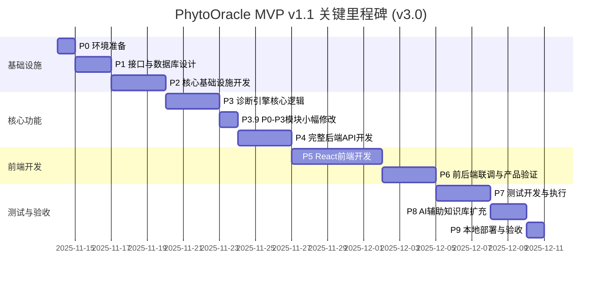

# PhytoOracle MVP v1.1 研发计划 v3.0

**版本**: v3.0
**创建时间**: 2025-11-16
**基于版本**: v2.0
**状态**: 待评审
**目标版本**: MVP v1.1 (端到端实现 + AI辅助知识扩充)

---

## 📋 v3.0 版本说明

本文档基于 `研发计划v2.0.md` 创建，主要变更如下：

### 🔄 核心变更
1. **P6阶段扩展**: 1.5天 → 2.5天，增加产品还原度验证和数据一致性验证
2. **新增P8阶段**: AI辅助知识库扩充（2天），利用Claude/GROK等AI工具批量生成知识
3. **P8改名为P9**: 原"本地部署与验收"阶段改为P9
4. **知识库扩充策略**: 从15个疾病扩充到25-30个疾病（6-8种花卉 × 3-4个疾病）
5. **总工期调整**: 20.5天 → 23.5天（+3天，包括P6扩展+1天和新增P8阶段+2天）

### ✅ 保持不变（相对v2.0）
- P0-P5的所有内容（已完成或规划明确）
- P7测试策略和标准
- 技术架构和设计原则
- 质量目标和边界说明

### 📍 章节修改标记
- ✅ **保持不变**: 内容与v2.0完全一致
- 🔄 **已修改**: 内容已更新，与v2.0不同
- ✨ **新增**: v3.0新增的内容

---

## 目录

- [📋 v3.0 版本说明](#-v30-版本说明)
- [1. 项目背景](#1-项目背景) ✅
  - [1.1 技术验证基础](#11-技术验证基础)
  - [1.2 核心挑战](#12-核心挑战)
- [2. 总体目标](#2-总体目标) 🔄
  - [2.1 核心目标](#21-核心目标)
  - [2.2 质量目标](#22-质量目标)
  - [2.3 边界说明](#23-边界说明)
- [3. 阶段划分总览](#3-阶段划分总览) 🔄
- [4. 关键里程碑](#4-关键里程碑) 🔄
- [5. 详细阶段规划](#5-详细阶段规划)
  - [P0: 环境准备与架构设计](#p0-环境准备与架构设计) ✅
  - [P1: 接口协议与数据库设计](#p1-接口协议与数据库设计) ✅
  - [P2: 核心基础设施开发](#p2-核心基础设施开发) ✅
  - [P3: 诊断引擎核心逻辑](#p3-诊断引擎核心逻辑) ✅
  - [P4: 完整后端API开发](#p4-完整后端api开发) 🔄
  - [P5: React前端开发](#p5-react前端开发) 🔄
  - [P6: 前后端联调与产品验证](#p6-前后端联调与产品验证) 🔄
    - [P6.1 技术对接验证](#p61-技术对接验证05天)
    - [P6.2 产品还原度验证](#p62-产品还原度验证075天) ✨
    - [P6.3 端到端业务流程验证](#p63-端到端业务流程验证075天)
    - [P6.4 数据一致性和边界条件验证](#p64-数据一致性和边界条件验证05天) ✨
  - [P7: 测试开发与执行](#p7-测试开发与执行) ✅
  - [P8: AI辅助知识库扩充](#p8-ai辅助知识库扩充) ✨
    - [P8.1 AI生成工作流准备](#p81-ai生成工作流准备05天)
    - [P8.2 使用AI批量生成知识](#p82-使用ai批量生成知识1天)
    - [P8.3 知识质量判断与分析](#p83-知识质量判断与分析05天)
  - [P9: 本地部署与验收](#p9-本地部署与验收) 🔄
    - [P9.1 部署脚本和文档](#p91-部署脚本和文档05天)
    - [P9.2 系统验收](#p92-系统验收05天)
- [6. 风险与应对](#6-风险与应对) 🔄
- [7. 附录](#7-附录) 🔄
- [8. 文档修订记录](#8-文档修订记录) ✨
- [结语](#结语)

---

## 1. 项目背景 ✅

**与v1.0保持一致，内容不变**

PhytoOracle 是基于本体建模的花卉疾病诊断系统，核心技术路线为：**VLM视觉理解 + 本体知识库 + 提示词工程 + 加权诊断引擎**。

### 1.1 技术验证基础

- **FlowerSpecialist v4.1**：已验证玫瑰黑斑病（100%特征检测率）、樱花白粉病（70.8%确诊率）
- **方法论v5.0**：零训练诊断、五知识库架构、视觉描述优化5大方法
- **测试数据集**：
  - `D:\项目管理\植物病虫害\数据集\flower_data`
  - `D:\项目管理\植物病虫害\数据集\Rose_leaf`

### 1.2 核心挑战

1. **知识库数据未完全准备**：18-24种疾病JSON需要逐步构建
2. **可扩展性要求高**：后续不能大规模重写，必须一次性设计好架构
3. **本地部署环境**：PostgreSQL + Redis需要本地搭建并验证
4. **管理后台优先级高**：疾病模型管理功能是关键（通过AI辅助构建疾病JSON）

---

## 2. 总体目标 🔄

### 2.1 核心目标

**产出一个可运行的花卉疾病诊断系统MVP**，具备：

1. ✅ **诊断能力**：支持Q0-Q6问诊序列 + 三层渐进诊断
2. 🔄 **管理能力**：Web界面，支持疾病CRUD、本体查看、诊断测试、统计分析
3. 🔄 **用户界面**：React实现的4个完整界面（单图诊断、批量诊断、本体管理、知识管理）
4. ✅ **可扩展性**：后续新增花卉/疾病无需大规模重构

**🆕 v2.0新增**: 完整的端到端系统实现，用户可正常使用所有功能（从上传到诊断到VLM给出结果）

### 2.2 质量目标

- **诊断准确率**：≥65%（使用测试数据集验证）
- **单元测试覆盖率**：≥80%（核心模块）
- **端到端测试**：完整诊断流程通过
- **代码质量**：通过Pylint/Flake8检查
- 🆕 **API响应时间**: < 5秒（单次VLM调用）
- 🆕 **前端界面响应**: 流畅，无明显卡顿

### 2.3 边界说明

**本计划范围内**：
- ✅ 后端诊断API（FastAPI）
- 🔄 完整Web界面（React，4个界面）
- ✅ 本地PostgreSQL + Redis部署
- ✅ 简单账号密码认证（后台登录）
- ✅ 单元测试 + 集成测试 + E2E测试

**本计划范围外**：
- ❌ 云服务器部署
- ❌ CI/CD流水线
- ❌ 复杂的API Key认证机制
- ❌ 生产级监控告警

---

## 3. 阶段划分总览 🔄

| 阶段 | 名称 | 核心产出 | 预估工作量 | v3.0变化 | Gate |
|------|------|----------|-----------|---------|------|
| **P0** | 环境准备与架构设计 | 完整目录蓝图 + 环境验证 | 0.5天 | ✅ 保持不变 | G0 |
| **P1** | 接口协议与数据库设计 | OpenAPI规范 + DDL脚本 + Pydantic模型 + 知识库JSON | 1.5天 | ✅ 保持不变 | G1 |
| **P2** | 核心基础设施开发 | VLM客户端 + 知识库加载器 + 提示词框架 + 本地图片存储 | 3天 | ✅ 保持不变 | G2 |
| **P3** | 诊断引擎核心逻辑 | Q0-Q6问诊 + 三层渐进诊断 + 知识库服务 + 图片服务 | 3天 | ✅ 保持不变 | G3 |
| **P3.9** | P0-P3已实现模块小幅修改 | 3个Service小幅修改（ImageService+KnowledgeService+DiagnosisService） | 0.6天 | ✅ 保持不变 | G3.9 |
| **P4** | 完整后端API开发 | FastAPI服务 + 完整API（诊断+知识库+本体+图片） | 2.5天 | ✅ 保持不变 | G4 |
| **P5** | React前端开发 | 4个完整界面（单图/批量诊断+本体/知识管理） | 4.5天 | ✅ 保持不变 | G5 |
| **P6** | 前后端联调与产品验证 | API对接 + 产品还原度验证 + 数据一致性验证 | 2.5天 | 🔄 从1.5天扩展到2.5天 | G6 |
| **P7** | 测试开发与执行 | 单元测试 + 集成测试 + E2E测试 | 2.5天 | ✅ 保持不变 | G7 |
| **P8** | AI辅助知识库扩充 | AI生成工具链 + 25-30个疾病知识 + 质量验证 | 2天 | ✨ 新增阶段 | G8 |
| **P9** | 本地部署与验收 | 完整系统运行 + 验收报告 | 1天 | 🔄 原P8改名 | G9 |
| **总计** | - | - | **23.5天** | 🔄 总工期从20.5天调整到23.5天（+3天，包括P6扩展+1天和新增P8阶段+2天） | - |

**v2.0 → v3.0 主要变化**：
- 🔄 **P6扩展**: 1.5天 → 2.5天（+1天），增加产品还原度验证和数据一致性验证
- ✨ **新增P8阶段**: AI辅助知识库扩充（2天），利用Claude/GROK批量生成25-30个疾病知识
- 🔄 **P8改名为P9**: 原"本地部署与验收"阶段改为P9
- **总工期**: 20.5天 → 23.5天（+3天）

---

## 4. 关键里程碑 🔄



**关键里程碑节点（v3.0）**:

- **D+2（G1通过）**：数据库表创建完成，API接口规范评审通过，知识库JSON设计完成
- **D+5（G2通过）**：VLM调用成功，知识库加载验证通过
- **D+8（G3通过）**：完整诊断引擎逻辑验证通过（单疾病测试）
- **D+8.6（G3.9通过）**：✨ P0-P3模块小幅修改完成（ImageService+KnowledgeService+DiagnosisService）
- **D+11.1（G4通过）**：🔄 完整后端API运行，所有接口协议已梳理，Postman测试通过（26个接口）
- **D+15.6（G5通过）**：🔄 4个前端界面开发完成，样式与原型一致
- **D+18.1（G6通过）**：🔄 前后端完全联通，产品还原度验证≥95%，数据一致性验证通过，第16.5节20+联调测试用例全部通过
- **D+20.6（G7通过）**：所有测试用例通过（单元+集成+E2E），第16.6节4个E2E场景全部通过
- **D+22.6（G8通过）**：✨ AI辅助知识库扩充完成，知识库规模达到35-40个疾病，诊断一致性≥70%
- **D+23.6（G9通过）**：验收测试通过，MVP v1.1交付完成

---

## 5. 详细阶段规划

---

### P0: 环境准备与架构设计 ✅

**✅ 与v1.0保持完全一致，内容不变**

**目标**：搭建开发环境，产出完整目录蓝图，验证技术栈可用性

**预估时间**：0.5天（4小时）

---

#### P0.1 开发环境搭建

**任务清单**：
1. 安装Python 3.10+（验证版本）
2. 安装PostgreSQL 14+（本地）
3. 安装Redis 7+（本地）
4. 安装Node.js 18+（用于Next.js前端）
5. 创建项目根目录 `D:\项目管理\PhytoOracle`

**产出物**：
- `backend/.env.example`：环境变量模板
- `backend/pyproject.toml`：Poetry依赖配置（初始版本）
- `frontend/package.json`：Node.js依赖配置（初始版本）

**验收标准（G0.1）**：
- [x] Python版本 ≥ 3.10
- [x] PostgreSQL服务运行成功（`psql --version`）
- [x] Redis服务运行成功（`redis-cli ping` 返回 `PONG`）
- [x] Node.js版本 ≥ 18

**上下文依赖**：无

---

#### P0.2 完整目录蓝图构建

**任务清单**：
1. 根据详细设计文档第4章，创建完整目录结构
2. 创建所有 `__init__.py` 文件（Python包结构）
3. 创建关键配置文件模板

**产出物**：
- **完整目录树**（见附录A）
- `backend/core/config.py`（空白模板，包含Settings类定义）
- `backend/apps/api/main.py`（FastAPI应用骨架）
- `backend/apps/admin/app.py`（Streamlit应用骨架）
- `frontend/app/page.tsx`（Next.js首页骨架）

**验收标准（G0.2）**：
- [x] 目录结构与详细设计文档第4章完全一致
- [x] 所有Python包包含 `__init__.py`
- [x] `backend/` 和 `frontend/` 结构分离清晰
- [x] 目录树可通过 `tree` 命令输出验证

**上下文依赖**：P0.1完成

**产出示例**：
```
PhytoOracle/
├── backend/
│   ├── apps/
│   │   ├── api/
│   │   │   ├── __init__.py
│   │   │   ├── main.py            # ✓ 创建骨架
│   │   │   ├── deps.py            # ✓ 创建空文件
│   │   │   ├── routers/
│   │   │   │   └── __init__.py
│   │   │   ├── schemas/
│   │   │   │   └── __init__.py
│   │   │   └── middleware/
│   │   │       └── __init__.py
│   │   └── admin/
│   │       ├── __init__.py
│   │       ├── app.py             # ✓ 创建骨架
│   │       └── pages/
│   ├── core/
│   │   ├── __init__.py
│   │   ├── config.py              # ✓ Settings类模板
│   │   └── ...
│   ├── domain/
│   ├── infrastructure/
│   ├── services/
│   ├── tests/
│   ├── knowledge_base/
│   │   ├── diseases/
│   │   ├── features/
│   │   ├── plants/
│   │   └── host_disease/
│   └── storage/
│       └── images/
└── frontend/
    ├── app/
    │   ├── layout.tsx
    │   └── page.tsx               # ✓ 创建骨架
    ├── components/
    └── lib/
```

---

#### P0.3 技术栈验证

**任务清单**：
1. 创建最小化FastAPI Hello World（验证FastAPI可运行）
2. 创建最小化Streamlit Hello World（验证Streamlit可运行）
3. 创建最小化Next.js页面（验证Next.js可运行）
4. 测试PostgreSQL连接（使用asyncpg）
5. 测试Redis连接（使用redis-py）
6. 测试Qwen VL Plus API调用（使用llm_config.json中的API Key）

**产出物**：
- `backend/tests/test_env_validation.py`：环境验证测试脚本
- `backend/scripts/test_qwen_api.py`：Qwen VL API测试脚本

**验收标准（G0.3）**：
- [x] FastAPI服务启动成功（`http://localhost:8000/docs` 可访问）
- [x] Streamlit应用启动成功（`http://localhost:8501` 可访问）
- [x] Next.js开发服务器启动成功（`http://localhost:3000` 可访问）
- [x] PostgreSQL连接成功（创建测试数据库 `phytooracle_test`）
- [x] Redis连接成功（`SET test_key test_value` 成功）
- [x] Qwen VL Plus API调用成功（返回有效响应）

**上下文依赖**：P0.1 + P0.2完成

---

**P0阶段Gate（G0）**：

通过条件（全部满足）：
- [x] G0.1：开发环境验证通过
- [x] G0.2：完整目录蓝图创建完成
- [x] G0.3：技术栈验证全部通过

失败时行动：
- 如果PostgreSQL/Redis连接失败 → 检查服务状态，重新安装
- 如果Qwen API调用失败 → 检查API Key有效性，标记为 **[待决策]**，向用户提问

---

### P1: 接口协议与数据库设计 ✅

**✅ 与v1.0保持完全一致，内容不变**

**目标**：完成API接口设计、数据库表设计、数据模型设计，产出可评审的设计文档

**预估时间**：1.5天（12小时）

---

#### P1.1 API接口设计（OpenAPI规范）

**任务清单**：
1. 根据详细设计文档第6章，编写完整OpenAPI 3.0规范
2. 定义核心接口：
   - `POST /api/v1/diagnose`：诊断接口
   - `GET /api/v1/diseases`：获取疾病列表
   - `POST /api/v1/admin/reload`：重载知识库
   - `POST /api/v1/auth/login`：后台登录
3. 定义所有请求/响应Schema

**产出物**：
- `docs/api/openapi.yaml`：完整OpenAPI 3.0规范文档
- `docs/api/接口协议说明.md`：接口使用说明（中文）

**验收标准（G1.1）**：
- [x] OpenAPI规范通过Swagger Editor验证（无语法错误）
- [x] 所有核心接口定义完整（路径、方法、参数、响应）
- [x] Schema定义符合详细设计文档第7章数据模型
- [x] 接口协议评审通过（架构师审核）

**上下文依赖**：P0完成

**评审检查点**：
- 诊断接口是否支持 `multipart/form-data`？
- 响应Schema是否包含 `feature_vector`、`diagnosis_result`、`scores`？
- 是否定义了错误响应格式（400/401/500）？

---

#### P1.2 数据库表设计（DDL）

**任务清单**：
1. 根据详细设计文档第9章，编写完整PostgreSQL DDL脚本
2. 创建5张核心表：
   - `diagnoses`：诊断记录
   - `images`：图片元数据
   - `api_keys`：API密钥（暂不使用，预留）
   - `admin_users`：管理员账号
   - `knowledge_versions`：知识库版本
3. 设计索引（timestamp、plant_genus、accuracy_label等）
4. 设计约束（CHECK约束、外键约束）

**产出物**：
- `backend/scripts/init_db.sql`：完整DDL脚本
- `backend/scripts/seed_data.sql`：初始化数据脚本（管理员账号）
- `docs/design/数据库设计评审.md`：数据库设计说明（表结构、索引策略）

**验收标准（G1.2）**：
- [x] DDL脚本在PostgreSQL中执行成功（无错误）
- [x] 所有表创建成功（`\dt` 命令可查看）
- [x] 索引创建成功（`\di` 命令可查看）
- [x] 初始化数据插入成功（至少1个管理员账号）
- [x] 数据库设计评审通过（检查表结构、索引合理性）

**上下文依赖**：P0完成

**评审检查点**：
- `diagnoses` 表是否使用JSONB存储 `feature_vector`？
- `images` 表是否有 `accuracy_label` 字段（unlabeled/correct/incorrect）？
- `admin_users` 表是否存储密码哈希（bcrypt）？
- 是否创建了合适的索引（避免全表扫描）？

---

#### P1.3 数据模型设计（Pydantic）

**任务清单**：
1. 根据详细设计文档第7章，编写所有Pydantic V2数据模型
2. 创建领域模型（`domain/`）：
   - `DiagnosisAggregate`：诊断聚合根
   - `DiseaseOntology`：疾病本体
   - `FeatureVector`：特征向量
   - `PlantOntology`：植物本体
3. 创建API Schema（`apps/api/schemas/`）：
   - `DiagnosisRequest`/`DiagnosisResponse`
   - `DiseaseSchema`
   - `LoginRequest`/`LoginResponse`
4. 使用Pydantic V2特性（Field、validator、model_validator）

**产出物**：
- `backend/domain/diagnosis.py`
- `backend/domain/disease.py`
- `backend/domain/feature.py`
- `backend/domain/plant.py`
- `backend/domain/value_objects.py`
- `backend/apps/api/schemas/diagnosis.py`
- `backend/apps/api/schemas/auth.py`

**验收标准（G1.3）**：
- [x] 所有Pydantic模型可成功导入（无语法错误）
- [x] 使用 `pydantic.BaseModel` V2语法
- [x] 必填字段使用 `Field(..., description="...")` 定义
- [x] 可选字段使用 `Optional[T] = None` 或 `T | None = None`
- [x] 模型通过单元测试验证（创建示例实例）

**上下文依赖**：P1.1完成（API Schema需参考OpenAPI定义）

**代码示例**：
```python
# backend/domain/diagnosis.py
from pydantic import BaseModel, Field
from typing import Optional
from uuid import UUID

class DiagnosisResult(BaseModel):
    """诊断结果领域模型"""
    diagnosis_id: UUID
    status: str = Field(..., description="诊断状态：confirmed/suspected/uncertain/rejected")
    confirmed_disease: Optional[str] = Field(None, description="确诊疾病ID")
    suspected_diseases: Optional[list[str]] = Field(None, description="疑似疾病ID列表")
    confidence: float = Field(..., ge=0.0, le=1.0, description="置信度")
    reasoning: Optional[str] = Field(None, description="诊断推理过程")
```

---

#### P1.4 知识库设计（JSON Schema）

**任务清单**：
1. 根据P1.3的Pydantic模型（`DiseaseOntology`/`PlantOntology`/`FeatureOntology`），设计对应的JSON Schema
2. 设计疾病本体JSON结构：
   - 疾病元信息（disease_id、disease_name、pathogen等）
   - 特征向量（feature_vector）
   - 特征重要性（feature_importance：major/minor/optional）
   - 诊断规则（diagnosis_rules：confirmed_rules/suspected_rules）
   - 视觉描述（visual_descriptions，用于VLM识别）
3. 设计植物本体JSON结构（v1.2+预留）：
   - 林奈分类学（kingdom/family/genus/species）
   - 器官解剖（organ_anatomy）
   - VLM识别线索（visual_cues）
   - 易感疾病列表（susceptible_diseases）
4. 设计特征本体JSON结构：
   - 特征维度定义（dimensions）
   - 模糊匹配规则（fuzzy_matching）
   - 症状类型/颜色/尺寸/分布模式枚举值
5. 设计宿主-疾病关系JSON结构：
   - 花卉属（genus）→ 疾病列表（diseases）映射
6. 创建初始知识库JSON文件（复制FlowerSpecialist v4.1数据）：
   - 玫瑰黑斑病（`rose_black_spot.json`）
   - 樱花白粉病（`cherry_powdery_mildew.json`）
   - 特征本体（`feature_ontology.json`）
   - 宿主-疾病关系（`host_disease_associations.json`）

**产出物**：
- `docs/knowledge_base/disease_schema.json`：疾病本体JSON Schema
- `docs/knowledge_base/plant_schema.json`：植物本体JSON Schema
- `docs/knowledge_base/feature_schema.json`：特征本体JSON Schema
- `docs/knowledge_base/知识库设计说明.md`：知识库结构说明文档
- `backend/knowledge_base/diseases/rose_black_spot.json`：玫瑰黑斑病JSON
- `backend/knowledge_base/diseases/cherry_powdery_mildew.json`：樱花白粉病JSON
- `backend/knowledge_base/features/feature_ontology.json`：特征本体JSON
- `backend/knowledge_base/host_disease/associations.json`：宿主-疾病关系JSON

**验收标准（G1.4）**：
- [x] 所有JSON Schema符合JSON Schema Draft 7规范
- [x] 疾病JSON文件通过Schema验证（使用jsonschema库）
- [x] 疾病JSON可被Pydantic `DiseaseOntology` 模型正确解析（无ValidationError）
- [x] 特征本体JSON可被Pydantic `FeatureOntology` 模型正确解析
- [x] 至少创建2种疾病JSON（Rose Black Spot + Cherry Powdery Mildew）
- [x] 知识库设计说明文档完成（包含字段说明、扩展指南）

**上下文依赖**：P1.3完成（需要Pydantic模型定义）

**疾病本体JSON示例**（完整结构请参考v1.0文档）：
```json
{
  "version": "4.1",
  "disease_id": "rose_black_spot",
  "disease_name": "玫瑰黑斑病",
  "feature_vector": {
    "symptom_type": "necrosis_spot",
    "color_center": "black",
    "color_border": "yellow"
  },
  "feature_importance": {
    "major_features": { "_weight": 0.8, "features": [...] },
    "minor_features": { "_weight": 0.15, "features": [...] },
    "optional_features": { "_weight": 0.05, "features": [...] }
  },
  "visual_descriptions": {
    "color_border": "像煎蛋的蛋白部分环绕着蛋黄（黄色晕圈）"
  }
}
```

**设计原则**：
1. **类型安全**：JSON结构严格对应Pydantic模型，确保可以无损解析
2. **可扩展性**：使用`additional_features`/`environmental_conditions`等字段支持动态扩展
3. **人类可读**：包含完整的中文描述、字段说明、注释
4. **版本控制**：每个JSON文件包含`version`字段，支持知识库版本管理
5. **验证友好**：所有枚举值与`domain/diagnosis.py`中的枚举类一致

**知识库扩展流程**（参考需求文档v1.3）：
1. **新花卉添加**：创建`PlantOntology` JSON（v1.2+）
2. **新疾病添加**：创建`DiseaseOntology` JSON → 更新`host_disease/associations.json` → 测试验证 → 提交Git
3. **特征维度扩展**：修改`feature_ontology.json` → 更新Pydantic枚举 → 更新提示词模板

---

**P1阶段Gate（G1）**：

通过条件（全部满足）：
- [x] G1.1：OpenAPI规范评审通过
- [x] G1.2：数据库DDL执行成功，初始化数据插入成功
- [x] G1.3：Pydantic模型创建完成，单元测试通过
- [x] G1.4：知识库JSON Schema设计完成，初始疾病JSON创建并通过验证

产出物清单：
- [x] `docs/api/openapi.yaml`
- [x] `backend/scripts/init_db.sql`
- [x] `backend/scripts/seed_data.sql`
- [x] `backend/domain/` 下所有模型文件
- [x] `backend/apps/api/schemas/` 下所有Schema文件
- [x] `docs/knowledge_base/` 下所有JSON Schema文件
- [x] `backend/knowledge_base/` 下初始疾病JSON文件（至少2种）

失败时行动：
- 如果OpenAPI规范评审不通过 → 修正后重新评审
- 如果DDL执行失败 → 检查SQL语法，修正后重试
- 如果发现数据模型遗漏 → 标记为 **[待决策]**，向用户提问
- 如果JSON Schema验证失败 → 检查JSON格式，修正后重试
- 如果Pydantic解析失败 → 检查JSON字段与模型定义一致性

---

### P2: 核心基础设施开发 ✅

**✅ 与v1.0保持完全一致，内容不变**


**目标**：实现VLM客户端、知识库加载器、提示词框架、模糊匹配引擎、加权诊断评分器、本地图片存储

**预估时间**：3天（24小时）

---

#### P2.1 提示词框架（PROOF Framework + Instructor）

**任务清单**：
1. 根据详细设计文档5.6节，实现PROOF Framework
2. 实现Instructor集成（包装Qwen VL Plus API）
3. 定义所有VLM响应Schema（Q00Response ~ Q05Response + FeatureResponse）
4. 编写Q0-Q6提示词模板

**产出物**：
- `backend/infrastructure/llm/prompts/framework.py`：PROOF Framework基类
- `backend/infrastructure/llm/prompts/response_schema.py`：VLM响应Schema
- `backend/infrastructure/llm/prompts/q0_0_content.py`：Q0.0提示词定义
- `backend/infrastructure/llm/prompts/q0_1_category.py`：Q0.1提示词定义
- `backend/infrastructure/llm/prompts/q0_2_genus.py`：Q0.2提示词定义
- `backend/infrastructure/llm/prompts/q0_3_organ.py`：Q0.3提示词定义
- `backend/infrastructure/llm/prompts/q0_4_completeness.py`：Q0.4提示词定义
- `backend/infrastructure/llm/prompts/q0_5_abnormality.py`：Q0.5提示词定义
- `backend/infrastructure/llm/prompts/q1_q6_features.py`：Q1-Q6动态特征提取模板

**验收标准（G2.1）**：
- [ ] PROOF Framework类可成功实例化
- [ ] `PROOFPrompt.render()` 方法可生成完整提示词字符串
- [ ] 所有VLM响应Schema使用 `Literal` 类型严格限制选项
- [ ] Q0.2提示词包含5种花卉的visual_cues（详细设计文档5.6.3示例）
- [ ] 单元测试通过（测试提示词渲染输出）

**上下文依赖**：P1.3完成（需要Pydantic模型）

**单元测试示例**：
```python
# backend/tests/unit/test_proof_framework.py
def test_q0_2_genus_prompt_render():
    """测试Q0.2提示词渲染"""
    from infrastructure.llm.prompts.q0_2_genus import q0_2_prompt

    rendered = q0_2_prompt.render()

    # 验证包含关键字段
    assert "ROLE: plant disease diagnosis assistant" in rendered
    assert "TASK: Identify the genus" in rendered
    assert "Rosa" in rendered
    assert "Prunus" in rendered
    assert "RESPONSE FORMAT (JSON only)" in rendered
```

---

#### P2.2 VLM客户端（Fallback机制）

**任务清单**：
1. 实现VLM Provider抽象接口（`VLMProtocol`）
2. 实现Qwen VL Plus Provider（读取 `llm_config.json`）
3. 实现Instructor集成（自动验证 + 重试）
4. 实现Fallback机制（Qwen → ChatGPT → Grok → Claude，当前仅Qwen可用）
5. 实现缓存机制（Redis，key = `vlm:{image_hash}:{question_id}`）

**产出物**：
- `backend/infrastructure/llm/base.py`：VLMProtocol抽象接口
- `backend/infrastructure/llm/client.py`：VLMClient主类
- `backend/infrastructure/llm/providers/qwen.py`：QwenVLPlusProvider
- `backend/infrastructure/llm/providers/chatgpt.py`：ChatGPTProvider（占位，标记TODO）
- `backend/core/cache.py`：RedisCache封装类

**验收标准（G2.2）**：
- [ ] VLMClient可成功初始化（加载Qwen API Key）
- [ ] 调用 `VLMClient.call_with_fallback()` 成功（使用测试图片）
- [ ] 返回的响应符合Pydantic Schema（如 `Q00Response`）
- [ ] 缓存机制生效（第二次调用同一图片时从Redis读取）
- [ ] 集成测试通过（测试完整VLM调用流程）

**上下文依赖**：P2.1完成（需要响应Schema）

**集成测试示例**：
```python
# backend/tests/integration/test_vlm_client.py
async def test_vlm_client_q0_0_call():
    """测试VLM客户端Q0.0调用"""
    from infrastructure.llm.client import VLMClient
    from infrastructure.llm.prompts.q0_0_content import Q0_0_PROMPT
    from infrastructure.llm.prompts.response_schema import Q00Response

    client = VLMClient()

    # 加载测试图片
    with open("tests/fixtures/rose_black_spot.jpg", "rb") as f:
        image_bytes = f.read()

    # 调用VLM
    response = await client.call_with_fallback(
        prompt=Q0_0_PROMPT,
        image=image_bytes,
        response_model=Q00Response,
        question_id="Q0.0"
    )

    # 验证响应
    assert response.choice in ["plant", "animal", "person", "object", "landscape", "other"]
    assert 0.0 <= response.confidence <= 1.0
```

---

#### P2.3 知识库加载器

**任务清单**：
1. 实现JSON知识库加载器（`JSONKnowledgeLoader`）
2. 加载疾病本体（`knowledge_base/diseases/*.json`）
3. 加载特征本体（`knowledge_base/features/feature_ontology.json`）
4. 加载植物本体（`knowledge_base/plants/*.json`，v1.2+预留）
5. 加载宿主-疾病关系（`knowledge_base/host_disease/associations.json`）
6. 解析JSON → Pydantic类（类型安全）
7. 支持热更新（管理后台调用 `reload()` 方法）

**产出物**：
- `backend/infrastructure/ontology/loader.py`：JSONKnowledgeLoader
- `backend/knowledge_base/diseases/rose_black_spot.json`：玫瑰黑斑病JSON（复制FlowerSpecialist数据）
- `backend/knowledge_base/diseases/cherry_powdery_mildew.json`：樱花白粉病JSON
- `backend/knowledge_base/features/feature_ontology.json`：特征本体JSON
- `backend/knowledge_base/host_disease/associations.json`：宿主-疾病关系JSON

**验收标准（G2.3）**：
- [ ] 知识库加载成功（至少2种疾病：Rose Black Spot + Cherry Powdery Mildew）
- [ ] JSON解析为Pydantic对象（`DiseaseOntology`）
- [ ] 可通过 `knowledge_base.get_disease_by_id("rose_black_spot")` 查询
- [ ] 热更新机制验证（修改JSON文件后调用 `reload()` 生效）
- [ ] 单元测试通过（测试加载、查询、重载）

**上下文依赖**：P1.3完成（需要 `DiseaseOntology` 模型）

**知识库JSON示例**：
```json
{
  "version": "4.1",
  "disease_id": "rose_black_spot",
  "disease_name": "玫瑰黑斑病",
  "common_name_en": "Rose Black Spot",
  "pathogen": "Diplocarpon rosae",
  "feature_vector": {
    "symptom_type": "necrosis_spot",
    "color_center": "black",
    "color_border": "yellow",
    "location": "lamina",
    "size": "medium",
    "distribution": "scattered"
  },
  "feature_importance": {
    "major_features": {
      "_weight": 0.8,
      "features": [
        {
          "dimension": "symptom_type",
          "expected_values": ["necrosis_spot"],
          "weight": 0.5
        },
        {
          "dimension": "color_center",
          "expected_values": ["black", "dark_brown"],
          "weight": 0.3
        }
      ]
    }
  },
  "visual_descriptions": {
    "color_border": "像煎蛋的蛋白部分环绕着蛋黄（黄色晕圈）"
  }
}
```

---

#### P2.4 模糊匹配引擎

**任务清单**：
1. 实现颜色模糊匹配（`COLOR_GROUPS`）
2. 实现尺寸模糊匹配（`SIZE_ORDER`，允许±1级别误差）
3. 实现位置模糊匹配（如 `lamina` 匹配 `["lamina", "petiole"]`）
4. 封装为 `FuzzyMatcher` 类

**产出物**：
- `backend/infrastructure/ontology/matcher.py`：FuzzyMatcher类

**验收标准（G2.4）**：
- [ ] 颜色模糊匹配测试通过（如 `black` 匹配 `dark_brown`）
- [ ] 尺寸模糊匹配测试通过（如 `medium` 匹配 `medium_small`）
- [ ] 位置模糊匹配测试通过
- [ ] 单元测试覆盖率 ≥ 90%

**上下文依赖**：P2.3完成（需要知识库数据）

**单元测试示例**：
```python
# backend/tests/unit/test_matcher.py
def test_color_fuzzy_match():
    """测试颜色模糊匹配"""
    from infrastructure.ontology.matcher import FuzzyMatcher

    matcher = FuzzyMatcher()

    # 同色系匹配
    assert matcher.match_color("black", "dark_brown") == True
    assert matcher.match_color("yellow", "light_yellow") == True

    # 不同色系不匹配
    assert matcher.match_color("black", "yellow") == False

def test_size_fuzzy_match():
    """测试尺寸模糊匹配"""
    from infrastructure.ontology.matcher import FuzzyMatcher

    matcher = FuzzyMatcher()

    # ±1级别匹配
    assert matcher.match_size("medium", "medium_small") == True
    assert matcher.match_size("medium", "small") == False  # 相差2级
```

---

#### P2.5 加权诊断评分器

**任务清单**：
1. 实现加权诊断评分算法（详细设计文档第5.4节）
2. 主要特征权重0.8（symptom_type: 0.5 + color_center: 0.3）
3. 次要特征权重0.15（location: 0.1 + additional_features: 0.05）
4. 可选特征权重0.05（size: 0.03 + distribution: 0.02）
5. 完整性修正系数（complete: 1.0, partial: 0.8, close_up: 0.6）
6. 诊断规则（confirmed: ≥0.85且主要特征≥2/2, suspected: 0.6-0.85）

**产出物**：
- `backend/infrastructure/ontology/scorer.py`：DiagnosisScorer类

**验收标准（G2.5）**：
- [ ] 评分算法与FlowerSpecialist v11实验结果一致
- [ ] 主要特征完全匹配时，total_score ≥ 0.8
- [ ] 诊断规则正确（confirmed/suspected/unlikely）
- [ ] 单元测试覆盖率 ≥ 95%

**上下文依赖**：P2.3 + P2.4完成

**单元测试示例**：
```python
# backend/tests/unit/test_scorer.py
def test_weighted_scoring():
    """测试加权评分算法"""
    from infrastructure.ontology.scorer import DiagnosisScorer
    from domain.feature import FeatureVector
    from domain.disease import DiseaseOntology

    scorer = DiagnosisScorer()

    # 构建特征向量（完全匹配）
    feature_vector = FeatureVector(
        symptom_type="necrosis_spot",
        color_center="black",
        color_border="yellow",
        location="lamina"
    )

    # 加载疾病
    disease = load_disease("rose_black_spot")

    # 计算评分
    score = scorer.calculate_score(feature_vector, disease)

    # 验证
    assert score.total_score >= 0.85  # 应为confirmed
    assert score.major_matched == 2   # 主要特征全匹配
    assert score.diagnosis_level == "confirmed"
```

---

#### P2.6 本地图片存储（LocalImageStorage）

**任务清单**：
1. 实现本地文件系统图片存储（`LocalImageStorage`类）
2. 按准确率+花卉名+日期分类存储规则：
   - 路径规范：`storage/images/{accuracy_label}/{genus}/{year-month}/{day}/{diagnosis_id}.jpg`
   - accuracy_label: unlabeled / correct / incorrect
3. 实现文件路径生成规范化（`get_path`方法）
4. 实现文件移动功能（`move`方法，用于准确性标注时移动文件）
5. 实现图片保存功能（`save`方法，异步保存图片）

**产出物**：
- `backend/infrastructure/storage/local_storage.py`：LocalImageStorage类
- `backend/infrastructure/storage/__init__.py`

**验收标准（G2.6）**：
- [ ] LocalImageStorage类可成功实例化
- [ ] `save()` 方法测试通过（生成正确的文件路径，保存图片成功）
- [ ] `move()` 方法测试通过（移动文件到correct/incorrect文件夹）
- [ ] `get_path()` 方法测试通过（路径生成规范正确）
- [ ] 单元测试覆盖率 ≥ 90%

**上下文依赖**：无（Layer 1模块，无依赖）

**单元测试示例**：
```python
# backend/tests/unit/test_local_storage.py
import pytest
from infrastructure.storage.local_storage import LocalImageStorage
from pathlib import Path

@pytest.mark.asyncio
async def test_save_image():
    """测试图片保存"""
    storage = LocalImageStorage(base_path="tests/storage_test")

    # 模拟图片数据
    image_bytes = b"fake_image_data"
    diagnosis_id = "diag_20251111_001"
    plant_genus = "rosa"

    # 保存图片
    saved_path = await storage.save(
        image_bytes=image_bytes,
        diagnosis_id=diagnosis_id,
        plant_genus=plant_genus,
        accuracy_label="unlabeled"
    )

    # 验证路径格式
    assert "unlabeled/rosa/2025-11/" in saved_path
    assert diagnosis_id in saved_path

    # 验证文件存在
    assert Path(saved_path).exists()

@pytest.mark.asyncio
async def test_move_file():
    """测试文件移动（准确性标注）"""
    storage = LocalImageStorage(base_path="tests/storage_test")

    # 先保存一张图片
    image_bytes = b"fake_image_data"
    old_path = await storage.save(
        image_bytes=image_bytes,
        diagnosis_id="diag_20251111_002",
        plant_genus="rosa",
        accuracy_label="unlabeled"
    )

    # 移动到correct文件夹
    new_path = await storage.move(
        old_path=old_path,
        new_accuracy_label="correct"
    )

    # 验证
    assert "correct/rosa/" in new_path
    assert Path(new_path).exists()
    assert not Path(old_path).exists()  # 旧文件已删除
```

**架构说明**：
- LocalImageStorage是**Layer 1基础设施模块**（无依赖）
- 被ImageService（Layer 3服务）调用
- 实现顺序：P2.6 → P3.6（ImageService） → P4.3（图片管理API）

---

**P2阶段Gate（G2）**：

通过条件（全部满足）：
- [x] G2.1：PROOF Framework + VLM响应Schema创建完成，单元测试通过
- [x] G2.2：VLM客户端调用成功，集成测试通过
- [x] G2.3：知识库加载成功（至少2种疾病）
- [x] G2.4：模糊匹配引擎单元测试通过
- [x] G2.5：加权诊断评分器单元测试通过
- [x] G2.6：本地图片存储单元测试通过

产出物清单：
- [ ] `backend/infrastructure/llm/` 下所有文件
- [ ] `backend/infrastructure/ontology/` 下所有文件
- [ ] `backend/infrastructure/storage/` 下所有文件（LocalImageStorage）
- [ ] `backend/knowledge_base/` 下至少2种疾病JSON
- [ ] `backend/tests/unit/` 下所有单元测试
- [ ] `backend/tests/integration/test_vlm_client.py`

失败时行动：
- 如果VLM调用失败 → 检查API Key，检查网络，标记为 **[待决策]**
- 如果知识库加载失败 → 检查JSON格式，使用JSON Schema验证
- 如果评分算法与v11不一致 → 对照v11源码修正

---


---

### P3: 诊断引擎核心逻辑 ✅

**✅ 与v1.0保持完全一致，内容不变**


**目标**：实现Q0-Q6问诊序列、三层渐进诊断流程、VLM兜底策略、知识库服务、图片服务

**预估时间**：3天（24小时）

---

#### P3.1 Q0逐级过滤实现

**任务清单**：
1. 实现Q0.0内容类型识别（plant/animal/person/object/landscape/other）
2. 实现Q0.1植物类别识别（flower/vegetable/tree/crop/grass/other）
3. 实现Q0.2花卉种属识别（Rosa/Prunus/Tulipa/Dianthus/Paeonia/unknown）
4. 实现Q0.3器官识别（flower/leaf）
5. 实现Q0.4完整性检查（complete/partial/close_up）
6. 实现Q0.5异常判断（healthy/abnormal）
7. 早期退出机制（如Q0.0 != plant → 直接返回错误）

**产出物**：
- `backend/services/diagnosis_service.py`：DiagnosisService类（部分实现）
  - `_execute_q0_sequence()` 方法
  - `_check_content_type()` 方法
  - `_check_plant_category()` 方法
  - `_check_flower_genus()` 方法

**验收标准（G3.1）**：
- [ ] Q0逐级过滤完整流程测试通过
- [ ] 非植物图片返回"不支持的图片类型"
- [ ] 非花卉图片返回"当前仅支持花卉诊断"
- [ ] Q0.2返回的flower_genus可用于候选疾病剪枝
- [ ] 集成测试通过（使用测试数据集）

**上下文依赖**：P2.1 + P2.2完成

**集成测试示例**：
```python
# backend/tests/integration/test_q0_filtering.py
async def test_q0_sequence_with_rose_image():
    """测试Q0序列（玫瑰图片）"""
    from services.diagnosis_service import DiagnosisService

    service = DiagnosisService(...)

    # 加载玫瑰图片
    with open("tests/fixtures/rose_black_spot.jpg", "rb") as f:
        image_bytes = f.read()

    # 执行Q0序列
    q0_responses = await service._execute_q0_sequence(image_bytes)

    # 验证
    assert q0_responses["content_type"] == "plant"
    assert q0_responses["plant_category"] == "flower"
    assert q0_responses["flower_genus"] in ["Rosa", "Prunus", "unknown"]
    assert q0_responses["organ"] in ["flower", "leaf"]
    assert q0_responses["completeness"] in ["complete", "partial", "close_up"]
    assert q0_responses["has_abnormality"] in ["healthy", "abnormal"]
```

---

#### P3.2 Q1-Q6动态特征提取

**任务清单**：
1. 实现Q1症状类型识别（symptom_type）
2. 根据Q1结果动态生成Q2-Q6问题：
   - 如symptom_type = "necrosis_spot" → Q2: color_center, Q3: color_border, Q4: location
   - 如symptom_type = "powdery_coating" → Q2: coverage_color, Q3: coverage_density
3. 实现特征向量构建（`FeatureVector` Pydantic对象）
4. 处理VLM不确定性（confidence < 0.5时标记为uncertain）

**产出物**：
- `backend/services/diagnosis_service.py`：DiagnosisService类（部分实现）
  - `_execute_q1_q6_sequence()` 方法
  - `_build_feature_vector()` 方法

**验收标准（G3.2）**：
- [ ] Q1-Q6动态问题生成成功
- [ ] 特征向量构建完整（包含所有必要字段）
- [ ] VLM不确定性处理正确
- [ ] 集成测试通过（使用测试数据集）

**上下文依赖**：P3.1完成

---

#### P3.3 三层渐进诊断流程

**任务清单**：
1. 实现Layer1：VLM视觉特征提取（Q0-Q6）
2. 实现Layer2：知识库匹配引擎
   - 候选疾病筛选（根据flower_genus剪枝）
   - 加权诊断评分（调用DiagnosisScorer）
   - 排序（按total_score降序）
3. 实现Layer3：置信度分层决策
   - High Confidence (≥0.85) → 返回confirmed
   - Medium Confidence (0.60-0.85) → 返回suspected（Top 2-3候选）
   - Low Confidence (<0.60) → 触发兜底策略（P3.4）

**产出物**：
- `backend/services/diagnosis_service.py`：DiagnosisService类（完整实现）
  - `diagnose()` 主方法（编排完整流程）

**验收标准（G3.3）**：
- [ ] 完整诊断流程测试通过（使用Rose Black Spot测试图片）
- [ ] 确诊结果正确（total_score ≥ 0.85，disease_id正确）
- [ ] 疑似结果正确（返回Top 2-3候选疾病）
- [ ] 集成测试通过（覆盖confirmed/suspected两种场景）

**上下文依赖**：P3.2 + P2.3 + P2.5完成

**集成测试示例**：
```python
# backend/tests/integration/test_diagnosis_flow.py
async def test_complete_diagnosis_rose_black_spot():
    """测试完整诊断流程（玫瑰黑斑病）"""
    from services.diagnosis_service import DiagnosisService

    service = DiagnosisService(...)

    # 加载测试图片
    with open("tests/fixtures/rose_black_spot.jpg", "rb") as f:
        image_bytes = f.read()

    # 执行诊断
    result = await service.diagnose(image_bytes)

    # 验证
    assert result.status == "confirmed"
    assert result.confirmed_disease == "rose_black_spot"
    assert result.confidence >= 0.85
    assert "feature_vector" in result.dict()
    assert "scores" in result.dict()
```

---

#### P3.4 VLM兜底策略

**任务清单**：
1. 当所有候选疾病score < 0.6时触发兜底策略
2. 调用VLM开放式诊断（使用fallback提示词模板）
3. 返回VLM推测结果，标记为"VLM推测"
4. 记录case用于后续知识库补充

**产出物**：
- `backend/infrastructure/llm/prompts/fallback.py`：VLM开放式诊断提示词
- `backend/services/diagnosis_service.py`：DiagnosisService类
  - `_vlm_fallback_diagnosis()` 方法

**验收标准（G3.4）**：
- [ ] 兜底策略触发测试通过（使用知识库外疾病图片）
- [ ] VLM开放式诊断返回有效结果
- [ ] 结果标记为"VLM推测"
- [ ] 集成测试通过

**上下文依赖**：P3.3完成

---

#### P3.5 知识库服务实现（KnowledgeService）

**任务清单**：
1. 实现KnowledgeService类（`backend/services/knowledge_service.py`）
2. 实现知识库初始化（`initialize`方法，调用KnowledgeLoader加载所有知识库）
3. 实现知识库热更新（`reload`方法，清除缓存并重新加载）
4. 实现候选疾病查询（`get_diseases_by_genus`方法，用于P3.3的候选疾病筛选）
5. 实现全部疾病查询（`get_all_diseases`方法，用于管理后台）
6. 实现单个疾病查询（`get_disease_by_id`方法）
7. 实现知识库版本管理（记录Git commit hash）

**产出物**：
- `backend/services/knowledge_service.py`：KnowledgeService类
- `backend/services/__init__.py`

**验收标准（G3.5）**：
- [ ] KnowledgeService可成功初始化（加载至少2种疾病）
- [ ] `get_diseases_by_genus("Rosa")` 返回玫瑰属疾病列表
- [ ] `get_all_diseases()` 返回所有疾病列表
- [ ] `get_disease_by_id("rose_black_spot")` 返回正确的疾病对象
- [ ] `reload()` 热更新测试通过（修改JSON后重新加载生效）
- [ ] 单元测试覆盖率 ≥ 90%

**上下文依赖**：P2.3（KnowledgeLoader）完成

**单元测试示例**：
```python
# backend/tests/unit/test_knowledge_service.py
import pytest
from services.knowledge_service import KnowledgeService
from infrastructure.ontology.loader import JSONKnowledgeLoader

@pytest.mark.asyncio
async def test_initialize_knowledge_service():
    """测试知识库服务初始化"""
    loader = JSONKnowledgeLoader(base_path="backend/knowledge_base")
    service = KnowledgeService(loader=loader)

    # 初始化知识库
    await service.initialize()

    # 验证
    assert service.knowledge_base is not None
    all_diseases = service.get_all_diseases()
    assert len(all_diseases) >= 2  # 至少2种疾病

@pytest.mark.asyncio
async def test_get_diseases_by_genus():
    """测试按花卉属查询疾病"""
    loader = JSONKnowledgeLoader(base_path="backend/knowledge_base")
    service = KnowledgeService(loader=loader)
    await service.initialize()

    # 查询玫瑰属疾病
    rosa_diseases = service.get_diseases_by_genus("Rosa")

    # 验证
    assert len(rosa_diseases) > 0
    assert all(d.host_genus == "Rosa" for d in rosa_diseases)

@pytest.mark.asyncio
async def test_reload_knowledge_base():
    """测试知识库热更新"""
    loader = JSONKnowledgeLoader(base_path="backend/knowledge_base")
    service = KnowledgeService(loader=loader)
    await service.initialize()

    # 记录初始疾病数量
    initial_count = len(service.get_all_diseases())

    # 热更新
    await service.reload()

    # 验证（数量应该一致，证明重新加载成功）
    new_count = len(service.get_all_diseases())
    assert new_count == initial_count
```

**架构说明**：
- KnowledgeService是**Layer 3应用服务**（依赖KnowledgeLoader）
- 被DiagnosisService（Layer 4服务）调用
- 实现顺序：P2.3（KnowledgeLoader） → P3.5（KnowledgeService） → P3.1-P3.4（DiagnosisService）

---

#### P3.6 图片服务实现（ImageService）

**任务清单**：
1. 实现ImageService类（`backend/services/image_service.py`）
2. 实现图片保存（`save_image`方法，调用LocalImageStorage保存图片）
3. 实现图片元数据持久化（调用ImageRepository保存到数据库）
4. 实现准确性标注（`update_accuracy_label`方法，移动文件到correct/incorrect文件夹）
5. 实现图片查询（`query_images`方法，按花卉属、准确性、日期范围筛选）
6. 实现图片删除（`delete_image`方法，软删除）
7. 实现ImageRepository（`backend/infrastructure/persistence/repositories/image_repo.py`）

**产出物**：
- `backend/services/image_service.py`：ImageService类
- `backend/infrastructure/persistence/repositories/image_repo.py`：ImageRepository类

**验收标准（G3.6）**：
- [ ] ImageService可成功保存图片（文件存在于正确路径）
- [ ] 图片元数据保存到数据库（`images`表）
- [ ] `update_accuracy_label()` 测试通过（文件移动成功）
- [ ] `query_images()` 测试通过（按条件筛选）
- [ ] `delete_image()` 测试通过（软删除，文件和数据库记录都标记为已删除）
- [ ] 单元测试覆盖率 ≥ 90%

**上下文依赖**：P2.6（LocalImageStorage）完成

**单元测试示例**：
```python
# backend/tests/unit/test_image_service.py
import pytest
from services.image_service import ImageService
from infrastructure.storage.local_storage import LocalImageStorage
from infrastructure.persistence.repositories.image_repo import ImageRepository

@pytest.mark.asyncio
async def test_save_image():
    """测试图片保存"""
    storage = LocalImageStorage(base_path="tests/storage_test")
    repo = ImageRepository(db_pool=...)
    service = ImageService(storage=storage, image_repo=repo)

    # 保存图片
    image_bytes = b"fake_image_data"
    image_id = await service.save_image(
        image_bytes=image_bytes,
        diagnosis_id="diag_20251111_001",
        plant_genus="rosa",
        organ="leaf"
    )

    # 验证文件存在
    assert image_id is not None

    # 验证数据库记录
    image_metadata = await repo.get_by_id(image_id)
    assert image_metadata.plant_genus == "rosa"
    assert image_metadata.accuracy_label == "unlabeled"

@pytest.mark.asyncio
async def test_update_accuracy_label():
    """测试准确性标注"""
    storage = LocalImageStorage(base_path="tests/storage_test")
    repo = ImageRepository(db_pool=...)
    service = ImageService(storage=storage, image_repo=repo)

    # 先保存一张图片
    image_bytes = b"fake_image_data"
    image_id = await service.save_image(
        image_bytes=image_bytes,
        diagnosis_id="diag_20251111_002",
        plant_genus="rosa",
        organ="leaf"
    )

    # 更新准确性标签
    await service.update_accuracy_label(
        image_id=image_id,
        label="correct"
    )

    # 验证数据库更新
    image_metadata = await repo.get_by_id(image_id)
    assert image_metadata.accuracy_label == "correct"

    # 验证文件已移动
    assert "correct/rosa/" in image_metadata.file_path

@pytest.mark.asyncio
async def test_query_images():
    """测试图片查询"""
    storage = LocalImageStorage(base_path="tests/storage_test")
    repo = ImageRepository(db_pool=...)
    service = ImageService(storage=storage, image_repo=repo)

    # 查询所有玫瑰属图片
    images = await service.query_images(
        genus="rosa",
        accuracy_label="unlabeled"
    )

    # 验证
    assert len(images) > 0
    assert all(img.plant_genus == "rosa" for img in images)
    assert all(img.accuracy_label == "unlabeled" for img in images)
```

**架构说明**：
- ImageService是**Layer 3应用服务**（依赖LocalImageStorage + ImageRepository）
- 被DiagnosisService（Layer 4服务）和AdminRouter调用
- 实现顺序：P2.6（LocalImageStorage） → P3.6（ImageService） → P4.3（图片管理API）

---

**P3阶段Gate（G3）**：

通过条件（全部满足）：
- [x] G3.1：Q0逐级过滤测试通过
- [x] G3.2：Q1-Q6动态特征提取测试通过
- [x] G3.3：三层渐进诊断流程测试通过（使用Rose Black Spot + Cherry Powdery Mildew测试）
- [x] G3.4：VLM兜底策略测试通过
- [x] G3.5：知识库服务单元测试通过
- [x] G3.6：图片服务单元测试通过

产出物清单：
- [ ] `backend/services/diagnosis_service.py`（DiagnosisService完整实现）
- [ ] `backend/services/knowledge_service.py`（KnowledgeService完整实现）
- [ ] `backend/services/image_service.py`（ImageService完整实现）
- [ ] `backend/infrastructure/persistence/repositories/image_repo.py`（ImageRepository）
- [ ] `backend/tests/integration/test_q0_filtering.py`
- [ ] `backend/tests/integration/test_diagnosis_flow.py`

验收测试：
- [ ] 使用测试数据集（Rose Black Spot 12张图片），确诊率 ≥ 65%
- [ ] 使用测试数据集（Cherry Powdery Mildew 12张图片），确诊率 ≥ 65%

失败时行动：
- 如果确诊率 < 65% → 调整提示词、特征权重，重新测试
- 如果VLM兜底失败 → 标记为 **[待决策]**，向用户提问

---


---

### P3.9: P0-P3已实现模块小幅修改 ✨

**✨ v2.0新增阶段**: 根据需求交付能力综合评审报告v2.0第3.3节，对P0-P3已实现模块进行小幅修改以满足新需求

**目标**: 修改ImageService、KnowledgeService、DiagnosisService三个已实现的Service，支持新增的功能需求

**预估时间**: 0.6天（约5小时）

**设计文档引用**:
- 详细设计文档v2.0 第6章 API设计（6.1节诊断API、6.4节知识库API、6.7节图片管理API）
- 详细设计文档v2.0 第7章 服务层设计

**评审报告来源**: `docs/reports/需求交付能力综合评审报告_v2.0.md` 第3.3节

---

#### P3.9.1 修改ImageService：新增准确度标注接口（0.2天）

**任务背景**:
评审报告3.3节指出，ImageService需扩展标注功能，支持用户对诊断结果进行准确性反馈（正确/错误）。

**任务清单**:

1. **修改ImageService类** (`backend/services/image_service.py`):
   ```python
   class ImageService:
       async def update_accuracy_label(
           self,
           image_id: str,
           is_accurate: bool,
           user_feedback: Optional[str] = None
       ) -> None:
           """标注诊断准确性"""
           # 1. 从数据库查询image记录
           # 2. 更新accuracy_label字段
           # 3. 可选：保存用户反馈文本
           pass
   ```

2. **新增API路由** (`backend/apps/api/routers/images.py`):
   ```python
   @router.patch("/images/{image_id}/accuracy")
   async def update_accuracy(
       image_id: str,
       accuracy: AccuracyLabelRequest,
       service: ImageService = Depends(get_image_service)
   ):
       """PATCH /api/v1/images/{image_id}/accuracy"""
       await service.update_accuracy_label(
           image_id=image_id,
           is_accurate=accuracy.is_accurate,
           user_feedback=accuracy.feedback
       )
       return {"message": "标注成功"}
   ```

3. **编写测试用例**:
   - 单元测试: `test_image_service.py::test_update_accuracy_label`
   - 集成测试: `test_images_api.py::test_patch_accuracy_success`

**产出物**:
- 修改 `backend/services/image_service.py`
- 新增 `backend/apps/api/routers/images.py` 路由
- 新增测试用例

**验收标准（G3.9.1）**:
- [ ] `update_accuracy_label()` 方法实现完成
- [ ] PATCH接口测试通过（Postman/cURL）
- [ ] 单元测试覆盖率 ≥ 90%
- [ ] 数据库中accuracy_label字段正确更新

**设计文档引用**: 详细设计文档v2.0 第6.7节图片管理API、第7章ImageService

---

#### P3.9.2 修改KnowledgeService：新增知识库树方法（0.25天）

**任务背景**:
评审报告3.3节指出，KnowledgeService需支持树结构查询，按"宿主属→疾病"分组返回知识库数据。

**任务清单**:

1. **修改KnowledgeService类** (`backend/services/knowledge_service.py`):
   ```python
   class KnowledgeService:
       async def get_knowledge_tree(self) -> KnowledgeTree:
           """获取按宿主属分组的疾病树结构"""
           # 1. 读取knowledge_base/host_disease/associations.json
           # 2. 按genus分组
           # 3. 返回树形结构
           hosts = []
           for genus, diseases in grouped_data.items():
               hosts.append({
                   "genus": genus,
                   "name_zh": genus_zh_name,
                   "diseases": [
                       {"id": d.id, "name_zh": d.name_zh}
                       for d in diseases
                   ]
               })
           return KnowledgeTree(hosts=hosts)
   ```

2. **新增API路由** (`backend/apps/api/routers/knowledge.py`):
   ```python
   @router.get("/knowledge/tree")
   async def get_tree(
       service: KnowledgeService = Depends(get_knowledge_service)
   ) -> KnowledgeTreeResponse:
       """GET /api/v1/knowledge/tree"""
       return await service.get_knowledge_tree()
   ```

3. **编写测试用例**:
   - 单元测试: 验证树结构正确分组
   - 集成测试: 验证API返回格式

**产出物**:
- 修改 `backend/services/knowledge_service.py`
- 新增 `GET /api/v1/knowledge/tree` 路由
- 新增测试用例

**验收标准（G3.9.2）**:
- [ ] `get_knowledge_tree()` 方法实现完成
- [ ] 返回数据按宿主属正确分组（Rosa、Prunus等）
- [ ] API路由测试通过
- [ ] 单元测试覆盖率 ≥ 90%

**设计文档引用**: 详细设计文档v2.0 第6.4节知识库管理API、第7章KnowledgeService

---

#### P3.9.3 修改DiagnosisService：调整响应格式（0.15天）

**任务背景**:
评审报告3.3节指出，DiagnosisService的API响应需要包含VLM问答对详情（Q0-Q6），支持界面1展示完整推理过程。

**任务清单**:

1. **调整DiagnosisResponse模型** (`backend/domain/models/diagnosis.py`):
   ```python
   class DiagnosisResponse(BaseModel):
       diagnosis_id: str
       disease_name: str
       confidence: float
       description: str
       # ✨ 新增字段
       qa_details: List[QADetail]  # VLM问答对（Q0-Q6）

   class QADetail(BaseModel):
       question_id: str  # "Q0.0", "Q1", etc.
       question: str
       answer: str
       image_url: Optional[str]  # 如果有标注图
   ```

2. **修改DiagnosisService.diagnose()方法**:
   - 在返回时包含VLM的Q0-Q6问答对
   - 调用VLMClient时保存中间结果

3. **编写测试用例**:
   - 集成测试: 验证响应中包含qa_details字段

**产出物**:
- 修改 `backend/domain/models/diagnosis.py`
- 修改 `backend/services/diagnosis_service.py`
- 更新测试用例

**验收标准（G3.9.3）**:
- [ ] DiagnosisResponse包含qa_details字段
- [ ] qa_details包含Q0-Q6完整问答对
- [ ] API测试通过，响应格式正确
- [ ] 不影响现有测试用例

**设计文档引用**: 详细设计文档v2.0 第6.1节诊断API、第7章DiagnosisService

---

**P3.9阶段Gate（G3.9）**:

通过条件（全部满足）:
- [ ] G3.9.1: ImageService新增`update_accuracy_label()`方法，测试通过
- [ ] G3.9.2: KnowledgeService新增`get_knowledge_tree()`方法，测试通过
- [ ] G3.9.3: DiagnosisService响应格式调整，包含qa_details字段
- [ ] G3.9.4: 所有修改的单元测试覆盖率 ≥ 90%
- [ ] G3.9.5: 集成测试通过，不影响已有功能
- [ ] G3.9.6: P0-P3阶段的85%+测试用例仍然通过

产出物清单:
- [ ] 修改 `backend/services/image_service.py`
- [ ] 修改 `backend/services/knowledge_service.py`
- [ ] 修改 `backend/services/diagnosis_service.py`
- [ ] 修改 `backend/domain/models/diagnosis.py`
- [ ] 新增 3个API路由
- [ ] 新增/更新测试用例

失败时行动:
- 如果测试不通过 → 调试修复，记录问题日志
- 如果破坏已有功能 → 回滚修改，重新设计方案
- 如果发现新的依赖问题 → 标记为 **[待决策]**，向用户提问

**说明**: 本阶段仅修改P0-P3已实现的模块，不涉及新模块开发。新API(15个)、新数据库表(3张)、新Service(5个)的实现在P4阶段完成。

---


---

### P4: 完整后端API开发 🔄

**🔄 v2.0重大修改**: 扩展API范围，实现26个API接口、创建8张数据库表、开发12个Service模块

**目标**：实现完整的后端API服务，包括诊断、知识库管理、本体管理、批量诊断、图片管理等功能

**核心任务**（对应详细设计文档v2.0）:
1. **实现26个API接口**（详细设计第6章）:
   - 现有API：5个（诊断、健康检查、认证等）
   - ✨ 新增15个API（详细设计6.4-6.7节）：
     - 知识库管理API 9个（6.4节）：tree, get, create, update, delete, validate, snapshot, snapshots, restore
     - 本体管理API 2个（6.5节）：list, get by type
     - 批量诊断API 3个（6.6节）：batch upload, get status, get progress
     - 图片管理API 2个（6.7节）：list images, update accuracy（含P3.9.1实现的接口）

2. **创建8张数据库表**（详细设计第9章）:
   - 现有表：5张（images, diagnoses, diagnosis_features, knowledge_base_meta, api_keys）
   - ✨ 新增3张表（详细设计9.2节）：
     - knowledge_snapshots：知识库版本管理
     - ontology_changes：本体变更历史
     - batch_diagnosis_sessions：批量诊断会话

3. **开发12个Service模块**（详细设计第7章）:
   - 已实现（P0-P3）：7个（DiagnosisService, VLMClient, ImageService, KnowledgeService, FuzzyMatcher, DiagnosisScorer, LocalImageStorage）
   - ✨ 新增5个Service（评审报告3.2节）：
     - BatchDiagnosisService：批量诊断编排
     - KnowledgeCRUDService：疾病CRUD操作
     - OntologyService：本体Schema查询
     - SnapshotService：版本快照管理
     - FeedbackService：人工反馈记录

**预估时间**：2.5天（20小时）

**设计文档引用**:
- 详细设计文档v2.0 第6章 API设计（6.1-6.7节，26个接口）
- 详细设计文档v2.0 第7章 服务层设计（12个Service）
- 详细设计文档v2.0 第9章 数据库设计（9.1基础表+9.2扩展表，共8张）

---

#### P4.1 FastAPI基础框架（0.5天）

**任务清单**：
1. 实现FastAPI应用主入口（`apps/api/main.py`）
2. 配置CORS中间件（允许前端跨域）
3. 配置异常处理器（统一错误响应格式）
4. 实现依赖注入（`apps/api/deps.py`）：
   - `get_db_pool()`：PostgreSQL连接池
   - `get_redis_client()`：Redis客户端
   - `get_vlm_client()`：VLM客户端
   - `get_knowledge_service()`：知识库服务
   - `get_diagnosis_service()`：诊断服务
5. 实现配置管理（`core/config.py`）：从 `.env` 加载配置

**产出物**：
- `backend/apps/api/main.py`
- `backend/apps/api/deps.py`
- `backend/core/config.py`
- `backend/.env.example`

**验收标准（G4.1）**：
- [ ] FastAPI服务启动成功（`uvicorn apps.api.main:app --reload`）
- [ ] `/docs` 可访问（Swagger UI自动生成API文档）
- [ ] 依赖注入测试通过（数据库连接池、Redis、VLM客户端可正常获取）
- [ ] 配置管理测试通过（从 `.env` 读取配置）
- [ ] CORS配置正确（前端可跨域调用）

**上下文依赖**：P1.1完成（需要API接口定义）

**设计文档引用**: 详细设计文档v2.0 第6.1节 FastAPI基础配置

---

#### P4.2 诊断API实现（1天）

**🔄 v2.0扩展**: 基于interface1和interface2原型需求，实现完整诊断API

**任务清单**：

1. **单图诊断API**: `POST /api/v1/diagnosis/single`
   - 接收图片文件上传（multipart/form-data）
   - 调用DiagnosisService执行完整诊断流程
   - 返回完整诊断结果：
     - 基本信息（疾病名称、置信度、病原体）
     - VLM问答对详情（Q0.0-Q0.5, Q1-Q6，包含原始问答对内容）
     - 特征匹配详情（按权重分组，显示得分）
     - 推理依据（匹配成功的特征）

2. **批量诊断API**: `POST /api/v1/diagnosis/batch`
   - 接收多张图片上传（最多50张）
   - 异步处理多张图片诊断
   - 返回批量诊断结果列表（包含进度状态）

3. **诊断结果查询API**: `GET /api/v1/diagnosis/result/{diagnosis_id}`
   - 支持interface2双击查看详情功能
   - 返回单个诊断的完整信息（与单图诊断API返回格式一致）

**接口协议详细定义**（参考设计文档v2.0 第6.2节）：

```yaml
# POST /api/v1/diagnosis/single
Request:
  ContentType: multipart/form-data
  Body:
    image: File (required) - 图片文件，支持JPG/PNG，最大10MB

Response:
  StatusCode: 200 OK
  ContentType: application/json
  Body:
    diagnosis_id: string        # 诊断ID
    image_path: string           # 图片存储路径
    timestamp: string            # 诊断时间
    disease:                     # 诊断结果
      disease_id: string         # 疾病ID
      disease_name_zh: string    # 中文名称
      disease_name_en: string    # 英文名称
      confidence: float          # 置信度 (0-1)
      pathogen: object           # 病原体信息
        type: string             # 类型 (fungal/bacterial/viral)
        species: string          # 学名
    vlm_qa_details:              # VLM问答对详情
      q0_responses: array        # Q0.0-Q0.5过滤问答
        - question_id: string    # 问题ID (q0_0)
          question_text: string  # 原始问题
          answer: string         # VLM原始回答
          extracted_value: string # 提取的结构化值
          passed: boolean        # 是否通过
      q1_q6_responses: array     # Q1-Q6特征提取问答
        - question_id: string    # 问题ID (q1-q6)
          dimension: string      # 特征维度
          question_text: string  # 原始问题
          answer: string         # VLM原始回答
          extracted_value: string # 提取的特征值
    feature_match_details:       # 特征匹配详情
      total_score: int           # 总得分
      max_score: int             # 最大分数
      match_percentage: float    # 匹配百分比
      feature_groups:            # 按权重分组
        major_features: array    # 主要特征 (权重50%+)
          - dimension: string    # 维度名称
            expected_value: string # 期望值
            actual_value: string # 实际值
            match_status: string # 匹配状态 (exact/fuzzy/mismatch)
            score: int           # 得分
            weight: float        # 权重
        minor_features: array    # 次要特征 (权重10-30%)
        optional_features: array # 可选特征 (权重<10%)
    推理依据: array               # 匹配成功的关键特征
      - 症状类型: 坏死斑点 ✓
      - 边缘颜色: 黄色晕圈 ✓

Error Response:
  400 Bad Request:
    message: "Invalid image format"
  500 Internal Server Error:
    message: "VLM service unavailable"
```

**产出物**：
- `backend/apps/api/routers/diagnosis.py`
- `backend/apps/api/schemas/diagnosis.py`
- `backend/apps/api/schemas/diagnosis_response.py`

**验收标准（G4.2）**：
- [ ] 单图诊断API测试通过（使用Postman）
- [ ] 批量诊断API测试通过（上传5张图片）
- [ ] 诊断结果查询API测试通过
- [ ] 返回数据包含所有必需字段（VLM问答对、特征匹配详情）
- [ ] 响应格式符合OpenAPI规范
- [ ] 错误处理正确（如上传非图片文件 → 400错误）
- [ ] 集成测试通过

**上下文依赖**：P3.3完成（需要DiagnosisService）

**设计文档引用**: 详细设计文档v2.0 第6.2节 诊断API详细设计

**Postman测试步骤**：
1. 单图诊断：
   - POST `http://localhost:8000/api/v1/diagnosis/single`
   - Body: form-data，key=`image`，value=选择玫瑰黑斑病图片
   - 验证响应包含完整VLM问答对和特征匹配详情

2. 批量诊断：
   - POST `http://localhost:8000/api/v1/diagnosis/batch`
   - Body: form-data，key=`images`，value=选择5张不同疾病图片
   - 验证返回批量诊断结果列表

---

#### P4.3 知识库管理API实现（0.75天）

**✨ v2.0新增**: 基于interface4原型需求，实现知识库CRUD API

**任务清单**：

1. **知识库目录树API**: `GET /api/v1/knowledge/tree`
   - 返回按宿主属分组的疾病树结构
   - 支持interface4左侧目录树展示

2. **疾病详情查询API**: `GET /api/v1/knowledge/disease/{disease_id}`
   - 返回疾病的完整知识数据
   - 包含基本信息、特征维度、VLM描述、权重

3. **疾病知识更新API**: `PUT /api/v1/knowledge/disease/{disease_id}`
   - 支持编辑VLM可理解的描述
   - 支持调整特征权重
   - 验证数据格式并保存到JSON文件

4. **疾病知识新增API**: `POST /api/v1/knowledge/disease`
   - 支持interface4添加新疾病

5. **疾病知识删除API**: `DELETE /api/v1/knowledge/disease/{disease_id}`
   - 软删除疾病知识（标记为已删除）

**接口协议详细定义**（参考设计文档v2.0 第6.3节）：

```yaml
# GET /api/v1/knowledge/tree
Response:
  StatusCode: 200 OK
  Body:
    hosts: array
      - genus: string           # 属名 (如 "Rosa")
        name_zh: string         # 中文名 (如 "蔷薇属")
        diseases: array         # 该属的所有疾病
          - disease_id: string  # 疾病ID
            name_zh: string     # 中文名称
    others: array               # 其他配置文件
      - id: string
        name: string
        type: string            # 类型 (config/ontology)

# GET /api/v1/knowledge/disease/{disease_id}
Response:
  StatusCode: 200 OK
  Body:
    disease_id: string
    disease_name_zh: string
    disease_name_en: string
    pathogen: object
    host_genus: string
    feature_vector: object      # 特征向量（8个维度）
      symptom_type: string
      color_center: string
      color_border: string
      location: string
      size: string
      distribution: string
      coverage: string
      edge_clarity: string
    visual_descriptions: object # VLM可理解的描述
      symptom_type:
        standard_value: string  # 标准值
        terminology: string     # 专业术语
        vlm_descriptions:
          medical_imaging: string    # 影像学描述
          everyday_language: string  # 日常用语
          spatial_positioning: string # 空间定位
      color_border:
        ...（相同结构）
    feature_importance: object  # 特征权重
      major_features: array     # 主要特征及权重
        - dimension: string
          weight: float
      minor_features: array
      optional_features: array

# PUT /api/v1/knowledge/disease/{disease_id}
Request:
  Body: (同GET响应格式，允许修改visual_descriptions和feature_importance)

Response:
  StatusCode: 200 OK
  Body:
    message: "Disease knowledge updated successfully"
    updated_at: string
```

**产出物**：
- `backend/apps/api/routers/knowledge.py`
- `backend/apps/api/schemas/knowledge.py`
- `backend/services/knowledge_service.py`（扩展CRUD方法）

**验收标准（G4.3）**：
- [ ] 知识库目录树API测试通过
- [ ] 疾病详情查询API测试通过
- [ ] 疾病知识更新API测试通过（更新后重新查询验证）
- [ ] 疾病知识新增API测试通过
- [ ] 疾病知识删除API测试通过
- [ ] 更新后的知识立即生效（刷新知识库缓存）
- [ ] JSON文件格式验证正确

**上下文依赖**：P3.5完成（需要KnowledgeService）

**设计文档引用**: 详细设计文档v2.0 第6.3节 知识库管理API详细设计

---

#### P4.4 本体管理API实现（0.25天）

**✨ v2.0新增**: 基于interface3原型需求，实现本体查询API

**任务清单**：

1. **本体类型列表API**: `GET /api/v1/ontology/list`
   - 返回所有本体类型（特征本体、疾病本体、宿主本体、治疗本体）

2. **本体Schema查询API**: `GET /api/v1/ontology/{type}`
   - 返回指定本体的Schema定义
   - 包含字段定义、枚举值、约束规则
   - 支持interface3本体结构展示

**接口协议详细定义**（参考设计文档v2.0 第6.4节）：

```yaml
# GET /api/v1/ontology/list
Response:
  StatusCode: 200 OK
  Body:
    ontologies: array
      - type: string            # 类型标识 (feature/disease/host/treatment)
        name_zh: string         # 中文名称
        name_en: string         # 英文名称
        file_path: string       # 文件路径
        version: string         # 版本号
        updated_at: string      # 更新时间

# GET /api/v1/ontology/feature
Response:
  StatusCode: 200 OK
  Body:
    type: "feature"
    name_zh: "特征本体"
    file_path: "knowledge_base/ontology/feature_ontology.json"
    version: "1.0"
    description: "定义可观察病害特征的维度和枚举值约束"
    dimensions: array           # 维度列表
      - dimension_name: string  # 维度名称 (symptom_type)
        name_zh: string         # 中文名称
        type: string            # 数据类型 (enum)
        allowed_values: array   # 允许值列表
          - value: string       # 值 (necrosis_spot)
            label_zh: string    # 中文标签
            label_en: string    # 英文标签
        fuzzy_matching_rules: object # 模糊匹配规则
```

**产出物**：
- `backend/apps/api/routers/ontology.py`
- `backend/apps/api/schemas/ontology.py`

**验收标准（G4.4）**：
- [ ] 本体类型列表API测试通过
- [ ] 特征本体查询API测试通过
- [ ] 返回数据格式符合interface3展示需求
- [ ] 枚举值展示完整

**上下文依赖**：P2.3完成（需要知识库加载器）

**设计文档引用**: 详细设计文档v2.0 第6.4节 本体管理API详细设计

---

**P4阶段Gate（G4）**：

通过条件（全部满足）：
- [ ] G4.1: FastAPI服务启动成功，Swagger UI可访问
- [ ] G4.2: 单图诊断API测试通过，返回包含完整VLM问答对和特征匹配详情
- [ ] G4.3: 批量诊断API测试通过
- [ ] G4.4: 知识库CRUD API全部测试通过
- [ ] G4.5: 本体管理API测试通过
- [ ] G4.6: 所有接口协议已在设计文档v2.0第6章梳理完成
- [ ] G4.7: Postman测试集合已创建并全部通过

产出物清单：
- [ ] `backend/apps/api/` 下所有路由和Schema文件
- [ ] OpenAPI规范文档（自动生成，可通过/docs访问）
- [ ] Postman测试集合（JSON导出文件）
- [ ] 接口协议梳理文档（设计文档v2.0第6章）

失败时行动：
- 如果API测试失败 → 检查路由配置、Schema定义、服务层调用
- 如果接口协议不完整 → 补充设计文档第6章，更新Swagger注释
- 如果Postman测试不通过 → 调试API，记录问题日志

---

### P5: React前端开发 🔄

**🔄 v2.0重大修改**: 改为React单一技术栈，实现4个完整界面

**目标**：基于详细设计第15章前端架构设计，实现4个界面（单图诊断、批量诊断、本体管理、知识库管理）

**预估时间**：4.5天（36小时）

**v2.0工期调整说明**: 从4天增加到4.5天（+0.5天），原因：
- 界面2批量诊断手动刷新方案实现复杂度高（需要轮询和状态管理）
- 界面4知识库管理的知识树展示功能（按宿主属分组）需要额外开发时间
- 4个界面的样式与原型匹配工作量较大

**设计文档引用**:
- 详细设计文档v2.0 第15章 前端架构设计（15.2-15.7节）
- 15.2节：界面1组件设计、数据流、状态管理
- 15.3节：界面2组件设计（批量诊断手动刷新方案）
- 15.4节：界面3组件设计
- 15.5节：界面4组件设计（知识库树）
- 15.6节：全局状态管理（Zustand stores）
- 15.7节：API Client层设计

**技术选型**：
- 推荐使用 **React 18** + **Ant Design** + **TypeScript**
- 状态管理：Zustand
- HTTP客户端：Axios + React Query

---

#### P5.1 项目初始化与通用组件（0.5天）

**任务清单**：
1. 创建前端项目（使用Vite + React + TypeScript）
2. 配置路由（React Router v6）
3. 配置状态管理（Zustand）
4. 配置HTTP客户端（Axios + React Query）
5. 配置UI组件库（Ant Design）
6. 实现通用组件：
   - `Header` 导航栏
   - `Loading` 加载组件
   - `Toast` 提示组件
   - `Modal` 对话框组件
7. 配置代理（开发环境调用后端API）

**目录结构**（参考设计文档v2.0 附录B）：

```
frontend/
├── src/
│   ├── api/                    # API客户端
│   │   ├── client.ts           # Axios配置
│   │   ├── diagnosis.ts        # 诊断API
│   │   ├── knowledge.ts        # 知识库API
│   │   └── ontology.ts         # 本体API
│   ├── components/             # 组件
│   │   ├── common/             # 通用组件
│   │   ├── diagnosis/          # 诊断组件
│   │   ├── batch/              # 批量诊断组件
│   │   ├── ontology/           # 本体组件
│   │   └── knowledge/          # 知识管理组件
│   ├── pages/                  # 页面
│   │   ├── SingleDiagnosis/    # 界面1
│   │   ├── BatchDiagnosis/     # 界面2
│   │   ├── OntologyManagement/ # 界面3
│   │   └── KnowledgeManagement/# 界面4
│   ├── store/                  # 状态管理
│   ├── types/                  # TypeScript类型定义
│   ├── utils/                  # 工具函数
│   ├── App.tsx
│   └── main.tsx
├── package.json
├── vite.config.ts
└── tsconfig.json
```

**产出物**：
- `frontend/` 项目目录
- `frontend/src/components/common/` 通用组件
- `frontend/src/api/client.ts` API客户端
- `frontend/vite.config.ts` 代理配置

**验收标准（G5.1）**：
- [ ] 前端项目启动成功（`npm run dev`）
- [ ] 路由配置正确（4个页面路由）
- [ ] API客户端可正常调用后端（测试GET /api/v1/ontology/list）
- [ ] 通用组件渲染正常

**设计文档引用**: 详细设计文档v2.0 第15.2节 前端项目初始化（15.2.1-15.2.2）

---

#### P5.2 界面1: 单图诊断（1天）

**参考原型**: `docs/prototypes/interface1_single_diagnosis.html`

**任务清单**：
1. 实现上传区域（支持拖拽和点击上传）
2. 实现图片预览区域
3. 实现"开始检测"按钮和加载状态
4. 实现诊断结果展示区：
   - 图片展示 + 诊断结果卡片
   - VLM问答对详情（可展开，带原始问答对内容）
     - Q0.0-Q0.5过滤问答（带通过/失败标记）
     - Q1-Q6特征提取问答（带维度名称）
   - 特征匹配详情（可展开，带权重和得分）
     - 按权重分组（主要/次要/可选）
     - 显示匹配状态（完全匹配✓、模糊匹配~、未匹配✗）
5. 对接 `POST /api/v1/diagnosis/single` API
6. 错误处理和加载状态

**核心组件**：
- `UploadArea.tsx` - 上传区域
- `ImagePreview.tsx` - 图片预览
- `DiagnosisResult.tsx` - 诊断结果卡片
- `QADetails.tsx` - VLM问答对详情
- `FeatureMatchDetails.tsx` - 特征匹配详情

**产出物**：
- `frontend/src/pages/SingleDiagnosis/` 页面组件
- `frontend/src/components/diagnosis/` 诊断相关组件

**验收标准（G5.2）**：
- [ ] 上传→预览→检测→结果展示流程完整
- [ ] VLM问答对可展开查看原始内容（Q0.0-Q0.5和Q1-Q6）
- [ ] 特征匹配详情展示正确（按权重分组，显示得分）
- [ ] 样式与原型一致（布局、颜色、字体）
- [ ] 加载状态和错误提示正常
- [ ] API调用成功，数据展示正确

**设计文档引用**: 详细设计文档v2.0 第15.2节 单图诊断界面设计

---

#### P5.3 界面2: 批量诊断（1天）

**参考原型**: `docs/prototypes/interface2_batch_diagnosis.html`

**任务清单**：
1. 实现文件上传区（支持多文件上传，最多50张）
2. 实现上传进度条
3. 实现结果列表展示：
   - 显示当前查看的图片（大图展示）
   - 显示诊断结果摘要（文件名、疾病名称、置信度、关键特征）
   - 翻页控制（上一张/下一张，显示序号/总数）
4. 实现底部结果列表（缩略）：
   - 每行显示：序号、文件名、诊断结果、置信度、[查看]按钮
   - 高亮显示当前正在查看的图片
   - 支持点击快速跳转
5. 实现双击查看详情功能：
   - 双击结果卡片打开Modal
   - Modal显示完整诊断信息（与界面1格式一致）
   - 包含VLM问答对详情和特征匹配详情
6. 实现导出Excel功能（可选）
7. 对接 `POST /api/v1/diagnosis/batch` API
8. 对接 `GET /api/v1/diagnosis/result/{diagnosis_id}` API（双击时调用）

**核心组件**：
- `BatchUpload.tsx` - 批量上传
- `ResultList.tsx` - 结果列表
- `ResultCard.tsx` - 结果卡片
- `DetailModal.tsx` - 详情模态框

**产出物**：
- `frontend/src/pages/BatchDiagnosis/` 页面组件
- `frontend/src/components/batch/` 批量诊断组件

**验收标准（G5.3）**：
- [ ] 批量上传和诊断流程完整
- [ ] 双击卡片可查看详细诊断结果（Modal展示）
- [ ] 支持翻页查看多张图片（上一张/下一张）
- [ ] 底部结果列表展示正常，高亮当前图片
- [ ] 样式与原型一致
- [ ] API调用成功，数据展示正确

**设计文档引用**: 详细设计文档v2.0 第15.3节 批量诊断界面设计

---

#### P5.4 界面3: 本体结构管理（0.5天）

**参考原型**: `docs/prototypes/interface3_ontology_management.html`

**任务清单**：
1. 实现左侧本体类型列表
2. 实现右侧本体结构展示区：
   - 显示本体元信息（文件名、版本、更新时间、描述）
   - 显示维度列表（包含维度数量）
   - 支持展开/折叠查看详细定义
3. 实现维度详情展示：
   - 维度名称（中英文）
   - 数据类型
   - 枚举值列表（可展开）
   - 每个枚举值显示：值、中文标签、英文标签
4. 实现模糊匹配规则展示（可选）
5. 对接 `GET /api/v1/ontology/list` API
6. 对接 `GET /api/v1/ontology/{type}` API

**核心组件**：
- `OntologyList.tsx` - 本体类型列表
- `OntologyDetail.tsx` - 本体详情展示
- `DimensionCard.tsx` - 维度卡片

**产出物**：
- `frontend/src/pages/OntologyManagement/` 页面组件
- `frontend/src/components/ontology/` 本体组件

**验收标准（G5.4）**：
- [ ] 本体类型切换正常
- [ ] 维度和枚举值展示正确
- [ ] 展开/折叠功能正常
- [ ] 样式与原型一致
- [ ] API调用成功，数据展示正确

**设计文档引用**: 详细设计文档v2.0 第15.4节 本体管理界面设计

---

#### P5.5 界面4: 知识详情管理（1天）

**参考原型**: `docs/prototypes/interface4_knowledge_management.html`

**任务清单**：
1. 实现左侧知识库目录树：
   - 按宿主属分组（父节点）
   - 每个宿主属下列出疾病（叶子节点）
   - 支持展开/折叠
   - 底部"其他"区域（折叠）放置配置文件
2. 实现右侧疾病详情展示区：
   - 基本信息卡片（疾病ID、病原体、宿主）
   - 多维度特征卡片（8个维度）
     - 每个维度带本体标识badge（"特征本体"）
     - 显示标准值、术语、VLM描述、权重
     - VLM描述包含：影像学描述、日常用语、空间定位
   - 治疗知识区域（可折叠，预留接口）
3. 实现编辑功能：
   - 点击"编辑"按钮进入编辑模式
   - 支持编辑VLM可理解的描述
   - 支持调整特征权重
   - 实时预览修改效果
4. 实现保存和验证：
   - 保存前验证数据格式
   - 调用API保存修改
   - 显示保存成功/失败提示
5. 对接 `GET /api/v1/knowledge/tree` API
6. 对接 `GET /api/v1/knowledge/disease/{disease_id}` API
7. 对接 `PUT /api/v1/knowledge/disease/{disease_id}` API

**核心组件**：
- `KnowledgeTree.tsx` - 知识库目录树
- `DiseaseDetail.tsx` - 疾病详情展示
- `DimensionCard.tsx` - 维度卡片
- `VLMDescriptionEditor.tsx` - VLM描述编辑器

**产出物**：
- `frontend/src/pages/KnowledgeManagement/` 页面组件
- `frontend/src/components/knowledge/` 知识管理组件

**验收标准（G5.5）**：
- [ ] 目录树展示正常（按宿主属分组）
- [ ] 疾病详情展示完整（含本体标识badge）
- [ ] 编辑和保存功能正常
- [ ] VLM描述格式正确（影像学、日常用语、空间定位）
- [ ] 样式与原型一致
- [ ] API调用成功，数据展示正确

**设计文档引用**: 详细设计文档v2.0 第15.5节 知识管理界面设计

---

**P5阶段Gate（G5）**：

通过条件（全部满足）：
- [ ] G5.1: 前端项目初始化完成，通用组件可用
- [ ] G5.2: 界面1单图诊断完整可用，样式与原型一致
- [ ] G5.3: 界面2批量诊断完整可用，双击查看详情正常
- [ ] G5.4: 界面3本体管理完整可用，展开/折叠正常
- [ ] G5.5: 界面4知识管理完整可用，编辑保存正常
- [ ] G5.6: 所有界面样式与原型一致，无明显视觉差异
- [ ] G5.7: 前端构建成功（`npm run build`）

产出物清单：
- [ ] `frontend/src/` 下所有页面和组件
- [ ] 前端构建产物（`frontend/dist/`）
- [ ] 前端开发文档（README.md）

失败时行动：
- 如果样式与原型不一致 → 对照原型HTML，调整CSS
- 如果API调用失败 → 检查API客户端配置，检查后端服务状态
- 如果组件渲染异常 → 检查TypeScript类型定义，检查数据格式

---

### P6: 前后端联调与产品验证 🔄

**🔄 v3.0修改**: 从1.5天扩展到2.5天，增加产品还原度验证和数据一致性验证

**目标**：完成前后端API对接，验证产品还原度，确保数据一致性，验证所有功能流程，执行第16.5节的20+联调测试用例

**预估时间**：2.5天（20小时）

**设计文档引用**:
- 详细设计文档v2.0 第16章 前后端联调指南
- 第15章 前端界面设计（用于产品还原度对照）
- 第13章 交互设计（用于交互流程验证）
- 16.1节：联调环境配置（CORS + Vite Proxy）
- 16.2节：联调测试流程
- 16.5节：联调测试用例清单（20+场景，必须全部执行）
  - TC-S01~S05：界面1单图诊断测试
  - TC-B01~B05：界面2批量诊断测试
  - TC-O01~O03：界面3本体管理测试
  - TC-K01~K07：界面4知识库管理测试
  - TC-E01~E02：错误处理测试

---

#### P6.1 技术对接验证（0.5天）

**任务清单**：
1. 配置前端代理（开发环境）：
   - Vite配置代理，将`/api`请求转发到`http://localhost:8000`
2. 调试所有API调用：
   - 诊断API（单图、批量、结果查询）
   - 知识库API（目录树、详情查询、更新）
   - 本体API（类型列表、Schema查询）
3. 处理跨域问题：
   - 确保FastAPI CORS配置正确
   - 验证OPTIONS预检请求通过
4. 处理错误响应：
   - 统一错误处理（400/404/500）
   - 显示友好的错误提示
5. 优化加载状态：
   - 添加Loading指示器
   - 添加骨架屏（Skeleton）
   - 优化用户等待体验

**产出物**：
- `frontend/vite.config.ts` 代理配置
- `frontend/utils/errorHandler.ts` 错误处理工具
- API对接调试日志

**验收标准（G6.1）**：
- [ ] 所有API调用成功（无CORS错误）
- [ ] 错误处理正确（显示友好提示）
- [ ] 加载状态显示正确（Loading、骨架屏）
- [ ] OPTIONS预检请求通过

**上下文依赖**：P4完成（后端API）+ P5完成（前端界面）

**设计文档引用**: 详细设计文档v2.0 第16.1节 API对接调试

---

#### P6.2 产品还原度验证（0.75天）

**✨ v3.0新增子阶段**: 验证前端界面与设计文档的一致性，确保产品质量

**任务清单**：

1. **UI组件还原度检查**（对照设计文档第15章）：
   - 界面1单图诊断：布局、组件位置、间距是否符合设计稿
   - 界面2批量诊断：表格样式、翻页组件、详情Modal布局
   - 界面3本体管理：树形展开、Schema展示格式
   - 界面4知识管理：表单布局、VLM描述编辑器样式
   - 检查所有UI组件的颜色、字体、阴影、圆角等细节

2. **交互流程还原度检查**（对照设计文档第13章）：
   - 单图诊断流程：上传 → VLM问答 → 结果展示 → 详情查看
   - 批量诊断流程：批量上传 → 进度追踪 → 结果列表 → 双击详情
   - 知识编辑流程：选择疾病 → 编辑VLM描述 → 保存 → 测试诊断
   - 本体查看流程：选择本体类型 → 展开维度 → 查看枚举值
   - 验证所有按钮点击、表单提交、页面跳转是否流畅

3. **文案和提示信息一致性检查**：
   - 按钮文案是否符合设计（如"开始诊断" vs "诊断"）
   - 错误提示文案是否友好且明确（避免技术术语）
   - 成功提示、警告提示的措辞是否准确
   - placeholder文本、tooltip提示是否完整

4. **视觉规范一致性检查**：
   - 主题色、辅助色使用是否一致（如primaryColor: #1890ff）
   - 字体大小、行高是否符合规范
   - 组件间距（padding、margin）是否统一
   - 阴影、边框、圆角等细节是否统一

5. **记录不一致项并修复**：
   - 创建产品还原度检查清单
   - 对每个不一致项评分：高/中/低优先级
   - 高优先级项立即修复（如布局错误、文案错误）
   - 中低优先级项记录到优化清单

**产出物**：
- 产品还原度检查报告（包含截图对比）
- UI/UX不一致项清单和修复记录
- 优化建议清单（P9后处理）

**验收标准（G6.2）**：
- [ ] UI组件还原度 ≥ 95%（允许5%的微调）
- [ ] 交互流程与设计文档完全一致
- [ ] 无明显文案错误或歧义
- [ ] 视觉规范一致性检查通过
- [ ] 所有高优先级不一致项已修复

**上下文依赖**：P6.1完成（技术对接验证）

**设计文档引用**: 详细设计文档v2.0 第15章 前端界面设计，第13章 交互设计

---

#### P6.3 端到端业务流程验证（0.75天）

**任务清单**：

1. **测试单图诊断完整流程**：
   - 上传玫瑰黑斑病图片（`tests/fixtures/rose_black_spot.jpg`）
   - 验证VLM调用成功（查看Network请求）
   - 验证诊断结果正确（疾病名称、置信度）
   - 验证VLM问答对详情展示完整（Q0.0-Q0.5, Q1-Q6）
   - 验证特征匹配详情展示正确（按权重分组）
   - 记录测试结果（截图+日志）

2. **测试批量诊断流程**：
   - 上传5张不同疾病图片
   - 验证批量诊断成功（进度条显示）
   - 验证翻页功能正常
   - 验证双击查看详情正常（Modal展示完整信息）
   - 记录测试结果

3. **测试知识库管理流程**：
   - 查看玫瑰黑斑病详情
   - 编辑"边缘颜色"维度的VLM描述
     - 修改日常用语：添加"像手电筒照射时周围的黄色光圈"
   - 保存并验证生效
   - 重新上传玫瑰黑斑病图片诊断
   - 验证知识更新是否影响诊断结果
   - 记录测试结果

4. **测试本体管理流程**：
   - 查看特征本体Schema
   - 验证维度和枚举值展示正确
   - 验证展开/折叠功能正常
   - 记录测试结果

5. **记录所有问题并修复**：
   - 创建问题清单（Bug List）
   - 优先级排序（P0阻塞性问题/P1重要问题/P2优化问题）
   - 逐个修复并回归测试

**产出物**：
- 端到端测试报告（包含截图和日志）
- Bug清单和修复记录
- 测试用例文档

**验收标准（G6.3）**：
- [ ] 单图诊断流程测试通过（≥2个疾病测试）
- [ ] 批量诊断流程测试通过（≥5张图片）
- [ ] 知识库编辑流程测试通过（编辑→保存→生效）
- [ ] 本体管理流程测试通过
- [ ] **第16.5节的20+联调测试用例全部执行通过**（TC-S01~S05, TC-B01~B05, TC-O01~O03, TC-K01~K07, TC-E01~E02）
- [ ] 所有P0和P1问题已修复
- [ ] 回归测试通过

**上下文依赖**：P6.2完成（产品还原度验证）

**设计文档引用**: 详细设计文档v2.0 第16.2节 端到端流程测试，第16.5节 联调测试用例清单

---

#### P6.4 数据一致性和边界条件验证（0.5天）

**✨ v3.0新增子阶段**: 验证前后端数据模型一致性，测试边界条件和异常场景

**任务清单**：

1. **前后端数据模型一致性检查**：
   - TypeScript类型定义 vs Pydantic模型对比：
     - `types/diagnosis.ts` vs `schemas/diagnosis.py`
     - `types/knowledge.ts` vs `schemas/knowledge.py`
     - `types/ontology.ts` vs `schemas/ontology.py`
   - 枚举值一致性检查：
     - FlowerGenus枚举（Rosa, Prunus, Tulipa, Dianthus, Paeonia）
     - SymptomType枚举（spot, wilting, rot, deformation, discoloration）
     - 所有特征维度的枚举值（45个维度）
   - 可选字段处理一致性：
     - 前端如何处理null/undefined vs 后端如何处理None
     - 空数组 [] vs null vs undefined 的语义一致性
   - 日期时间格式一致性：
     - 前端ISO 8601格式 vs 后端datetime序列化格式

2. **文件上传边界测试**：
   - 超大文件上传（>10MB）：
     - 验证前端文件大小限制生效
     - 验证后端返回400错误和友好提示
   - 不支持的文件格式（PDF, TXT, DOCX）：
     - 验证前端格式过滤生效
     - 验证后端返回400错误
   - 损坏的图片文件：
     - 验证后端能识别并返回明确错误
   - 批量上传超限（>20张）：
     - 验证前端限制生效
     - 验证后端返回400错误

3. **空值和异常输入处理**：
   - 空字符串输入：
     - 疾病名称搜索框输入空字符串
     - VLM描述编辑器清空内容保存
   - 特殊字符输入：
     - 输入SQL注入尝试字符串（如`' OR '1'='1`）
     - 输入XSS攻击尝试字符串（如`<script>alert(1)</script>`）
     - 验证后端输入验证生效，返回400错误
   - null/undefined值传递：
     - 前端传递null值时后端是否正确处理
     - 后端返回null值时前端是否正确渲染

4. **网络异常场景处理**：
   - 网络断开模拟（断开WiFi）：
     - 验证前端显示"网络连接失败"提示
     - 验证用户可以重试操作
   - 请求超时模拟（VLM调用>30s）：
     - 验证前端显示超时提示
     - 验证后端返回408 Timeout错误
   - 后端服务停止：
     - 停止FastAPI服务
     - 验证前端显示"服务不可用"提示

5. **记录所有问题并修复**：
   - 创建数据一致性问题清单
   - 创建边界条件测试报告
   - 修复所有P0级数据一致性问题
   - 记录P1/P2级问题到后续优化清单

**产出物**：
- 数据模型一致性检查报告
- 边界条件测试报告
- 数据一致性问题清单和修复记录

**验收标准（G6.4）**：
- [ ] 前后端数据模型完全一致（TypeScript类型 ↔ Pydantic模型）
- [ ] 所有枚举值匹配（前后端无差异）
- [ ] 文件上传边界限制生效（大小、格式、数量）
- [ ] 空值和异常输入处理正确（无崩溃、无安全漏洞）
- [ ] 网络异常场景处理友好（有明确提示和重试机制）
- [ ] 所有P0级数据一致性问题已修复

**上下文依赖**：P6.3完成（端到端业务流程验证）

**设计文档引用**: 详细设计文档v2.0 第6章 API设计，第8章 数据模型设计

---

**P6阶段Gate（G6）**：

通过条件（全部满足）：
- [ ] G6.1: 技术对接验证通过（前后端API完全联通，无CORS问题）
- [ ] G6.2: 产品还原度验证通过（UI/UX还原度≥95%）
- [ ] G6.3: 端到端业务流程验证通过（单图+批量诊断+知识管理+本体管理）
- [ ] G6.4: 数据一致性验证通过（前后端数据模型完全一致）
- [ ] G6.5: **第16.5节的20+联调测试用例全部通过**
- [ ] G6.6: 边界条件和异常场景处理正确
- [ ] G6.7: 无P0阻塞性Bug，P1重要问题已修复

产出物清单：
- [ ] API对接调试日志
- [ ] 产品还原度检查报告
- [ ] 端到端测试报告
- [ ] 数据一致性检查报告
- [ ] 边界条件测试报告
- [ ] Bug清单和修复记录
- [ ] 回归测试通过证明

失败时行动：
- 如果技术对接失败 → 检查代理配置、CORS配置、后端服务状态
- 如果产品还原度不达标 → 对照设计文档逐项修复UI/UX不一致项
- 如果端到端测试失败 → 定位失败环节（前端/后端/VLM），记录详细日志
- 如果数据一致性问题严重 → 重新对齐TypeScript类型和Pydantic模型
- 如果Bug数量过多 → 延长P6时间，优先修复阻塞性问题

---

### P7: 测试开发与执行 🔄

**🔄 v2.0修改**: 增加前端测试和E2E测试

**目标**：完善测试覆盖，确保系统质量，执行第16.6节的4个E2E测试场景

**预估时间**：2.5天（20小时）

**设计文档引用**:
- 详细设计文档v2.0 第11章 测试策略
- 详细设计文档v2.0 第16.6节 E2E测试场景详细定义
  - 16.6.1节：界面1单图诊断E2E场景
  - 16.6.2节：界面2批量诊断E2E场景
  - 16.6.3节：界面3本体管理E2E场景
  - 16.6.4节：界面4知识库管理E2E场景

---

#### P7.1 后端单元测试补充（0.75天）

**任务清单**：
1. 补充诊断API的单元测试
2. 补充知识库API的单元测试
3. 补充本体API的单元测试
4. 确保单元测试覆盖率 ≥ 80%

**产出物**：
- `backend/tests/unit/test_diagnosis_api.py`
- `backend/tests/unit/test_knowledge_api.py`
- `backend/tests/unit/test_ontology_api.py`

**验收标准（G7.1）**：
- [ ] 所有单元测试通过
- [ ] 测试覆盖率 ≥ 80%（使用pytest-cov检查）

**上下文依赖**：P4完成（后端API）

**设计文档引用**: 详细设计文档v2.0 第12.1节 单元测试策略

---

#### P7.2 集成测试（0.75天）

**任务清单**：
1. 测试完整诊断流程（API → Service → VLM → 数据库）
2. 测试知识库更新流程（API → Service → 文件系统 → 缓存刷新）
3. 测试缓存机制（Redis缓存命中率）
4. 测试异常处理（VLM调用失败、数据库连接失败）

**产出物**：
- `backend/tests/integration/test_full_diagnosis_flow.py`
- `backend/tests/integration/test_knowledge_update.py`
- `backend/tests/integration/test_cache.py`

**验收标准（G7.2）**：
- [ ] 集成测试全部通过
- [ ] 异常场景覆盖（VLM失败、数据库失败、文件读写失败）
- [ ] 缓存机制验证通过

**上下文依赖**：P4完成（后端API）+ P2完成（基础设施）

**设计文档引用**: 详细设计文档v2.0 第12.2节 集成测试策略

---

#### P7.3 前端测试（0.5天）

**🆕 v2.0新增**

**任务清单**：
1. 编写关键组件的单元测试（Jest + React Testing Library）
   - 测试UploadArea组件
   - 测试DiagnosisResult组件
   - 测试KnowledgeTree组件
2. 编写E2E测试（Playwright或Cypress），执行第16.6节定义的4个E2E测试场景：
   - **16.6.1节：界面1单图诊断E2E场景**（上传→诊断→查看VLM问答对→标注准确性）
   - **16.6.2节：界面2批量诊断E2E场景**（批量上传→手动刷新→查看结果→导出CSV）
   - **16.6.3节：界面3本体管理E2E场景**（查看本体类型→查看Schema详情）
   - **16.6.4节：界面4知识库管理E2E场景**（查看知识树→新建疾病→编辑→创建快照）

**产出物**：
- `frontend/src/__tests__/` 单元测试
- `frontend/e2e/` E2E测试（对应第16.6节的4个场景）

**验收标准（G7.3）**：
- [ ] 前端单元测试通过
- [ ] **第16.6节的4个E2E测试场景全部通过**（界面1-4的完整流程验证）

**上下文依赖**：P5完成（前端界面）+ P6完成（前后端联调）

**设计文档引用**: 详细设计文档v2.0 第11.3节 E2E测试策略，第16.6节 E2E测试场景详细定义

---

#### P7.4 性能和准确率测试（0.5天）

**任务清单**：
1. 测试诊断准确率（使用测试数据集）：
   - 玫瑰黑斑病：12张图片，确诊率目标 ≥ 65%
   - 樱花白粉病：12张图片，确诊率目标 ≥ 65%
2. 测试API响应时间：
   - 单图诊断：< 5秒
   - 批量诊断：< 30秒（10张图片）
3. 测试并发性能（可选）：
   - 使用Locust或JMeter进行压力测试
4. 生成测试报告

**产出物**：
- `docs/reports/性能测试报告_v2.md`
- `docs/reports/准确率测试报告_v2.md`

**验收标准（G7.4）**：
- [ ] 诊断准确率 ≥ 65%（至少2种疾病）
- [ ] API响应时间满足要求
- [ ] 测试报告完整

**上下文依赖**：P6完成（端到端流程）

**设计文档引用**: 详细设计文档v2.0 第12.4节 性能测试策略

---

**P7阶段Gate（G7）**：

通过条件（全部满足）：
- [ ] G7.1: 后端单元测试覆盖率 ≥ 80%
- [ ] G7.2: 集成测试全部通过
- [ ] G7.3: 前端单元测试和E2E测试通过
- [ ] G7.4: **第16.6节的4个E2E测试场景全部通过**
- [ ] G7.5: 诊断准确率 ≥ 65%（至少2种疾病）
- [ ] G7.6: API响应时间满足要求

产出物清单：
- [ ] 所有测试代码
- [ ] 性能测试报告
- [ ] 准确率测试报告
- [ ] 测试覆盖率报告

---

### P8: AI辅助知识库扩充 ✨

**✨ v3.0新增阶段**: 利用Claude/GROK等AI工具批量生成疾病知识，扩充知识库规模

**目标**：利用AI工具从零人力投入的情况下，将知识库从15个疾病扩充到**25-30个疾病**（6-8种花卉 × 3-4个疾病），并通过实战测试验证知识质量

**预估时间**：2天（16小时）

**设计文档引用**:
- 详细设计文档v2.0 第8章 数据模型设计（知识库JSON Schema）
- 详细设计文档v2.0 第9章 特征本体设计（45个特征维度定义）
- 详细设计文档v2.0 第7.2节 VLM问答序列设计（Q0-Q6问诊逻辑）

**核心策略**：
- 完全依靠AI（Claude/GROK）生成疾病知识，无需人工编写
- 建立AI生成工作流和质量验证机制
- 验收标准：用户提供测试图片，PhytoOracle诊断结果与用户期望一致

---

#### P8.1 AI生成工作流准备（0.5天）

**任务清单**：

1. **设计AI提示词模板**：
   - 创建提示词模板文件：`docs/prompts/disease_knowledge_generation.md`
   - 模板包含以下部分：
     - **输入信息**：疾病中文名、英文名、宿主种属
     - **输出要求**：严格按照JSON Schema输出（见设计文档第8章）
     - **专业要求**：
       - 特征向量准确性（基于植物病理学文献）
       - VLM描述质量（technical_description + colloquial_description）
       - 治疗建议实用性（基于综合防治IPM原则）
     - **JSON Schema定义**：完整的疾病知识JSON结构（包含disease_id, pathogen, feature_vector, vlm_descriptions, treatment_recommendations等字段）
     - **特征维度清单**：45个特征维度的枚举值（如symptom_type, spot_color, spot_size等）
   - 提示词模板需明确告知AI如何生成高质量知识

2. **准备目标疾病清单**：
   - 创建目标疾病清单：`docs/knowledge_targets/target_diseases.xlsx`
   - Excel包含以下列：
     - genus（种属拉丁名）：Rosa, Prunus, Tulipa, Dianthus, Paeonia, Chrysanthemum, Hibiscus, Camellia
     - genus_zh（种属中文名）：玫瑰/月季、樱花、郁金香、康乃馨、牡丹、菊花、扶桑、茶花
     - disease_name_zh（疾病中文名）
     - disease_name_en（疾病英文名）
     - priority（优先级）：P0/P1/P2
   - 目标数量：6-8种花卉，每种3-4个疾病，总计**20-25个新疾病**
   - 优先级分配：
     - P0: 常见病害（如黑斑病、白粉病、锈病）
     - P1: 次常见病害
     - P2: 补充病害

3. **开发知识验证脚本**：
   - 创建验证脚本：`backend/scripts/validate_ai_knowledge.py`
   - 验证功能：
     - **格式验证**：JSON schema、必填字段检查
     - **枚举值验证**：所有枚举值是否合法（对照特征本体定义）
     - **逻辑一致性验证**：病原体类型与症状是否匹配（如真菌→斑点/腐烂，病毒→变形/变色）
     - **完整性评分**：45个特征维度覆盖度（至少10个维度有值）
   - 输出验证报告：通过率、错误列表、建议修复项

4. **开发知识合并脚本**：
   - 创建合并脚本：`backend/scripts/merge_knowledge.py`
   - 功能：
     - 读取`backend/data/temp/*.json`（AI生成的单个疾病文件）
     - 合并到`backend/data/knowledge_base.json`
     - 检查disease_id冲突（如已存在ROSA_002，则生成ROSA_003）
     - 输出合并日志：已合并xx个新疾病，总计xx个疾病

**产出物**：
- `docs/prompts/disease_knowledge_generation.md` - AI提示词模板
- `docs/knowledge_targets/target_diseases.xlsx` - 目标疾病清单（20-25个）
- `backend/scripts/validate_ai_knowledge.py` - 知识验证脚本
- `backend/scripts/merge_knowledge.py` - 知识合并脚本

**验收标准（G8.1）**：
- [ ] 提示词模板设计完成，能输出符合schema的JSON
- [ ] 目标疾病清单制定完成（20-25个新疾病）
- [ ] 验证脚本开发完成，能自动检查格式和逻辑
- [ ] 合并脚本开发完成，能安全合并知识库

**上下文依赖**：P7完成（测试开发与执行）

---

#### P8.2 使用AI批量生成知识（1天）

**任务清单**：

1. **配置AI生成环境**：
   - **使用Claude方式**（推荐，质量更高）：
     - 打开目标疾病清单（20-25个疾病）
     - 准备提示词模板内容
   - **使用GROK方式**（可选，自动化）：
     - 获取GROK API Key
     - 配置环境变量：`export GROK_API_KEY="your_key"`
     - 编写批量生成脚本：`backend/scripts/batch_generate_with_grok.py`

2. **批量生成疾病知识**（Claude推荐流程）：
   - 对于目标清单中的每个疾病：
     ```
     Step 1: 向Claude发送请求
     "请根据提示词模板 docs/prompts/disease_knowledge_generation.md，
     为我生成以下疾病的JSON知识：

     疾病名：玫瑰白粉病（Rose Powdery Mildew）
     宿主：Rosa（玫瑰/月季）

     请严格输出JSON格式，确保包含所有必填字段。"

     Step 2: Claude输出完整JSON

     Step 3: 复制JSON并保存到临时文件
     backend/data/temp/ROSA_002.json

     Step 4: 运行验证脚本检查
     python backend/scripts/validate_ai_knowledge.py backend/data/temp/ROSA_002.json

     Step 5: 如果验证不通过，请Claude修正后重新生成
     ```
   - 每生成10个疾病，运行一次合并脚本进行阶段性合并
   - 重复直到完成20-25个疾病

3. **初步格式验证**：
   - 每生成一个疾病JSON，立即运行验证脚本
   - 记录验证结果：通过/失败、错误类型、建议修复
   - 对于验证失败的JSON，立即请Claude修正

4. **合并到知识库**：
   - 所有疾病JSON生成并验证通过后，运行合并脚本：
     ```bash
     python backend/scripts/merge_knowledge.py
     ```
   - 验证合并后的`knowledge_base.json`格式正确
   - 重载知识库：
     ```bash
     curl -X POST http://localhost:8000/api/v1/admin/reload
     ```
   - 确认后端日志显示知识库加载成功

**产出物**：
- `backend/data/temp/*.json` - 20-25个AI生成的疾病知识文件
- `backend/data/knowledge_base.json` - 更新后的知识库（15→35-40个疾病）
- AI生成日志：记录每个疾病的生成时间、验证结果

**验收标准（G8.2）**：
- [ ] 成功生成≥20个新疾病知识
- [ ] 所有JSON文件通过验证脚本检查
- [ ] 知识库成功合并，无格式错误
- [ ] 重载知识库成功（POST /admin/reload返回200）
- [ ] 知识库总规模达到35-40个疾病

**上下文依赖**：P8.1完成（AI生成工作流准备）

**关键说明（给用户的协作指引）**：
- **用户角色**：本阶段需用户协助执行AI生成任务
- **用户需提供**：
  - 确认目标疾病清单（20-25个疾病）
  - 协助向GROK发送批量生成请求（如使用GROK方式）
  - 提供对生成知识的初步审核反馈
- **AI（Claude）角色**：
  - 执行提示词模板，生成符合schema的JSON
  - 根据用户反馈修正生成的知识
  - 确保知识质量和格式正确性

---

#### P8.3 知识质量判断与分析（0.5天）

**任务清单**：

1. **准备测试图片集**：
   - 用户从互联网下载花卉疾病照片（混合有病+无病）
   - 图片组织方式：
     ```
     tests/fixtures/ai_validation/
     ├── target_labels.xlsx  # 用户提供的目标标签
     │   └── 列：image_name, expected_disease_id, expected_disease_name, is_diseased
     ├── rose_powdery_mildew_1.jpg
     ├── rose_healthy_1.jpg
     ├── tulip_fire_disease_1.jpg
     └── ...
     ```
   - 目标标签表示例：
     | image_name | expected_disease_id | expected_disease_name | is_diseased |
     |------------|---------------------|----------------------|-------------|
     | rose_powdery_mildew_1.jpg | ROSA_002 | 玫瑰白粉病 | Yes |
     | rose_healthy_1.jpg | NULL | 健康 | No |
   - 建议数量：随机抽取5-10个新疾病，每个疾病2-3张图片，总计10-30张

2. **运行实战诊断测试**：
   - 使用界面1（单图诊断）或界面2（批量诊断）上传测试图片
   - 记录PhytoOracle诊断结果：
     - 诊断出的disease_id和disease_name
     - 置信度confidence
     - VLM问答对（Q0-Q6）
   - 与用户提供的目标标签对比：
     - 诊断结果是否与expected_disease_id一致
     - 对于健康图片，是否识别为无病或低置信度

3. **计算诊断一致性指标**：
   - **一致性比例** = 诊断结果与目标标签一致的图片数 / 总图片数
   - **高置信度一致性** = 高置信度（>0.6）且一致的图片数 / 总图片数
   - **目标标准**：
     - 一致性比例 ≥ 70%（允许30%的误差，因为知识是AI生成的）
     - 高置信度一致性 ≥ 50%
   - 生成诊断一致性报告

4. **分析不一致案例**：
   - 对于诊断结果与目标标签不一致的图片：
     - 分析原因：
       - VLM描述不准确？
       - 特征向量偏差？
       - 图片质量问题？
       - 用户目标标签错误？
     - 记录到问题清单
     - 优先级排序：P0（严重偏差）/P1（中等偏差）/P2（轻微偏差）

5. **修复P0级问题**：
   - 对于严重不一致的疾病知识：
     - **方式A**：请Claude重新生成该疾病的知识
     - **方式B**：使用界面4手动编辑VLM描述和特征向量
     - **方式C**：调整提示词模板，重新批量生成该花卉种属的疾病
   - 修复后重新测试，确认一致性提升
   - P1/P2级问题记录到优化清单（P9后处理）

**产出物**：
- `tests/fixtures/ai_validation/target_labels.xlsx` - 用户提供的测试图片和目标标签
- 诊断一致性测试报告（包含详细对比表）
- 不一致案例分析报告
- 知识质量问题清单和修复记录

**验收标准（G8.3）**：
- [ ] 准备≥10张测试图片和目标标签
- [ ] 诊断一致性比例 ≥ 70%
- [ ] 高置信度一致性 ≥ 50%
- [ ] 所有P0级不一致问题已修复
- [ ] 用户确认诊断结果与期望基本一致

**上下文依赖**：P8.2完成（AI批量生成知识）

**关键说明（给用户的协作指引）**：
- **用户角色**：本子阶段用户是主要参与者
- **用户需提供**：
  - 从网上下载10-30张花卉疾病照片（有病+无病混合）
  - 为每张照片标注目标标签（expected_disease_id, is_diseased）
  - 提供照片和目标标签给AI（Claude）
  - 基于PhytoOracle诊断结果与目标标签对比，判断一致性
  - 随机抽取部分不一致案例，提供反馈意见
- **AI（Claude）角色**：
  - 运行诊断一致性测试
  - 生成诊断一致性报告
  - 分析不一致原因
  - 根据用户反馈修复知识质量问题

---

**P8阶段Gate（G8）**：

通过条件（全部满足）：
- [ ] G8.1: AI生成工作流建立完成（提示词模板+验证脚本+合并脚本）
- [ ] G8.2: 成功生成≥20个新疾病知识
- [ ] G8.3: 知识库质量验证通过（诊断一致性≥70%）
- [ ] G8.4: 知识库规模达标（总计35-40个疾病）
- [ ] G8.5: 6-8种花卉覆盖均衡（每种≥3个疾病）
- [ ] G8.6: 用户确认诊断结果与期望基本一致

产出物清单：
- [ ] AI提示词模板
- [ ] 目标疾病清单（20-25个）
- [ ] 知识验证脚本和合并脚本
- [ ] 35-40个疾病的完整知识库
- [ ] 诊断一致性测试报告
- [ ] 知识质量问题清单和修复记录

失败时行动：
- 如果生成知识格式错误 → 优化提示词模板，增加JSON Schema示例
- 如果诊断一致性低（<70%） → 分析VLM描述质量，请Claude重新生成问题疾病
- 如果时间不足 → 降低目标到15-20个新疾病（确保每种花卉≥2个疾病）
- 如果用户反馈不满意 → 优先修复P0级问题，P1/P2级记录到P9后优化

---

### P9: 本地部署与验收 🔄

**🔄 v3.0修改**: 原P8阶段改名为P9（新增P8为AI辅助知识库扩充）

**目标**：完整系统本地部署并验收

**预估时间**：1天（8小时）

**设计文档引用**: 详细设计文档v2.0 第14章 部署方案

---

#### P9.1 部署脚本和文档（0.5天）

**任务清单**：
1. 编写一键启动脚本：
   - `scripts/start_backend.sh` - 启动后端服务（FastAPI）
   - `scripts/start_frontend.sh` - 启动前端服务（Vite dev server或nginx）
   - `scripts/start_all.sh` - 启动完整系统（后端+前端）
   - `scripts/stop_all.sh` - 停止所有服务

2. 编写部署文档：
   - `docs/deployment/本地部署指南_v2.md`
     - 环境要求
     - 依赖安装步骤
     - 配置说明
     - 启动步骤
     - 常见问题排查
   - `docs/deployment/环境配置说明_v2.md`
     - PostgreSQL配置
     - Redis配置
     - .env文件配置
     - VLM API Key配置

3. 编写用户手册：
   - `docs/user_guide/使用手册_v2.md`
     - 界面1使用说明（单图诊断）
     - 界面2使用说明（批量诊断）
     - 界面3使用说明（本体管理）
     - 界面4使用说明（知识管理）

**产出物**：
- 一键启动脚本（`scripts/`）
- 部署文档（`docs/deployment/`）
- 用户手册（`docs/user_guide/`）

**验收标准（G9.1）**：
- [ ] 一键启动脚本可用（测试启动和停止）
- [ ] 文档完整清晰（可供其他开发者部署）
- [ ] 用户手册易读（包含截图）

**设计文档引用**: 详细设计文档v2.0 第14.1节 本地部署方案

---

#### P9.2 系统验收（0.5天）

**任务清单**：
1. 验收测试（按照验收标准逐项检查）：
   - 功能完整性验收
   - 技术指标验收
   - 部署可用性验收
2. 生成验收报告
3. 录制演示视频（可选，推荐）

**验收标准（详细）**：

**功能完整性**：
- [ ] 用户可以上传图片并在30秒内获得诊断结果
- [ ] 诊断结果包含疾病名称、置信度、VLM问答对、特征匹配详情
- [ ] 批量诊断支持最多50张图片
- [ ] 知识库支持新增、编辑、删除疾病知识
- [ ] 本体结构可正常展示

**技术指标**：
- [ ] 诊断准确率 ≥ 65%（基于测试数据集）
- [ ] API响应时间 < 5秒（单次VLM调用）
- [ ] 前端界面响应流畅，无明显卡顿
- [ ] 单元测试覆盖率 ≥ 80%

**部署可用性**：
- [ ] 一键启动脚本可用（启动后端+前端）
- [ ] 系统可在本地环境稳定运行
- [ ] 有完整的部署文档和使用说明

**产出物**：
- `docs/reports/系统验收报告_v2.md`
- 演示视频（可选）

**验收标准（G9.2）**：
- [ ] 所有功能验收标准通过
- [ ] 所有技术指标验收标准通过
- [ ] 所有部署可用性验收标准通过
- [ ] 验收报告完整

**设计文档引用**: 详细设计文档v2.0 第14.2节 系统验收标准

---

**P9阶段Gate（G9）**：

通过条件（全部满足）：
- [ ] G9.1: 系统可一键启动
- [ ] G9.2: 所有功能验收通过
- [ ] G9.3: 所有技术指标验收通过
- [ ] G9.4: 文档完整（部署文档+用户手册）
- [ ] G9.5: MVP v1.1交付完成

产出物清单：
- [ ] 一键启动脚本
- [ ] 部署文档
- [ ] 用户手册
- [ ] 系统验收报告
- [ ] 演示视频（可选）

失败时行动：
- 如果验收不通过 → 根据验收报告修复问题，重新验收
- 如果部署失败 → 检查环境配置，更新部署文档
- 如果技术指标不达标 → 优化代码，重新测试

---

## 6. 风险与应对 🔄

| 风险 | 影响 | 概率 | v1.0应对策略 | v2.0新增应对策略 |
|------|------|------|------------|---------------|
| React学习曲线 | 高 | 中 | - | 提前准备教程资源，使用成熟UI组件库，优先参考官方文档 |
| API设计不匹配界面需求 | 高 | 中 | - | P4阶段详细梳理接口协议，与前端开发者充分沟通，提前定义API规范 |
| VLM调用不稳定 | 中 | 中 | 实现重试机制，准备备用VLM提供商 | ✅ 保持 |
| 知识库数据未准备 | 中 | 低 | 优先使用验证过的疾病JSON（Rose Black Spot、Cherry Powdery Mildew） | ✅ 保持 |
| 前后端联调时间不足 | 中 | 低 | - | 预留充足的P6联调时间（1.5天），及时沟通问题，建立问题清单 |
| 测试覆盖不足 | 中 | 低 | - | 明确测试标准，优先测试核心流程，使用E2E测试验证端到端流程 |
| PostgreSQL性能问题 | 低 | 低 | MVP版本数据量小，暂不考虑 | ✅ 保持 |

---

## 7. 附录 🔄

### 附录A: 完整目录结构

**✅ 后端目录结构与v1.0保持一致**

**🆕 前端目录结构（v2.0新增）**：

```
frontend/
├── public/
│   ├── index.html
│   └── favicon.ico
├── src/
│   ├── api/                    # API客户端
│   │   ├── client.ts           # Axios配置，统一请求/响应拦截
│   │   ├── diagnosis.ts        # 诊断API封装
│   │   ├── knowledge.ts        # 知识库API封装
│   │   └── ontology.ts         # 本体API封装
│   ├── assets/                 # 静态资源
│   │   ├── images/
│   │   └── styles/
│   ├── components/             # 组件
│   │   ├── common/             # 通用组件
│   │   │   ├── Header.tsx      # 导航栏
│   │   │   ├── Loading.tsx     # 加载组件
│   │   │   ├── Toast.tsx       # 提示组件
│   │   │   └── Modal.tsx       # 对话框组件
│   │   ├── diagnosis/          # 诊断组件
│   │   │   ├── UploadArea.tsx  # 上传区域
│   │   │   ├── ImagePreview.tsx # 图片预览
│   │   │   ├── DiagnosisResult.tsx # 诊断结果
│   │   │   ├── QADetails.tsx   # VLM问答对详情
│   │   │   └── FeatureMatchDetails.tsx # 特征匹配详情
│   │   ├── batch/              # 批量诊断组件
│   │   │   ├── BatchUpload.tsx # 批量上传
│   │   │   ├── ResultList.tsx  # 结果列表
│   │   │   ├── ResultCard.tsx  # 结果卡片
│   │   │   └── DetailModal.tsx # 详情模态框
│   │   ├── ontology/           # 本体组件
│   │   │   ├── OntologyList.tsx # 本体类型列表
│   │   │   ├── OntologyDetail.tsx # 本体详情
│   │   │   └── DimensionCard.tsx # 维度卡片
│   │   └── knowledge/          # 知识管理组件
│   │       ├── KnowledgeTree.tsx # 知识库目录树
│   │       ├── DiseaseDetail.tsx # 疾病详情
│   │       ├── DimensionCard.tsx # 维度卡片
│   │       └── VLMDescriptionEditor.tsx # VLM描述编辑器
│   ├── pages/                  # 页面
│   │   ├── SingleDiagnosis/    # 界面1：单图诊断
│   │   │   └── index.tsx
│   │   ├── BatchDiagnosis/     # 界面2：批量诊断
│   │   │   └── index.tsx
│   │   ├── OntologyManagement/ # 界面3：本体管理
│   │   │   └── index.tsx
│   │   └── KnowledgeManagement/# 界面4：知识管理
│   │       └── index.tsx
│   ├── store/                  # 状态管理
│   │   ├── diagnosisStore.ts   # 诊断状态
│   │   ├── knowledgeStore.ts   # 知识库状态
│   │   └── globalStore.ts      # 全局状态
│   ├── types/                  # TypeScript类型定义
│   │   ├── diagnosis.ts
│   │   ├── knowledge.ts
│   │   ├── ontology.ts
│   │   └── api.ts
│   ├── utils/                  # 工具函数
│   │   ├── formatters.ts       # 格式化工具
│   │   ├── validators.ts       # 验证工具
│   │   └── errorHandler.ts     # 错误处理
│   ├── App.tsx                 # 根组件
│   ├── main.tsx                # 入口文件
│   └── routes.tsx              # 路由配置
├── .env.example                # 环境变量模板
├── package.json
├── tsconfig.json
├── vite.config.ts
└── README.md
```

### 附录B: 技术栈对比（v1.0 vs v2.0）

| 技术栈 | v1.0 | v2.0 | 变化说明 |
|--------|------|------|---------|
| **后端框架** | FastAPI | FastAPI | ✅ 不变 |
| **前端框架** | Streamlit + Next.js | React | 🔄 统一为单一技术栈 |
| **UI组件库** | - | Ant Design | ✨ 新增 |
| **状态管理** | - | Zustand | ✨ 新增 |
| **HTTP客户端** | - | Axios + React Query | ✨ 新增 |
| **VLM客户端** | Instructor + 自定义adapter | Instructor + 自定义adapter | ✅ 不变 |
| **数据库** | PostgreSQL | PostgreSQL | ✅ 不变 |
| **缓存** | Redis | Redis | ✅ 不变 |
| **测试框架** | Pytest | Pytest + Jest + Playwright | 🔄 增加前端测试 |

---

## 8. 文档修订记录 ✨

| 版本 | 日期 | 修订人 | 主要变更 |
|------|------|--------|---------|
| v1.0 | 2025-11-11 | 系统架构师 | 初始版本 |
| v2.0 | 2025-11-14 | 系统架构师 | **重大修订**: 基于HTML原型需求，调整P4-P8阶段规划，改为React单一技术栈，扩展API范围，新增P6前后端联调阶段，详细梳理接口协议 |
| v3.0 | 2025-11-16 | 系统架构师 | **重要修订**: 扩展P6阶段（+1天），新增P8 AI辅助知识库扩充阶段（+2天），原P8改名为P9，知识库扩充策略明确 |

**v2.0修订详情**：
1. **P4: 诊断API开发** → **P4: 完整后端API开发**
   - 工期: 1.25天 → 2.5天
   - 新增: 知识库管理API（P4.3）、本体管理API（P4.4）
   - 新增: 详细的接口协议梳理，引用设计文档v2.0第6章

2. **P5: 管理后台开发（Streamlit）** → **P5: React前端开发**
   - 工期: 2天 → 4天
   - 变更: 改为React实现4个完整界面
   - 新增: 详细的界面实现任务清单和验收标准

3. **P6: Web验证界面开发（Next.js）** → **P6: 前后端联调**
   - 工期: 1.5天（保持）
   - 变更: 改为前后端API对接和端到端流程测试
   - 新增: 详细的联调步骤和Bug修复流程

4. **P7: 测试开发与执行**
   - 工期: 2天 → 2.5天
   - 新增: 前端测试（P7.3）
   - 新增: E2E测试

5. **P8: 本地部署与验收**
   - 工期: 1天（保持）
   - 更新: 部署脚本（前端部署）
   - 更新: 验收标准（增加前端相关标准）

6. **总工期**: 15.75天 → 16.5天（增加0.75天）

7. **新增附录B**: 技术栈对比表（v1.0 vs v2.0）

**v3.0修订详情**：
1. **P6: 前后端联调** → **P6: 前后端联调与产品验证**
   - 工期: 1.5天 → 2.5天（+1天）
   - 新增: P6.2 产品还原度验证（0.75天）
   - 新增: P6.4 数据一致性和边界条件验证（0.5天）
   - 更新: Gate G6扩展到7个验收标准

2. **新增P8: AI辅助知识库扩充**
   - 工期: 2天（新增阶段）
   - 包含: P8.1 AI生成工作流准备（0.5天）
   - 包含: P8.2 使用AI批量生成知识（1天）
   - 包含: P8.3 知识质量判断与分析（0.5天）
   - 目标: 从15个疾病扩充到25-30个疾病（6-8种花卉 × 3-4个疾病）

3. **P8: 本地部署与验收** → **P9: 本地部署与验收**
   - 工期: 1天（保持）
   - 变更: 阶段编号从P8改为P9
   - 变更: Gate编号从G8改为G9

4. **关键里程碑更新**
   - G6通过: D+17.1 → D+18.1（P6扩展影响）
   - G7通过: D+19.6 → D+20.6
   - 新增G8: D+22.6（AI辅助知识库扩充完成）
   - G9通过: D+20.6 → D+23.6（原G8，MVP交付）

5. **总工期**: 20.5天 → 23.5天（+3天）
   - P6扩展: +1天
   - 新增P8: +2天

---

## 结语

本文档（v3.0）基于 `研发计划v2.0.md` 进行修订，主要针对P6阶段扩展和AI辅助知识库扩充进行了调整，确保研发计划更加完善和可执行。

**关键变化**:
- P6阶段扩展，增加产品还原度验证和数据一致性验证
- 新增P8阶段：AI辅助知识库扩充（利用Claude/GROK批量生成知识）
- 原P8阶段改名为P9
- 总工期从20.5天调整到23.5天（+3天）

**下一步**:
1. 评审本研发计划v3.0
2. 执行P6阶段：前后端联调与产品验证（2.5天）
3. 执行P7阶段：测试开发与执行（2.5天）
4. 执行P8阶段：AI辅助知识库扩充（2天）
5. 执行P9阶段：本地部署与验收（1天）

---

**文档结束**
