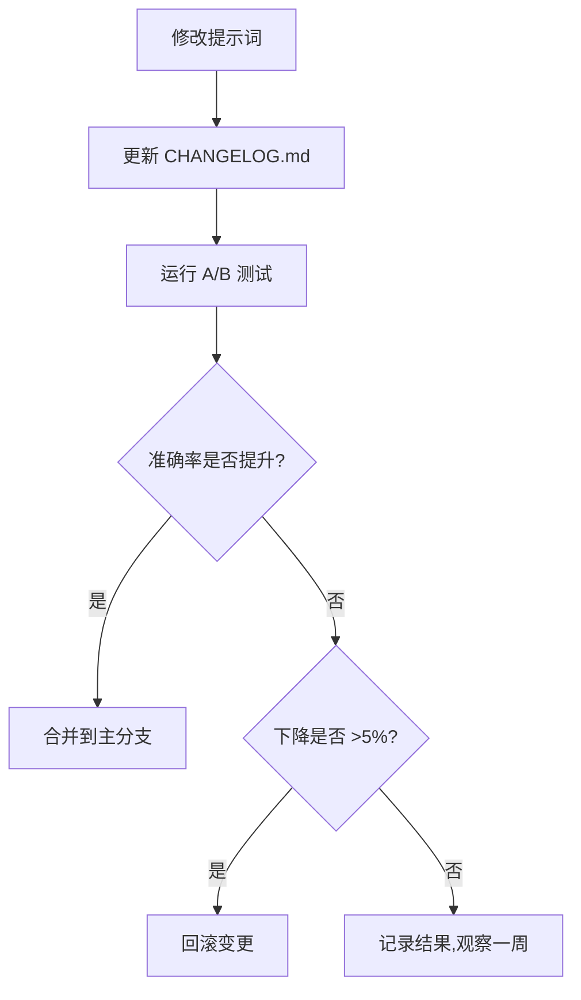

# PhytoOracle 提示词工程原则

> 本文档总结了 PhytoOracle 项目在 VLM 提示词设计中采用的最佳实践，参考了 [dair-ai/Prompt-Engineering-Guide](https://github.com/dair-ai/Prompt-Engineering-Guide) 的核心理念。

---

## 1. 为什么不直接使用 Prompt-Engineering-Guide？

### Prompt-Engineering-Guide 的性质

| 特性 | Prompt-Engineering-Guide | PhytoOracle 需求 |
|------|--------------------------|-----------------|
| **项目类型** | 教育性文档库（Markdown tutorials） | 可执行的 Python 代码库 |
| **提供内容** | 通用提示词技巧、论文集合 | 植物病理学领域特定提示词 |
| **集成方式** | 阅读学习，手工应用 | Git 版本控制的模板文件 |
| **代码支持** | ❌ 无可导入的 Python 模块 | ✅ 需要与 Pydantic/VLM Client 集成 |

**结论**：Prompt-Engineering-Guide 是一个**知识库**而非**代码库**，我们应当**学习其理念**并**自行实现**适合植物病理学诊断的提示词系统。

---

## 2. PhytoOracle 采用的提示词工程最佳实践

### 2.1 Few-Shot Learning（少样本学习）

**原理**（来自 Prompt-Engineering-Guide）：
- 在提示词中提供 1-3 个典型示例
- 显著提高 VLM 对任务的理解准确率
- 特别适用于输出格式要求严格的场景

**PhytoOracle 实现**：

**位置**：`docs/design/详细设计文档.md:1493-1499`（Q0.2 花卉种属识别）

```python
FEW-SHOT EXAMPLE:
Input: Image shows a flower with compound leaves (5 leaflets), thorns on stem, pink layered petals
Output: {
  "choice": "Rosa",
  "confidence": 0.92,
  "reasoning": "Compound leaves with 5 leaflets and thorny stems are典型特征 of Rosa genus"
}
```

**应用场景**：
- Q0.2 花卉种属识别（最复杂的分类任务）
- Q2 颜色中心识别（Egg Yolk Metaphor 示例）
- Q3 颜色边界识别（3-Zone Comparison 示例）

---

### 2.2 Chain of Thought (CoT, 思维链)

**原理**（来自 Prompt-Engineering-Guide）：
- 要求模型输出推理步骤，而非直接给出答案
- 提高复杂推理任务的准确率
- 增强可解释性，便于调试

**PhytoOracle 实现**：

**位置**：`docs/design/详细设计文档.md:1286-1290`

```python
class VLMResponse(BaseModel):
    choice: str = Field(..., description="选择的选项值")
    confidence: float = Field(..., ge=0.0, le=1.0)
    reasoning: Optional[str] = Field(None, description="推理过程（可选，调试用）")  # ← CoT
```

**应用场景**：
- 所有 Q0-Q6 问题都要求 VLM 返回 `reasoning` 字段
- 用于诊断日志记录（`diagnosis_logs/` 目录）
- 帮助开发者理解 VLM 的决策过程

**示例**（Q0.5 异常判断）：
```json
{
  "choice": "abnormal",
  "confidence": 0.95,
  "reasoning": "Observed black spots with yellow halos on leaf surface, typical necrotic lesions"
}
```

---

### 2.3 Structured Output（结构化输出）

**原理**（来自 Prompt-Engineering-Guide）：
- 明确要求输出格式（JSON, XML, YAML 等）
- 在 System Prompt 中强制约束
- 使用 JSON Schema 验证输出

**PhytoOracle 实现**：

**位置**：`docs/design/详细设计文档.md:1280-1321, 1778-1799`

**1. Pydantic V2 Schema 定义**：
```python
class Q02Response(VLMResponse):
    """Q0.2 花卉种属识别"""
    choice: Literal["Rosa", "Prunus", "Tulipa", "Dianthus", "Paeonia", "unknown"]
```

**2. System Prompt 强制 JSON**：
```python
system_prompt = (
    "You are a JSON API. Always respond with valid JSON. "
    "Never include explanatory text outside the JSON structure."
)
```

**3. 响应验证器**（`ResponseValidator`）：
```python
# docs/design/详细设计文档.md:1336-1407
validated = ResponseValidator.validate_and_parse(raw_response, question_id)
```

**4. Provider 级别的 `response_format` 参数**：
```python
response = await self.client.chat.completions.create(
    model="qwen-vl-plus",
    messages=messages,
    response_format={"type": "json_object"}  # ← OpenAI API 标准
)
```

---

### 2.4 Visual Prompting（视觉化描述）

**原理**（来自 Prompt-Engineering-Guide）：
- 使用隐喻、类比、分区等方法辅助视觉理解
- 特别适用于 VLM（Vision-Language Model）
- 提高跨文化、跨语言场景的理解一致性

**PhytoOracle 实现**：融入**方法论 v5.0 的 5 大视觉化方法**

**位置**：`docs/design/详细设计文档.md:1478-1484, 1626-1631, 1663-1668`

#### 方法 1：Egg Yolk Metaphor（煎蛋隐喻）

**应用**：Q2 颜色中心识别 + Q3 颜色边界识别

```python
VISUAL METHOD (方法论v5.0 - Egg Yolk Metaphor):
Think of the spot like a fried egg:
- The "yolk" (center) is what we're identifying now
- The "white" (border/halo) will be identified in the next question
```

**原理**：将抽象的病斑结构映射到日常物品（煎蛋），VLM 更容易理解"中心-边界"的概念。

#### 方法 2：3-Zone Comparison（三区对比）

**应用**：Q3 颜色边界识别（晕圈判断）

```python
Compare three zones:
- Zone A (spot center): The dark necrotic area
- Zone B (border, 1-3mm around center): Is there a distinct colored ring?
- Zone C (normal tissue): Green healthy tissue
```

**原理**：明确空间分区，避免 VLM 混淆"病斑中心"和"健康组织"之间的过渡区域。

#### 方法 3：Compound Feature Description（复合特征描述）

**应用**：Q0.2 花卉种属识别

```python
VISUAL CLUES:
- Rosa (玫瑰/月季): Compound leaves with 5-7 leaflets, thorny stems, layered petals
- Prunus (樱花/樱桃): Simple oval leaves with serrated edges, 5-petal flowers, smooth bark
```

**原理**：同时描述多个视觉特征（叶片形态 + 茎干特征 + 花朵结构），提高识别鲁棒性。

---

### 2.5 Self-Consistency（自我一致性）

**原理**（来自 Prompt-Engineering-Guide）：
- 多次采样同一个提示词，选择最一致的答案
- 降低随机性带来的误判
- 适用于高风险决策场景

**PhytoOracle 实现**（规划中）：

**位置**：`docs/design/详细设计文档.md:5.3 DiagnosisService`（待实现）

```python
# 未来可能的实现
async def call_with_self_consistency(
    self,
    prompt: str,
    image: bytes,
    n_samples: int = 3
) -> VLMResponse:
    """通过多次采样提高一致性"""
    results = []
    for _ in range(n_samples):
        response = await self.vlm_client.call(prompt, image)
        results.append(response)

    # 选择出现次数最多的 choice
    most_common_choice = Counter([r.choice for r in results]).most_common(1)[0][0]
    return next(r for r in results if r.choice == most_common_choice)
```

**当前状态**：
- ✅ 已设计 `confidence` 字段记录 VLM 自信度
- ⏳ 未来可在 Layer2（置信度 0.60-0.85）场景中应用 Self-Consistency

---

### 2.6 Prompt Chaining（提示词链）

**原理**（来自 Prompt-Engineering-Guide）：
- 将复杂任务分解为多个子任务
- 前一个提示词的输出作为下一个提示词的输入
- 每个环节专注于单一问题

**PhytoOracle 实现**：**Q0-Q6 逐级过滤 + Layer1-Layer3 渐进诊断**

**位置**：`docs/requirements/需求文档.md:5.2 三层渐进诊断流程`


**特点**：
- 每个问题只关注一个维度（单一职责）
- Q0.2 的输出（花卉种属）用于剪枝候选疾病
- Q1 的输出（symptom_type）决定 Q2-Q6 的问题内容

---

### 2.7 Error Handling in Prompts（提示词中的错误处理）

**原理**（来自 Prompt-Engineering-Guide）：
- 明确告知 VLM 如何处理不确定的情况
- 提供 "unknown"、"unclear"、"uncertain" 等选项
- 避免 VLM 强行给出错误答案

**PhytoOracle 实现**：

**位置**：`docs/design/详细设计文档.md:1418`（设计原则第4条）

```python
# Q0.2 花卉种属识别
CHOICES:
- Rosa
- Prunus
- Tulipa
- Dianthus
- Paeonia
- unknown  # ← 允许 VLM 回答"不知道"

# Q3 颜色边界识别
CHOICES:
- yellow
- light_yellow
- no_halo
- unclear  # ← 允许 VLM 表示图像质量不足
```

**配套兜底逻辑**（`docs/requirements/需求文档.md:5.3.5`）：
- `unknown` → 知识库无数据
- `unclear` → VLM 开放式诊断兜底
- 所有候选疾病分数 < 0.30 → 认怂或 VLM 兜底

---

## 3. PhytoOracle 特有的提示词工程创新

以下是我们基于植物病理学领域需求的**原创设计**：

### 3.1 症状类型驱动的动态提示词生成

**位置**：`docs/design/详细设计文档.md:1619-1656`

```python
# Q1 返回 "necrosis_spot"
Q2_COLOR_CENTER_PROMPT_NECROSIS = """..."""  # 询问病斑中心颜色

# Q1 返回 "powdery_coating"
Q2_COVERAGE_PATTERN_PROMPT_POWDERY = """..."""  # 询问粉末覆盖面积
```

**原理**：不同症状类型的特征维度完全不同，动态生成提示词避免无效问题。

---

### 3.2 医学诊断逻辑的提示词设计

**位置**：`docs/design/详细设计文档.md:1144-1162`

```python
# 计算主要特征匹配数量（major_matched / major_total）
# 医学诊断标准：
# - ≥2/2 → confirmed（确诊）
# - ≥1/2 → suspected（疑似）
# - 0/2 → unlikely（排除）
```

**创新点**：
- 不是简单的加权求和，而是**先判断主要特征匹配数量**
- 符合医学诊断的"必要条件"思想（如玫瑰黑斑病必须有"黑色中心 + 黄色晕圈"）

---

### 3.3 知识库版本与提示词版本独立管理

**位置**：`docs/design/详细设计文档.md:1699-1737`

```
infrastructure/llm/prompts/
├── CHANGELOG.md            # 提示词变更日志
└── versions/
    └── v1.0/               # 历史版本归档
```

**创新点**：
- 提示词模板纳入 Git 版本控制
- 每次修改必须运行 A/B 测试
- 准确率下降 >5% 则回滚

**原因**：
- 知识库更新主要是添加新疾病（水平扩展）
- 提示词更新影响所有疾病的诊断准确率（垂直影响）
- 两者需要独立管理以降低风险

---

## 4. 与 Prompt-Engineering-Guide 的对照表

| Prompt-Engineering-Guide 技术 | PhytoOracle 实现 | 代码位置 | 状态 |
|------------------------------|-----------------|---------|-----|
| **Few-Shot Learning** | Q0.2, Q2, Q3 提供示例 | `详细设计文档.md:1493-1499, 1640-1646, 1675-1681` | ✅ 已实现 |
| **Chain of Thought (CoT)** | `reasoning` 字段 | `详细设计文档.md:1289` | ✅ 已实现 |
| **Structured Output** | Pydantic + ResponseValidator | `详细设计文档.md:1280-1407` | ✅ 已实现 |
| **Visual Prompting** | 方法论 v5.0（Egg Yolk, 3-Zone） | `详细设计文档.md:1626-1681` | ✅ 已实现 |
| **Self-Consistency** | 多次采样 + 投票机制 | 待设计 | ⏳ v1.5 规划 |
| **Prompt Chaining** | Q0-Q6 逐级过滤 + Layer1-3 | `需求文档.md:5.2` | ✅ 已实现 |
| **Error Handling in Prompts** | `unknown`, `unclear` 选项 | `详细设计文档.md:1418, 1491, 1673` | ✅ 已实现 |
| **Prompt Templates** | `infrastructure/llm/prompts/*.py` | `详细设计文档.md:1700-1710` | ✅ 已实现 |
| **Active-Prompt** | A/B 测试 + 版本回滚 | `详细设计文档.md:1720-1737` | ⏳ v1.5 规划 |

---

## 5. 实施建议

### 5.1 代码实现检查清单

开发时确保所有提示词模板满足以下要求：

- [ ] **Structured Output**：所有提示词末尾加上 `IMPORTANT: Only return JSON, no additional text.`
- [ ] **Few-Shot**：复杂任务（Q0.2, Q2, Q3）提供 1-2 个示例
- [ ] **CoT**：所有响应包含 `reasoning` 字段
- [ ] **Error Handling**：提供 `unknown` / `unclear` / `other` 选项
- [ ] **Visual Prompting**：使用隐喻或分区描述（Egg Yolk, 3-Zone）
- [ ] **Pydantic Validation**：定义对应的 `VLMResponse` 子类
- [ ] **版本控制**：在 `CHANGELOG.md` 中记录变更

### 5.2 提示词优化工作流



### 5.3 参考资源

- **Prompt-Engineering-Guide 文档**：https://www.promptingguide.ai/
- **OpenAI Prompt Engineering 指南**：https://platform.openai.com/docs/guides/prompt-engineering
- **Anthropic Prompt Engineering 资源**：https://docs.anthropic.com/claude/docs/prompt-engineering
- **FlowerSpecialist 方法论 v5.0**：`docs/research/FlowerSpecialist方法论v5.0.md`

---

## 6. 总结

PhytoOracle 的提示词工程系统：

✅ **学习了** Prompt-Engineering-Guide 的核心理念（Few-Shot, CoT, Structured Output 等）
✅ **融入了** 植物病理学领域的专家知识（视觉化描述、症状类型驱动）
✅ **创新了** 医学诊断逻辑的提示词设计（主要特征匹配 major_matched）
✅ **建立了** 完整的版本管理与 A/B 测试机制

**结论**：我们不需要直接集成 Prompt-Engineering-Guide，而是将其作为**知识来源**，结合实际需求自行设计实现。

---

**文档版本**：v1.0
**最后更新**：2025-11-11
**维护者**：PhytoOracle 团队
